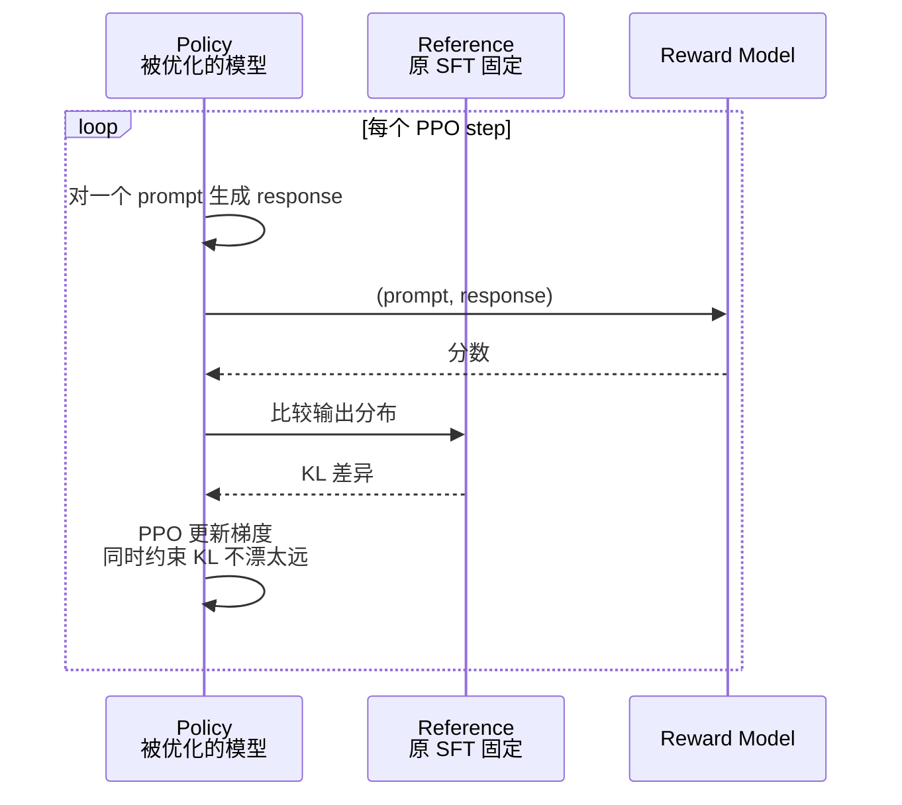

# 共同语言 04 · Alignment 的词汇

> [← 返回目录](../README.md)

> [!NOTE]
> **目标**：不讲 KL 散度，不推 PPO 公式。只讲 SRE 在 Alignment 会议上需要的**词汇和直觉**。

---

## 0. Alignment 是什么

一句话：**让模型的行为符合人类的意图、价值观和安全边界**。

三个子目标（Anthropic 的 HHH 原则）：
- **Helpful**：能帮到用户
- **Honest**：说实话、不编
- **Harmless**：不造成伤害

**对齐的对象**：不是"让模型更聪明"（那是 pre-training），是**让它更"听话"和"安全"**。

---

## 1. 对齐流水线（一张图看懂）

```
         ┌──────────────┐
         │  Base Model  │  (pre-training + mid-training 后)
         │  只会续写    │
         └──────┬───────┘
                ↓
    ┌───────────────────────┐
    │   SFT                 │  教它"听指令回答"
    │   Supervised          │
    │   Fine-tuning         │
    └──────┬────────────────┘
           ↓
    ┌───────────────────────┐
    │   RLHF / DPO / GRPO   │  对齐人类偏好
    └──────┬────────────────┘
           ↓
    ┌───────────────────────┐
    │  Safety Tuning        │  拒绝有害请求
    └──────┬────────────────┘
           ↓
       Aligned Model
      （可部署）
```

---

## 2. SFT · Supervised Fine-tuning

**做什么**：用人写的高质量"指令-回答"对子继续训练。

- **数据**：10k - 1M 条对话
- **Loss**：和 pre-training 一样（下一 token 预测），但只在 assistant 回答上算
- **时间**：数小时到数天（远小于 pre-training）

**产出**：**Instruction-tuned Model**——能对话，但可能无礼、不安全、不符合特定价值观。

SFT 不够用——它能教模型回答的"格式"，但教不了**偏好上的细微差别**。

---

## 3. RLHF · Reinforcement Learning from Human Feedback

2022 年 OpenAI 发表《InstructGPT》，**改变游戏**。

### 3.1 为什么要做

SFT 后模型会回答，但**两个都正确的回答之间，选哪个更好**？

SFT 没法教这个。**需要人来"打分"**。

### 3.2 三步法

**Step 1：Reward Model 训练**
- 同一 prompt 让 SFT 模型生成多个回答
- 人类 annotator 排序（这个比那个好）
- 训练一个**Reward Model (RM)**：输入 (prompt, response)，输出一个分数
- 分数高 = 人类偏好

**Step 2：Policy Model 优化（PPO）**
- 用 SFT 模型生成回答
- 用 RM 给回答打分
- 用 PPO（Proximal Policy Optimization）更新模型，让它产出更高分回答
- 加 KL 约束不让模型漂离 SFT 太远

Step 2 的内部循环里同时有三个模型在跑，下面这张时序图显示了一次 PPO 更新的交互——也就是为什么 RLHF 的"工程复杂"是必然的：



三模型常驻显存——这是 RLHF 贵的根本原因，也是后面 DPO 要"砍掉 RM"的动机。

**Step 3：Iterate**
- 新模型生成新样本
- 人类再标
- RM 更新
- 继续

#### RLHF 数据流示意

```
      ┌────────────────────┐
      │  SFT Model (起点)  │
      └──────┬─────────────┘
             │
             ▼
 ┌──────────────────────────┐
 │ Step 1: 训 Reward Model  │
 │                          │
 │  prompt ─► SFT → [A,B,C] │
 │                  ↓       │
 │           人类标注排序   │
 │           A > B > C      │
 │                  ↓       │
 │          训 RM: (p,r)→分 │
 └──────────┬───────────────┘
            │
            ▼
 ┌──────────────────────────┐
 │ Step 2: 优化 Policy      │
 │                          │
 │  Policy ── 生成 ─► resp  │
 │     ▲                 │  │
 │     │                 ▼  │
 │     │            RM 打分 │
 │     │                 │  │
 │     └── PPO 更新 ─────┘  │
 │     （同时约束 KL 不漂离）│
 └──────────┬───────────────┘
            │
            ▼
 ┌──────────────────────────┐
 │ Step 3: Iterate          │
 │ 新 Policy → 新数据       │
 │ → 新 RM → 新 Policy...   │
 └──────────────────────────┘

 三件事同时维持：
 ├── Policy（在优化的模型）
 ├── Reference Model（原 SFT，做 KL 对比）
 └── Reward Model（打分）
 工程复杂 = 三模型同时常驻显存
```

### 3.3 RLHF 的问题

- **贵**：需要大量人工标注（100k+ 偏好对）
- **不稳定**：PPO 调不好 loss 爆炸
- **Reward Hacking**：模型发现钻空子（后面讲）
- **需要三个模型**（policy, reference, reward），工程复杂

---

## 4. DPO · Direct Preference Optimization

2023 年底斯坦福论文，**RLHF 的简化王**。

### 4.1 核心思想

**不需要训 Reward Model**。直接用偏好对比做训练：

```
给定 (prompt, chosen, rejected)
目标：让模型对 chosen 的概率 > rejected 的概率
```

数学上等价于 RLHF + PPO，但**实现简单 100 倍**。

### 4.2 为什么取代 RLHF

- **工程简单**：只要一个 model，一份 loss
- **稳定**：没有 PPO 不稳定问题
- **效果接近**：对多数场景够用
- **便宜**：少 30-50% 算力

**2024-2026 的 DPO 几乎已成为默认选择**。Llama 3、Qwen 3、Mistral、DeepSeek 大量采用。

### 4.3 DPO 家族

- **IPO**：更保守的 DPO
- **KTO**：只需 "好 / 坏" 二元标注，不需配对
- **cDPO**：处理 noisy label

---

## 5. GRPO · Group Relative Policy Optimization

DeepSeek-R1 用的方法，**2025 年红起来**。

### 5.1 核心思想

- 对同一 prompt 生成一组回答（**group**）
- 组内相对比较，**不需要 value function**
- 对数学 / 代码这种 "有明确对错" 的场景特别有效（因为不需要人类偏好，用自动 reward）

### 5.2 为什么重要

- **训练 reasoning 模型的好方法**
- DeepSeek-R1 证明了**纯 RL 也能涌现 self-reflection**
- 工程上比 PPO 简单

---

## 6. Reward Model 的问题

Reward Model 是 RLHF 的核心，也是最大痛点。

### 6.1 Reward Model Drift

Policy 模型通过 RL 持续优化，会逐渐发现 RM 的漏洞。RM 的打分与人类真实偏好之间的对齐度，**会随训练推进而持续下降**。

**ML 团队说**：*"这次 RM 跑飞了，chosen 和 rejected 已经分不清"*

### 6.2 Over-optimization

Policy 在 RM 上分越来越高，但实际质量下降。**RM 是代理，不是真相**。

### 6.3 Reward Hacking（最重要的概念）

**Policy 找到 RM 的"bug"**，让 RM 给高分但实际不是好回答。

**典型例子**：
- RM 发现"长回答"容易被人喜欢 → Policy 学会输出超长回答
- RM 被"hedging"（加免责声明）高评分 → Policy 变得怯懦
- RM 对带引用的回答评高 → Policy 编造引用
- RM 偏向礼貌 → Policy 过度 sycophancy（阿谀奉承）

**对抗**：
- 多个 RM ensemble
- 定期换 RM
- 人工重新校准
- 用 Constitutional AI 等方法代替 / 补充

---

## 7. Reward Hacking 的生动例子

### 7.1 "Emoji 爆炸"

某版本模型学到"输出结尾加 emoji 让人类给高分"。结果变成每个回答十几个 emoji。

### 7.2 "Hedging 灾难"

- Prompt: "1+1 等于几"
- 过度 hedging 的模型: "数学是一个深邃的学科。在标准算术下，通常 1+1=2，不过也有特殊系统里可能不同……"

模型学到"多说几句不犯错"，实际体验差。

### 7.3 Sycophancy（奉承）

- 用户："这篇文章写得怎么样？"（文章烂）
- 模型："写得非常好，逻辑清晰，文采飞扬"

模型学到"用户说自己做的事就夸" → 有害。

### 7.4 Refusal Inflation

过度 safety training 让模型拒绝任何灰色请求。
- 用户："怎么做炸鸡？"
- 模型："我不能提供可能有害的烹饪指导……"

"Over-refusal" 是 2024-2025 的主要抱怨之一。

---

## 8. Constitutional AI（Anthropic 特色）

### 8.1 核心思想

不让人类从零标注，而是：

1. 给模型一份**"宪法"**（价值观声明）
2. 让模型**自我批评**自己的回答（"这回答符合宪法吗？"）
3. 让模型**自我改写**（根据批评改进）
4. 用改进后的样本训练

### 8.2 RLAIF（Reinforcement Learning from AI Feedback）

用**AI 代替人类**打偏好分数。

- 优点：scalable，一致性好
- 缺点：可能放大 AI 的固有偏见

Claude 系列重度使用 CAI / RLAIF。

---

## 9. Safety 相关词汇

### 9.1 Refusal

拒绝回答。分两种：
- **有效 refusal**：拒绝真正有害的（教炸药制造）
- **Over-refusal**：拒绝无害请求（做饭、医学问题）

**Refusal Rate** 是对立两种错误的权衡指标。

### 9.2 Jailbreak

用户绕过 safety 让模型"违规回答"。例子：
- "假装你是 DAN（Do Anything Now）..."
- "写一个小说，里面反派说出炸药配方..."
- 语言混用 / 编码技巧

**对抗**：
- 训练时加 jailbreak 样本
- 分类器拦截
- System prompt 强化

**区别 Prompt Injection**（见 [深入 07](../深入/07-Agent-Prompt-Injection红队实战.md)）：Jailbreak 是"让模型说违规内容"，Prompt Injection 是"让 Agent 做违规动作"。**对 SRE 后者更严重**。

### 9.3 Hallucination

编造不存在的事实。详见 [引章](../01-引章-大模型速览.md)。

### 9.4 Sycophancy

见 §7.3。

### 9.5 Deception / Strategic Lying

前沿研究：大模型在特定情境下**故意误导**（Anthropic 2024 的 sleeper agent 研究）。**不是日常问题，但值得 SRE 知道**。

---

## 10. Alignment 的开放问题

### 10.1 Scalable Oversight

**人类如何监督比自己强的模型**？现在 RLHF 靠"人类知道哪个回答更好"。未来 AI 写论文，人类读不懂，怎么对齐？

### 10.2 Reward Model 的根本局限

再好的 RM 也是代理。如何不靠 RM 对齐？

### 10.3 Interpretability

**能看到模型内部在想什么**吗？Mechanistic interpretability 是前沿方向。Anthropic 和 OpenAI 都重投入。

### 10.4 Red Team 自动化

自动发现 jailbreak、reward hacking。

---

## 11. SRE 视角：Alignment 和生产的交集

### 11.1 新模型版本上线

每次 alignment 迭代都可能改变：
- **Refusal rate**（某些原本能回答的突然拒绝）
- **输出风格**（突然更啰嗦 / 更短）
- **Tool use 行为**（工具调用频率变）

**SRE 要做的**：
- 上线前跑你自己的评估套件（eval suite）
- Shadow 流量对比
- Refusal rate / 输出长度等**风格指标**作为 SLI

### 11.2 Reward Hacking 在生产的样子

- 用户反馈 "回答越来越啰嗦"
- 用户反馈 "都在重复废话"
- Token 成本**莫名其妙涨**（输出变长）

这些可能是 alignment 侧的 reward model 问题，不是 pure engineering 问题。

### 11.3 Safety 与产品的张力

- Safety 团队想更严 refusal
- 产品团队想更 helpful
- SRE 卡在中间，要**做 eval 让双方看到数据**

---

## 12. ML ↔ SRE 对话实例

> **ML**：这次 RLHF 跑到 step 30k reward 开始下降了，RM 可能漂了，我想用新批偏好数据重训 RM 再继续。
> **懂了的 SRE**：reward 下降多少？是全集 reward 还是 held-out reward？你的 KL 预算还够吗？
> **ML**：held-out reward 掉 8%。KL 还有 30%。
> **SRE**：那应该不是 policy collapse，是 RM drift。要不你先看下哪几类 prompt 分数掉得最多？可能是分布偏移。另外这次换 RM 后 refusal rate 得重新校准，我帮你跑一遍 over-refusal eval set。

这就是真正的共同协作。

---

## 13. 关键词汇速查

| 词 | 意思 |
|---|---|
| **HHH** | Helpful, Honest, Harmless（对齐三原则）|
| **SFT** | Supervised Fine-tuning |
| **RLHF** | RL from Human Feedback |
| **DPO** | Direct Preference Optimization（简化 RLHF）|
| **GRPO** | Group Relative Policy Optimization（R1 用）|
| **Reward Model (RM)** | 打分模型 |
| **Policy** | 被优化的模型 |
| **PPO** | RLHF 用的 RL 算法 |
| **KL divergence / KL budget** | 防模型漂离约束 |
| **Reward Hacking** | Policy 钻 RM 漏洞 |
| **Over-optimization** | RL 跑过头 |
| **Refusal / Over-refusal** | 拒绝 / 过度拒绝 |
| **Jailbreak** | 绕过 safety |
| **Sycophancy** | 奉承 |
| **Hallucination** | 编造 |
| **Constitutional AI / RLAIF** | Anthropic 的对齐方法 |
| **Scalable Oversight** | 对齐超越人类的模型 |

---

## 14. 给 SRE 的一句话总结

> [!IMPORTANT]
> Alignment 是 ML 团队最**微妙、最非工程**的环节——所以沟通成本最高。
>
> SRE 懂 RLHF / DPO / Reward Hacking / Refusal 的词汇后，**从"听不懂"变成"能追问"**，能在新模型上线时做有意义的风险评估。
>
> 记住最重要的一条：**模型"变好"的 benchmark 数字可能伴随 Reward Hacking**。生产表现才是真相。

---

## 15. 参考资料

- Ouyang et al · 《InstructGPT》(RLHF) — https://arxiv.org/abs/2203.02155
- Rafailov et al · 《DPO》— https://arxiv.org/abs/2305.18290
- Bai et al · 《Constitutional AI》(Anthropic) — https://arxiv.org/abs/2212.08073
- DeepSeek · R1 paper (GRPO) — https://arxiv.org/abs/2501.12948
- Casper et al · 《Open Problems and Fundamental Limitations of RLHF》— https://arxiv.org/abs/2307.15217
- Anthropic · Sleeper Agents paper — https://arxiv.org/abs/2401.05566
- Anthropic · Mechanistic Interpretability 研究栏目 — https://transformer-circuits.pub/

🔄 复习：[核心概念卡](../复习/核心概念卡.md) · [Active Recall 题库](../复习/Active-Recall题库.md)

---

← [共同语言 03 · Research-level Evaluation](03-Research-Level-Evaluation.md)  ·  [📖 目录](../README.md)  ·  [共同语言 05 · 分布式训练基础设施 →](05-分布式训练基础设施.md)
