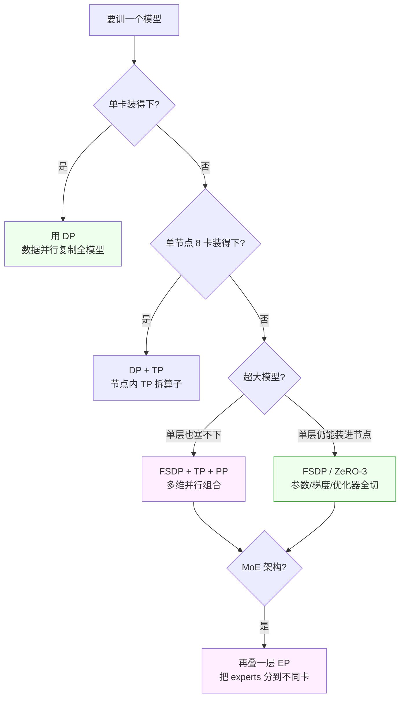

# 共同语言 05 · 分布式训练基础设施（SRE 实用版）

> [← 返回目录](../README.md)

> [!NOTE]
> **目标**：SRE 运维过推理集群，但训练集群是另一个生物。这一章告诉你**训练集群和推理集群的区别、并行方式、checkpoint 经济学、常见事故**——让你能负责训练集群 ops 或者至少和 ML infra 团队对话。

---

## 0. 训练和推理集群的本质差别

| 维度 | 推理集群 | 训练集群 |
|---|---|---|
| **请求模式** | 无数独立请求 | 一个大任务持续数周 |
| **并行粒度** | 请求级 | Step 级（全集群同步）|
| **容错** | 重试请求即可 | 单点失败整个作业挂 |
| **通信** | 客户端 ↔ 服务端 | GPU ↔ GPU**超高带宽**必须 |
| **网络** | 普通 Ethernet 够 | **InfiniBand / NVLink 必须** |
| **负载均衡** | 随请求分配 | 无（全部协同）|
| **扩缩容** | 自动 | 手动 / 半手动 |
| **GPU 利用率** | 中（受 batch 影响）| **高**（~60-70% MFU）|

> [!WARNING]
> 用运维推理集群的思路去跑训练，**必然出大问题**。扩缩容、负载均衡、容错模型都不一样。

---

## 1. 训练集群的"形状"

### 1.1 典型物理拓扑

```
┌─ Rack 1 ──────────────────────────┐
│  Node 1: 8× H100 + NVLink + 400G │
│  Node 2: 8× H100 + NVLink + 400G │
│  ... 64 nodes = 512 GPU           │
└────────────┬──────────────────────┘
             │ InfiniBand 400Gbps
┌────────────┴──────────────────────┐
│  Rack 2: 同上                     │
│  ...                              │
│  总计 4096+ GPU                    │
└───────────────────────────────────┘
```

### 1.2 为什么需要特殊网络

- Gradient all-reduce 每 step 要在所有 GPU 间交换
- 每 step 传输 **数百 GB 数据**
- Ethernet 10G/25G **远远不够**
- InfiniBand 400G+ / NVLink **必须**

**InfiniBand** 带宽 3200 Gbps 起，延迟 <1μs。贵但不可或缺。

---

## 2. 并行策略（必须懂的 5 种）

5 种并行策略听起来多，但选型逻辑其实是一棵决策树——按"模型能不能装下"逐级判断：



下面逐个展开。

### 2.1 Data Parallelism (DP)

**做什么**：模型复制到 N 张卡，每张卡看不同的数据批次。

```
GPU 0: 模型全份 + Batch[0:B]
GPU 1: 模型全份 + Batch[B:2B]
...
GPU N: 模型全份 + Batch[NB:(N+1)B]
```

每 step 结束：**all-reduce 梯度**。

**限制**：模型必须能装进单卡。70B bf16 = 140GB，单 H100 80GB 装不下——**DP 不够用**。

### 2.2 Tensor Parallelism (TP)

**做什么**：把**单层的算子**切到多卡。比如一个 `Linear(in=10240, out=10240)` 拆成两张卡，每张管一半。

**通信**：每层 forward/backward 都要 all-reduce。**通信极频**，**必须 NVLink 级带宽**。

**典型用法**：TP 在同一 node 内（8 卡），跨 node 太慢。

### 2.3 Pipeline Parallelism (PP)

**做什么**：把模型**按层**切到多卡。Layer 1-20 在 GPU 0，Layer 21-40 在 GPU 1……

**通信**：只在层之间传 activation，比 TP 少。

**问题**：**Bubble**（流水线空泡）—— 前面层在算时后面层等。
**优化**：1F1B、interleaved pipeline。

### 2.4 Expert Parallelism (EP)

MoE 模型专用：把 experts 分到不同卡。

**问题**：routing imbalance（某些 expert 过忙）。

### 2.5 FSDP / ZeRO（工业界现状）

**FSDP (Fully Sharded Data Parallel)** / DeepSpeed ZeRO：

**核心思想**：把**模型参数、梯度、优化器状态**都切片到不同 GPU，forward/backward 时临时 gather。

- **ZeRO-1**：只切优化器状态（省最多，ZeRO 原始贡献）
- **ZeRO-2**：切优化器 + 梯度
- **ZeRO-3 / FSDP**：切全部

**为什么这是主流**：兼得 DP 的简单和 TP 的省显存。2024-2026 几乎所有训练框架默认用 FSDP/ZeRO-3。

### 2.6 组合使用

现代 frontier 训练常常**多种并行同时用**：

```
FSDP ZeRO-3（跨 rack 的 DP）
   × TP=8（node 内）
   × PP=4（跨几个 rack）
   × EP（MoE 场景）
```

**这就是 "3D / 5D parallelism"**。

#### 4 种并行的一张对比图

```
────────────────────────────────────────────────────────
  策略    │ 切谁      │ 通信量    │ 带宽要求     │ 场景
────────────────────────────────────────────────────────
  DP      │ 数据批次  │ 每 step   │ 跨节点 OK    │ 小模型
          │ (模型全拷)│ all-reduce│              │ + 大数据
────────────────────────────────────────────────────────
  TP      │ 算子内部  │ 每层多次  │ NVLink 必要  │ 大模型
          │           │           │ 节点内       │ 单层超大
────────────────────────────────────────────────────────
  PP      │ 按层切    │ 层间      │ 较低         │ 超大模型
          │           │ activation│              │ 有 bubble
────────────────────────────────────────────────────────
  FSDP    │ 参数 +     │ forward  │ 跨节点 OK    │ ★当代
  ZeRO-3  │ 梯度 +     │ gather   │ 但要 IB      │ 主流
          │ 优化器     │ backward │              │
          │           │ reduce    │              │
────────────────────────────────────────────────────────
  EP      │ MoE experts│ router   │ 看 expert    │ MoE 专用
          │           │ 分发      │ 分布         │
────────────────────────────────────────────────────────

组合例：70B 模型 × 256 GPU
   DP=32  ← 跨 rack（FSDP 模式）
   × TP=8 ← 每节点 8 卡（NVLink）
   = 256 卡
```

---

## 3. Checkpoint 经济学

### 3.1 Checkpoint 是什么

定期把**当前模型参数 + 优化器状态 + 训练状态**写到磁盘，用于：
- 从故障恢复
- 回退版本
- 做 evaluation
- Post-training 的起点

### 3.2 大小

```
Checkpoint size ≈ 参数量 × 字节数 × k
  k ≈ 4-6 (模型 + 优化器 Adam 1st moment + 2nd moment + gradient)
```

| 模型 | bf16 大小 | Checkpoint 大小 |
|---|---|---|
| 7B | 14GB | ~70GB |
| 70B | 140GB | **~700GB** |
| 400B MoE | 800GB | **~4TB** |
| Frontier 1T+ | 2TB+ | **10TB+** |

### 3.3 存储

- **本地 NVMe SSD**：写快但贵、易丢
- **分布式存储**（GPFS / Lustre / Ceph）：必须
- **对象存储**（S3 / GCS）：冷备
- **多 tier**：最近 checkpoint 在快存储，老的归档

### 3.4 频率

- **太频繁**：浪费 IO，拖慢训练
- **太稀**：故障后损失大

**经验**：每 1-2 小时 / 1-5k steps 一次。

### 3.5 恢复

**理想**：故障时从最近 checkpoint 恢复，继续。

**复杂点**：
- 所有 GPU 要一致恢复
- 数据 iterator 状态也要恢复（否则重跑相同数据）
- RNG 状态要恢复

**async checkpoint**：后台写，不阻塞训练。**现代训练必备**。

### 3.6 SRE 关心的指标

- **Checkpoint 写耗时**：突增 = 存储问题
- **Checkpoint 写失败率**
- **存储容量趋势**
- **最近 checkpoint 年龄**（max lag）
- **跨区复制延迟**

---

## 4. 常见事故：SRE 要能处理

### 4.1 Loss Spike

Loss 突然飙高。

**处理流程**（ML + SRE 协作）：
1. 暂停训练（保留现场）
2. 检查最近数据批次（是否垃圾）
3. 查看优化器状态（是否 gradient 爆炸）
4. 从最近 checkpoint 恢复
5. Skip 可疑数据批次
6. 恢复训练

**SRE 要保证**：
- Checkpoint 完整可恢复
- 数据 iterator 状态精确
- 审计日志（哪批数据进来时 spike 的）

### 4.2 Node Failure

节点挂了。

**后果**：整个分布式训练作业**卡住**（等不到响应）。

**处理**：
- 检测并隔离故障节点
- 从最近 checkpoint 整集群恢复
- **不能像推理那样"替换一个 pod 继续"**

**Elastic training** 是新方向：允许节点动态加入/离开。但生产上还不普及。

### 4.3 Network Flap

InfiniBand 网络抖动。

**症状**：
- 某些 all-reduce 超时
- Gradient 同步失败
- 训练卡住

**SRE 要做**：
- IB 网络深度监控（errors, link flap, congestion）
- 预先做 burn-in（烧机测试）
- 拓扑感知调度

### 4.4 OOM

显存爆了。

**常见原因**：
- Sequence length 超预期
- Activation 没 checkpoint（gradient checkpointing 没开）
- Optimizer states 太大

**SRE 预防**：
- 预跑小规模确认 memory footprint
- 留 10-20% buffer

### 4.5 GPU 故障

**ECC errors**、thermal throttling、link 降速。

**典型 mitigations**：
- ECC 监控：每小时几十个可能是坏 GPU 苗头
- 温度监控：超过阈值降频
- **每月 burn-in**（烧机 72h）

---

## 5. 训练集群的调度

### 5.1 Slurm（学术界 / HPC 传统）

- CLI-based
- Queue + partition 概念
- 适合大作业
- 无容器化

### 5.2 Kubernetes + Kubeflow / Ray

- 容器化
- 整合到 DevOps 流程
- **Volcano scheduler**、**Kueue** 用于 gang scheduling

### 5.3 Ray

- Python-native
- 适合 ML 工程师
- Anthropic / OpenAI 内部都用

### 5.4 SRE 要做的

- **Gang Scheduling**：一次性分配所有需要的 GPU（不是"先给一半"）
- **Pre-emption 策略**：高优先级作业能抢低优先级
- **Capacity Planning**：训练 vs 推理的 GPU 预算分配
- **Job Lifecycle**：submit → run → checkpoint → 完成 → 归档

---

## 6. 监控训练集群

### 6.1 GPU 层

- **Utilization**（但不等于 MFU）
- **HBM usage**
- **Power / Thermal**
- **NVLink / IB 吞吐**
- **SM efficiency**
- **ECC errors**

### 6.2 Job 层

- **Steps/sec**（吞吐量）
- **MFU (Model FLOPs Utilization)**：实际 FLOPs / 峰值 FLOPs，**60-70% 是目标**
- **Loss curve**
- **Gradient norm**：突增 = 爆炸苗头
- **Learning rate 调度**

### 6.3 Infra 层

- **NCCL collective 耗时**（all-reduce / broadcast）
- **Checkpoint write time**
- **Data loader queue depth**
- **Cross-node latency**

---

## 7. 训练 vs 推理的架构原则差异

| 原则 | 推理 | 训练 |
|---|---|---|
| **故障域** | 每请求独立 | 全集群一个故障域 |
| **水平扩展** | 几乎免费 | 越大越难 |
| **冷备** | 多副本 | 单实例多 checkpoint |
| **混部** | 可多模型共卡 | 一般独占 |
| **网络** | 标准 | 专线 |
| **存储** | 只读小量 | 大量热写 |

---

## 8. ML ↔ SRE 对话实例

> **ML**：我们要跑 70B 的继续预训练，10T token 数据，需要 256 张 H100 四周。用 FSDP + TP=8，checkpoint 每 5k steps。
> **老 SRE**：好，我申请资源。
> **懂了的 SRE**：
> - **256 H100 四周**是连续独占吗？有没有预留？
> - **FSDP + TP=8** 是每节点 TP 吗，我们 IB 拓扑支持这配置吗，有没有 latency risk？
> - **10T token 数据**在哪里？吞吐跟得上吗（每 step 要读 X GB）？
> - **Checkpoint 每 5k steps** = 每 2 小时 = **700GB 写入**，存储容量够吗？你们要保留几个？
> - **Node fail 预案**：预期 MTBF？你们接受多少 step 丢失？
> - **Data iterator 状态** 恢复逻辑你们测过没？上次 spike 后一恢复少 3k steps……
> - **Loss 监控** 接入我们的 alerting 吗？

**能问出这些问题的 SRE 才是 ML infra 的真正合作伙伴**。

---

## 9. 关键词汇速查

| 词 | 意思 |
|---|---|
| **DP / TP / PP / EP** | 4 种并行 |
| **FSDP / ZeRO** | 参数 + 梯度 + 优化器分片 |
| **All-reduce / Broadcast** | 集合通信 |
| **NCCL** | NVIDIA 集合通信库 |
| **InfiniBand (IB)** | 高性能网络 |
| **NVLink** | 节点内 GPU 互联 |
| **MFU** | Model FLOPs Utilization |
| **Bubble** | Pipeline 空泡 |
| **Gradient accumulation** | 多 micro-batch 累积后 update |
| **Global batch size** | 总 batch（所有卡合计）|
| **Micro-batch** | 单卡一次处理量 |
| **Checkpoint** | 模型 + 优化器快照 |
| **Async checkpoint** | 异步写检查点 |
| **Gang scheduling** | 一次性给所有 GPU |
| **Slurm / Kubeflow / Ray** | 训练调度系统 |
| **Elastic training** | 弹性节点训练 |
| **Burn-in** | 设备烧机测试 |

---

## 10. 给 SRE 的一句话总结

> [!IMPORTANT]
> 训练集群的运维原则与推理集群**根本不同**——整个集群同属一个故障域、InfiniBand 不可或缺、Checkpoint 是生命线、Loss spike 有独特处理流。
>
> SRE 懂这些后，能从"只管采购 GPU 的"变成"ML 基础设施架构师"——这是 LLM 时代 SRE 最值钱的演进方向之一。

---

## 11. 参考资料

- Rajbhandari et al · 《ZeRO》— https://arxiv.org/abs/1910.02054
- Microsoft · DeepSpeed docs — https://www.deepspeed.ai/
- PyTorch · FSDP docs — https://pytorch.org/docs/stable/fsdp.html
- Megatron-LM · https://github.com/NVIDIA/Megatron-LM
- HuggingFace · nanotron (minimal training framework) — https://github.com/huggingface/nanotron
- Meta · Llama 3 Herd paper（训练 infra 细节）— https://arxiv.org/abs/2407.21783
- OpenAI · Scaling Kubernetes to 7500 Nodes — https://openai.com/blog/scaling-kubernetes-to-7500-nodes
- Ray · Training framework — https://docs.ray.io/en/latest/train/train.html

🔄 复习：[核心概念卡](../复习/核心概念卡.md) · [Active Recall 题库](../复习/Active-Recall题库.md)

---

← [共同语言 04 · Alignment 的词汇](04-Alignment的词汇.md)  ·  [📖 目录](../README.md)
