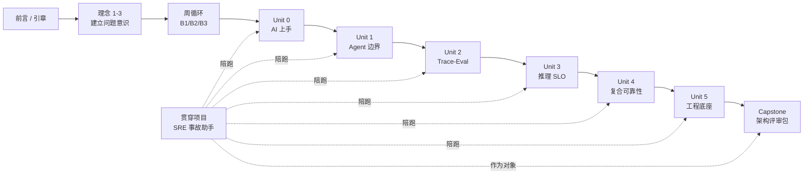

# 学习路线图

> [← 返回目录](README.md)

这本书不是让你从头到尾读完所有章节。正确用法是：**沿着 Unit 主线练习，用知识章节建立判断力，用深入专题按需查问题，用贯穿项目把产出落地**。

> [!IMPORTANT]
> 第一次学习时，**深入 / 科学 / 共同语言 / 附录都不是拦路虎**。它们是工具箱。主线是 Unit 0-5。

---

## 1. 一张图看完整学习路径

---

## 2. 主线怎么走

> **如果你不知道现在该打开哪个文件**：先去 [Unit 0 总览](练习/Unit0-AI大模型上手/总览.md)。其余都是"按需查阅"。

| 阶段 | 必读 | 按需查阅 | 本阶段产出 |
|---|---|---|---|
| 启动 | [前言](00-前言.md)、[引章](01-引章-大模型速览.md)、[理念 1](理念/01-AI时代工程师的真实处境.md)、[理念 2](理念/02-SRE架构师的角色迁移.md)、[理念 3](理念/03-学习能力才是新的护城河.md) | [深入 12](深入/12-Claude-GPT-Gemini三大模型系列使用指南.md) | 选定路线，知道自己为什么学 |
| 学习方法 | [第 10 章](练习/10-三个核心训练动作.md)、[周循环](练习/周循环总览.md) | [复习系统](复习/README.md) | 每周学习节奏 |
| Unit 0 | [Unit 0 总览](练习/Unit0-AI大模型上手/总览.md) | [附录 D](附录/D-厂商官方学习资源.md)、[代码 README](代码/README.md) | 最小 AI 工具 / RAG 雏形 |
| Unit 1 | [Unit 1 总览](练习/Unit1-Agent自治与致命三角/总览.md)、[第 6 章](知识/06-AI自治与上下文架构约束.md) | [深入 07](深入/07-Agent-Prompt-Injection红队实战.md)、[深入 09](深入/09-何时不该用AI.md) | Agent 权限边界与威胁模型 |
| Unit 2 | [Unit 2 总览](练习/Unit2-TraceEval统一可观测性/总览.md)、[第 7 章](知识/07-质量可观测性与DataFlywheel.md) | [深入 06](深入/06-Eval-Pipeline设计.md) | Trace-Eval 一体化方案 |
| Unit 3 | [Unit 3 总览](练习/Unit3-推理SLO与静默降级/总览.md)、[第 5 章](知识/05-AI推理服务的可靠性工程.md) | [深入 01](深入/01-首包延迟与吞吐的影响因素.md)、[深入 02](深入/02-Prompt-Caching原理.md)、[深入 05](深入/05-LLM推理服务的容量规划.md)、[深入 10](深入/10-AI系统事故模式库.md) | 推理 SLO、容量规划、回滚决策树 |
| Unit 4 | [Unit 4 总览](练习/Unit4-复合AI可靠性数学/总览.md)、[第 4 章](知识/04-系统架构与复合AI可靠性数学.md) | [深入 11](深入/11-AI-SRE现实图谱.md) | Step 预算、Verifier 设计、复合可靠性评审 |
| Unit 5 | [Unit 5 总览](练习/Unit5-数值与编译器级调试/总览.md)、[第 9 章](知识/09-工程底座.md) | [科学 03](科学/03-Quantization为什么有时坏.md)、[科学 04](科学/04-Tokenization的坑.md) | 数值级故障 Runbook |
| 收束 | [Capstone](练习/Capstone-AI生产架构评审包.md)、[附录 E](附录/E-模板库.md) | [附录 A](附录/A-每月自检表.md) | AI 生产架构评审包 |

---

## 3. 哪些内容是必读，哪些是工具箱

### 必读主线

- [前言](00-前言.md)
- [理念 1-3](理念/01-AI时代工程师的真实处境.md)
- [第 10 章 · 三个核心训练动作](练习/10-三个核心训练动作.md)
- [周循环总览](练习/周循环总览.md)
- Unit 0-5 的总览与 Week 文件
- [贯穿项目 · SRE 事故助手](练习/贯穿项目-SRE事故助手.md)
- [Capstone · AI 生产架构评审包](练习/Capstone-AI生产架构评审包.md)

### 跟着 Unit 回查

- Unit 1 回查 [第 6 章](知识/06-AI自治与上下文架构约束.md)
- Unit 2 回查 [第 7 章](知识/07-质量可观测性与DataFlywheel.md)
- Unit 3 回查 [第 5 章](知识/05-AI推理服务的可靠性工程.md)
- Unit 4 回查 [第 4 章](知识/04-系统架构与复合AI可靠性数学.md)
- Unit 5 回查 [第 9 章](知识/09-工程底座.md)

### 按需查阅

- **遇到模型选型**：先看 [深入 12](深入/12-Claude-GPT-Gemini三大模型系列使用指南.md)，再看 [深入 03](深入/03-模型与工具场景化最佳实践.md)。自建推理服务选框架 → [深入 19 · 框架对比](深入/19-模型服务框架对比.md)
- **遇到延迟 / 成本 / 容量**：看 [深入 01](深入/01-首包延迟与吞吐的影响因素.md)、[深入 02](深入/02-Prompt-Caching原理.md)、[深入 05](深入/05-LLM推理服务的容量规划.md)
- **遇到"这个 Agent 为什么一个月花了 5 万美元"**：看 [深入 18 · 成本工程](深入/18-LLM成本工程.md)
- **遇到大批量 LLM 任务（日志摘要 / 全量 re-index）**：看 [深入 13 · 离线推理](深入/13-离线批量推理.md)
- **遇到质量评估**：看 [深入 06](深入/06-Eval-Pipeline设计.md)
- **遇到 Agent 安全**：看 [深入 07](深入/07-Agent-Prompt-Injection红队实战.md)
- **遇到"该不该用 AI"争论**：看 [深入 09](深入/09-何时不该用AI.md)
- **遇到 RAG / Embedding / Vector 系统**：看 [深入 16 · Embedding 服务](深入/16-Embedding-服务作为独立运维对象.md)
- **遇到要不要微调 / 怎么运维微调模型**：看 [深入 14 · 微调作为运维对象](深入/14-微调作为运维对象.md)
- **遇到模型版本管理 / 上线流程**：看 [深入 15 · Model Registry](深入/15-模型注册表与上线流程.md)
- **遇到事故复盘 / 上线评审**：看 [深入 10](深入/10-AI系统事故模式库.md)、[深入 11](深入/11-AI-SRE现实图谱.md)、[附录 E](附录/E-模板库.md)
- **遇到架构设计 / 系统蓝图**：看 [架构 01 · 参考架构](架构/01-AI系统参考架构.md)
- **遇到团队切分 / RACI 争议**：看 [架构 02 · 组织设计](架构/02-AI-SRE组织设计.md)
- **遇到自建 vs 托管 / RAG vs 微调**等架构选型：看 [架构 03 · 决策框架](架构/03-架构师的决策框架.md)
- **季度自评 / 成熟度判断**：看 [架构 04 · L1-L5 自评清单](架构/04-AI-SRE成熟度模型.md)
- **遇到不可逆决策 / 三年规划**：看 [架构 05 · Day 2 / Day N](架构/05-不可逆决策与Day2状态.md)
- **遇到预算治理 / 跨维度优化**：看 [架构 06 · 四种 budget 统合](架构/06-预算治理.md)
- **遇到法务 / CFO / 上游合同评审**：看 [架构 07 · 与外部世界的契约](架构/07-与外部世界的契约.md)
- **月底自检 / 反思"我有没有在犯错"**：看 [附录 F · SRE 行为反模式](附录/F-SRE行为反模式Top10.md)

---

## 4. 三种推荐路线

### 路线 A · 标准路线（19 周）

适合传统 SRE、平台工程师、AI 应用工程师。

1. 读前言、引章、理念 1-3。
2. 建立周循环。
3. 做 Unit 0-5。
4. 全程用贯穿项目陪跑。
5. 最后做 Capstone。

这是本书的主设计路线。

### 路线 B · 架构师快读路线（2-4 周，每天 1 小时）

适合技术负责人、架构师、管理者。

1. 读理念 1-3。
2. 读知识 4-9。
3. 读 [深入 09](深入/09-何时不该用AI.md)、[深入 10](深入/10-AI系统事故模式库.md)、[深入 11](深入/11-AI-SRE现实图谱.md)、[深入 12](深入/12-Claude-GPT-Gemini三大模型系列使用指南.md)。
4. **读 [架构 01-07 全 7 篇](架构/01-AI系统参考架构.md)**——这是路线 B 的**核心收获**，给出可拿去开会的产出物模板。
5. 用 [附录 E · 模板 9](附录/E-模板库.md) 评审你手头的 AI 系统。
6. 用 [架构 04 · 30 项自评清单](架构/04-AI-SRE成熟度模型.md) 给系统定档。

这条路线不追求动手细节，追求**判断力和评审能力**——"读完能在评审会上拿出图说话"。

### 路线 C · 项目驱动路线（按需 4-8 周）

适合已经有 AI 项目在手的人。

1. 先用 [深入 11](深入/11-AI-SRE现实图谱.md) 判断系统处在哪个成熟度阶段。
2. 按项目短板选择 1-2 个 Unit 深做。
3. 用 [附录 E](附录/E-模板库.md) 补齐评审文档。
4. 用 [Capstone](练习/Capstone-AI生产架构评审包.md) 做一次正式收束。

这条路线的关键是：**不要为了读书而读书，让项目暴露你该学什么**。

---

## 5. 容易走错的路

- **先读完所有深入专题再开始练习**：会累，而且很多内容没有项目语境读不进去。
- **只看模型榜单不做 eval**：会得到很快过期的自信。
- **只做代码不写评审文档**：能力会停在 demo，不会变成架构判断。
- **只用 AI 帮你总结**：会复现本书最开始警惕的认知外包。
- **跳过复习系统**：19 周后你会记得"看过"，但不一定能用。

---

## 6. 最小承诺

如果你时间很少，只做这 5 件事：

1. 读 [理念 1](理念/01-AI时代工程师的真实处境.md)。
2. 读 [第 10 章](练习/10-三个核心训练动作.md)。
3. 做 [Unit 0](练习/Unit0-AI大模型上手/总览.md)。
4. 选 [贯穿项目](练习/贯穿项目-SRE事故助手.md) 做一个最小版本。
5. 用 [附录 E · 模板 9](附录/E-模板库.md) 评审它。

做到这 5 件事，比浏览完整本书更有价值。

---

[← 返回目录](README.md)  ·  [开始周循环 →](练习/周循环总览.md)
