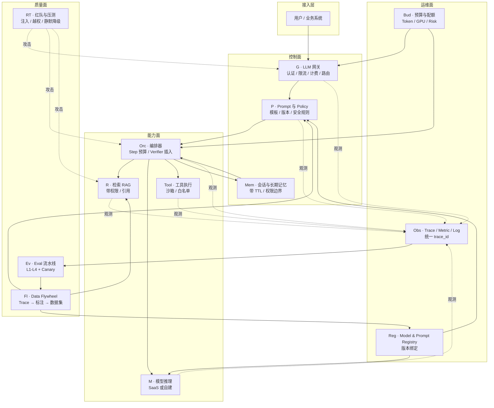
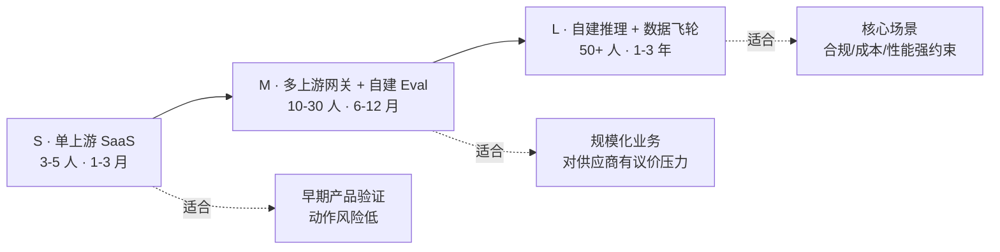
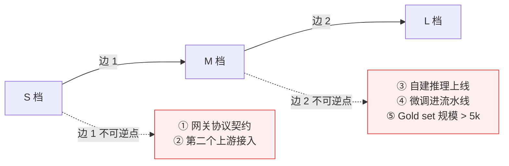

# 架构 01 · AI 系统参考架构

> 所属：第三部分 · 架构  ·  [← 返回目录](../README.md)

读到这里你已经走过了知识六维和大半个深入系列。这一章把那些散点压成**一张可评审的参考架构**，并给出从 S 到 L 的三档实现以及"哪一步走出去就回不来"的不可逆点。

第三部分和第二部分的关系是这样的：**知识章节回答"这个机制怎么回事"，深入专题回答"这个具体问题怎么解"，而本章回答"作为架构师我该产出什么图、签什么字"**。读完本章你应该能在白板上把整套蓝图画出来，并能告诉一位陌生的总监"我们现在在哪一档、下一步要走哪条边"。

## 1 · 为什么需要参考架构

很多团队的 AI 系统没有架构图——有的只是一串调用链。问题在于：

- **新人加入第一周看不到全貌**——只能从"我接的这块"反推系统是什么样的
- **设计 review 没有参照系**——每次都从零讨论"我们要不要加这一层"
- **事故 timeline 写不顺**——因为没有标准组件命名，事后描述时每个团队用自己的术语
- **演进决策无锚点**——"我们要不要做网关"这种问题答不上来，因为没人说清"做了之后系统长什么样、不做长什么样"

参考架构的价值不是"标准答案"——它的价值是**把对话从词汇争论拉回到组件归属和契约设计**。两个团队吵"prompt 注入应该谁防"，看着一张图说"在 P 层"或"在 G 层"，争论会很快收敛。

> [!IMPORTANT]
> 参考架构不是必须照搬的模板。它是**评审基准**——你的系统可以缺组件、可以合并组件，但缺什么、合并了什么、为什么，必须能在图上指出来。"我们没有 G 层"是个合法的状态，"我们不知道 G 层在哪里"不是。

## 2 · 端到端参考架构图

图上有四个面、十一个组件。**面的划分比组件的划分重要**——因为组织通常是按面分团队的，跨面接缝就是事故和扯皮的高发区。

## 3 · 七组件契约表

每个组件用同一张五栏卡片描述：**职责 · SLO · 失败模式 · 归属 · 可替换边界**。这五栏不是随便选的：

- **职责**——一句话，写不完一句话说明组件被滥用了，要拆
- **SLO**——必须可数值化，"应该可靠"不算
- **失败模式**——典型 1-3 种，写得出来才说明你设计过它而不是只画过它
- **归属**——RACI 里的 R，单个团队
- **可替换边界**——什么变了这个组件就要重写，决定了它和谁解耦

下面只列七个核心组件，剩下四个（Mem / Reg / Bud / RT）契约在 [架构 06](06-预算治理.md) 与 [深入 08](../深入/08-大模型的记忆是怎么回事.md) / [深入 15](../深入/15-模型注册表与上线流程.md) 详谈。

### G · LLM 网关

| 栏位 | 内容 |
|---|---|
| **职责** | 入口控制平面：认证、限流、计费、多上游路由、影子流量 |
| **SLO** | 网关增加的延迟 p99 < 30ms；可用性 ≥ 上游可用性 + 0.05% 冗余 |
| **失败模式** | ① 自身过载导致全站雪崩 ② 路由策略漂移导致流量错送 ③ 上游限流被网关吃掉变成"上游不可见" |
| **归属** | 平台 SRE / 网关团队 |
| **可替换边界** | 上游协议变了（OpenAI → Anthropic）网关改一层 adapter；业务协议变了网关全改 |

详见 [深入 17 · LLM 网关的 SRE 视角](../深入/17-LLM网关的SRE视角.md)。

### P · Prompt 与 Policy

| 栏位 | 内容 |
|---|---|
| **职责** | Prompt 模板管理、版本化、安全规则注入、变量校验 |
| **SLO** | Prompt 版本回滚 < 5 分钟；模板渲染失败率 < 0.01% |
| **失败模式** | ① 模板变量未脱敏导致 PII 泄漏 ② 多语言场景下模板 fallback 错乱 ③ 旧版本被静默删除导致回滚失败 |
| **归属** | 应用团队主写、平台团队主控发布流程 |
| **可替换边界** | 模型供应商变了 prompt 大改一轮；业务场景变了 prompt 改但模板系统不变 |

### Orc · 编排器

| 栏位 | 内容 |
|---|---|
| **职责** | 多步链路调度、Step 预算执行、Verifier 插入、错误重试与兜底 |
| **SLO** | Step 超出预算的请求 < 1%；级联失败影响半径 ≤ 当前会话 |
| **失败模式** | ① Step 预算硬上限缺失导致单请求烧 200 步 ② Verifier 之间状态不一致 ③ 重试逻辑放大成本（指数级 token 消耗）|
| **归属** | 应用团队主写、SRE 共审 step 预算与失败兜底 |
| **可替换边界** | 业务流程变了编排重写；模型变了编排基本不变（这是它存在的意义）|

理论依据见 [第 4 章 · 复合 AI 可靠性数学](../知识/04-系统架构与复合AI可靠性数学.md)。

### M · 模型推理

| 栏位 | 内容 |
|---|---|
| **职责** | 把 prompt 转成 token 输出。仅此一件事 |
| **SLO** | TTFT p99、Token 吞吐 p50、可用性、按任务类型分桶的质量分（不是单一幻觉率，见 [第 5 章](../知识/05-AI推理服务的可靠性工程.md)）|
| **失败模式** | ① 静默降级（数学错但 200 OK）② 上下文长度爆炸 ③ 编译器/kernel 漂移 |
| **归属** | SaaS 时是供应商；自建时是推理后端团队 |
| **可替换边界** | **这是全图最该解耦的组件**——好的架构里换模型像换数据库版本，差的架构里换模型像重写应用 |

### R · 检索（RAG）

| 栏位 | 内容 |
|---|---|
| **职责** | 把外部知识接进上下文，附带权限与引用 |
| **SLO** | 召回 recall@k 与人工标注对齐；引用支持率（claim → source 真实存在）≥ 95% |
| **失败模式** | ① 权限未在检索层过滤（仅 UI 过滤）② 旧文档与新架构冲突仍被召回 ③ 找不到时模型硬答 |
| **归属** | 应用团队 + 数据/索引团队联合 |
| **可替换边界** | 向量库换型代价大（迁移嵌入向量 + reindex 全量），是**主要不可逆点**之一，见 [第 6 节](#6--演进路径与不可逆点) |

详见 [深入 16 · Embedding 服务作为独立运维对象](../深入/16-Embedding-服务作为独立运维对象.md)。

### Tool · 工具执行

| 栏位 | 内容 |
|---|---|
| **职责** | 把模型决策映射到副作用：读 API、写工单、执行命令 |
| **SLO** | 工具调用参数合法率、白名单外调用拦截率 100%、写操作审计完整率 100% |
| **失败模式** | ① 沙箱逃逸 ② tool response 被当 instruction 执行 ③ 写操作没人复核（HITL 仪式化）|
| **归属** | 平台 SRE（沙箱与权限）+ 应用团队（工具语义）|
| **可替换边界** | 沙箱实现可换（容器 → WASM）但**工具白名单是组织资产**，迁移代价极大 |

威胁模型见 [第 6 章 · 致命三角](../知识/06-AI自治与上下文架构约束.md#致命三角lethal-trifecta)。

### Ev · Eval 流水线

| 栏位 | 内容 |
|---|---|
| **职责** | 离线打分 + 在线 canary + 发布 gate；trace 转 eval 样本的桥接 |
| **SLO** | Eval pipeline 自身 uptime ≥ 99%；judge-human 对齐度跟踪、gold set 新鲜度 |
| **失败模式** | ① Eval 自己挂了导致发布盲飞 ② Judge 漂移没人发现 ③ Eval 过 gate 但 prod 烂——见 [深入 11 · 现实图谱](../深入/11-AI-SRE现实图谱.md)|
| **归属** | 质量团队主控；ML 提供 rubric；SRE 提供 pipeline 可靠性 |
| **可替换边界** | Judge 模型可换、rubric 可改，但 **gold set 是组织最宝贵资产**，丢了几个月才能补回 |

详见 [深入 06 · Eval Pipeline 设计](../深入/06-Eval-Pipeline设计.md)。

## 4 · S / M / L 三档参考实现

把上面 11 个组件铺满需要钱、人、时间。绝大多数团队**不该一开始就走 L 档**。三档差别如下：

### S 档 · 单上游 SaaS

最小可生产形态。组件清单：

| 组件 | 实现 |
|---|---|
| G | 一个薄 proxy（百行代码），做认证 + 计费日志 |
| P | git 里的 prompt 文件 + 简单模板引擎 |
| Orc | 应用代码内联，无独立服务 |
| M | OpenAI / Anthropic 单家 API |
| R | 单向量库（Pinecone / pgvector），简单 top-k |
| Tool | 仅只读工具（查日志、查文档）|
| Ev | 周更的 100-300 题 gold set，跑在 CI 里 |
| Obs | 既有 APM + 自定义 trace_id |
| Reg | git tag = prompt version |
| Bud | 月度成本上限告警 |

**S 档的边界条件**：

- 业务体量：< $50k/月 推理花费
- 不可用容忍：分钟级降级到"暂时不可用"用户能接受
- 法务约束：数据可以送出 SaaS 上游

**S 档典型反模式**：上来就建网关。当只有一个上游时网关只是个 latency tax，节省不了任何东西。

### M 档 · 多上游网关 + 自建 Eval

业务规模化后必走的档位。新增/升级：

| 组件 | 升级点 |
|---|---|
| **G** | 独立网关服务，多上游路由、影子流量、统一 token 计费 |
| **P** | Prompt Registry 服务、版本绑定、灰度发布 |
| **Orc** | 独立编排服务，集中执行 step 预算、Verifier 由配置驱动 |
| **M** | 至少两家 SaaS 上游（主备 + 议价）|
| **R** | 引入 reranker、权限过滤进检索层、文档过期淘汰 |
| **Tool** | 沙箱化、egress 白名单、capability 凭证 |
| **Ev** | 在线 canary、judge 对齐度跟踪、按任务类型分桶 |
| **Fl** | Trace → 自动标注采样 → 增量 gold set 的最小闭环 |
| **Obs** | 跨组件统一 trace、Eval 与 Trace 互可跳转 |
| **Reg** | Prompt + Model + Embedding + Judge 四类 artifact 联合版本 |
| **Bud** | 月度按业务线/客户成本归因、超额自动降级 |

**M 档的边界条件**：

- 业务体量：$50k - $5M/月
- 多上游议价空间已经能覆盖网关团队成本
- 单一供应商故障 = 业务级事故，必须有 failover

**M 档典型反模式**：网关有了但 Eval 没跟上——团队会陷入"我们的网关很完整但不知道质量在掉"的盲区。

### L 档 · 自建推理 + 完整数据飞轮

战略规模才该走。新增/升级：

| 组件 | 升级点 |
|---|---|
| G | 全球多 region 部署、跨上游 token budget |
| P | Prompt 单元测试、回放评审、自动化 lint |
| Orc | 自治分级（L0-L4，见 [深入 11](../深入/11-AI-SRE现实图谱.md)）+ 跨任务 step 预算 |
| **M** | **自建推理后端**（vLLM / SGLang / 自研，见 [深入 19](../深入/19-模型服务框架对比.md)）+ 微调流水线 |
| R | Hybrid 检索、多向量库、跨语言 reranker |
| Tool | 形式化的工具协议、跨服务沙箱共识 |
| Ev | 多维度 eval、人工标注闭环、研究级 eval（见 [共同语言 03](../共同语言/03-Research-Level-Evaluation.md)）|
| **Fl** | 完整 Data Flywheel：Trace → 标注 → 数据集 → 微调 → 上线 |
| Obs | 数值级监控（per-kernel 漂移）、跨大区一致性 |
| Reg | 模型谱系（lineage）、复现训练记录 |
| Bud | Token / GPU / Risk / Error 四种 budget 联合治理（见 [架构 06](06-预算治理.md)）|
| RT | 红队常态化团队、对抗样本库 |

**L 档的边界条件**：

- 业务体量：> $5M/月，或核心场景对延迟/成本/合规有强约束
- 已有专职 ML 系统团队和 ML 研究人员
- 自建推理 ROI 已经算清——不是为了"自建"而自建

**L 档典型反模式**：自建推理但 eval 跟不上。模型迭代飞快但每次都靠"感觉不错"上线，比 SaaS 阶段更危险。

## 5 · 跨档位的不变量

无论 S / M / L，下面五件事必须立起来——它们是档位无关的工程基线：

1. **Trace 跨组件统一 ID**——出事时能从 Tool 调用反向追到 prompt 版本和模型版本
2. **Prompt / Model / Embedding / Judge 四联版本绑定**——发布与回滚都按这四元组走
3. **Step 预算硬上限**——不管编排多简单，一个请求的最大 step 数必须有
4. **Eval 与发布门槛绑定**——没有 eval 数字达标，prompt / model 不允许进 prod
5. **致命三角至少砍一腿**——通常是出站白名单或 capability 凭证（见 [第 6 章](../知识/06-AI自治与上下文架构约束.md)）

这五条立不起来，再大的架构图都是装饰。

## 6 · 演进路径与不可逆点

S → M → L 看起来线性，实际不是。每条边上都有**不可逆点**，越过去就回不来——回的成本远大于继续往前。架构师的核心工作之一就是**在跨这些点之前**做好准备。

### 六类常见不可逆点

**① 向量库选型**（在 S 档就发生）——一旦写入百万级向量并做了大量 chunk 调优，换库要重 embedding + reindex + 重测召回，typically 3-6 个月。**对策**：embedding 函数与向量库解耦；chunk 策略可配置不可硬编码。

**② 网关协议契约**（S → M）——一旦客户端按你的网关协议接入，协议改动需要全公司应用层配合。**对策**：网关协议从第一天起就用版本号、字段保留扩展空间。

**③ 自建推理上线**（M → L）——一旦上了自建，团队规模、on-call 模式、容量规划全要重做；想再退回 SaaS，业务方会问"那我们之前花的几千万怎么交代"。**对策**：自建前必须算清三年 TCO；保留 SaaS 可降级路径至少 12 个月。

**④ 微调进入主流程**（L 档）——一旦业务依赖某个微调模型，模型供应商升级基座你必须重训；这是把"模型"从供应商资产变成你自己的资产。**对策**：微调前评估能否通过 prompt + RAG 达成同样效果；对必须微调的场景保留两条路线（基座 A + 基座 B）。

**⑤ Eval Gold Set 与 Judge Rubric**——这个**反向也是个保护**：一旦 gold set > 5k 题、judge rubric 经过几轮 calibration，它就成了组织的核心资产，模型怎么换都不丢；但它也意味着 rubric 的根本变化（比如评估维度从 4 维改 7 维）变得很贵。**对策**：rubric 设计阶段就考虑可扩展维度，不要把"幻觉率"做成单一总分。

**⑥ Prompt 与业务流程深度耦合**——某些 prompt 嵌入了业务规则（"如果客户是 VIP 请给两次重试机会"），跟模型升级一起改既要懂 prompt 又要懂业务，跨团队改不动。**对策**：业务规则尽量留在 Orc 和 P 之外的代码里，prompt 只承担"语言层任务描述"。

### 跨边的判据

什么时候可以跨边 1（S → M）？满足下面三条同时成立：

- 单上游故障已经导致过一次业务级事故，或合同里上游 SLA 与你对客户承诺的 SLA 出现 ≥ 1 个 9 的差距
- 月度推理成本 > $50k 且增速 > 20%/月（议价空间足够覆盖网关团队 ROI）
- 上游迭代速度让你 prompt 改动追不上（每次升级都要回归一周以上）

什么时候可以跨边 2（M → L）？满足下面三条同时成立：

- 至少一个核心场景的延迟 / 成本 / 合规 / 数据驻留约束 SaaS 满足不了
- M 档的 Eval / Trace / Registry 已经稳定运行 ≥ 6 个月（**这是硬门槛**——L 档对控制平面的要求是 M 档的两倍，控制平面不稳就上 L = 自杀）
- 已有或能招到 ≥ 3 名能写 CUDA / 读 vLLM 源码的工程师

不满足任意一条都不要跨。**走错档比慢一拍贵一个数量级**。

## 7 · 与现实图谱的关系

[深入 11 · AI SRE 现实图谱](../深入/11-AI-SRE现实图谱.md) 是**现状描述**——它讲真实团队都掉进过哪些坑、组织边界为什么扯皮。本章是**目标态描述**——它讲架构师该把系统画成什么样。

两者关系：

- 用现实图谱**诊断**你现在在哪一档、缺哪些组件
- 用本章**设计**你要走到哪一档、下一个不可逆点是什么
- 用 [架构 04 · 成熟度模型](04-AI-SRE成熟度模型.md) **评估**走得对不对

## 8 · 架构师的产出物清单

读完本章你应该能交出下面四件东西。这是从知识到判断、从判断到产出的兑现：

1. **一张当前架构图**——按本章组件标注，明确缺哪几块、哪几块合并了
2. **一份契约表**——七个核心组件每个填完五栏（职责 / SLO / 失败模式 / 归属 / 可替换边界）
3. **一份不可逆点清单**——下 12 个月可能跨的不可逆点，对策与决策权人
4. **一份档位评估**——当前在 S/M/L 哪一档、跨边判据满足几条、缺什么

这四件东西不是文档作业——它们是架构师在 design review、capacity planning、年度规划里**反复使用的工件**。本章给的是模板，你的工作是用它把组织拉到同一张图上。

## 这一章不讨论什么

- **不是组件实现指南**——每个组件怎么写、用哪个开源项目，散在各深入专题。本章只管"组件该不该有 / 长什么样 / 谁负责"。
- **不是组织设计**——团队怎么切、RACI 怎么排，看 [架构 02](02-AI-SRE组织设计.md)。
- **不是决策手册**——具体决策（自建 vs 托管、RAG vs 微调）的判据矩阵看 [架构 03](03-架构师的决策框架.md)。
- **不是单一企业的最佳实践**——这是参考架构，意思是"你的系统应该长得**像**这样而不是**和**这一样"。

## 接下来

- **下一章**：[架构 02 · AI SRE 组织设计](02-AI-SRE组织设计.md) —— 给这张架构图配一组团队
- **配套模板**：[附录 E · 模板库](../附录/E-模板库.md) 里的 AI 生产就绪一页评审，是本章四件产出物的浓缩版
- **诊断现状**：[深入 11 · AI SRE 现实图谱](../深入/11-AI-SRE现实图谱.md)

🔄 复习：[核心概念卡](../复习/核心概念卡.md) · [Active Recall 题库](../复习/Active-Recall题库.md)

---

[← 返回目录](../README.md)  ·  下一章 → [架构 02 · AI SRE 组织设计](02-AI-SRE组织设计.md)
