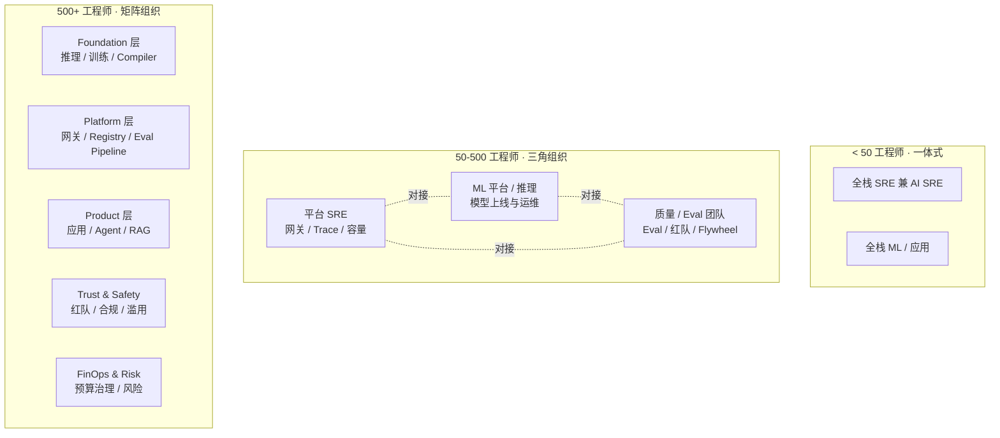
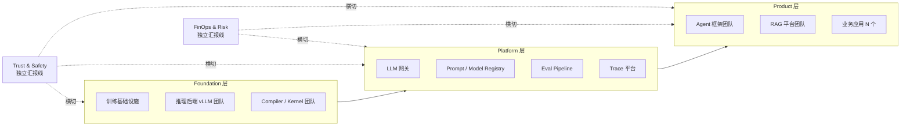
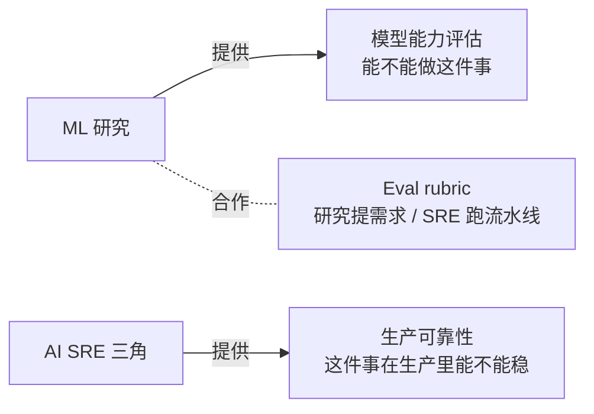
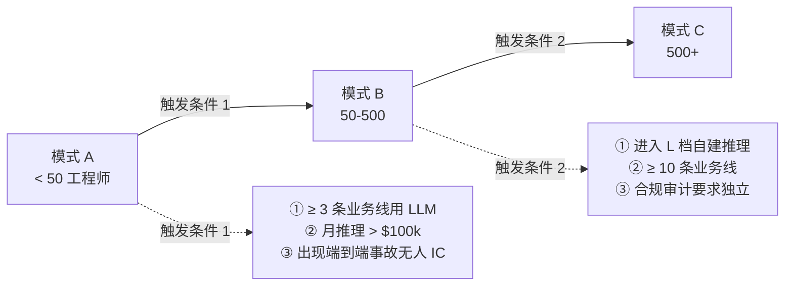

# 架构 02 · AI SRE 组织设计

> 所属：第三部分 · 架构  ·  [← 返回目录](../README.md)

[架构 01](01-AI系统参考架构.md) 给了一张组件图，但组件归谁负责、谁向谁交付什么、谁参加哪个例会——这些在图上看不到。这一章把组件图转成**组织图**：给每个组件配团队、给每条接缝定接口、给每个反复出事故的边界写明确的 RACI。

> [!IMPORTANT]
> 这一章里的"团队"是**职责单元**不是**HR 单位**。在 50 人公司一个人可能同时是网关团队和 Eval 团队；在 1000 人公司"网关团队"是 8-12 人的独立部门。重要的是**职责清晰**，不是层级。

## 1 · 为什么 AI SRE 需要专门讲组织

很多公司把 AI 系统组织成下面这样：

> "推理服务归 ML 平台、网关归中间件、Prompt 归应用、Eval 归算法、Trace 归 SRE。"

每个职责都有人——但**接缝处全是无人区**。事故发生时常见对话：

- 网关 p99 超了 → "网关限流没问题，应该是上游慢"  
- 上游 → "我们没限流，可能是网关聚合 token 错"  
- 应用 → "我们 prompt 没改，应该是模型升级"  
- ML → "我们用的是 SaaS，没法升级"

四个团队互甩 30 分钟，没人回答用户。**这不是责任心问题，是组织架构问题**——没有人对"端到端用户感知 SLO"负责。

AI SRE 组织设计的第一原则要在这里立起来：

> **AI 系统的端到端用户感知 SLO 必须有一个"单一负责人团队"，且这个团队必须有权调度其他团队**。

这条不立起来，后面所有组织设计都是装饰。

## 2 · 三种典型组织模式

按工程师规模有三档典型组织。每一档都对应 [架构 01](01-AI系统参考架构.md) 的某一档实现，但不是 1:1 锁定——组织规模可能领先或落后于系统档位。

### 模式 A · 一体式（< 50 工程师）

特征：

- 一个 SRE（或一组 2-3 人 SRE）兼顾传统服务和 AI
- 一个 ML / 应用团队同时管 prompt、Eval、模型选型
- 没有专门的"网关团队"——网关是应用代码的一部分

适用条件：

- 在 [架构 01](01-AI系统参考架构.md) 的 **S 档**
- 单一上游、单一业务场景
- 不需要专门的红队 / 合规岗位

致命陷阱：

- ⚠️ **不要试图复制大公司的 RACI 矩阵**——50 人公司搞 7 个团队的接口契约，开会比写代码多
- ⚠️ **不要把"AI SRE"写成专职岗 JD**——会招不到合适的人，且来了也只能接零散活

最低必备的角色清晰度：

- 端到端用户感知 SLO 谁负责（通常是兼任的 SRE Lead）
- Prompt 谁有写权限（通常是应用 lead 一个人）
- Eval 谁评审（应用 + SRE 双签）

### 模式 B · 三角组织（50-500 工程师）

这是大多数中型公司应该走的形态。三个核心团队：

| 团队 | 主管组件（[架构 01](01-AI系统参考架构.md) 命名）| 团队规模 | 主要 KPI |
|---|---|---|---|
| **平台 SRE / AI 网关** | G · Obs · Reg · Bud · Tool 沙箱 | 5-15 | 网关可用性 / 端到端延迟 / 单位成本 |
| **ML 平台 / 推理** | M · Mem · Reg 模型部分 | 5-15 | 模型可用性 / TTFT / 自建场景的容量 |
| **质量 / Eval** | Ev · Fl · RT · 部分 R | 3-10 | Judge-human 对齐度 / Gold set 健康度 / 红队覆盖 |

应用团队不在这张图里——它们是"客户"，按业务线划分，使用上面三个团队提供的平台。

适用条件：

- 在 [架构 01](01-AI系统参考架构.md) 的 **M 档**或正在跨向 L 档
- ≥ 3 条业务线在用 LLM
- 月度推理花费 > $100k

三角组织的关键设计：**任何两团队之间都必须有一个固定例会**。

- 平台 SRE × ML 平台 → 容量 / 性能周会，议题：TTFT、显存、限流策略
- ML 平台 × Eval → 模型质量周会，议题：上线 gate、回滚阈值
- 平台 SRE × Eval → 静默降级周会，议题：Canary 监控、数值漂移

三个例会缺一个，对应那条边就会变成事故源。

### 模式 C · 矩阵组织（500+ 工程师）

到这个规模，三角已经撑不住。典型分层：

适用条件：

- 在 [架构 01](01-AI系统参考架构.md) 的 **L 档**
- ≥ 10 条业务线在用 LLM
- 单年推理花费 > $50M，或核心场景受合规约束
- 已有专职安全 / 合规部门

矩阵组织的关键不在于团队多——而在于**横切团队的独立汇报线**。Trust & Safety 和 FinOps 不能向 Platform 或 Product 报告，否则会被合并优化掉（红队总会被砍预算、FinOps 总会被业务压回去）。

> [!CAUTION]
> 模式 C 最常见的失败是 **"看起来像矩阵，实际是命令链"**——红队挂在 Platform 下，FinOps 挂在 Engineering 下，独立性消失。一旦失去独立性，这两个团队就只是装饰，不再起约束作用。

## 3 · RACI 矩阵：模式 B 完整版

下面这张是模式 B（三角组织）的完整 RACI。**R = 主责一人 / A = 最终签字 / C = 必须咨询 / I = 知情**。

| 决策 / 任务 | 平台 SRE | ML 平台 | Eval | 应用 | 安全 | 法务 |
|---|---|---|---|---|---|---|
| **端到端用户感知 SLO** | **R/A** | C | C | C | I | I |
| 模型选型（SaaS 哪家） | C | **R/A** | C | C | C | C |
| 自建推理 vs 继续 SaaS | C | **R** | C | I | C | C/A |
| Prompt 模板写作 | I | I | C | **R** | I | I |
| Prompt 上线 gate | C | I | **R/A** | C | I | I |
| 模型上线 gate | C | C | **R/A** | I | C | I |
| 容量规划 | **R/A** | C | I | C | I | I |
| 网关限流策略 | **R/A** | C | I | C | I | I |
| 数据保留与脱敏 | C | C | I | C | C | **R/A** |
| 致命三角合规 | C | C | I | C | **R/A** | I |
| 红队演练 | C | C | C | C | **R/A** | I |
| 事故 IC（端到端事故）| **R/A** | C | C | C | I | I |
| 事故 IC（数据泄漏）| C | C | I | C | C/A | **R** |
| Eval pipeline uptime | C | I | **R/A** | I | I | I |
| Gold set 维护 | I | C | **R/A** | C | I | I |
| 单位经济性 / TCO | **R/A** | C | I | C | I | C |
| Judge 模型校准 | I | C | **R/A** | C | I | I |
| Trace 标准与规范 | **R/A** | C | C | C | I | I |
| 模型供应商合同 | C | C | I | I | C | **R/A** |

读这张表的方法：

- **每行只能有一个 R 和一个 A，且最好同人**——两个 R 等于没人负责
- **没有 R 的行不允许存在**——发现就是组织 bug
- **C 列代表"必须咨询，不咨询事后追责"**，不是"可以咨询"

### 三个最常见的 RACI 错配

**错配 1 · "Eval 归 ML 完全不归 SRE"**

ML 团队负责让模型变好，Eval 既是 ML 的 KPI 也是 ML 的考试——这是利益冲突。Eval 必须有独立汇报线（哪怕只是组长不向 ML 总监汇报），不然就是让被考试的人自己出题。

**正确**：Eval 团队向 SRE 或 Quality VP 汇报，ML 提供 rubric 但不掌控 gold set。

**错配 2 · "网关团队不看模型质量"**

网关团队的 KPI 全是 latency / availability / throughput——结果出现"网关全绿但用户在抱怨答非所问"。原因是网关团队认为质量是 ML 的事。

**正确**：网关团队的 KPI 必须包含**至少一个质量信号**，比如"按 trace 抽样的引用支持率"或"用户拒答正确率周环比"。这样才会有动力做影子流量、canary 探针。

**错配 3 · "红队是临时活动"**

红队由 ML 工程师轮值做，每季度一次"安全周"。这等于没有红队——攻击者不会按你的日历来。

**正确**：红队至少有 1 名常驻人员（即使部分时间也行），有持续运行的对抗样本库，每次模型/prompt 上线触发自动化红队回归。

## 4 · 五个邻居团队的边界

平台 SRE / ML 平台 / Eval 三角之外，还有五个邻居团队。每个邻居都有一个**最容易模糊**的边界——这一节专写这五条边界。

### 边界 1 · 与 ML 研究 / 算法团队

模糊点：Eval、模型选型、prompt 设计。

清晰边界：

- ML 研究负责"模型能力评估"——这件事能不能做、做到什么水平
- AI SRE 负责"生产可靠性评估"——同样的事在生产环境能不能稳定做
- Eval rubric 由研究提出，由 Eval 团队跑流水线和维护版本——研究不直接改 gold set

### 边界 2 · 与 MLOps 团队

模糊点：模型注册、推理部署、A/B 测试。

清晰边界：

- 如果公司有专门的 MLOps 团队（通常做训练流水线和 model registry），ML 平台 = MLOps 的推理子集
- **训练侧的 model registry** vs **推理侧的 model registry** 必须打通但**不一定合并**——推理侧关心"生产用的模型 + prompt + judge 三联版本"，训练侧关心"训练数据 + checkpoint + lineage"
- A/B 测试基础设施归 MLOps，但**AI 系统的 A/B 必须接 Eval pipeline**——传统 A/B 看 CTR，AI A/B 必须同时看质量分

### 边界 3 · 与安全团队

模糊点：致命三角合规、数据脱敏、红队。

清晰边界：

- 致命三角防御**架构上**归 SRE（沙箱、egress、capability 凭证），但合规审计归安全
- 红队**对抗样本设计**归安全，**回归运行**归 Eval 团队
- 数据脱敏在哪一层做归 SRE（通常在 P 层和 G 层），脱敏规则与豁免清单归法务

> [!IMPORTANT]
> AI 安全和传统应用安全是两个学科——传统安全工程师不天然懂 prompt injection。组织上应至少有 1 名安全工程师专门学习 AI 安全，否则安全团队会用错的工具来对付 AI 系统（继续依赖 WAF 而不是渲染层防御）。

### 边界 4 · 与平台 / 中间件团队

模糊点：LLM 网关算谁的、Trace 系统算谁的。

清晰边界：

- LLM 网关**不是**通用 API 网关。它有 token 计费、上游路由、影子流量这些通用网关没有的能力——必须由 AI SRE 拥有
- 通用 API 网关（处理认证、TLS、WAF）继续归中间件——LLM 网关是它的下游
- Trace 系统的**底座**（OTel collector、存储）归平台，**AI 特有的 schema**（trace_id 关联 prompt 版本、token 消耗、verifier 结果）归 AI SRE 定义

### 边界 5 · 与应用 / 业务团队

模糊点：Prompt 写作、step 预算谁定、谁担质量责任。

清晰边界：

- Prompt 模板由应用团队写，但**模板变量校验和安全规则注入**由 P 层负责（应用提需求、平台落实）
- Step 预算由应用提议、SRE 审核——超预算需要 SRE 签字
- 业务质量（"用户满意度"）归应用，技术质量（"引用支持率"、"JSON 通过率"）归 Eval 团队

应用团队和 AI SRE 三角的关系**不是甲乙方而是共同设计者**——SRE 提供平台和约束，应用提供业务知识和场景，两边都不能一边倒。

## 5 · 接口契约：每团队对外的承诺清单

承接上一节的 RACI——**每个团队对外承诺什么、按什么节奏交付**必须写下来。下面是模式 B 三个核心团队的对外承诺模板。

### 平台 SRE / 网关团队

对外承诺：

- 网关 SLO（可用性 ≥ X%、增加的 p99 延迟 ≤ Y ms）月度报告
- 端到端 trace 与 dashboard，所有团队可查
- 容量预测，季度更新
- 上游切换 / 限流变更预告（≥ 1 周）
- 事故 IC（端到端事故）

对内需要：

- 应用团队提供：流量预测、新业务上线预告
- ML 平台提供：上游模型升级预告、推理后端版本变更预告
- Eval 团队提供：质量退化报警的 dashboard 接入

### ML 平台 / 推理团队

对外承诺：

- 模型 SLO（TTFT、token 吞吐、可用性）
- 模型上线 release notes（性能 / 行为变化）
- 静默降级 canary 报警接入
- 自建场景的容量曲线（QPS × 上下文长度 × 显存）

对内需要：

- 平台 SRE 提供：网关侧的真实流量分布
- Eval 团队提供：上线 gate 的判据
- 应用团队提供：长 context 场景预告

### 质量 / Eval 团队

对外承诺：

- Eval pipeline uptime（这是基础设施，不是研究项目）
- Gold set 健康度月报（覆盖率、新鲜度、judge-human 对齐度）
- 上线 gate 判据（清晰、可争议但不可绕过）
- 红队回归报告

对内需要：

- ML 平台提供：模型版本、上线预告
- 应用团队提供：业务场景描述、典型样本
- 平台 SRE 提供：trace 采样接入

这三套承诺的核心思想：**每个团队都既是平台（对下游有承诺）又是客户（对上游有需求）**。RACI 把责任划清，但实际工作的进展靠这套互相承诺。

## 6 · 反模式（最常见的组织失败）

### 反模式 1 · 没有"端到端 SLO 负责人"

最常见也最致命。每个团队都有自己的 SLO，但没有团队对**用户感知**负责。事故时四个团队互甩。

**修复**：明确指定一个团队拥有"端到端用户感知 SLO"——通常是平台 SRE / 网关团队，因为它在所有调用的入口。这个团队必须有权要求其他团队改东西（不只是开 ticket，是 ticket 进 sprint 排期）。

### 反模式 2 · 把 AI SRE 当成传统 SRE 的扩展技能

公司想：让现有 SRE 团队"也学一下 AI"，不增加 headcount。结果是 AI SRE 既没有专人推进、又没有专门的预算和指标。

**修复**：必须有至少一名工程师把"AI SRE"写进 JD 和 OKR。哪怕兼任，也要在 OKR 里占 ≥ 50%。

### 反模式 3 · 网关团队不看模型质量、Eval 团队不看延迟

每个团队看自己一亩三分地。结果"上游延迟正常 + 网关延迟正常 + 模型质量正常 = 用户体验崩了"，因为没人看交叉指标。

**修复**：每个核心团队的 KPI 里必须有**至少一个跨界指标**。网关团队 KPI 含"按 trace 抽样的引用支持率"；Eval 团队 KPI 含"端到端 p99"。这种"看似不归我管"的指标才能推动跨团队对话。

### 反模式 4 · Prompt 没有版本所有者

Prompt 散在 git 各处，每个应用一个 readme，没有人对"Prompt Registry 的健康度"负责。某天发现 prompt 静默改动半年没人审，已经回不去了。

**修复**：Prompt Registry 必须有一名维护者（通常在平台 SRE 或 ML 平台团队），这名维护者对"prompt 版本回滚 < 5 分钟"这个 SLO 负责。

### 反模式 5 · 红队挂在 ML 团队下

ML 团队的 KPI 是模型上线速度，红队是它的成本中心——结果红队总被砍预算或被合并到"安全周"。

**修复**：红队必须有独立汇报线（向安全 / 质量 / 法务汇报均可，但不向 ML 汇报），且至少有一名常驻人员。

### 反模式 6 · "Eval 归 ML"

Eval 团队向 ML VP 汇报，ML VP 的 KPI 是模型上线速度——Eval 的实际作用变成"帮 ML 拿绿灯"，而不是"帮组织把住质量门"。

**修复**：Eval 必须独立于 ML 汇报。模式 B 推荐向 Quality 或 SRE 汇报；模式 C 推荐独立 Quality VP。

### 反模式 7 · FinOps 不参与 AI 设计评审

财务发现 AI 账单一个月烧了 $5M 时已经晚了——架构里早就有"每个用户请求平均 50k token"这种问题。

**修复**：≥ $1M/月推理花费的组织，FinOps 必须出席 AI 系统的架构评审。详见 [架构 06 · 预算治理](06-预算治理.md) 和 [架构 07 · 与外部世界的契约](07-与外部世界的契约.md)。

### 反模式 8 · "AI 委员会"代替清晰 RACI

公司发现协调难，于是开一个"AI 委员会"——10 个人每周开会，没有人是 R。结果决策全靠会议拖延。

**修复**：委员会用于**信息同步**，不用于**决策**。决策必须落到具体的 R 上，委员会能做的是 challenge 和咨询。

## 7 · 组织演进路径

模式 A → B → C 的演进时机：

A → B：**最容易拖**。组织规模到了 80 人还在按 A 跑，结果是几个核心人疲于救火。看到上面三条触发任意两条就该开始拆三角。

B → C：**最容易过早**。组织 200 人就上矩阵会变成"每个团队 5 个人但接缝有 20 条"。三角组织能撑到 500 人，撑不下时再上矩阵。

> [!CAUTION]
> 组织迁移和系统迁移**不要同时做**。同时迁移，事故率会乘起来——通常是组织先稳半年，再做系统跨档；或系统稳定半年，再做组织升级。

## 8 · 这一章的产出物

读完本章你应该能交出三件东西：

1. **当前组织的 RACI 表**（参照本章模板填空）——找出哪些 R 缺失或重复
2. **当前组织所处模式**（A/B/C）+ **下一档的触发条件检查**
3. **接缝故障清单**——过去 3-6 个月的事故里，多少是组织接缝问题（"两个团队都说不归自己管"），哪些可以通过 RACI 修复

这三件产出物拿去做组织评审、招聘规划、季度规划都用得上。

## 这一章不讨论什么

- **不是 HR 与汇报关系**——本章只管职责单元，不管 line manager
- **不是个人能力建模**——AI SRE 个人画像看 [理念 02](../理念/02-SRE架构师的角色迁移.md) 和 [第 8 章](../知识/08-组织与判断力.md)
- **不是组织变革管理**——怎么推动组织接受这套 RACI 是另一门学问，本章只给"应然"

## 接下来

- **下一章**：[架构 03 · 架构师的决策框架](03-架构师的决策框架.md) —— 6 类高频决策的判据矩阵
- **配套**：[第 8 章 · 组织与判断力](../知识/08-组织与判断力.md) —— 个人层面的角色与能力
- **诊断现状**：[深入 11 · AI SRE 现实图谱](../深入/11-AI-SRE现实图谱.md) §2 真实职责边界

🔄 复习：[核心概念卡](../复习/核心概念卡.md) · [Active Recall 题库](../复习/Active-Recall题库.md)

---

[← 架构 01 · AI 系统参考架构](01-AI系统参考架构.md)  ·  下一章 → [架构 03 · 架构师的决策框架](03-架构师的决策框架.md)
