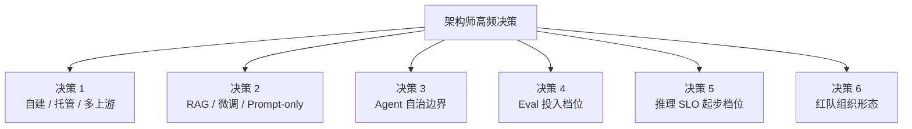
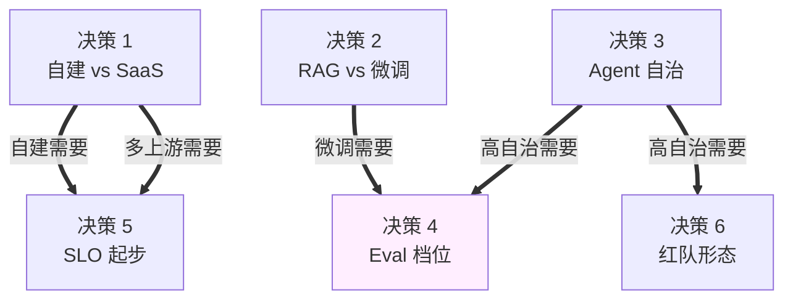

# 架构 03 · 架构师的决策框架

> 所属：第三部分 · 架构  ·  [← 返回目录](../README.md)

[架构 01](01-AI系统参考架构.md) 给了"系统该长什么样"，[架构 02](02-AI-SRE组织设计.md) 给了"组织该长什么样"。但**站在白板前的架构师每天面对的不是"长什么样"，是"今天该选 A 还是 B"**。这一章给六类高频决策的判据矩阵——不是答案，是把对话从"我觉得"拉到"按这几条判据来看"的工具。

> [!IMPORTANT]
> 框架的价值不是"消除分歧"——是**让分歧落到具体的判据上**。两个架构师争"该不该自建推理"，争半天发现一个在算 TCO 一个在算性能；用同一个判据矩阵讨论，分歧 5 分钟就能定位在第几条。

## 1 · 一个架构师的判据原则

在进入六类决策前先立四条元规则——这些规则比任何一条具体判据都重要。

**规则 1 · 先识别决策类型**。决策有两类：**可逆**（错了 1-2 个月内能改）和**不可逆**（错了 6 个月以上修复成本 → 架构 05 详述）。可逆决策快做，不可逆决策慢做。两类用同样的速度做都是错的。

**规则 2 · 默认推荐 + 偏离条件**。每类决策都该有一个**默认选项**——既给团队一个起点，也给"为什么偏离默认"创造对话空间。"默认选 A，但你有 X / Y / Z 三种情况下选 B"——这种结构比"看情况"有用 100 倍。

**规则 3 · 链回具体章节**。每条判据必须有可查证的依据，不靠权威。本章每条判据后都会标 →[章节] 作为引用源——这是为了让你的团队能自己 check，不是凭你说。

**规则 4 · 写下"什么会让我改主意"**。任何架构决策都该附一个**反向触发条件**——什么数据/事件会让你重新考虑。没有反向条件的决策不是决策，是宗教。

## 2 · 六类高频决策

下面每类决策按同一格式：**问题 · 默认推荐 · 判据矩阵 · 反向触发 · 元决策**。

---

## 决策 1 · 自建 vs 托管 vs 多上游聚合

**问题**：模型推理用 SaaS（Anthropic / OpenAI / Azure），还是自建（vLLM / SGLang），还是多上游聚合（网关 + 多家 SaaS）？

**默认推荐**：从 **单一 SaaS** 起步 → 触发条件满足后跨到 **多上游网关** → 极少数情况才进 **自建推理**。

详细拆解见 [架构 01 · S/M/L 三档](01-AI系统参考架构.md#4--s--m--l-三档参考实现) 和 [深入 19 · 模型服务框架对比](../深入/19-模型服务框架对比.md)。

### 判据矩阵

| 判据 | 单一 SaaS | 多上游聚合 | 自建推理 |
|---|---|---|---|
| **月度推理花费** | < $50k | $50k - $5M | > $5M 或核心场景 |
| **延迟约束** | TTFT 容忍 SaaS 水平 | TTFT 容忍 SaaS + 网关 30ms | TTFT 必须 < SaaS 最优 |
| **数据驻留** | SaaS 区域可接受 | SaaS 区域可接受 | 必须自有数据中心 |
| **可用性诉求** | < 3 个 9 | 3-4 个 9 | > 4 个 9 |
| **工程师能力** | 应用层够用 | + 网关 / Eval 团队 | + CUDA / 编译器 / 容量工程 |
| **议价空间** | 无 | 多家议价覆盖网关成本 | 自建覆盖供应商利润 |
| **业务体量** | 几条业务线 | ≥ 3 条 | ≥ 10 条或核心场景 |

→ 容量数学见 [深入 05](../深入/05-LLM推理服务的容量规划.md)；财务模型见 [深入 18 · LLM 成本工程](../深入/18-LLM成本工程.md)。

### 反向触发（什么会让我从默认偏离）

- **从 SaaS 偏向多上游**：单一上游连续两次月度故障 ≥ 30 分钟；或上游限流频繁打到业务侧
- **从多上游偏向自建**：三年 TCO 测算自建比 SaaS 便宜 ≥ 30%（不是 10%——10% 不够覆盖工程风险）；或某个核心场景的延迟 / 数据驻留 SaaS 满足不了
- **从自建退回 SaaS**：自建团队规模 < 3 人能写 CUDA 的（这是最低门槛，达不到自建会变成"用开源不会调也不会修"）

### 元决策

> **大多数公司的"我们要自建"是早 18-24 个月做的决策**。议价空间没用尽就上自建，等于把"只要不被锁死的好处"换成了"既要建又要运维"的全责。

---

## 决策 2 · RAG vs 微调 vs Prompt-only

**问题**：用户问"我们的产品手册里 X 是怎么规定的"，怎么把这个知识接给模型？

**默认推荐**：**先 Prompt-only → 不行再 RAG → 极少数情况才微调**。

### 判据矩阵

| 判据 | Prompt-only | RAG | 微调 |
|---|---|---|---|
| **知识量** | < 单次上下文（几千 token） | 几 MB - TB | 几十 MB - 几 GB（训练样本）|
| **更新频率** | 月级以上 | 实时-小时级 | 月级以上 |
| **可解释性** | 原文在 prompt 里 | 引用可追溯 | 黑盒（除非记录训练数据）|
| **冷启动成本** | 低（写 prompt） | 中（建索引、reranker、eval） | 高（数据准备 + 训练 + eval） |
| **持续运维成本** | 低 | 中（索引更新、过期淘汰） | **高**（基座升级要重训）|
| **典型应用** | 客服话术、固定模板回答 | 知识问答、文档检索 | 风格、领域 jargon、特殊推理 |

→ RAG 设计见 [深入 16](../深入/16-Embedding-服务作为独立运维对象.md)；微调运维见 [深入 14 · 微调作为运维对象](../深入/14-微调作为运维对象.md)。

### 反向触发

- **从 Prompt-only 升 RAG**：知识量超出上下文窗口（典型阈值：> 50k token 的相关知识），或知识更新需要小时级生效
- **从 RAG 升微调**：RAG + reranker + 良好的 prompt 仍然达不到质量目标（**至少做完三轮 RAG 调优后再考虑**）；或者输出风格 / 行话有强约束
- **从微调退回 RAG**：基座供应商升级强制重训成本 > 你团队的可承受范围；或微调模型的边际收益 < 维护成本

### 元决策

> **微调被严重高估**。"我们要微调一个属于自己的模型"是个浪漫的想法，工程上 80% 的场景 RAG + Prompt 优化能达到同样效果且维护成本低一个数量级。微调真正合适的场景集中在两类：① 输出风格 / 格式有强约束（Prompt 调不动）② 领域语言模型（医疗 / 法律的术语和 reasoning chain）。

---

## 决策 3 · Agent 自治边界

**问题**：我的 Agent 该让它做到哪一步——只读？读后建议？读后执行？读后执行+回滚？

**默认推荐**：**从 L0 起步，每升一级要求上一级稳定运行 ≥ 3 个月**。完整的 L0-L4 分级见 [深入 11 · AI SRE 现实图谱 §3](../深入/11-AI-SRE现实图谱.md)。

### 判据矩阵：能不能升一级？

升级到下一级前，每条都必须为"是"：

| 判据 | L0 → L1（带引用 RAG）| L1 → L2（受限工具） | L2 → L3（半自治） | L3 → L4（高自治） |
|---|---|---|---|---|
| 上一级线上 ≥ 3 个月稳定 | 是 | 是 | 是 | **是 ≥ 12 个月** |
| 引用支持率 / tool 参数合法率 | ≥ 95% | ≥ 99% | ≥ 99.5% | ≥ 99.9% |
| 红队覆盖（致命三角） | 至少砍一腿 | 至少砍两腿 | 三腿全控 | 三腿全控 + 多重防御 |
| 失败的 blast radius | 单次 UI 错答 | 误读单条数据 | 单次写操作可回滚 | 不可逆动作有双签 |
| 回滚机制 | N/A | 不需要 | 自动 < 5 分钟 | 自动 < 1 分钟 + 双系统交叉验证 |
| HITL（人在回路）正确部署 | 不需要 | 写操作必须 | 高风险动作必须 | 全程双轨 |

→ 致命三角见 [第 6 章](../知识/06-AI自治与上下文架构约束.md)；工具沙箱见 [深入 07](../深入/07-Agent-Prompt-Injection红队实战.md)。

### 反向触发

- **从 Lx 降级到 L(x-1)**：连续 7 天该等级失败率 > 阈值；红队发现新攻击面尚未修补；上游模型升级未做回归
- **完全停用 Agent 自治**：发生不可逆事故；用户群体出现"不再信任 AI 输出"的趋势

### 元决策

> **大部分组织高估了自己 ready 的等级**。常见情况：团队号称在做 L3，实际 L1 的引用支持率都没测过——一旦出事就是从 L3 直接掉到 L0（关停）。**不要跳级**——稳扎稳打 L0→L1→L2 的组织，最终能到 L3 的概率，比从一开始就上 L3 的高 10 倍。

---

## 决策 4 · Eval 投入档位

**问题**：Eval 系统该投入多少——只跑 assertion？跑 LLM-as-judge？接人工标注？建研究级 eval？

**默认推荐**：**四档（L1 assertion → L2 LLM judge → L3 人工标注采样 → L4 研究级）依次叠加**，永远先做 L1。

详细分级见 [深入 06 · Eval Pipeline 设计](../深入/06-Eval-Pipeline设计.md)。

### 判据矩阵

| 档位 | 必备条件 | 工程量 | 适合阶段 |
|---|---|---|---|
| **L1 · Assertion** | 每个任务类型 ≥ 5 条硬规则 | 1-2 周 | 上线第一天起 |
| **L2 · LLM-as-Judge** | L1 通过；judge 模型与人工标注 calibration | 1-2 月 | 进入 [架构 01 M 档](01-AI系统参考架构.md#m-档--多上游网关--自建-eval) |
| **L3 · 人工标注采样** | L2 稳定；专门的标注流程；样本采样策略 | 3-6 月 + 持续 | 业务月推理 > $500k |
| **L4 · 研究级 eval** | L3 已稳定；研究人员；长尾场景 / 多语种 | 6-12 月 + 持续 | 进入 [架构 01 L 档](01-AI系统参考架构.md#l-档--自建推理--完整数据飞轮) |

→ 研究级 eval 见 [共同语言 03](../共同语言/03-Research-Level-Evaluation.md)。

### 反向触发

- **跳过 L1 直接上 L2**：永远不要——L1 是 L2 的健康检查（L2 漂移时 L1 是兜底）
- **L2 失效信号**：judge-human 对齐度 < 0.7；judge 在某类任务上系统性偏一边
- **要不要上 L3**：上线后线上质量 > eval 质量的差距 > 10pp，或事故复盘里反复出现"eval 没覆盖到"

### 元决策

> **Eval 最大的失败不是覆盖不全，是 Eval 本身没人维护**。Eval pipeline 自己挂了一周没人发现，gold set 半年没更新，judge 模型悄悄换了——这些情况比"eval 不够全面"普遍得多。**先把 L1 维持稳定 6 个月**，比跳到 L2 但 L1 烂掉重要 10 倍。

---

## 决策 5 · 推理 SLO 起步档位

**问题**：第一次给 AI 服务定 SLO，TTFT / token throughput / 可用性 / 质量分各定多少？

**默认推荐**：**先看观测、再定 SLO**——前 4-6 周纯观测不定 SLO，第二个月用 p50 / p95 实测值的"略低于"作为初始 SLO。

完整指标体系见 [第 5 章 · AI 推理服务的可靠性工程](../知识/05-AI推理服务的可靠性工程.md)。

### 判据矩阵：起步档位的四条线

| 指标 | 起步默认 | 收紧条件 |
|---|---|---|
| **TTFT p99** | 实测 p99 + 30%（给容量增长空间） | 用户研究表明 TTFT > X 流失上升 |
| **Token throughput p50** | 实测 p50 - 10% | 长答场景占比 > 30% |
| **可用性** | 上游 SLA - 0.05% | 业务对单次请求结果有强依赖 |
| **质量分（按任务分桶）** | 上线前 eval 实测的 -5pp | 出现两次质量退化但 dashboard 全绿 |

→ 静默降级与质量分见 [第 5 章](../知识/05-AI推理服务的可靠性工程.md#静默降级这维度里最容易被忽视的盲点)；网关位四段归因见 [深入 17](../深入/17-LLM网关的SRE视角.md)。

### 反向触发

- **SLO 定得太松**：连续 3 个月 error budget 用不到 30% → 收紧
- **SLO 定得太紧**：连续 3 个月 error budget 透支 → 放松或加资源；不要 silently 让 SLO 形同虚设
- **质量 SLO 缺失**：发生静默降级事故而 SLO 没接到 → 立刻补质量分维度

### 元决策

> **"全局幻觉率"这种 SLO 是反模式**——它不可操作，alarm 响了不知道该做什么。SLO 必须按**任务类型分桶**：客服类 95%、文档检索 99%、代码生成 90%。这样 alarm 响起来你知道修哪类。

---

## 决策 6 · 红队 / 安全独立成组 vs 嵌入

**问题**：红队应该独立成组、嵌入安全部门、还是各业务线自己做？

**默认推荐**：**至少有 1 名常驻、独立汇报线的红队工程师**——其他模式都不稳。

### 判据矩阵

| 模式 | 适合规模 | 必备条件 | 失败模式 |
|---|---|---|---|
| **嵌入应用 / ML（不推荐）** | 任何规模 | —— | 永远被业务 KPI 压制 |
| **常驻 1 人 + 兼职轮值** | 50-200 工程师 | 兼职轮值有时间预算 | 兼职人员被业务抽走 |
| **独立小组 3-5 人** | 200-1000 工程师 | 向 Quality / Security VP 汇报 | 小组与业务脱节，找不到现实风险点 |
| **独立部门 + 红蓝对抗** | > 1000 工程师 | 与监管 / 合规对接 | 重叠严重，组织成本高 |

→ 详细见 [架构 02 · 反模式 5](02-AI-SRE组织设计.md#反模式-5--红队挂在-ml-团队下) 和 [深入 07](../深入/07-Agent-Prompt-Injection红队实战.md)。

### 反向触发

- **从嵌入升独立**：发生过一次 prompt injection 事故；或合规要求审计独立性
- **从独立小组升部门**：业务线 ≥ 10 条；或核心业务受监管约束（金融、医疗、法律）

### 元决策

> **红队不是测试一次性活动，是持续的对抗演化**。攻击面会随模型升级、prompt 变化、新工具接入而漂移——一年前测过的"安全的 prompt"今天可能就是攻击面。所以红队一定要有**持续运行**的回归库，而不是按季度搞"安全周"。

---

## 3 · 决策的协同：六类决策不是独立的

最后一节专讲六类决策**之间的耦合关系**——选 A 类的某档会强制 B 类的某档。架构师常错的是只在单一决策上推敲，忽略联动。

**强耦合关系（出现就强制升档）**：

- **决策 3 · Agent 自治升一档** → **决策 4 · Eval 必须升一档**（高自治没 L3 eval = 盲飞）
- **决策 2 · 上微调** → **决策 4 · 至少 L2 eval**（微调没法靠 prompt 调，必须 eval 闭环）
- **决策 1 · 自建推理** → **决策 5 · 必须有质量分 SLO**（自建后没人帮你监控数学正确性）
- **决策 3 · L3+** → **决策 6 · 红队必须独立**（兼职红队应付不了 Agent 攻击面）

**弱耦合关系（强相关但不强制）**：

- **决策 1 · 多上游** → **决策 5 · 网关位 SLO 必须四段归因**（不分段会变成"上游和网关互相甩锅"，见 [深入 01 §1.10](../深入/01-首包延迟与吞吐的影响因素.md)）
- **决策 2 · RAG 上线** → **决策 6 · 至少考虑 RAG 投毒攻击面**

### 一个决策树例子

业务方说："我们要做一个 Agent 自动审批小额报销，目标延迟 < 3 秒，预期月调用 100 万次。"

按本章框架走一遍：

1. **决策 3 · 自治边界**：审批 = 写操作 + 涉及金额 → 至少 L3，目标 L4 → **触发决策 4 升档**
2. **决策 4 · Eval 档位**：L3+ 自治 → 至少 L3 eval（人工标注采样）→ **6 个月准备期**
3. **决策 1 · 部署形态**：100 万次/月 + 3 秒延迟 → 起步用 SaaS（多上游或单家），不需要自建
4. **决策 5 · SLO**：必须有"审批正确率"分桶 SLO；可用性 ≥ 99.9%（业务级）
5. **决策 6 · 红队**：财务流程 = 强对抗动机 → 红队必须独立
6. **决策 2 · RAG vs 微调**：报销规则是文档 → RAG，不微调

整体看完发现："Eval 团队还没有 → 准备期 ≥ 6 个月 → 业务方要的 Q3 上线做不到"。这就是架构师该回去的反馈。

**不走框架的话**，对话会变成"用 GPT-4 + LangChain，下个月上"——三个月后翻车然后甩锅给 AI。

## 4 · 这一章的产出物

读完本章你应该能交出三件产出物，每一件都拿去开会用：

1. **当前系统的六类决策快照**——每类当前选了哪一档、判据矩阵打几分、反向触发条件是什么
2. **下一年的决策路线图**——预计哪几类决策会升档，对应的准备工作
3. **决策评审模板**——业务方提新需求时，按本章六类决策走一遍

这三件东西是 design review、年度规划、季度复盘的常驻工件。

## 这一章不讨论什么

- **不是包含所有决策**——本章只覆盖**架构层面、跨多团队、不可逆或半不可逆**的六类。具体技术选型（"用 Pinecone 还是 pgvector"）在深入专题层
- **不是给出标准答案**——所有"默认推荐"都是基于当下生态的合理起点，不是真理。生态变了判据也要变
- **不是替代具体业务判断**——业务约束（合规、客户合同、内部数据敏感性）会改变默认推荐的权重，框架只给结构

## 接下来

- **下一章**：[架构 04 · AI SRE 成熟度模型 L1-L5](04-AI-SRE成熟度模型.md) —— 决策做了之后怎么自评走得对不对
- **配套**：[架构 05 · 不可逆决策与 Day 2 状态](05-不可逆决策与Day2状态.md) —— 不可逆决策的纵深处理
- **配套**：[附录 E · 模板库](../附录/E-模板库.md) —— 评审模板

🔄 复习：[核心概念卡](../复习/核心概念卡.md) · [Active Recall 题库](../复习/Active-Recall题库.md)

---

[← 架构 02 · AI SRE 组织设计](02-AI-SRE组织设计.md)  ·  下一章 → [架构 04 · AI SRE 成熟度模型 L1-L5](04-AI-SRE成熟度模型.md)
