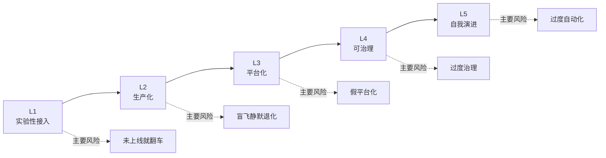
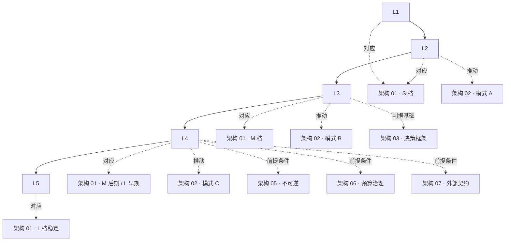

# 架构 04 · AI SRE 成熟度模型 L1-L5

> 所属：第三部分 · 架构  ·  [← 返回目录](../README.md)

[架构 01](01-AI系统参考架构.md) 的 S/M/L 是**系统形态**——讲组件配齐了几档。本章的 L1-L5 是**控制能力**——讲组织在多大程度上能驾驭它建出来的系统。两者不一定锁定：S 档可能 L3，L 档也可能假装 L4 实际 L2。这一章给一套判据，让架构师每季度问一次"我们到底处在哪一级、缺什么、卡在哪"。

> [!IMPORTANT]
> 成熟度模型的价值**不是评级炫耀**——是**反向自检**。一个团队声称在 L4 但触发条件只满足两条 → 这不是 L4，是"假 L4"。识别假升档比识别真升档重要 10 倍——因为前者会让组织带着虚假信心做不该做的事。

## 1 · 为什么 L1-L5 而不是别的分级

成熟度模型已经被 SEI / DevOps / DORA 用过很多次。这一套 AI SRE 专用分级有三条不一样：

- **它不是"你越高越好"**——多数团队应停在 L3 / L4，强行追 L5 通常是浪费
- **它有"假升档"症状**——传统成熟度模型只讲怎么升，不讲怎么识别"虚假升档"
- **它把组织能力 / 系统能力 / 控制能力分开**——一个团队可能系统看上去很强但控制能力很弱（[架构 01](01-AI系统参考架构.md) L 档但本章 L2）



## 2 · L1-L5 概览：一句话定义

| 级别 | 一句话 | 系统对应 | 团队规模 |
|---|---|---|---|
| **L1 · 实验性接入** | "能用 LLM API，没什么别的" | S 档不完整 | 1-3 人 |
| **L2 · 生产化** | "上线了，有 SLO 和基础 Eval" | S 档完整 | 3-10 人 |
| **L3 · 平台化** | "网关 + Trace + Eval 一体化，多业务复用" | M 档 | 30-100 人 |
| **L4 · 可治理** | "数据飞轮 + 红队 + 多维 SLO + 组织清晰" | M 档稳定或 L 档早期 | 100-500 人 |
| **L5 · 自我演进** | "模型可换、上游可换、人员可换" | L 档稳定 | 500+ 人 |

**关键观察**：

- L1 → L2 是**最常被低估的跨级**——很多团队号称在 L2，实际 SLO 没定 / Eval 是 demo
- L3 是**绝大多数公司的目标终点**——再往上 ROI 急剧下降
- L4 → L5 之间几乎没有公司——L5 是个理想态，本书拿出来作为"最高北极星"，不期待你能到

## 3 · 五维判据矩阵

每一级用同样的五维评估：**可观测 · 可靠性 · 安全 · 成本 · 组织**。下面给出每级在五维上的判据。任意一维不达标 → 这一级不算达成。

### L1 · 实验性接入

| 维度 | 判据 |
|---|---|
| **可观测** | 至少把 LLM 调用打日志（请求 / 响应 / token 数）|
| **可靠性** | 错误处理（429 / 5xx 重试），超时设置 |
| **安全** | API key 不进 git；prompt 里没有用户 PII 直接外发 |
| **成本** | 月度账单可见，知道大概花多少 |
| **组织** | 有人对这件事负责（即使是兼职）|

L1 的精神：**别裸奔**。能跑、能查日志、能算账。

进入 L1 的触发：业务方决定试用 LLM。

L1 → L2 的触发（任意两条）：

- 用户开始抱怨"AI 答错了"——出现质量问题
- 月度推理花费 > $5k（开始有财务压力）
- 团队决定把这个用例**正式纳入产品**

### L2 · 生产化

| 维度 | 判据 |
|---|---|
| **可观测** | 跨组件 trace（最低一个 trace_id 贯穿）；TTFT / 错误率 / token / 成本可视化 |
| **可靠性** | 至少一个延迟 SLO 和一个可用性 SLO，定义清晰；上游限流有兜底（降级 / 排队）|
| **安全** | 致命三角至少砍一腿（通常 egress 白名单或工具白名单）|
| **成本** | 按业务功能 / 用户类型分维度归因，月度报告 |
| **组织** | 有 [架构 02](02-AI-SRE组织设计.md) 模式 A 的最小 RACI；有人能接事故 |

L2 的精神：**上线了，但还没规模化**。一个业务、一个上游、一套 prompt。

L2 → L3 的触发（任意两条）：

- 业务线 ≥ 3 条都在用 LLM
- 月度推理花费 > $50k
- 出现端到端事故无人能 IC（接入网关团队的关键时机，见 [架构 02 反模式 1](02-AI-SRE组织设计.md#反模式-1--没有端到端-slo-负责人)）
- 单一上游故障导致业务级事故

### L3 · 平台化

| 维度 | 判据 |
|---|---|
| **可观测** | 统一 trace / metric / log 平台；按任务类型分桶的质量分（[第 5 章](../知识/05-AI推理服务的可靠性工程.md)）；网关位四段归因（[深入 17](../深入/17-LLM网关的SRE视角.md)）|
| **可靠性** | 多上游网关；推理 SLO 完整三类（延迟 / 容量 / 质量）；Canary 持续运行 |
| **安全** | 致命三角砍两腿；Tool 沙箱化；红队回归（哪怕季度一次）|
| **成本** | 按业务线 / 客户分摊；预算告警（[架构 06 · 预算治理](06-预算治理.md)）|
| **组织** | [架构 02 模式 B 三角组织](02-AI-SRE组织设计.md#模式-b--三角组织50-500-工程师) 完整；端到端 SLO 有单一负责人 |

L3 的精神：**多业务复用同一套平台**。AI 工程从"项目"变成"基础设施"。

L3 是绝大多数公司的合理目标终点。

L3 → L4 的触发（任意三条以上才该考虑）：

- 进入 [架构 01 L 档](01-AI系统参考架构.md#l-档--自建推理--完整数据飞轮) 的触发条件已满足
- 有合规审计要求（金融 / 医疗 / 政府）
- 出现过隐蔽的静默降级事故，发现"L3 的 eval 不够覆盖"
- 业务体量 > $5M/月推理花费且增速持续 > 30%/年

### L4 · 可治理

| 维度 | 判据 |
|---|---|
| **可观测** | Trace ↔ Eval ↔ Prod ↔ Postmortem 可双向跳转；judge-human 对齐度跟踪；按地域 / 语言 / 任务的多维度质量监控 |
| **可靠性** | 完整 [Data Flywheel](../知识/07-质量可观测性与DataFlywheel.md)；模型 / Prompt 灰度发布；自动回滚 < 5 分钟；红队常态化 |
| **安全** | 致命三角三腿全控；红队独立汇报线（[架构 02 模式 C](02-AI-SRE组织设计.md#模式-c--矩阵组织500-工程师)）；隐私保护（差分隐私、PII 自动脱敏）|
| **成本** | 单位经济性（unit economics）建模；Token / GPU / Risk / Error budget 联合治理（[架构 06](06-预算治理.md)）|
| **组织** | 矩阵组织或接近；Trust & Safety 独立；FinOps 进入设计评审 |

L4 的精神：**系统能自我矫正**。问题被发现得快、定位到具体组件、改完能验证、不重复犯。

L4 → L5 的触发：

- L4 稳定运行 ≥ 18 个月
- 经历过至少一次模型供应商重大变更（升级 / 限流 / 价格变动 / 合规要求）并平稳过渡
- 经历过至少一次内部组织变更（团队拆分 / 合并）系统未受影响
- **真的有必要**——大多数公司不需要 L5

### L5 · 自我演进

| 维度 | 判据 |
|---|---|
| **可观测** | 可观测系统自身可审计；监控指标随业务自动演化（不靠人工每年更新）|
| **可靠性** | 模型 / 上游 / 网关任意可替换且 < 30 天迁移完；Eval gold set 与 rubric 持续自适应业务变化 |
| **安全** | 红蓝对抗自动化；致命三角威胁模型每季度更新；新攻击面发现 → 防御 < 7 天 |
| **成本** | 多模型自动路由优化（[深入 18](../深入/18-LLM成本工程.md)）；预算与质量联合优化（不再是单一目标）|
| **组织** | 任何关键人员离职 ≤ 1 月内系统不受影响；新人 onboarding ≤ 4 周能独立交付 |

L5 的精神：**系统的瓶颈不再是任何一个具体的人 / 模型 / 上游 / 工具**。

老实说全球能确认达到 L5 的组织目前是少数派。把它写进来是为了**给 L4 一个目标方向**，不是期待大家都到。

## 4 · 假升档症状（评审武器）

成熟度模型最大的实际用法不是"评级"——是**识别哪些组织自封某档但实际不在**。下面是六种最常见的假升档症状，每种都附"看哪里能识破"。

### 症状 1 · 假 L2："SLO 写在文档里但没人看"

**外观**：团队声称有 SLO，文档里写得清清楚楚——TTFT < 500ms、可用性 99.9%。

**识破方法**：

- 问"上次 SLO 违约是什么时候？发生了什么 follow-up？"——答不上来 = 没在用
- 看 dashboard 有没有 SLO burn rate 曲线——没有 = SLO 是装饰
- 翻最近 3 次事故复盘——SLO 一次都没被引用 = SLO 形同虚设

**真 L2 的标志**：SLO 违约会触发明确的 action（降级、排队、回滚），且复盘会指向 SLO。

### 症状 2 · 假 L3："网关有了但没有质量信号"

**外观**：团队建了 LLM 网关，统一接入所有 LLM 调用，dashboard 一片绿。

**识破方法**：

- 看网关团队 KPI 有没有质量信号——只有 latency / availability = 没有
- 问"上一次静默降级是什么时候发现的？怎么发现的？"——答不上来 = 没在监控
- 看 canary 探针的 dashboard 有没有持续运行——没有 = 网关只是个 latency proxy

**真 L3 的标志**：网关位有持续 canary、按任务分桶质量分、出现质量退化时 30 分钟内能定位到上游 / 网关 / 应用三段中的哪段。

### 症状 3 · 假 L3："Eval 跑过但没接发布 gate"

**外观**：有 Eval pipeline、有 gold set、定期跑分数。

**识破方法**：

- 问"最近一次 prompt 上线，Eval 分数是什么？" → 答"我们没看 / 没卡"= 没接 gate
- 问"Eval pipeline 自身的 uptime SLO 是什么？" → "什么 uptime SLO" = Eval 是研究项目而不是基础设施
- 看 prompt 上线流程有没有 Eval gate 必经环节——没有 = Eval 与发布脱节

**真 L3 的标志**：Eval 不达标的 prompt / 模型不允许进 prod；Eval pipeline 自身有 SRE 级 uptime；Eval 失败会触发回滚。

### 症状 4 · 假 L4："数据飞轮停在抽样这一步"

**外观**：团队声称有完整 Data Flywheel——trace 进 storage、采样、人工标注。

**识破方法**：

- 问"过去 6 个月有几个 prompt / 模型版本是直接因为 flywheel 数据触发的？"—— 0 个 = 飞轮是装饰
- 看人工标注的样本有没有真的回到 gold set 和 fine-tuning 数据集——没有 = 飞轮在原地转
- 问"飞轮的人均吞吐量"——含糊 = 没在跟踪

**真 L4 的标志**：每月至少一次 prompt / 模型 / RAG 调整能直接溯源到 flywheel 数据；标注 → gold set → eval → 上线的闭环 ≤ 1 个月延迟。

### 症状 5 · 假 L4："红队是 PR 活动"

**外观**：组织有红队团队、定期发"安全月报告"。

**识破方法**：

- 看红队人员的 OKR 是不是与业务上线进度绑死——绑了 = 红队不会真挑刺
- 问"最近一次红队发现的问题，多久修好的？"—— "还在排期" = 红队结论被 deprioritize
- 看红队团队的汇报线——挂在 ML 或 Engineering 下 = 假独立

**真 L4 的标志**：红队有独立汇报线；红队发现的问题有 SLA 修复时限；红队回归是 prompt / 模型上线流水线的必经环节。

### 症状 6 · 假 L5："所有都自建 = 自我演进"

**外观**：团队自建一切——推理后端、向量库、网关、Eval 平台。声称"我们什么都能换、什么都自主可控"。

**识破方法**：

- 问"如果首席工程师明天离职，谁能接？"——答不上来 = 自建变成知识孤岛
- 问"上次基座模型升级用了多久？"—— > 2 个月 = 没有真的可演进
- 问"团队里几个人能完整画出推理栈每一层？"—— ≤ 2 人 = 系统在演进单点

**真 L5 的标志**：组件可换 < 30 天；任何人离职团队仍能交付；新人 onboarding 4 周可上手。**自建本身不是 L5 标志，"任何东西可换"才是**。

## 5 · 自评清单

下面这张是**季度自评清单**，30 项问题，每项 yes/no。按你勾选的总数定档：

```
L1: 6-12 项
L2: 13-18 项
L3: 19-24 项
L4: 25-28 项
L5: 29-30 项
```

### 可观测（6 项）

- [ ] 每个 LLM 调用都进了集中日志，可按 trace_id 追溯
- [ ] 跨组件统一 trace，至少串通"网关 → 模型 → 工具"
- [ ] 至少有一个按任务类型分桶的质量分 dashboard
- [ ] 网关位四段归因（client / gateway / upstream / model）已落地
- [ ] Trace 与 Eval 互可跳转（看到一条 trace 能直接打开它的 eval 历史）
- [ ] 监控指标随业务变化定期回顾（≥ 季度）

### 可靠性（6 项）

- [ ] 至少一个延迟 SLO 和一个可用性 SLO 在 dashboard 上
- [ ] 上游限流 / 故障有明确兜底（降级 / 排队 / 切换上游）
- [ ] Canary 探针持续运行，可识别静默降级
- [ ] Prompt / Model / Embedding / Judge 四联版本绑定发布
- [ ] 自动回滚机制 < 5 分钟
- [ ] 完整 Data Flywheel：trace → 标注 → gold set → 上线 gate

### 安全（6 项）

- [ ] 致命三角至少砍一腿
- [ ] Tool 调用沙箱化、egress 白名单、capability 凭证
- [ ] 红队（哪怕季度一次）有持续运行的对抗样本库
- [ ] 红队团队有独立汇报线（不向被测试团队汇报）
- [ ] PII 在 P 层和 G 层有自动检测 / 脱敏
- [ ] Markdown 渲染层有 image / iframe 白名单防外带

### 成本（6 项）

- [ ] 月度推理成本可按业务线 / 客户分摊
- [ ] 至少有一个成本 SLO 或预算告警阈值
- [ ] 单位经济性（per-request 或 per-user 成本）有跟踪
- [ ] Token 浪费场景（[深入 04](../深入/04-为什么简单你好也消耗数万token.md)）有抓手发现
- [ ] Token / GPU / Risk / Error budget 有联合视图（[架构 06](06-预算治理.md)）
- [ ] FinOps 出席 AI 设计评审

### 组织（6 项）

- [ ] 端到端用户感知 SLO 有单一负责人团队
- [ ] [架构 02 RACI](02-AI-SRE组织设计.md#3--raci-矩阵模式-b-完整版) 中关键决策每行都有 R 且不重复
- [ ] Eval 团队的汇报线独立于 ML
- [ ] Prompt Registry 有专人维护，回滚 < 5 分钟
- [ ] 法务 / 合规 / 安全的对外契约清单有定期更新（[架构 07](07-与外部世界的契约.md)）
- [ ] 任何关键岗位离职 ≤ 1 月内系统继续可交付

填完算总数。**第一次填几乎所有团队都会被自己吓到**——这是好事，把虚假信心捅破比维持它有用。

## 6 · 升档的常见误区

几个反复见到的错误升档姿势：

**误区 1 · 上来就建网关追 L3**——团队规模 < 30 但开始建独立 LLM 网关，结果网关团队 1 个人，业务上线全靠他兼职。**对策**：网关要追 L3 但**先把 L2 稳住**——SLO、Trace、单一上游兜底先都立起来。

**误区 2 · "我们用的开源很全所以是 L4"**——把"功能完整"等同于"成熟度高"。**对策**：成熟度是控制能力，不是功能勾选——L4 的关键是"系统能自我矫正"，不是"系统组件齐全"。

**误区 3 · 跳过红队直接讲 Eval**——团队投入 Eval pipeline 半年，但红队是空白。**对策**：Eval 和红队是同一类工作的两面——Eval 测"我们想做对的事做对了没"，红队测"我们没想到的事会不会被搞坏"。两个一起做，不要分先后。

**误区 4 · 一次性升两档**——L2 升 L4 跳过 L3。**对策**：成熟度像肌肉，不能跳过中间训练。L2→L4 没经过 L3 的"多业务复用平台",L4 的"治理能力"会浮在表面。

**误区 5 · 把工具当成熟度**——上了某某 SaaS 平台就觉得到 L4。**对策**：工具是杠杆，能放大也能掩盖问题。一个组织在没有 RACI 清晰、没有事故文化的情况下买再贵的 Eval 平台都用不起来。

## 7 · 与其他章的关系



简单读：

- 看[架构 01](01-AI系统参考架构.md) 能知道**系统该长什么样**
- 看[架构 02](02-AI-SRE组织设计.md) 能知道**组织该长什么样**
- 看[架构 03](03-架构师的决策框架.md) 能知道**单次决策怎么做**
- 看本章能知道**整体成熟度有没有跟上**——前三章是 snapshot，本章是趋势

## 8 · 这一章的产出物

读完本章你应该能交出：

1. **当前成熟度自评得分**——30 项清单填完，加总后定档
2. **下一档的差距清单**——离下一档还差哪几条，每条都有 owner 和时间线
3. **季度复盘节奏**——把这张清单纳入季度 review，跟踪进展

放到工作里：每季度 review 一次（不是月度——成熟度变化没那么快）；每两年根据生态变化重新审视判据本身。

## 这一章不讨论什么

- **不是 SEI CMM 风格的认证**——本章是自评工具，不是发证书的体系
- **不是越高越好**——L3 / L4 是绝大多数组织的合理终点；L5 是理想态而非目标
- **不是 AI 公司专用**——传统软件公司接 LLM 一样适用，只是会发现自己起步在 L1 / L2

## 接下来

- **下一章**：[架构 05 · 不可逆决策与 Day 2 状态](05-不可逆决策与Day2状态.md)
- **配套**：[附录 E · 模板库](../附录/E-模板库.md) —— 把第 5 节自评清单做成可填模板
- **诊断对照**：[深入 11 · AI SRE 现实图谱](../深入/11-AI-SRE现实图谱.md) §3 现实成熟度阶段（Agent 自治维度）

🔄 复习：[核心概念卡](../复习/核心概念卡.md) · [Active Recall 题库](../复习/Active-Recall题库.md)

---

[← 架构 03 · 架构师的决策框架](03-架构师的决策框架.md)  ·  下一章 → [架构 05 · 不可逆决策与 Day 2 状态](05-不可逆决策与Day2状态.md)
