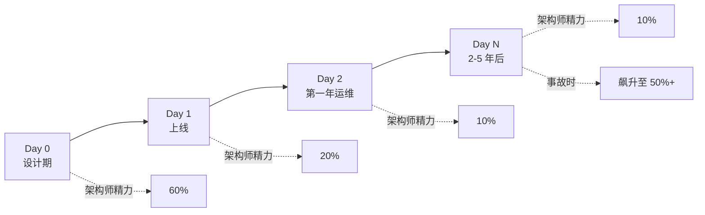
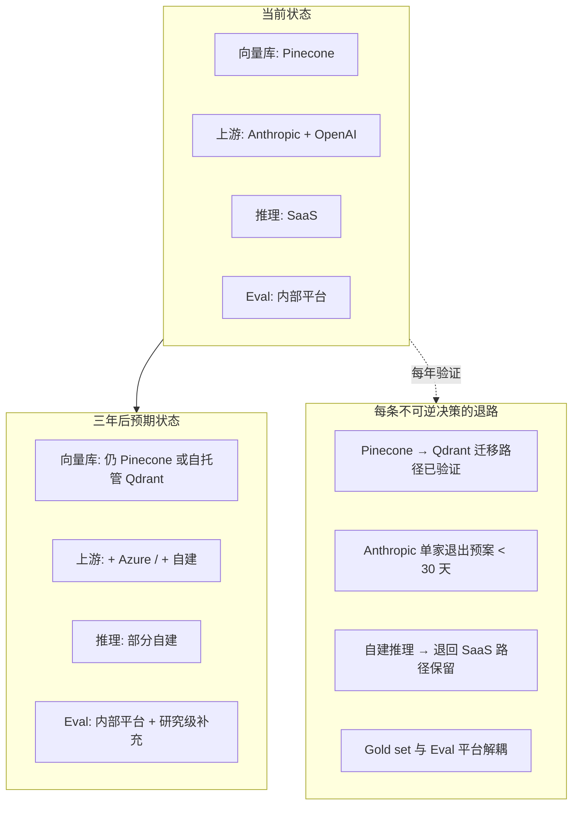
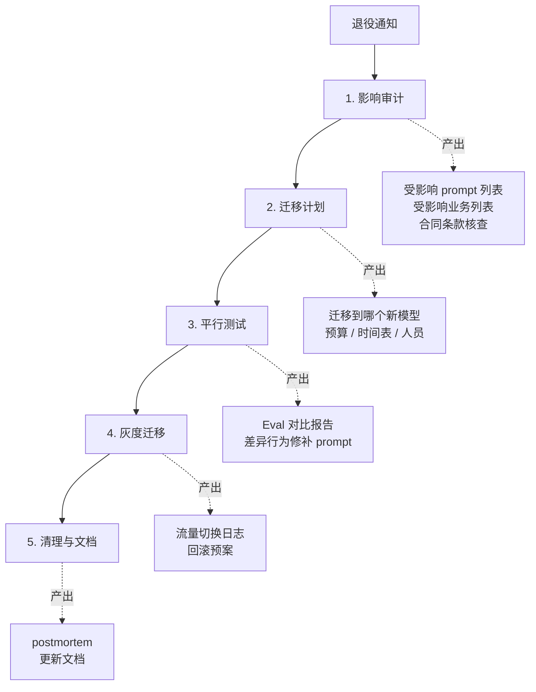
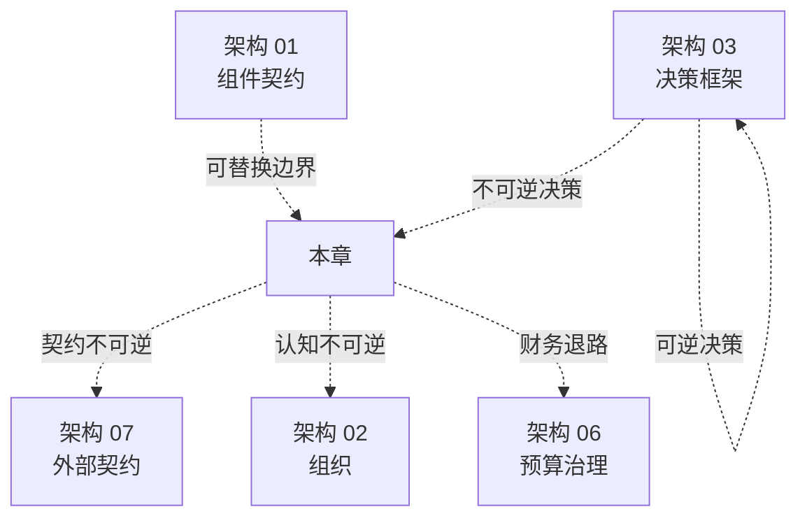

# 架构 05 · 不可逆决策与 Day 2 状态

> 所属：第三部分 · 架构  ·  [← 返回目录](../README.md)

[架构 03](03-架构师的决策框架.md) 给了六类**高频**决策的判据。本章专注另一类——**低频但贵**的决策。这类决策一年可能就那么几次，但每一次决定的是未来 18-36 个月的系统形态。架构师的核心价值之一，就是**识别什么决策是不可逆的、Day 2 状态长什么样、Day N 退路是否还在**。

> [!IMPORTANT]
> 工程师可以做对每一个具体决策却让组织陷入泥潭——因为他们看的是当下，看不到三年后。架构师必须把"现在做这件事，三年后这个系统会被什么钉死"问出来。**这一章是架构师 vs 资深工程师的分水岭**。

## 1 · 不可逆性的五种形态

不可逆不是一个二值开关。它有谱系：

### 形态 1 · 完全可逆

可以在 1-2 周内回滚，无成本可见。例：换个 prompt 模板、改个 timeout 值、调整重试策略。

**架构师对这类决策的态度**：让团队快做、错了快改。**不要给可逆决策套上重的评审流程**——这会把组织拖到泥里。

### 形态 2 · 软不可逆

回滚需要 1-3 个月，迁移成本可控但显著。例：换一家 SaaS 上游、改 prompt 模板的字段结构、网关协议小改。

**架构师对这类决策的态度**：让 [架构 03](03-架构师的决策框架.md) 的六类决策走流程，但不要无限放大评审范围。

### 形态 3 · 硬不可逆

回滚需要 6-18 个月，团队会被这个迁移工作占满半个产能。例：换向量库、自建推理上线、微调模型进入主流程、Eval gold set 的根本性 rubric 变化。

**架构师对这类决策的态度**：必须有专门的"不可逆决策评审"，跟 [架构 03 决策 1](03-架构师的决策框架.md#决策-1--自建-vs-托管-vs-多上游聚合) 那种走完一遍判据矩阵不够——还要回答下面四个问题（详见 §3）。

### 形态 4 · 契约不可逆

被合同 / 法务 / 监管钉死。例：和某个 SaaS 上游签了三年最低消费的承诺；监管要求数据驻留某个区域；和大客户合同里写了"使用模型 X"；GDPR / HIPAA 之类法规里的数据处理承诺。

**架构师对这类决策的态度**：合同期内就是被钉死了，没法工程上回滚。所以**签合同的时候就要做架构判断**——这是 [架构 07 · 与外部世界的契约](07-与外部世界的契约.md) 的核心论点。

### 形态 5 · 认知不可逆

最难识别也最难解决——**团队心智已经把某个选择当成了"理所当然"**，再去重新评估它会触发组织级抵抗。例：

- 团队已经为某个开源 Agent 框架投入两年，重新评估"要不要换框架"会面临"否定过去两年"的政治阻力
- 某个 Eval rubric 已经被无数次引用、deck 里写满，重新设计 = 否定每一个用过它的人
- 某个内部"AI 平台"已经成为团队 OKR，淘汰它 = 团队失业

**架构师对这类决策的态度**：**承认它的存在并主动管理**——给"重新评估"找一个外部触发（行业变化、新数据、新事故），而不是让它变成内部权力斗争。

## 2 · 不可逆决策的六大类（含分类对照表）

[架构 01 §6](01-AI系统参考架构.md#6--演进路径与不可逆点) 列了六类不可逆点，本章扩展并按上面五形态分类——这样你看一眼就知道每一类该用哪种姿态对待。

| 决策 | 形态 | 典型迁移成本 | 架构师该问的核心问题 |
|---|---|---|---|
| **① 向量库选型** | 硬不可逆 | 3-6 个月（重 embedding + reindex + 重测召回）| Embedding 函数与库是否解耦？|
| **② 网关协议契约** | 硬不可逆 | 6-12 个月（全公司客户端配合）| 协议是否预留版本号 / 扩展空间？|
| **③ 自建推理上线** | 硬不可逆 | 12-24 个月（人员、容量、on-call 模式重做）| SaaS 降级路径是否保留 12 个月？|
| **④ 微调进入主流程** | 硬 + 契约 | 6-18 个月 + 与基座供应商绑定 | 是否评估过 Prompt + RAG 替代？|
| **⑤ Eval Gold Set / Judge Rubric** | 硬不可逆 | 6-12 个月（重新标注 + 校准）| Rubric 设计可扩展维度吗？|
| **⑥ Prompt 与业务规则深度耦合** | 软 + 认知 | 3-9 个月（业务规则与语言任务剥离）| 业务规则在 Orc 还是 P？|
| **⑦ 模型供应商深度合同** | 契约不可逆 | 合同期（1-3 年）| 合同 clause 哪些影响架构选择？|
| **⑧ 长期运维某个内部平台** | 认知不可逆 | 18-36 个月（团队心智 + OKR 转向）| 三年后还有 ROI 吗？|

⑦⑧ 是 [架构 01](01-AI系统参考架构.md) 没列的——本章首次扩展。

### 不可逆决策的"事前体检"四问

任何即将做出的硬 / 契约 / 认知不可逆决策，必须在评审会上回答下面四个问题。每一题都要写下来、有人签字：

**Q1 · 反向迁移路径是什么？**

不是"理论上能换"——是"如果今天就要换，需要做什么、谁做、多久、花多少钱"。答得越含糊，说明对这条路径越不熟，事后真的需要换时只会更难。

**Q2 · 当前选择的"假设"如果错了会怎样？**

每个不可逆选择背后都有一组假设。"选 Pinecone 是因为我们认为云托管 + 高性能能省运维"——假设是 ① 团队没人能运维向量库 ② Pinecone 的价格不会涨 ③ 业务体量不会让 Pinecone 变贵。把假设列出来，每个都问"这个假设错了怎么办"。

**Q3 · 什么信号会让我们重新评估？**

写下来。"如果 Pinecone 月费超过 $X" / "如果有合规要求自托管" / "如果业务体量超过 Y"。**没有反向触发的不可逆决策 = 跑掉的火车**。

**Q4 · 三年后的目标态长什么样？**

这件事**做完了**之后系统是什么样的——不是"做的过程中"，是"这件事完工之后稳定运行的状态"。这个问题逼你看 Day 2，不只看 Day 1。

四题答不上来 = 决策没做透——把决策推回去一周，把这四题答了再来。

## 3 · Day 0 / Day 1 / Day 2 / Day N

软件世界的传统说法是 Day 1（上线）和 Day 2（运维）。AI 系统因为模型迭代速度更快、组件耦合更复杂，需要更细的分段：

每个阶段架构师该关注什么：

### Day 0 · 设计期（最重要）

这是架构师精力主要应该投在的阶段。Day 0 做对了，Day 2 / N 大部分问题不会出现。

Day 0 的关键产出：

- [架构 01](01-AI系统参考架构.md) 蓝图与契约表
- [架构 02](02-AI-SRE组织设计.md) RACI
- [架构 03](03-架构师的决策框架.md) 六类决策快照
- 本章的不可逆决策事前体检四问
- Day 2 / N 的目标态画图

### Day 1 · 上线

容易被新鲜感占据——但这是最低风险阶段（业务小、流量小、关注度高）。

Day 1 的关键关注：

- 监控接到位（不是 Day 2 才补）
- SLO 定义清楚（哪怕暂时数字宽松）
- 红队第一次走查（不是上线后等出事再做）

### Day 2 · 第一年运维

最容易**让系统积累技术债**的阶段。业务稳定、监控全绿，团队进入"维护模式"——但每一次 prompt 改动、每一次模型升级、每一个新业务接入，都在让架构慢慢偏离 Day 0 设计。

Day 2 的关键关注：

- 季度做一次 [架构 04](04-AI-SRE成熟度模型.md) 自评
- 每次 prompt / 模型 / RAG 大改时回到设计图上看是否仍然成立
- 团队人员变动时，确认 RACI 仍然清晰
- Trace 与 Eval 的"可观测延伸度"是否被新业务稀释

### Day N · 2-5 年后

最容易被忽略——因为这时项目已经过了"光鲜期"，新管理者上来，新一轮资源争夺。

Day N 的真实状况通常长这样：

- 模型供应商升级了 4-6 次，最早的 prompt 模板还在跑
- 当年的核心工程师走了 2 个、剩 1 个
- 红队团队被砍预算到 1 人
- 向量库一次没换过，总数据量是 Day 1 的 50 倍
- 月度推理花费是 Day 1 的 30 倍

Day N 是**真正测试架构是否成功**的时间点——不是"上线那天能跑"，是"五年后还能稳定运行 + 还能接新业务"。

> [!IMPORTANT]
> **Day 0 评审会上必须画出 Day N 状态图**——把"这个系统三年后预期的拓扑、组件归属、迁移过的不可逆决策"画出来。如果画不出，说明 Day 0 设计还没考虑生命周期。

## 4 · Day N 状态图：必须画的三件事

Day N 状态图不是预言——是**当下决策的反向约束**。下面三件东西必须在 Day 0 就画清楚：

### 件 1 · 三年后的组件归属图

每个 [架构 01](01-AI系统参考架构.md) 组件三年后归哪个团队？这件事现在画不出来 → 说明组织走向不清晰。

例：

- 网关团队会从 1 人扩到 8 人吗？还是会被合并到某个平台？
- 红队会独立成部门吗？还是仍然是兼职？
- ML 平台和 SRE 三角的边界三年后会怎样演进？

### 件 2 · 三年后的成本结构

[深入 18 · LLM 成本工程](../深入/18-LLM成本工程.md) 给了当下成本归因方法。Day N 视角要回答：

- 三年后总推理花费是当前的几倍？（业务增长 × 单价变化）
- 哪些组件的成本占比会升、哪些会降？
- 单位经济性（per-request / per-user 成本）会改善还是恶化？

成本预测做不到精确——做的是**结构性预判**，避免三年后突然发现"AI 账单占公司毛利 30% 已经回不去了"。

### 件 3 · 三年后的退路图

每个不可逆决策对应一条退路：

**退路图不是文档作业**——它要**每年验证一次**：当年说的"30 天能切回 SaaS"今年还是 30 天吗？如果变成了 90 天，要么是该退路了，要么是该把退路重新建起来。

退路图被忽略的代价：当真的需要退路时，发现"我们当年说能换其实换不了"。这个发现通常发生在事故复盘里，最坏的时候。

## 5 · Sunset / 模型废弃 / 平台退役

AI 系统比传统系统更频繁面对"被强迫淘汰"——上游模型供应商的退役节奏正在变快。Anthropic 退役 Claude 旧版本、OpenAI 退役 GPT 旧版本、各种 API 价格调整、SLA 调整——每一次都是组织级事件。

### 模型供应商退役的标准流程

每次接到模型供应商的"模型 X 将于 6 个月后退役"通知，应该有个标准应对剧本：

每次退役都按这个流程走 → 第二次以后会越走越快。这是组织肌肉，越用越强。

### 内部平台的 Sunset

更难处理的是**内部 AI 平台 / 工具的退役**。这通常涉及认知不可逆——团队对它有感情。

成功的内部平台 Sunset 有几个共同特征：

- **有明确的"为什么退役"的客观理由**（成本超支、维护负担、被新方案取代）——不是"管理层决定"
- **退役期 ≥ 6 个月**——给依赖它的团队充分迁移时间
- **明确的"迁移到什么"**——不能只说"把 X 退役"，必须说"X 上的工作迁移到 Y"
- **关键人员保护**——开发 X 的人员不会因为 X 退役而失业 / 失意，否则下次没人愿意建新东西

## 6 · 反模式：不可逆决策最常见的失败

### 反模式 1 · 把可逆当不可逆

团队对一个**完全可逆**的决策（换 prompt 模板）开 5 次评审会、走 3 周流程。**对策**：识别可逆决策，让团队快做。架构师不应该对所有决策都要求严密评审，否则组织会陷入"决策地狱"——什么都决定不了。

### 反模式 2 · 把不可逆当可逆

更常见也更危险。"我们先用着 Pinecone，不行再换"——三年后向量库里有 5 亿条记录，"换"已经不可能。**对策**：决策前先问"这个决定如果三年后想撤回需要做什么"。

### 反模式 3 · 反向触发条件不写下来

"如果未来情况变了我们再调整"——这种含糊保留等于没保留。**对策**：每个不可逆决策强制写下"什么会让我重新评估"，并放到季度 review 检查表里。

### 反模式 4 · 退路不验证

设计期写了"如果 Anthropic 出问题，30 天内可以切到 OpenAI"——三年后真发生了，发现 prompt 完全没在 OpenAI 上测过、Eval gold set 与 Anthropic 输出格式深度耦合。**对策**：退路每年走一次"演习"——不必真切流量，但至少跑一次端到端的 fallback 测试。

### 反模式 5 · 不可逆决策由初级工程师主导

"建议用 Pinecone"由一名 1 年经验的工程师在 design doc 里写下，然后通过——三年后这个决定影响了 100 人的工作。**对策**：硬不可逆决策必须有架构师/技术 director 级别签字，而不是只看技术细节。

### 反模式 6 · 把不可逆决策捆绑到一次性事件

"借这次重构机会，我们顺便切换向量库 + 升级网关协议 + 改 RAG chunk 策略"——三件硬不可逆决策同时做，事故风险乘起来。**对策**：硬不可逆决策一次只做一个，间隔至少 3 个月。

### 反模式 7 · 假退路

"如果 SaaS 不行，我们可以自建"——但团队里没人能写 CUDA、没采购过 GPU、没运维过推理后端。这种"退路"在真需要时是不存在的。**对策**：写下退路时同时写"激活这条退路需要团队先具备什么"——能写出来就是真退路，写不出来就是想象。

### 反模式 8 · "等以后再考虑 Day N"

"我们先把 Day 1 做好，Day N 以后再说。" 但 Day 0 决策在塑造 Day N。**对策**：Day 0 评审会上必须画出 Day N 状态图——哪怕粗糙。

## 7 · 与其他章的关系

简单读：

- **可逆 / 软不可逆**决策走 [架构 03](03-架构师的决策框架.md)
- **硬不可逆 / 契约不可逆**决策走本章
- **认知不可逆**决策走 [架构 02](02-AI-SRE组织设计.md) + 本章
- 本章的"退路验证"在 [架构 06 预算治理](06-预算治理.md) 中有财务对应物

## 8 · 这一章的产出物

读完本章你应该能交出：

1. **当前系统的不可逆决策清单**——按本章六大类整理；每条标注形态（硬 / 契约 / 认知）+ 反向触发条件 + 退路
2. **下 12 个月可能发生的不可逆决策**——预判、提前评审
3. **Day N 状态图**——三年后系统、组织、成本结构
4. **退路演习日历**——每年至少一次每条退路的可执行性验证

这四件产出物在年度规划、不可逆决策评审、组织变更评审中反复使用。

## 这一章不讨论什么

- **不是关于"避免所有不可逆"**——很多重要选择本质就是不可逆的（自建推理、签长合同），逃避只会让组织停滞。本章是教**怎么主动管理不可逆**，不是教如何避免
- **不是 vendor lock-in 的反对论**——某种程度的 lock-in 是分工带来的福利。问题是 lock-in 时是否清楚自己在 lock-in 什么、退路是什么
- **不是宿命论**——退役、Sunset 是工程现实，本章是给应对方法

## 接下来

- **下一章**：[架构 06 · 预算治理](06-预算治理.md) —— 不可逆决策中财务部分的展开
- **配套**：[架构 07 · 与外部世界的契约](07-与外部世界的契约.md) —— 契约不可逆的展开
- **诊断现状**：[深入 11 · AI SRE 现实图谱](../深入/11-AI-SRE现实图谱.md)

🔄 复习：[核心概念卡](../复习/核心概念卡.md) · [Active Recall 题库](../复习/Active-Recall题库.md)

---

[← 架构 04 · AI SRE 成熟度模型 L1-L5](04-AI-SRE成熟度模型.md)  ·  下一章 → [架构 06 · 预算治理](06-预算治理.md)
