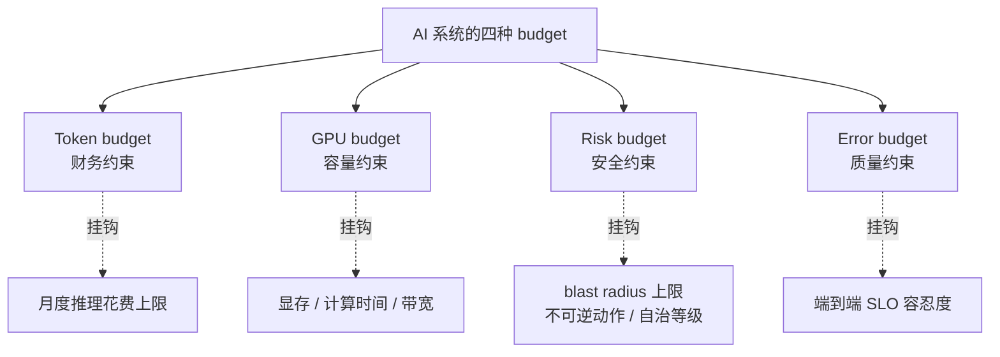
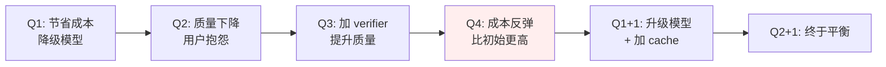
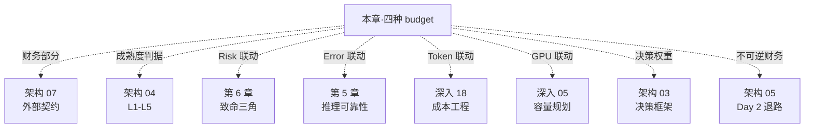

# 架构 06 · 预算治理：四种 budget 的统合视图

> 所属：第三部分 · 架构  ·  [← 返回目录](../README.md)

传统 SRE 做预算治理只有一个对象：**error budget**。AI 时代多了三个：**Token budget**、**GPU budget**、**Risk budget**——它们之间互相耦合，但绝大多数组织把它们当成独立指标，分别由不同团队管，结果是**四个 budget 同时透支但没人发现**。这一章把这四个 budget 摆到一张表上，讲它们怎么联动、怎么治理、怎么防止"看似某个维度有富余，实际另一个维度在烧"。

> [!IMPORTANT]
> 这一章不是 FinOps 教程——FinOps 只关注一个维度（钱）。架构师的视角必须四个维度联合看，因为 AI 系统的真实健康度是这四条曲线**最低**那一条决定的。

## 1 · 四种 budget 的定义



### Token budget · 财务约束

**定义**：单位时间（月、季）内允许消耗的 token 数（或转换为 USD 的预算上限）。

**子维度**：

- 按模型（Claude / GPT / 自建）
- 按业务线 / 客户
- 按功能（chat / batch / embedding / fine-tuning）
- 按成本类型（input / output / cache write / cache hit / compute）

→ 详细成本归因方法见 [深入 18 · LLM 成本工程](../深入/18-LLM成本工程.md)。

### GPU budget · 容量约束

**定义**：单位时间内允许消耗的 GPU 资源（显存 × 计算时间 × 带宽）。**仅在自建推理或固定算力配额场景下显性存在**——SaaS 用户看到的是 token budget 间接反映 GPU。

**子维度**：

- 显存（KV cache 占用）
- prefill 时间 / decode 时间（分别对应不同瓶颈）
- 跨 region / 跨集群分布
- 训练 vs 推理的优先级争抢

→ 容量数学见 [深入 05 · LLM 推理服务的容量规划](../深入/05-LLM推理服务的容量规划.md)。

### Risk budget · 安全约束

**定义**：单位时间内允许的"高风险动作"配额。这是本章最少被识别但最重要的概念之一。

**子维度**：

- 自治级别（[深入 11 · L0-L4](../深入/11-AI-SRE现实图谱.md)）每升一档消耗多少 risk budget
- 不可逆动作（写数据库、发邮件、调财务 API）的次数上限
- 越权可能性（致命三角中的工具/外泄通道暴露面）
- 红队覆盖率不达标时的"风险欠债"

**Risk budget 的核心思想**：把"安全"从一个无限制的约束变成**可度量的预算**——超出预算就触发降级，不是无限制等管理层批准。

### Error budget · 质量约束

**定义**：传统意义上的 SLO 错误预算，但在 AI 系统里要按**任务类型分桶**而非全局。

**子维度**：

- 延迟违约（TTFT / token throughput）
- 可用性违约（HTTP 错误 / 降级触发）
- 质量违约（按任务类型的 assertion 通过率、judge 分数）
- 静默降级（dashboard 全绿但用户感知差）

→ 完整指标见 [第 5 章 · AI 推理服务的可靠性工程](../知识/05-AI推理服务的可靠性工程.md)。

## 2 · 为什么必须联合看

四个 budget 任意一个透支都不致命——但它们之间的**相互转化**才是真问题。

### 转化关系矩阵

下面这张表读法：行是"被消耗的 budget"，列是"消耗它的来源"——某种动作如何**用一个维度换另一个维度**。

| 来源 → 消耗 | Token | GPU | Risk | Error |
|---|---|---|---|---|
| **延长 prompt 改进质量** | ↑ | ↑ | – | ↓ |
| **加 verifier / 多轮校验** | ↑↑ | ↑↑ | ↓ | ↓↓ |
| **降级到便宜模型** | ↓ | ↓ | – | ↑ |
| **prompt cache 命中率提升** | ↓ | ↓ | – | – |
| **批量 / 离线推理** | ↓ | ↓ | – | – |
| **升 Agent 自治等级** | ↑ | ↑ | ↑↑ | ↑ |
| **缩短 step budget** | ↓ | ↓ | ↓ | ↑（部分场景）|
| **微调专用模型** | ↓（推理）↑（训练） | ↑（训练） | ↑（依赖单点） | ↓ |
| **Eval / 红队投入加大** | ↑（小） | – | ↓↓ | ↓ |
| **接入更多上游做 failover** | – | – | ↑（攻击面） | ↓ |

读这张表的意义：**每个看似单维度的优化，都在另外三个维度产生波动**。

举例：

- "我们发现 prompt 太短导致质量低，我们要加点 reasoning chain"——好像只是质量优化，但 token 和 GPU 同时被推高，每月账单可能翻倍
- "我们要把 Agent 升到 L3 自治"——好像只是产品升级，但 Risk budget 立刻紧张，且需要 Eval 投入跟上才能维持 Error budget
- "我们要降级到便宜模型节省成本"——Token 降了，但 Error budget 可能立刻被消耗光

**架构师的工作就是在四个维度上保持平衡**，而不是单点优化。

### 一个组织级故事

很多组织走过这条悲剧曲线：



如果 Q1 时就把四个 budget 同时摆上桌——"降级模型节省的钱够 verifier 的 token 增量吗？"——很可能避免 Q3 的反弹。**单点优化只看一个维度，组织级最优一定看四个**。

## 3 · 治理仪式：月度 / 季度 / 年度

四个 budget 的治理不是"建立一次"——是**持续运行的仪式**。下面是推荐的三层节奏：

### 月度治理：30 分钟例会

**参与者**：平台 SRE Lead、ML 平台 Lead、Eval Lead、FinOps（如有）、Application Lead × N

**议程模板**（按这个顺序，不要换）：

1. **(5 min) 上月四个 budget 实际消耗**——一张表，四列分别是 Token / GPU / Risk / Error budget 的当月使用率
2. **(5 min) 异常单维度**——任意维度 > 80% 或 < 30% 的，列出原因
3. **(10 min) 跨维度联动**——上月有没有"省了 X 烧了 Y"的事件
4. **(5 min) 下月预测**——哪个维度可能紧张
5. **(5 min) 行动项**——本月要调整的策略（不要超过 3 件）

**月度治理的关键原则**：

- **先看趋势，再看绝对值**——某个 budget 突然涨 30% 比一直高在 80% 更值得讨论
- **接受波动**——四个 budget 不是要一直平衡，是要让"不平衡"被发现得快、解释得清
- **不在月度会决定不可逆决策**——这种会议是诊断会，决策会另外开

### 季度治理：2 小时深度评审

**目标**：审视四个 budget 的**结构性问题**，调整下季度策略。

**关键议题**：

- 单位经济性（per-request / per-user / per-month）的趋势
- 各业务线的 ROI 排序——哪些场景值得继续投、哪些该收
- Risk budget 的"暗债"——红队覆盖率、致命三角防御缺口、自治等级与 Eval 是否同步
- 不可逆决策的识别（[架构 05](05-不可逆决策与Day2状态.md)）——下季度会不会跨某个不可逆点

### 年度治理：与公司预算同步

把四个 budget 的下一年预测纳入公司年度财务规划。这一步在 ≥ M 档的组织里是必做的——AI 推理花费已经达到能影响公司 P&L 的量级。

**典型年度产出**：

- 下一年总 Token budget（USD）+ 按业务线分配
- 自建推理的 GPU 采购计划（如适用）
- Risk budget 的"上限策略"——什么场景禁止上 L3+，什么场景允许
- Error budget 与产品 KPI 的对齐（产品/业务承诺的 SLO）

## 4 · 四种 budget 的具体治理工具

### Token budget 工具：Cost Dashboard + 异常检测

最低要求：

- **三层归因 dashboard**（按模型 / 业务 / 用户）每日刷新
- **异常检测告警**——某个维度环比涨 50% 自动触发
- **预算阈值告警**（80% 黄、95% 红）

进阶要求：

- **per-request 成本追踪**——把"这次请求花了多少钱"作为 trace 字段
- **Cache 命中率分维度跟踪**（[深入 02 · Prompt Caching 原理](../深入/02-Prompt-Caching原理.md)）
- **多模型路由优化**（[深入 18](../深入/18-LLM成本工程.md)）

### GPU budget 工具（仅自建场景）

最低要求：

- **显存利用率 / KV cache 占用** dashboard
- **prefill 时间 vs decode 时间分桶**
- **跨集群 / 跨 region 容量曲线**

进阶要求：

- **容量预测模型**——基于业务增长预测下月 GPU 缺口
- **训练 vs 推理资源调度策略**（自动 + 人工双轨）
- **跨集群 inflight token budget**（[深入 17](../深入/17-LLM网关的SRE视角.md)）

### Risk budget 工具：本章核心创新

Risk budget 是四个里最少被建模的——大多数组织把"安全"当成无限制的硬约束（"全部都得防")，结果反而无法做权衡。把它建模成 budget 之后能做的事：

**Risk budget 的量化方法**（推荐起步公式）：

```
每月 Risk budget = 100 单位

一次自治升档（L0 → L1）= 10 单位
一次新工具上线 = 5 单位（只读）/ 20 单位（写）
一次新 RAG 数据源 = 3 单位（公开）/ 15 单位（含 PII）
红队回归一次（覆盖现有攻击面）= -5 单位（补回）
重大事故未复盘 = +30 单位（消耗）

→ 月底如果 budget 透支：下月禁止新自治升档 / 新工具上线
```

数字本身可以根据组织调——重点是**把"风险"做成可量化、可累积、可消耗的对象**。这样月度评审会上才有共同语言可讨论。

### Error budget 工具：分桶 SLO 看板

最低要求：

- **按任务类型分桶**（不要全局幻觉率）
- **延迟、可用性、质量三类**
- **burn rate 曲线**——快速烧 vs 慢速烧分别报警

进阶要求：

- **Trace ↔ Eval ↔ Error budget 互可跳转**
- **Judge-human 对齐度**作为 budget 透支的修正因子（judge 漂了，error budget 数据本身要打折看）

## 5 · 联合视图：一张表概览所有四种 budget

下面是一个推荐的"AI 系统月度健康度一表"模板：

```
┌─────────────────────────────────────────────────────────┐
│  AI 系统月度健康度 · 2026-XX                              │
├──────────────┬───────┬────────┬───────┬──────┬─────────┤
│ Budget       │ 上限   │ 已用   │ 使用率 │ 趋势  │ 备注    │
├──────────────┼───────┼────────┼───────┼──────┼─────────┤
│ Token (USD)  │ 200k  │ 175k   │ 87%   │ ↑12% │ Agent X │
│ GPU (h100h)  │ 4000  │ 3200   │ 80%   │ ↑5%  │ -       │
│ Risk         │ 100   │ 110    │ 110%  │ ↑40% │ 透支    │
│ Error (e2e)  │ 0.5%  │ 0.7%   │ 140%  │ ↑    │ 透支    │
└──────────────┴───────┴────────┴───────┴──────┴─────────┘

行动建议：
- Risk 与 Error 同时透支 → 立即降级 Agent X 自治等级
- Token 趋势高于业务增长 → 启动 prompt cache 优化
- 四个维度联动：Agent X 升档 → Risk + Token + Error 同时压力
```

把这张表做成自动生成的 dashboard，每月例会前自动出。**架构师不再需要从五个团队收集数据拼凑——直接看一张表**。

## 6 · 反模式（最常见的预算失败）

### 反模式 1 · 只看 Token budget

最普遍的失败——FinOps 接管 AI 预算，但只看一个维度。结果是"省了钱但烧了风险"或"省了钱但烧了用户体验"。

**对策**：把 FinOps 的视野扩展到四个 budget——FinOps 不需要懂 AI 内部，但需要看到"省下的 $X 是否在另一个维度产生了 $Y 的债"。

### 反模式 2 · Risk budget 不存在

"安全没有预算，安全是无限的"——结果是要么过度限制（什么都禁），要么完全失控（一次次例外批准 Agent 升档，从未量化代价）。

**对策**：第 4 节给的量化方法可能粗糙，但**有量化总比没有强 10 倍**。先建一个简单的 Risk 量化体系，几个月后根据实际再调。

### 反模式 3 · 各 budget 各团队管，不交叉

平台 SRE 看 GPU、FinOps 看 Token、Eval 看 Error、Security 看 Risk——四张 dashboard 永不在同一张图。

**对策**：第 5 节的"一张表"是组织设计——必须有一个角色（架构师 / SRE Lead / Quality VP）把四个维度合到一张表上。

### 反模式 4 · 月度治理变成"月度甩锅会"

某团队 budget 透支，会上互相指责。会议结束没有任何 follow-up。

**对策**：月度治理是**诊断会**不是**追责会**——议程模板（第 3 节）严格执行，每条 budget 透支必须有"行动项 + owner + 时限"。Owner 是改善这个 budget 的负责人，不是被追责的人。

### 反模式 5 · "明年再说"型预测

每月会议都说"下月会更好"，从不真的算下个月预测。

**对策**：每月例会议程必有"下月预测"环节——哪怕粗糙，也比不算强。三个月后回头对账，预测能力会逐渐提升。

### 反模式 6 · 把 budget 做成绝对硬约束

"绝对不能超过 $200k/月"——结果业务高峰时全公司都在批 emergency budget 例外。

**对策**：budget 是**指引**不是**禁令**。透支会触发"降级 / 限流 / 优先级重排"，但不应该让业务停滞。配合第 4 节的 burn rate 概念——快速烧和慢速烧响应不同。

### 反模式 7 · 自治升档只签字不算 Risk budget

Agent 自治升档评审会上只看技术 readiness，不算"这一升档会消耗多少 Risk budget"。

**对策**：把自治升档的 Risk 消耗做成评审环节强制项——升档申请书里必须写"消耗 X 单位 Risk budget，本月剩余 Y 单位"。

### 反模式 8 · Error budget 只在事故时被想起

平时 SLO 全绿大家不看 error budget，事故时才发现"这是本季度第三次了"。

**对策**：Error budget burn rate 进入月度治理常规议程，**不是只在烧光时才报警**。

## 7 · 四种 budget 与其他章的关系



简单读：

- 本章是**统合视图**——单维度细节散落各章，本章是把它们摆到一张桌上
- [架构 03](03-架构师的决策框架.md) 的六类决策每一个都会动到四种 budget
- [架构 04](04-AI-SRE成熟度模型.md) 的 L3+ 隐含"四种 budget 联合视图已建立"
- [架构 07](07-与外部世界的契约.md) 处理的是"对外承诺"——本章的对内治理与对外承诺要一致

## 8 · 这一章的产出物

读完本章你应该能交出：

1. **四种 budget 的当前测算**——每种的当月数字、上限、使用率
2. **月度治理日历**——例会安排、参与人、议程模板
3. **联合视图 dashboard 设计**（第 5 节那张表的具体落地版）
4. **Risk budget 量化方案**（第 4 节起步公式的本组织版）

这四件产出物是季度评审、年度规划、不可逆决策评审中反复使用的工件。

## 这一章不讨论什么

- **不是 FinOps 教程**——单维度成本优化看 [深入 18](../深入/18-LLM成本工程.md)，本章是**多维度联合**
- **不是采购合同细节**——签合同的视角看 [架构 07](07-与外部世界的契约.md)
- **不是预算编制流程**——年度预算怎么和公司财务部门走流程是 CFO 体系的事，本章只管"AI 系统该有几种 budget、怎么联合看"

## 接下来

- **下一章**：[架构 07 · 与外部世界的契约](07-与外部世界的契约.md)
- **配套**：[深入 18 · LLM 成本工程](../深入/18-LLM成本工程.md) —— Token 维度的工程深度
- **配套**：[深入 05 · 容量规划](../深入/05-LLM推理服务的容量规划.md) —— GPU 维度的工程深度

🔄 复习：[核心概念卡](../复习/核心概念卡.md) · [Active Recall 题库](../复习/Active-Recall题库.md)

---

[← 架构 05 · 不可逆决策与 Day 2 状态](05-不可逆决策与Day2状态.md)  ·  下一章 → [架构 07 · 与外部世界的契约](07-与外部世界的契约.md)
