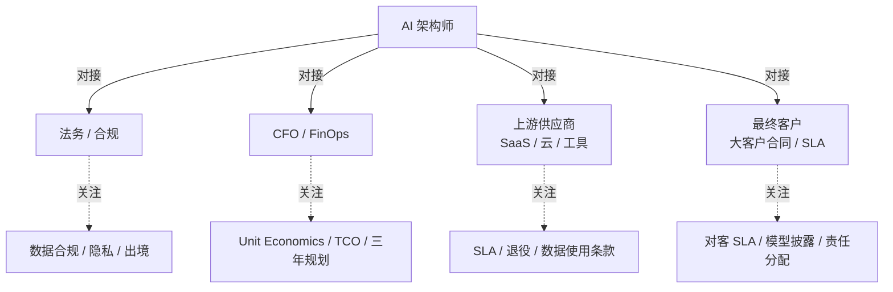
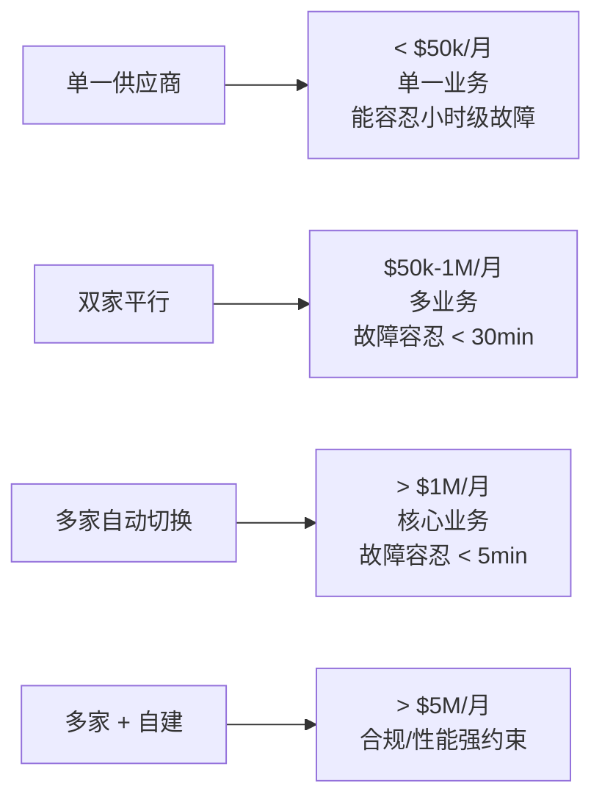
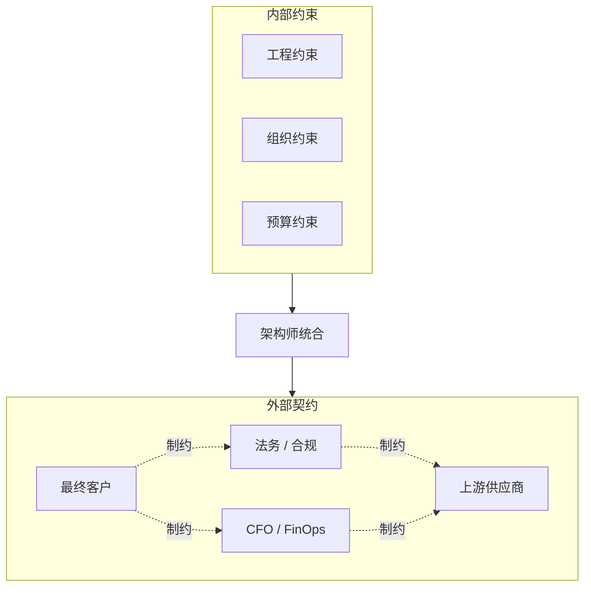
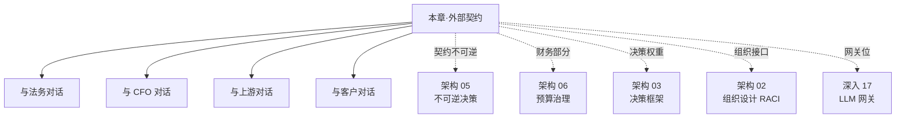

# 架构 07 · 与外部世界的契约

> 所属：第三部分 · 架构  ·  [← 返回目录](../README.md)

前面六章都是在系统内部和组织内部讨论。本章把视角拉出公司——架构师还要和**法务、CFO、外部供应商、最终客户**打交道，这些"外部契约"的形态决定了你能做什么、不能做什么、什么时候被谁的合同条款卡住。AI 时代这一面比传统系统更重要：模型供应商每年合同都改、数据合规要求每季度都新，工程上完美的设计**会被一行合同条款一夜之间废掉**。

> [!IMPORTANT]
> 这一章是 SRE 架构师与"纯工程师"的另一道分水岭——纯工程师不需要看合同，架构师必须能在合同条款上指出"这一句会让我们失去 RAG 的退路"。**不读合同的架构师，是被合同决定的架构师**。

## 1 · 为什么外部契约是架构师的事

很多组织把外部契约外包给"非技术团队"——法务管 DPA，采购管价格，BD 管客户合同。结果是：

- **合同里隐藏的架构约束没人翻译给工程**——某条款写"数据不出区"，但工程师不知道"区"的定义改变了
- **工程上做出的承诺不一定能进合同**——团队答应客户"99.9% 可用性"，但合同里上游 SLA 只有 99.5%，差一个 9 没人补
- **不可逆决策被合同钉死**——和某 SaaS 签了三年最低消费 1M USD，工程上还在讨论"我们要不要换供应商"

这一章把架构师必须主导的四类外部契约摆出来：**法务/合规 · CFO/FinOps · 上游供应商 · 最终客户**。每一类都给"哪些条款影响架构、哪些条款是红线、哪些条款必须坚持谈"。



## 2 · 与法务 / 合规

法务关心的是**风险**——数据、隐私、知识产权、监管。AI 系统的法务面有几条传统系统没有的：

### 2.1 必须签字的几类条款

| 类别 | 关键条款 | 架构含义 |
|---|---|---|
| **数据驻留** | 用户数据不出 X 区 | RAG 索引、Eval 样本、Trace 都不能出区 → 决定了上游能选哪家 |
| **数据用于训练** | 上游不得用我数据训练 | 和 SaaS 上游谈判时是必谈条款；某些上游免费档默认拿数据训练 |
| **PII 处理** | 调用前必须脱敏 | 决定 P 层和 G 层的 PII 检测必须强制 |
| **可审计性** | 客户/监管可审计调用记录 | Trace 的保留期、查询权限、加密存储 |
| **模型披露** | 用户必须知道是 AI 在回答 | 影响 UI 设计、prompt 模板、对客回答里的 disclaimer |
| **责任划分** | AI 出错谁担责 | 决定能不能上 L3+ 自治 / 写操作 |
| **知识产权** | 训练数据 / 输出归属 | 自建模型 / 微调时关键 |
| **删除权** | 用户要求删除其数据 | RAG 索引 / Trace / Eval 都要支持"按用户删" |

### 2.2 法规对照表

不同法规对架构有不同强度的约束。架构师不需要背法规细节，但必须能说出"我们落在哪几个法规适用范围"：

| 法规 / 框架 | 适用 | 关键架构约束 |
|---|---|---|
| **GDPR**（欧盟）| 服务欧洲用户 | 删除权、数据可携带、跨境传输限制 |
| **CCPA / CPRA**（加州）| 服务加州用户 | 类似 GDPR 但豁免范围不同 |
| **HIPAA**（美国医疗）| 处理健康信息 | BAA 签署、加密、审计日志 |
| **PCI DSS**（金融）| 处理信用卡 | 卡号不进 prompt（基本不允许）|
| **SOC 2**（审计认证）| 企业客户多 | 影响整个 trace / log 流水线设计 |
| **EU AI Act**（欧盟）| 欧洲业务 | 高风险 AI 系统的额外要求（透明度、人工监督）|
| **中国《生成式 AI 服务管理办法》** | 中国境内 | 算法备案、训练数据合规、安全评估 |
| **NIST AI RMF**（美国）| 政府 / 国防 | 不强制但越来越多公司参照 |

→ 详细 OWASP / NIST 参考见 [深入 11 · AI SRE 现实图谱](../深入/11-AI-SRE现实图谱.md) 末尾。

### 2.3 与法务对话的常见错配

**错配 1 · 法务不懂 AI 特性**——大多数法务起步时会用传统软件外包合同的模板谈 AI 合同。结果是关键条款（如"上游不得用我数据训练"）会漏。

**对策**：架构师主动给法务做 AI 合同培训——一份"AI 上游合同里必须看的 10 个条款"清单。法务不需要懂技术，但需要知道"找哪几行"。

**错配 2 · 法务过度保守**——把所有 AI 都当高风险处理，结果是 L0 的 copilot 也要走 L4 的合规流程。

**对策**：建立**风险分级**——按 [深入 11 L0-L4 自治分级](../深入/11-AI-SRE现实图谱.md) 对应不同的合规强度。L0 / L1 走轻审批，L3+ 走完整合规。

**错配 3 · 工程绕过法务**——团队觉得法务慢，于是"先做了再说"——某天合规审计要求查 RAG 数据来源，发现没人记录。

**对策**：把法务对接做成**架构师的常规工作**，不是"出事时才找"。每月一次同步 30 分钟，让法务看见在做什么、提前预警。

### 2.4 一份"AI 上游合同最低条款清单"

下面这份清单是和上游 SaaS（OpenAI / Anthropic / Azure OpenAI / Google）签合同时**必须确认**的：

1. **数据使用**：明确写出"输入和输出不被用于模型训练" / 例外条款 / opt-out 流程
2. **数据保留**：上游服务端保留多久（典型 30 天，可谈到 0 天）
3. **数据驻留**：可选区域 / 是否跨区
4. **模型版本绑定**：能否锁定某个模型版本不被自动升级（[深入 17 · 网关位的模型升级风险](../深入/17-LLM网关的SRE视角.md)）
5. **退役通知期**：模型退役提前多久通知（< 6 个月就该 push 谈判）
6. **SLA**：可用性、最大故障窗口、补偿机制
7. **审计权**：能否要求上游提供安全 / 合规审计报告
8. **知识产权**：输出归谁所有 / 输入版权问题
9. **责任上限**：典型是合同金额上限——AI 失败导致客户损失能从上游追偿多少
10. **价格变动**：合同期内价格能否变、变多少给多少 notice
11. **数据删除**：用户行权时上游配合的 SLA
12. **AUP / 内容政策**：上游禁用场景，提前确认你的业务不在禁用列表

如果某条上游不肯谈 → 那条就是**架构红线**，做架构决策时要算进去。

## 3 · 与 CFO / FinOps

[架构 06 · 预算治理](06-预算治理.md) 已经讲了内部四种 budget。本节专讲对 CFO 这一面——架构师如何把"AI 工程账"翻译成"公司财务账"。

### 3.1 CFO 关心的三件事

**Unit Economics**——每个用户 / 每次请求的成本，是否随业务规模摊薄。CFO 看到"AI 月度账单 $5M"不慌张，看到"per-user 成本一直在涨"才慌张。

**TCO（Total Cost of Ownership）**——三年总成本，包含 SaaS 费、自建成本、人员、机会成本、退役成本。CFO 决策"自建 vs SaaS"看的是 36 个月 TCO，不是单年比较。

**财务可预测性**——下季度账单波动有多大。这件事 AI 比传统软件难——token 成本随业务深度变化，CFO 想要的是"波动可解释、上限可保证"。

### 3.2 单位经济性的关键指标

每个 AI 应用上线时，架构师应该能给 CFO 出这么一张表：

| 指标 | 当前值 | 三个月趋势 | 一年预测 | 对应业务指标 |
|---|---|---|---|---|
| Per-request 成本（USD） | $0.05 | ↓ 15%（cache 优化）| $0.04 | 用户单次咨询 |
| Per-user 月度成本 | $1.20 | ↑ 8%（用户使用更深）| $1.50 | 月活跃用户 |
| Per-conversation 成本 | $0.30 | 平 | $0.30 | 对话次数 |
| 边际成本 / 边际收入比 | 12% | ↓ 2pp | 10% | 业务毛利模型 |

→ 详细成本归因见 [深入 18 · LLM 成本工程](../深入/18-LLM成本工程.md)。

**架构师的关键工作**：让单位经济性**可被预测**。这需要：

- Trace 里要带 token / 成本字段，不能事后从账单倒推
- 至少按"业务功能 × 用户类型"做成本分摊
- 当成本上升时能定位到"是某类用户增多 / 某类功能使用变深 / 某个 prompt 变长"——而不是"模型贵了"

### 3.3 三年 TCO 模型

自建 vs SaaS 的真实对比必须是三年 TCO，下面是参考模板：

```
SaaS 三年 TCO（模拟）
─────────────────────────────
 Y1: API 费 $X1 + 工程 $1M = ?
 Y2: API 费 $X2（业务增长 1.5×）+ 工程 $1.2M = ?
 Y3: API 费 $X3（业务增长 1.5×）+ 工程 $1.4M = ?
 三年总: A
```

```
自建三年 TCO（模拟）
─────────────────────────────
 Y0 准备期: 团队搭建 $2M + GPU $5M + 工程 $1M = $8M
 Y1: GPU $5M + 工程 $5M = $10M
 Y2: GPU 增量 $2M + 工程 $5M = $7M
 Y3: GPU 增量 $2M + 工程 $5M = $7M
 三年总: B = $32M
 + 退役 SaaS 的过渡损耗: ~$2M
 + 风险溢价（团队失败概率 × 重建成本）: ~$5M
 调整后: C = $39M
```

CFO 看的是 **A vs C**——而不是 SaaS 单年 vs 自建单年。架构师必须能给出这套模型，否则"自建省钱"的论点被 CFO 一句"算上风险吗"就推翻了。

> [!IMPORTANT]
> **没有"风险溢价"的自建提案应该被退回**。新建的自建团队失败率 ≥ 30%（行业经验值），这部分必须计入财务模型——把成功概率也写下来，让 CFO 自己拿主意，而不是工程团队替 CFO 假装"一定会成功"。

### 3.4 财务可预测性

CFO 最怕的是 surprise。下面是给到 CFO 的"最低承诺"：

- **月度账单上限承诺**——超过 X 触发自动降级（[架构 06](06-预算治理.md) 第 4 节）
- **季度内业务变化的成本弹性**——例如"用户量翻倍预计成本增加 60-80%"（不是 100%，因为有 cache 等摊薄）
- **大事件预案**——大促 / 新功能上线 / 客户灌入数据时的预估成本峰值
- **黑天鹅成本上限**——上游突涨价、上游退役迫使迁移、合规要求换供应商时的最大支出

## 4 · 与上游供应商

### 4.1 与 LLM 供应商的关系本质

AI SRE 必须接受一个不舒服的现实——**LLM 上游不是传统的"云服务商"关系**：

| 维度 | 传统云（AWS / GCP）| LLM 上游 |
|---|---|---|
| 服务稳定性 | 5+ 个 9 | 3-4 个 9，且随模型升级波动 |
| 服务一致性 | 高（API 行为稳定）| 低（同 API 输出可能漂移）|
| 退役节奏 | 罕见（旧 API 多年支持）| 频繁（每 6-18 月退一波模型）|
| 价格稳定性 | 罕见涨价（多年偶尔降价）| 频繁变动（涨/降都有，幅度更大）|
| 替代性 | 中（迁移成本大但路径清晰）| 低（行为差异大，迁移要重测全部业务）|
| 议价能力 | 大客户有 | 大客户有限（供需关系不同）|

这意味着**与 LLM 上游的关系应该按"高频变化的 critical 供应商"来设计架构和合同**——不是"一次签三年躺平"，而是"每年评估、每季度对账、随时准备切换"。

### 4.2 供应商画像：必须知道的四个维度

每一个上游供应商，架构师手上必须有一份画像：

**维度 1 · 可用性历史**

- 过去 12 个月有几次重大故障 / 单次故障最长时间 / 平均故障频率
- 故障期间公开沟通做得如何（status page、postmortem 公开度）

**维度 2 · 退役政策**

- 旧模型退役的提前期典型多长
- 是否给企业客户更长的迁移窗口
- 是否有"模型版本永久锁定"选项

**维度 3 · 价格趋势**

- 过去 24 个月价格变动次数和幅度
- 大客户折扣空间
- 是否有 commitment-based 长期合同

**维度 4 · 数据政策**

- 默认数据使用策略（是否用于训练）
- 企业级是否能 opt-out
- 数据删除 SLA

→ 三大主流模型供应商对比见 [深入 12 · Claude / GPT / Gemini 三大模型系列使用指南](../深入/12-Claude-GPT-Gemini三大模型系列使用指南.md)。

### 4.3 多供应商策略：何时单家 / 何时多家



切换到下一档的判据见 [架构 03 · 决策 1](03-架构师的决策框架.md#决策-1--自建-vs-托管-vs-多上游聚合)。

**多供应商策略的现实代价**——别只看好处：

- **prompt 不能跨家直接搬**——同一 prompt 在 Claude 和 GPT 上行为不一样，多家就要维护多套 prompt
- **Eval 要按家分桶**——不是一套 eval 跑所有
- **网关增加复杂度**——多上游 = 多种 token 计费方式 + 多种 streaming 协议（[深入 17](../深入/17-LLM网关的SRE视角.md)）
- **质量分桶可能下降**——分散流量后每家的优势场景没充分利用

所以**多供应商不是越多越好**——通常 2-3 家是甜蜜点，4 家以上边际成本超过边际收益。

### 4.4 与基础设施供应商（云 / GPU）

如果走自建路线，还要管理 GPU 供应商关系。AI 时代 GPU 采购也变了：

- **H100 / B100 类高端 GPU 长期紧缺**——预订要提前 6-12 个月
- **租 vs 买的边界更模糊**——对短期 burst 租划算，长期固定负载买划算，但"长期固定负载"在业务高速增长期很难定义
- **多云策略更值钱**——AWS / GCP / Azure / CoreWeave / Lambda 各家库存和价格差异大，单家锁定就是失去议价

这部分超出本书范围，但架构师做"自建推理"决策时必须把这条算进 TCO（[第 3 节](#33-三年-tco-模型)）。

## 5 · 与最终客户

### 5.1 对客 SLA 的特殊性

传统对客 SLA 大致就是可用性 + 故障响应时间。AI 时代多了几条：

| 条款 | 传统 | AI 时代新增 |
|---|---|---|
| **可用性** | 99.X% | 同 + "AI 功能降级到非 AI 备份" 的承诺 |
| **延迟** | p95 / p99 | 同 + TTFT vs Token throughput 分别承诺 |
| **正确性** | （通常没承诺）| **质量分桶 SLA**（按任务类型）|
| **可解释性** | （N/A）| 引用 / 推理路径 / 决策依据 |
| **数据使用** | 限定使用 | 明确"客户数据不进训练" |
| **可审计** | 日志保留 | 完整 trace、模型版本、prompt 版本 |
| **AI 披露** | （N/A）| 客户必须知道在用 AI / 客户有权要求人工 |
| **错误责任** | 服务商责任 | 责任分配（AI 出错的责任边界）|

### 5.2 不能进对客合同的承诺

某些工程上"看上去能保证"的指标，**不要写进对客合同**：

- ❌ **"AI 永远准确"**——任何模型都有错答率，写这个等于写一颗定时炸弹
- ❌ **"使用最新最强模型"**——你不能保证下季度 vendor 还有这个模型
- ❌ **"零幻觉"**——技术上做不到，写就是欺诈
- ❌ **具体模型名称**（除非客户特别要求）——锁死你的供应商策略
- ❌ **"AI 决策与人类一致"**——人都不一致，AI 怎么承诺一致

写进合同前问自己一个问题：**18 个月后我还能保证这条吗**？答不上的不签。

### 5.3 对客质量 SLA 的实现

可以谨慎承诺的"质量 SLA"模板：

```
对客质量 SLA（参考）
─────────────────────────────
任务类 1 · 文档检索 · 引用准确率 ≥ 95%
任务类 2 · 客服回答 · 用户满意度 ≥ 4.0/5.0
任务类 3 · 摘要生成 · 关键信息覆盖率 ≥ 90%

测量方法：每月人工抽样 N 条
违约补偿：未达成时按月费 X% 退款
排除条款：用户输入超出文档/明显恶意/模型供应商不可抗力
```

关键是这些都要**测得出来、记录得到、双方对得上**——你需要自己的 Eval pipeline 完整运行才能给这种 SLA。

### 5.4 客户审计要求

大企业客户越来越多要求 AI 审计权，常见要求包括：

- **年度安全审计**：渗透测试报告、安全合规证明
- **AI 风险评估**：偏见检测、公平性指标、红队覆盖
- **数据流审计**：客户数据在你系统里走过哪些组件、保留多久
- **模型供应商穿透**：你用的是谁的模型、合同条款是什么

架构师该做的：**预先准备一份"客户审计标准包"**——包含上面四类的标准答案，不要每个客户来都从头准备。

## 6 · 四类外部契约的协同

外部契约不是孤立的——某些条款会**互相约束或冲突**。架构师必须把四类放在一张视图上看。



### 协同矩阵：常见冲突

| 冲突场景 | 描述 | 解法 |
|---|---|---|
| 客户要求数据驻留中国，但最强模型只在美国可用 | 合规 vs 能力 | 找次优本地模型 + 性能补偿条款 |
| 上游涨价 50%，但客户合同价格固定 | 上游 vs 客户 | 对客合同里加"重大成本变动调价"条款 |
| 客户审计要查 trace，但上游不开放 prompt 内部细节 | 客户 vs 上游 | 中间留"网关层 trace 能力" |
| CFO 要求降本 30%，但合规要求不准用便宜的开源 | CFO vs 合规 | 优化 cache / 路由 / 减少 token，不动模型 |
| 上游退役模型，但客户合同里写了"使用模型 X" | 上游 vs 客户 | 客户合同永远不绑定具体模型 |

### 协同设计的三条原则

**原则 1 · 客户合同 ≤ 上游能力**——你对客户承诺的任何 SLA，都不能高于上游能给你的 SLA + 你能补偿的差。差超过 1 个 9 不要签。

**原则 2 · 合规要求 ⊆ 上游能力**——合规要求的所有条款（数据驻留、数据使用、审计），上游必须能支持。上游不支持的合规承诺，改用其他上游或自建。

**原则 3 · 财务承诺 ≤ 工程可实现**——给 CFO 的成本承诺不能高于工程能做到的。工程做不到的成本承诺最后会变成事故或 surprise。

## 7 · 反模式（外部契约最常见的失败）

### 反模式 1 · "签完合同再让架构看"

合同签了之后才让架构师 review，架构师发现某条款让全套设计要改。

**对策**：四类外部契约的合同评审，架构师在签字前必须签字。法务 / 采购 / BD 没有架构师 sign-off 不出门。

### 反模式 2 · "工程承诺超过合同保障"

工程团队对客户说 99.9% 可用性，但上游合同只给 99.5%——一旦上游故障，差出来的 0.4% 就是公司自己赔。

**对策**：所有对客 SLA 在签字前过一遍"上游能给我们多少"对账。

### 反模式 3 · "签了三年最低消费"

为了拿"大客户折扣"，和上游签了三年最低 $1M USD/月——结果第二年要换供应商，发现合同钉死了。

**对策**：长期合同必须有"业务变化 / 上游退役 / 重大价格调整"的灵活退出条款。

### 反模式 4 · "对客承诺具体模型"

客户合同里写明"使用 GPT-4 Turbo"——半年后这模型退役，被迫违约或重新谈合同。

**对策**：对客合同永远只承诺"能力级别"，不承诺具体模型。

### 反模式 5 · "把 AI 当传统软件谈合同"

法务用传统 SaaS 模板谈 LLM 合同——结果数据训练条款、退役条款、模型行为漂移条款全没写。

**对策**：第 2.4 节的 12 条最低条款清单进入法务模板。

### 反模式 6 · "Unit Economics 不可见"

CFO 看到的只有总账单，看不到 per-user / per-request 成本。当成本随业务增长时无法判断"正常"还是"失控"。

**对策**：从 Day 0 起 Trace 里就带成本字段，dashboard 里就有 unit economics 看板。

### 反模式 7 · "审计权不预演"

客户合同里有"审计权"条款，从未演练过。某天客户真要审计，发现你的 trace 没保留全 / 文档没整理 / 流程没明确。

**对策**：每年至少一次"模拟审计"——内部先走一遍客户审计流程。

### 反模式 8 · "供应商画像只有一份"

只有"我们用的是 OpenAI"这种一句话信息，没有第 4.2 节的四维画像。

**对策**：每家上游供应商都要有完整画像，并且每季度更新。

## 8 · 与其他章的关系



简单读：

- **契约不可逆**部分在 [架构 05](05-不可逆决策与Day2状态.md) 单独展开
- **预算视角**在 [架构 06](06-预算治理.md) 单独展开
- **本章是统合视图**——把外部世界四个对象的契约影响摆到架构师桌面

## 9 · 这一章的产出物

读完本章你应该能交出：

1. **当前外部契约清单**——按四类（法务 / CFO / 上游 / 客户）整理，每条标注影响哪些组件
2. **上游供应商画像**——每家四维（可用性 / 退役 / 价格 / 数据）档案
3. **对客合同模板审查**——上面 5.2 节列的"不能进对客合同"清单是否在你的对客合同里被拒
4. **审计准备包**——客户来审计时直接拿出来的标准答案
5. **法务对接节奏**——月度同步 30 分钟，季度合同回顾

这些产出物覆盖架构师在 design review、合同评审、客户审计、年度规划的多场景需求。

## 这一章不讨论什么

- **不是法律 / 财务 / 采购教程**——本章只讲架构师该看哪几行、问哪几个问题
- **不是替代专业法务 / FinOps**——这两个角色仍然不可替代，本章是教架构师如何与他们高效协作
- **不是合同模板**——具体合同条款随地区 / 行业差异巨大，本章只给"该有什么、不该有什么"的结构

## 接下来

- **下一步**：完成 [Capstone · AI 生产架构评审包](../练习/Capstone-AI生产架构评审包.md) —— 把架构 01-07 的产出物做一次综合评审
- **配套**：[附录 E · 模板库](../附录/E-模板库.md) —— 合同清单、供应商画像、审计准备的可填模板
- **回望**：[第 8 章 · 组织与判断力](../知识/08-组织与判断力.md) —— 与法务 / CFO / 客户对话本质上是组织能力，不是技术能力

🔄 复习：[核心概念卡](../复习/核心概念卡.md) · [Active Recall 题库](../复习/Active-Recall题库.md)

---

[← 架构 06 · 预算治理](06-预算治理.md)  ·  [📖 总目录](../README.md)
