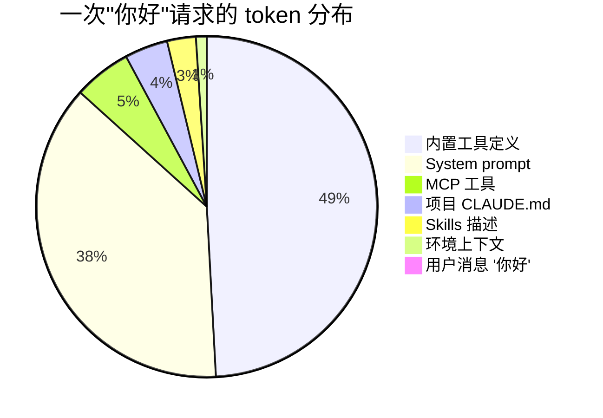

# 深入 04 · 为什么简单"你好"也会让 LLM 消耗数万 Token

> [← 返回目录](../README.md)  ·  相关：[深入 02 · Prompt Caching 原理](02-Prompt-Caching原理.md)  ·  [第 6 章 · AI 自治与上下文架构约束](../知识/06-AI自治与上下文架构约束.md)

---

## 0. 先看现象

在 LLM 网关 / 监控仪表盘上，你会看到一个反直觉的事实：

| 用户输入 | 实际发送给模型的 token 数 |
|---|---|
| `你好` | **13,000 – 25,000+**（首轮） |
| `ls` | **同上** |
| `这个文件改一下空格` | **20,000 – 40,000+**（带项目上下文） |
| 多轮对话第 20 轮 | **80,000 – 200,000+** |

> [!WARNING]
> 这不是 bug，是**架构必然**。理解它才能设计成本、延迟和路由策略——否则你会怀疑人生。

---

## 1. 为什么会这样：LLM API 是无状态的

传统 Web 服务：

```
Client --HTTP--> Server
              |
              +---> Session store (Redis/DB)
              |
              +---> Memory
```

Server 有记忆，可以查会话、用户档案、历史。

LLM API：

```
Client --HTTP--> LLM API
              |
              +---> （没有状态——模型本身没有记忆）
```

**模型没有任何记忆**。每次 API 调用都必须**把一切它需要知道的东西全部带上**：

- 它是谁（角色）
- 它可以做什么（工具清单）
- 项目背景是什么
- 之前说过什么（对话历史）
- 用户这次问什么

这就是为什么 `你好` 会带着几万 token 一起送进去——那几万 token 不是"你好"生成的，是**让这个模型能对你说话的全部前置条件**。

---

## 2. Token 构成解剖（按量级排序）

以一次典型的 **Claude Code / Trae / Cursor Composer / Codex CLI** 调用为例。

### 2.1 系统提示 System Prompt · 约 3k – 8k token

这是工具厂商注入的**使命书**，包含：

- **角色定义**："你是一个专业的编程助手……"
- **行为约束**：输出风格、禁忌、长度规则
- **工具使用协议**：什么时候调用什么工具、如何处理结果
- **安全指南**：哪些操作要确认、哪些禁止
- **输出格式**：markdown 规范、引用约定、代码块语言标签

Claude Code 的 system prompt 在 2026 年约 **5-8k token**，比 2024 年的 1-2k 涨了好几倍——因为工具越做越能干。

### 2.2 工具定义（Tool Schemas）· 约 5k – 15k token

每个"工具"在 prompt 里就是一段 JSON schema，给模型看它长什么样：

```json
{
  "name": "Read",
  "description": "Reads a file from the local filesystem. You can access any file directly...\n\nUsage:\n- The file_path parameter must be an absolute path, not a relative path\n- By default, it reads up to 2000 lines starting from the beginning of the file\n...",
  "input_schema": {
    "type": "object",
    "properties": {
      "file_path": {"description": "The absolute path to the file to read", "type": "string"},
      "limit": {"description": "The number of lines to read...", "type": "integer"},
      "offset": {"description": "The line number to start reading from...", "type": "integer"}
    },
    "required": ["file_path"]
  }
}
```

**每个工具的描述越细致，模型用得越准，但 token 越多**。常见工具 token 成本：

| 工具 | 单个 token 数 |
|---|---|
| 简单工具（3-5 个参数，短描述） | 200–400 |
| 复杂工具（含示例和规则） | 800–2000 |
| Claude Code 的 `Bash`、`Edit`、`Agent` 等带详细说明的 | 1500–3000 各自 |

一个典型的 Claude Code 会话预载 **15-25 个内置工具** + MCP 工具 + Skills 工具，合计 **8-15k token** 很常见。

### 2.3 项目上下文 `CLAUDE.md` / `AGENTS.md` · 约 2k – 10k token

工程师手动维护的项目说明——架构、依赖、命令、约定。Trae 等工具有类似的项目文件机制。

- 小项目：1-2k token
- 中等项目：3-5k token
- 复杂仓库（monorepo）：5-10k token

这部分是**可控**的。很多团队的 `CLAUDE.md` 长到上万 token 后没人管，成为成本黑洞。

### 2.4 用户级全局记忆 / 指令 · 约 500 – 5k token

- `~/.claude/CLAUDE.md`（用户全局规则）
- Memory / 持久化记忆文件
- 个人偏好（语言、输出风格）

### 2.5 MCP Servers 附带的提示 · 约 1k – 5k token

每个挂上的 MCP server 会：
- 注册它提供的 **工具**（计入 2.2）
- 额外注入一段 **使用说明**（告诉模型怎么用这些工具）

装 3-5 个常用 MCP（如文件系统、GitHub、数据库），很快追加 2-4k token。

### 2.6 Skills / Hooks / Sub-agent 描述 · 约 500 – 3k token

Claude Code 的 Skills 机制会把**可用 skill 列表**塞进 prompt：

> 当用户说 X 时，调用 Skill Y……

每个 skill 的名称和触发描述就是几十到几百 token。

### 2.7 环境上下文 · 约 100 – 500 token

- Working directory
- Platform / shell
- Git status 摘要
- 当前日期时间
- 模型自己的名字和能力范围

### 2.8 对话历史 · 随对话线性增长

这是最容易失控的部分。每一轮包括：

- **用户消息**（几十到几千 token）
- **模型回复**（经常上千 token）
- **工具调用请求**（tool_use 块，几百 token）
- **工具执行结果**（可能很大：一个 `Read` 可能返回几 k token，`Bash ls -la` 几百，`grep` 结果一片）

**长对话的 token 增长曲线**：

```
第 1 轮：   15k token
第 5 轮：   30k token
第 10 轮：  60k token
第 20 轮：  120k token
第 50 轮：  300k+ token   （很多模型已撑不住）
```

这就是 Claude Code 里 `/compact` / `/clear` 不是可选的原因。

### 2.9 最后才是用户这次说的话

"你好" 只占 **2 个 token**。

---

## 3. 一个具体的 token 分布示例

在 Claude Code 里说 `你好`（默认配置，在一个有 `CLAUDE.md` 的项目里），LLM 网关能观察到的 **请求 1**：

| 来源 | 估算 Token | 占比 |
|---|---|---|
| System prompt（Claude Code 官方） | 5,500 | 37% |
| 内置工具定义（Read/Write/Edit/Bash/Grep/Glob/Agent/TodoWrite/WebFetch/WebSearch 等 ~17 个） | 7,200 | 49% |
| MCP 工具（假设 1-2 个 server） | 800 | 5% |
| Skills 描述 | 400 | 3% |
| 项目 `CLAUDE.md` | 600 | 4% |
| 环境上下文 | 150 | 1% |
| 用户消息"你好" | 2 | 0.01% |
| **合计** | **≈ 14,650** | 100% |

这就是为什么你会在网关看到**输入 1.4 万 token**。



用户消息在整张饼里小到几乎看不见——这张图是对"API 无状态必然带来大前缀"最直观的呈现。

> [!NOTE]
> 真实数字随厂商和版本变化。Claude Code 2024 年的 system prompt 约 1-2k token，2026 年已达 5-8k，因为工具变复杂、skill 生态更大。Trae / Cursor / Codex CLI 的量级类似。

---

## 4. 经济学含义：Prompt Caching 不是可选项

### 如果不用缓存

每说一次"你好"，按 Claude Sonnet 4.6 $3/MTok 输入价计算：

- 14,650 token × $3/MTok = **$0.044 每次**
- 一天说 100 次 = $4.4/天
- 一个月一个用户 = **$130/月**

而这还没开始**输出**。

### 开了 Prompt Caching（cache_control）

Anthropic 缓存：**写入 1.25×，读取 0.1×**（见[深入 02](02-Prompt-Caching原理.md)）。

- 首次"你好"（写缓存）：14,650 × $3 × 1.25 / 1M = $0.055
- 之后每次（命中缓存）：14,650 × $3 × 0.1 / 1M = **$0.0044**

成本降至 **1/10**。**重用 2 次即回本**。

这就是为什么 Claude Code / Trae / Cursor Composer 的系统提示和工具定义**必然是缓存友好**的——**它们全部放在 prompt 最前面，保证能被缓存**。

### DeepSeek V4 Flash 更夸张

- Cache-hit 输入：$0.0028/MTok
- 14,650 token 命中成本：**$0.00004** 每次
- 比传统 API 便宜 50-100×

> [!TIP]
> **这是国产推理服务能做到超低价的核心原因**——大规模缓存共享 + cache-hit 定价差异。

---

## 5. 为什么架构上必须这么做

有人会问："为什么不把 system prompt 和 tool schema 存在服务端，每次只发用户消息？"

答案：**有一些厂商在做，但不普及**，且有工程代价。

### 5.1 Anthropic 的 `prompt_cache`（客户端显式管理）
缓存仍然在服务端，但客户端要**每次都发完整 prompt**，匹配靠 prefix。**客户端视角没"减负"**。

### 5.2 OpenAI 的 Assistants API v2 / Responses API
服务端存储 thread、tools、files。客户端只发增量。
- **优点**：客户端轻
- **缺点**：
  - 失去可控性（不知道 prompt 到底长啥样）
  - 调试困难
  - 供应商锁定深
  - 不适合跨厂商的 Agent 框架

### 5.3 Google Gemini Context Caching
显式创建 cached content，按时间付费。**客户端要先 create，再引用 ID**。
- 适合：单次大 context，大量复用
- 不适合：对话场景的动态上下文

### 结论

**在可预见未来，Agent 工具依然会"每次发完整 prompt"**，因为：

- 跨厂商通用（同一套 Agent 实现可挂 Claude / GPT / Gemini）
- Prompt 可审计、可 diff
- 缓存机制补成本
- **客户端是单一真相源**

所以"你好 = 几万 token"是这个生态系统的**结构性特征**。

---

## 6. SRE 的观测方法

### 6.1 看 API 自带的 usage 字段

Anthropic API 返回里：

```json
{
  "usage": {
    "input_tokens": 143,
    "cache_creation_input_tokens": 1024,
    "cache_read_input_tokens": 13500,
    "output_tokens": 89
  }
}
```

- `input_tokens`：**没被缓存**的那部分（通常是用户当次消息 + 新增对话）
- `cache_creation_input_tokens`：**写入缓存**的新增前缀
- `cache_read_input_tokens`：**命中缓存**读到的
- 三者之和 = 总 input

**工程 SLI**：
- **Cache hit rate** = `cache_read / (cache_read + input + cache_creation)`
- 目标：`> 80%` 对于稳定对话场景

### 6.2 工具厂商的 debug 模式

```bash
# Anthropic SDK debug
export ANTHROPIC_LOG=info

# OpenAI SDK debug
export OPENAI_LOG=debug

# Claude Code verbose
claude --debug
```

开 debug 后可以看到**实际发送的完整 prompt**，方便定位哪里胖了。

### 6.3 自建 LLM 网关要监控什么

| 指标 | 说明 | 告警阈值 |
|---|---|---|
| 单请求 input token p50/p99 | 分位数 | 突增 20% |
| Cache hit rate | 全局 / per-tenant | 低于预期 20% |
| 每轮新增 token | 对话 drift | 持续增长不收敛 |
| 超长 prompt 比例 | > 80k token 的请求占比 | > 5% |
| Token 成本 per active user per day | 业务成本 | 预算上限 |

### 6.4 一个实用分析：token 来源 pie chart

生产上建议给每个 Agent session 打标签，便于归因：

- `system_prompt_tokens`：厂商注入
- `tools_tokens`：工具定义
- `user_context_tokens`：CLAUDE.md / memory
- `history_tokens`：对话历史
- `user_message_tokens`：当次用户输入

这样出现"突然变贵"时能精确定位。

---

## 7. 自建 Agent / Workflow 时的最佳实践

### 7.1 精简 System Prompt

- **只放真正必要的角色 + 约束**
- 例子和详细说明放到外部 RAG，需要时再检索
- 如果你的 system prompt 超过 2k token，问自己：**哪些可以删？**

### 7.2 Lazy Tool Loading

不是每次都注册全部工具。按任务类型或意图分类：

```python
# ❌ 一股脑全塞
tools = [read_file, write_file, run_shell, search_web,
         query_db, send_email, create_ticket, ...]

# ✅ 按意图动态加载
if intent == "code_edit":
    tools = [read_file, write_file, run_shell, grep]
elif intent == "research":
    tools = [search_web, read_file]
```

**代价**：意图分类需要一次额外调用（可以用小模型/便宜模型做）。

### 7.3 分级 MCP Server

不要默认挂全部 MCP。让用户显式启用他需要的。

### 7.4 Context Compaction

对话超过阈值（比如 50k token）自动压缩：

- 把老对话压成摘要（用小模型做一次 summarization）
- 保留最近 N 轮原文 + 压缩历史
- Claude Code 的 `/compact` 就是这个机制的手动版

### 7.5 合理放置可缓存内容

按**变化频率从低到高**排列 prompt 内容：

```
[系统提示]        ← 最少变（可能一个月一次）
[工具定义]        ← 配置变时才变
[CLAUDE.md]       ← 项目变时才变
[历史对话 1..N-1]  ← 每轮追加
[当前用户消息]    ← 每次变
```

**越靠前的越要缓存**。一次 `cache_control` 写入覆盖前三段，后续所有请求都能命中前缀。

### 7.6 压缩 tool schema

- 用**短描述** + 只在必要时加示例
- **参数名简短但清晰**（`file_path` 优于 `absolute_file_path_to_read`）
- 避免重复描述（不要在 description 和 schema 里写两遍同一件事）

### 7.7 预算告警

```
if input_tokens > budget_per_request:
    log_warning("oversized prompt")
    alert_if_persistent()
```

这对**多租户 LLM 平台**尤其重要——单个租户的一个 bug 可以烧掉全团队预算。

---

## 8. 常见陷阱

- ❌ **每次把当前时间塞 system prompt 前面**：缓存每次失效，账单翻倍（参见[深入 02 · 缓存失效](02-Prompt-Caching原理.md#4-缓存何时失效)）
- ❌ **`CLAUDE.md` 越长越好**：错。长到没人读的 `CLAUDE.md` 只在付钱，不在赋能
- ❌ **把 user_id 放 prompt 开头做"个性化"**：每个用户独享缓存，命中率归零
- ❌ **工具注册一大堆但 90% 用不上**：token 都在白占
- ❌ **不做 compaction**：长对话直撞 context 上限
- ❌ **看到"input: 14k"就以为是 bug**：这是**基础事实**，不是 bug
- ❌ **按 `input_tokens` 一个字段看总成本**：要看 `input + cache_creation + cache_read` 的总和

---

## 9. 给 SRE 的一句话总结

> [!IMPORTANT]
> **"你好 = 14k token"** 是 Agent 工具的**架构特征**，不是 bug。
>
> SRE 架构师要做的不是消灭它，而是：
>
> 1. **设计缓存策略**让大部分 token 在 cache-hit 价格下流转
> 2. **监控 token 来源分布**快速定位异常
> 3. **为自建 Agent 精简 system prompt 和 tool schema**
> 4. **做 context compaction** 让对话能长期进行

---

## 10. 参考资料

- Anthropic · Prompt Caching docs · https://platform.claude.com/docs/en/docs/build-with-claude/prompt-caching
- Anthropic · Building effective agents · https://www.anthropic.com/research/building-effective-agents
- OpenAI · Prompt Caching · https://platform.openai.com/docs/guides/prompt-caching
- OpenAI · Assistants API / Responses API · https://platform.openai.com/docs/
- Google · Gemini Context Caching · https://ai.google.dev/gemini-api/docs/caching
- DeepSeek · Context Caching · https://api-docs.deepseek.com/guides/kv_cache

🔄 复习：[核心概念卡](../复习/核心概念卡.md) · [Active Recall 题库](../复习/Active-Recall题库.md)

---

← [深入 03 · 模型与工具场景化最佳实践](03-模型与工具场景化最佳实践.md)  ·  [📖 目录](../README.md)
