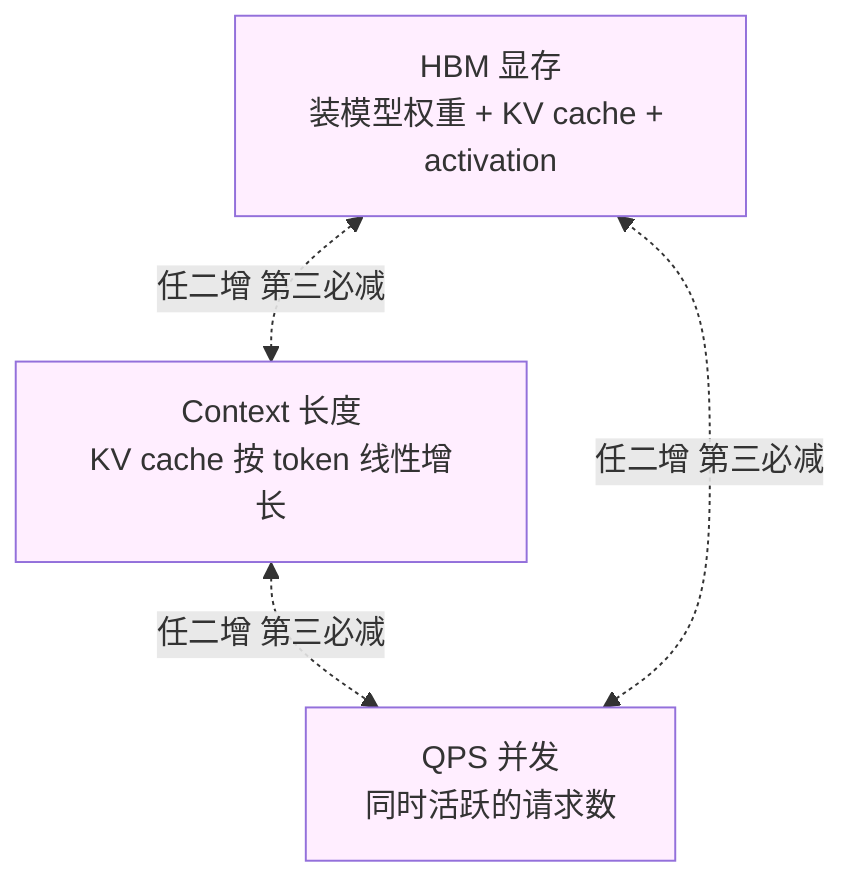
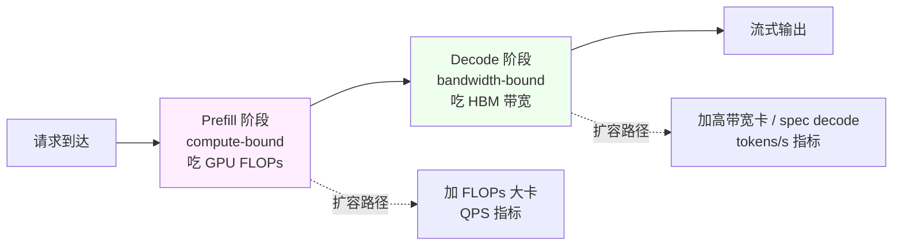

# 深入 05 · LLM 推理服务的容量规划

> [← 返回目录](../README.md)  ·  相关：[深入 01 · TTFT 与吞吐](01-首包延迟与吞吐的影响因素.md)  ·  [深入 02 · Prompt Caching](02-Prompt-Caching原理.md)

给 SRE 架构师用的工程手册。传统 web service 的容量规划（QPS × 平均处理时间 = 核数）在 LLM 推理上**完全不够用**。这篇告诉你为什么，以及怎么算。

---

## 0. 为什么 LLM 容量规划是个新学科

传统服务：**QPS 是主变量，内存和 CPU 是资源**。

LLM 推理：**显存、带宽、算力三者共同约束，并且 prefill 和 decode 两阶段完全不同**。

| 维度 | 传统 Web Service | LLM 推理服务 |
|---|---|---|
| 主要资源 | CPU / 内存 | GPU 算力 + HBM + HBM 带宽 |
| 处理时间 | 稳定（ms 级） | 变化 10-1000×（prefill 3s vs decode 300ms）|
| 请求形态 | 固定大小 payload | Token 数可以差 1000× |
| 批处理 | 没必要 | **必须**（continuous batching）|
| 容量建模 | `concurrency = QPS × avg_latency` | 三角约束 |

> [!WARNING]
> 用传统 Web 容量模型算 GPU 集群，**预估会差 3-10 倍**。要么买多了烧钱，要么买少了扛不住。

---

## 1. 三角约束：HBM × Context × QPS

GPU 推理的三个主要资源互相约束：



- **HBM 显存**：装模型权重 + KV cache + activation buffer
- **Context 长度**：每个活跃请求占的 KV cache 随输入 token 数线性增长
- **QPS（并发数）**：同时活跃的请求数

**三角规则**：**任何两个增加 → 第三个必须减**。

### 举个直观例子

- 在 H100 上跑 70B bf16，模型权重占 140GB
- H100 有 80GB HBM → **单卡装不下**，需要 TP=2（两卡共享 140GB 权重，剩余显存放 KV cache）
- 假设每请求 context 2k token，KV cache 约 1.2 GB/请求
- 两卡剩余显存 ~20GB ÷ 1.2 GB = **~16 个并发请求**
- 如果 context 升到 32k，KV cache 变 19.2GB/请求 → **并发跌到 1**

这就是为什么**"1M context"在实际部署中基本用不满**——显存扛不住。

---

## 2. KV Cache 占用：精确公式

这是容量规划的**核心公式**，必须会背：

```
KV cache size per token
  = 2 (K + V)
  × num_layers
  × num_heads
  × head_dim
  × bytes_per_element
```

### 典型模型的 KV cache 大小

| 模型 | 层数 | Heads | Head Dim | 每 token (bf16) |
|---|---|---|---|---|
| Llama 3 8B | 32 | 32 (KV=8 GQA) | 128 | ~0.13 MB |
| Llama 3 70B | 80 | 64 (KV=8 GQA) | 128 | ~0.32 MB |
| Llama 3 405B | 126 | 128 (KV=8 GQA) | 128 | ~0.50 MB |
| GPT-NeoX 20B | 44 | 64 | 96 | ~1.1 MB |

> [!TIP]
> **GQA（Grouped Query Attention）是 KV cache 省钱的秘诀**。Llama 3 用 `KV heads = 8`（不是 64/128），KV cache 立即缩 8-16×。现代模型几乎都用 GQA。

### 一个 context 要多少显存

```
context KV = tokens × per-token size
```

- Llama 3 70B，4k context：4096 × 0.32 MB ≈ **1.3 GB**
- Llama 3 70B，32k context：32768 × 0.32 MB ≈ **10.5 GB**
- Llama 3 70B，128k context：128k × 0.32 MB ≈ **42 GB**（一个用户独占半张 H100）

---

## 3. 单实例极限（Worked Example）

### 场景设定

- 硬件：2× H100（TP=2，共 160GB HBM）
- 模型：Llama 3 70B bf16（140GB 权重）
- 目标：找到单实例最大并发

### 逐项计算

```
总 HBM          : 160 GB
模型权重        : 140 GB
预留（activation / CUDA context / framework buffer）: 8 GB
----------------------------------------------------
KV cache 可用    : 12 GB
```

**场景 A：平均 context 4k token**
- 每请求 KV cache：1.3 GB
- 理论并发：`12 / 1.3 ≈ 9 个请求`
- 实际 vLLM continuous batching + PagedAttention 可做到 ~**12-14**（内存碎片处理更好）

**场景 B：平均 context 32k token**
- 每请求 KV cache：10.5 GB
- 理论并发：`12 / 10.5 ≈ 1 个请求`
- 这是极限——实际只能服务 1-2 并发

**场景 C：混合 context（80% 是 2k 短，20% 是 32k 长）**
- 平均 KV cache per request：`0.8 × 0.65 + 0.2 × 10.5 ≈ 2.6 GB`
- 理论并发：`12 / 2.6 ≈ 4-5 个请求`
- 但**长请求挤占严重**，可能被 preemption

### 引入 Prefix Caching

如果开启 Anthropic / vLLM 式 prefix caching：
- 相同前缀（system prompt + tools + CLAUDE.md，约 14k token）**只占一份**
- 假设 100 个活跃请求共享 **14k × 0.32 MB = 4.5 GB** 前缀
- 剩余显存 `12 - 4.5 = 7.5 GB` 服务**独立部分**
- 每请求独立 context 2k：7.5 / 0.65 ≈ **11-12 并发**
- **有效吞吐提升 2-3×**（看场景）

> [!IMPORTANT]
> 没开启 prefix caching 的容量规划会**高估 2-3×成本**。

---

## 4. Prefill 和 Decode 容量要分开算

### Prefill 容量（Compute-bound）

- **瓶颈**：GPU FLOPs
- **公式**：`FLOPs ≈ 2 × 参数量 × 输入 token 数`
- Llama 3 70B × 4k token ≈ 560 TFLOPs
- H100 bf16 峰值 989 TFLOPS → **每请求 prefill ≈ 0.57s**（理论）
- 实际 80-90% 效率 → **~0.7s**

**容量含义**：
- 单张 H100 每秒能处理约 **1.4 个 4k token 的 prefill**
- 2× H100 TP 约 **2-2.5 个/秒**（通信开销）
- 如果 QPS > 2.5，必须加实例

### Decode 容量（Bandwidth-bound）

- **瓶颈**：HBM 带宽
- **公式**：`tokens/s ≤ HBM bandwidth / model size`
- Llama 3 70B bf16 / H100 TP=2：`3.35 × 2 / 140 ≈ 48 tokens/s 聚合上限`
- 加上 continuous batching，可以让多个请求共享这个带宽

**容量含义**：
- 如果每个用户需要 20 tokens/s 的感知速度
- 单实例最多同时服务 **~2 个用户 decode**（聚合 48 tokens/s 分给 2 个）
- 想要更高并发 → 开 speculative decoding 或加实例

### Prefill ≠ Decode 的意义

服务生命周期有两个阶段，**它们的瓶颈和可服务并发数不同**：



- Prefill 吞吐：QPS 级别
- Decode 吞吐：tokens/s 级别

**这就是为什么 2025-2026 推理服务走向 PD 解耦**（见 [深入 03 · 1.6](03-模型与工具场景化最佳实践.md#16-推理基础设施的三个关键演化)）：prefill 用大卡堆算力，decode 用高带宽卡堆带宽。

---

## 5. 请求形态的影响（重要但常被忽略）

不同业务场景的 token 分布完全不同：

| 场景 | 输入 token | 输出 token | 瓶颈 |
|---|---|---|---|
| Chat 短对话 | 500 | 300 | 均衡 |
| RAG 文档问答 | 8000 | 500 | **Prefill** |
| 代码生成（Claude Code）| 14000 | 2000 | **Prefill** |
| Agent 长任务 | 50000+ | 10000+ | **Decode + KV cache 压力** |
| 总结一本书 | 500000 | 2000 | **Prefill 极限，可能 OOM** |

**做容量规划前，一定要先搞清楚你的 workload 分布**。

### 实用方法：用 p50/p95/p99 而非平均值

如果用平均值（比如"平均输入 5k token"），你会因为**长尾请求**挤爆显存。

建议监控：
- `input_tokens_p50 / p95 / p99`
- `output_tokens_p50 / p95 / p99`
- `total_tokens_per_request_p99`

按 **p95 规划**，p99 作为 preemption 容忍边界。

---

## 6. Autoscaling 的陷阱

LLM 推理的 autoscaling **比 web 服务难 10 倍**。

### 陷阱 1：冷启动很长

- 70B 模型装载：**30s - 数分钟**（从对象存储）
- CUDA warmup + JIT 编译：**数十秒**
- 第一个请求延迟会被 HPA 的 "probe" 误判为"健康"

> [!WARNING]
> 不要用 HPA default。准备好：
> - 最小副本数 ≥ 2（避免 0→1 的超长冷启动影响用户）
> - `minReadySeconds` 和 `initialDelaySeconds` 足够长（>60s）
> - Model weight pin 在本地 SSD / NVMe cache

### 陷阱 2：扩缩容丢缓存

- Scale-down 把实例杀掉 → **prefix cache 全失**
- 新上来的实例 cache 是空的 → **cold period 成本飙升 3-5×**
- 业务高峰后的"凉下来"阶段特别疼

**缓解**：
- Scale-down 要慢（冷却期 10+ 分钟）
- Warm pool / sticky routing

### 陷阱 3：指标滞后

- CPU 利用率在 LLM 场景**没啥意义**（GPU 忙但 CPU 闲）
- 应该看：**GPU utilization、KV cache utilization、queue depth**
- 这些指标从容器内 exporter 拿到 Prometheus 有 30-60s 延迟

**按 queue depth 自动扩容**更有效，因为它直接反映"积压压力"。

### 陷阱 4：按 QPS 扩容很危险

QPS 相同，token 流量可能差 100×。举例：
- 100 QPS × 平均 500 token = 50k token/s
- 100 QPS × 平均 50000 token = 5M token/s（100×）

**按 token 流量规划**，不要按 QPS。

---

## 7. Worked Example：SRE 事故助手的完整容量规划

> 本节用[贯穿项目 · SRE 事故助手](../练习/贯穿项目-SRE事故助手.md)作为完整案例，把前面 §1–§6 的公式串起来。读完这一节你应该能给自己的系统填出同样一张表。

### 场景设定（来自贯穿项目）

- **用户**：公司内部 100 名 SRE，覆盖 3 个时区轮值
- **典型一次交互**：粘贴一段告警 / 日志 → Agent 调 2-4 个只读工具（查 metrics / 查依赖 / 查历史事故） → 给出诊断 + runbook 链接
- **请求形态**（基于灰度期监控的 p95）
    - 输入：10k token（system prompt 2k + 工具描述 3k + 历史事故片段 3k + 当前事故上下文 2k）
    - 输出：1k token（诊断 + 引用）
    - 工具循环：平均 3 轮，每轮触发一次新的 prefill
- **业务节奏**
    - 平时：~10 并发，0.5 QPS
    - 值班高峰 / 大事故时：100 并发，**5 QPS**（按这个上限做容量规划）
- **SLO**
    - 首次诊断 TTFT p99 < 3s（SRE 心理上限）
    - 流式速度 ≥ 25 tokens/s
    - 月度可用性 99.5%（事故工具不在 critical path，但失效会拖慢 MTTR）
- **模型选择**：Llama 3 70B bf16，TP=2，2× H100 一个实例（沿用 §3 的硬件设定）

> 数字怎么来：输入 10k 是因为 SRE 场景必须把 runbook / system prompt / tool schema 全部装进去——这是[深入 04 · "你好"消耗数万 token](04-为什么简单你好也消耗数万token.md) 的现实写照。

### 需求摘要表（先列总账，再分解）

| 维度 | 高峰值 | 来源 |
|---|---|---|
| 同时活跃 SRE | 100 | 业务上限 |
| 顶层 QPS | 5 | 每人 ~0.05 QPS |
| 工具循环后的等效 QPS | **15** | 平均 3 轮 prefill / 顶层请求 |
| p95 输入 token | 10k | 监控 |
| p95 输出 token | 1k | 监控 |
| TTFT p99 目标 | 3s | SLO |
| tokens/s 目标 | 25 | SLO |

### 步骤 1：prefill 容量

- **工具循环放大**：5 顶层 QPS × 平均 3 轮 = **15 prefill QPS**（每次工具返回都触发新一轮 prefill，KV cache 复用见步骤 3）
- 单卡 H100 prefill：70B × 10k 约 1.4s × 2 TP = ~0.7s → **每秒 ~1.4 请求**
- 需要实例数：`15 / 1.4 ≈ 11 个 TP=2 实例` = **22 张 H100**

> 这一步最容易掉的坑：直接用顶层 5 QPS 算，会少买 2/3 的容量。**Agent workload 的真实 QPS = 顶层 QPS × 工具循环深度**。

### 步骤 2：decode 容量

- 高峰期总 decode：`100 并发 × 25 tokens/s = 2500 tokens/s 聚合`
- 单实例 decode：48 tokens/s（见 §3）
- 实例数：`2500 / 48 ≈ 52 个` = **104 张 H100**

> Decode 比 prefill 贵得多——这就是 [深入 03 PD 解耦](03-模型与工具场景化最佳实践.md#16-推理基础设施的三个关键演化) 的现实驱动力。SRE 助手场景下，**decode 是真正的成本中心**。

**取 max(11, 52) = 52 个实例 = 104 张 H100**

> Decode 占主导，是 SRE 助手这种"输入长、需要细致解释"工作负载的典型形态。如果场景换成日志摘要（输入大、输出短），结论会倒过来。

### 步骤 3：Prefix Cache 校验（决定真实账单）

SRE 助手有一个明显的"高重复前缀"特征：
- system prompt + tools schema（约 5k）+ 公司 runbook 索引（约 9k）每次请求都重复
- 而且 Agent 工具循环里，**前 N-1 轮的 prefix 也在第 N 轮中复用**

按 [深入 02 · Prompt Caching](02-Prompt-Caching原理.md) 的模型估算：
- 共享前缀长度：约 14k token
- 缓存命中率（实测灰度期）：**~85%**（剩 15% 因事故新数据破缓）
- prefill 实际 token：`10k × 0.15 + 10k × 0.85 × 0.1 = 2.35k`（cached portion 仍按 ~10% 等效成本算）

**修正后的 prefill 容量**：
- 等效 prefill 时间：`0.7s × 0.235 ≈ 0.16s`
- 单实例：~6 请求/s → 15 QPS 只需 **3 个实例**

> 没开 prefix caching 的容量规划会比真实需求高 3-5 倍。这是 §1 三角约束 + §6 KV cache 公式 + 业务场景共同决定的——单看任何一个维度都得不到正确答案。

### 步骤 4：KV cache 校验

- 高峰同时活跃请求 ≈ 100
- 单实例可承载并发：52 实例 → 平均 **1.9 并发/实例**
- 每请求独占 KV cache：扣除 14k 共享前缀后，**独立部分 ~6k token = 1.9 GB**
- 单实例可用 KV cache：12 GB → ~6 并发 ✓（safety margin 充足）

### 步骤 5：余量和韧性

- 高峰 decode 实例 52，+30% 长尾冗余 → **68 个实例 = 136 张 H100**
- 多 AZ 部署（至少 2 个 AZ，每 AZ 取 60% 容量上线，避免单 AZ 故障击穿）
- minReadySeconds ≥ 90s（70B 冷启动），PodDisruptionBudget 保留 80% 容量
- Scale-down 冷却期 ≥ 10 分钟（避免 prefix cache 失效）

### 步骤 6：最终账单 + 自建 vs 托管的决策点

| 方案 | 月度成本（估算） | 备注 |
|---|---|---|
| 自建 136× H100 on-demand | ~$294k/月 | 没规模优势 |
| 自建 136× H100 1-year reserved | ~$120k/月 | 占用 1 年期 |
| Anthropic Claude Sonnet 4.6 托管 | ~$15k/月 | 按真实 token 流量估算，含工具循环 |
| 自建小模型（Qwen 32B）+ Claude 兜底 | ~$8k/月 | 80% 走小模型，20% 难案升级 |

> SRE 事故助手的规模（100 用户）显然达不到自建经济性临界点。**这本身就是一个容量规划的产出**——规划过程证明"该用托管"，而不是先决定再算。

### 步骤 7：监控指标埋点（与练习 Unit 3 的 SLO 对齐）

| 层级 | 必埋指标 | 用途 |
|---|---|---|
| 实例 | `kv_cache_usage`, `queue_depth`, `gpu_util` | 自动扩缩容触发器 |
| 请求 | `ttft_p99`, `output_tps_p50`, `tool_loop_depth` | SLO 监控 |
| 缓存 | `cache_hit_rate`, `cache_hit_prefix_length` | 验证步骤 3 的假设是否成立 |
| 业务 | `incident_resolution_time_with_agent` | 真正衡量 Agent 是否帮上忙 |

> 这一步对应 [Unit 3 · 推理 SLO 与静默降级](../练习/Unit3-推理SLO与静默降级/总览.md) 的产出。**容量规划做完不埋指标，规划就是纸面工程**。

---

## 8. 核心监控指标

### 实例级
- `gpu_utilization` p50/p95
- `kv_cache_usage` / `gpu_memory_usage`
- `preemption_count` 累计和速率
- `queue_depth`（等待调度的请求数）
- `batch_size` 分布

### 请求级
- `ttft_p50 / p95 / p99`
- `output_tokens_per_second_p50 / p95`
- `input_tokens_p50 / p95 / p99`
- `end_to_end_latency_p99`

### 缓存级（如果启用 prefix caching）
- `cache_hit_rate`
- `cache_hit_prefix_length_p50`
- `cache_memory_usage`

### 业务级
- `token_cost_per_user_per_day`
- `failed_request_rate`（timeout / OOM / preemption 被拒）
- `long_tail_request_ratio`（输入 > 50k 的请求占比）

---

## 9. 常见错误

- ❌ **按 QPS 规划**：token 流量才是主变量
- ❌ **用平均值而非 p95**：长尾会爆
- ❌ **忘了 KV cache**：算完权重就以为容量够了
- ❌ **不开 prefix caching**：容量估算虚高 2-3×
- ❌ **只看 GPU 利用率**：HBM 满了但算力闲着，看不出瓶颈
- ❌ **Autoscale 太激进**：冷启动和 cache 丢失惩罚大
- ❌ **单实例而非 TP 配置**：大模型装不下 → OOM
- ❌ **不区分 prefill / decode**：buy too much or too little
- ❌ **忽略长尾输入**：一个 500k 输入的请求能让整个实例卡死

---

## 10. 给 SRE 的一句话总结

> [!IMPORTANT]
> LLM 容量规划 = **三个独立的容量模型叠加**（prefill 吞吐 / decode 吞吐 / KV cache 并发），按 max 取实例数，再加冗余。
>
> 不要复用 web 服务的 `QPS × latency` 心智模型——**那个在这里会差 3-10×**。

---

## 11. 参考资料

- vLLM · Scheduler & PagedAttention 设计文档 — https://docs.vllm.ai/en/latest/
- SGLang · RadixAttention 论文 — https://arxiv.org/abs/2312.07104
- NVIDIA · H100 / H200 / B200 架构白皮书
- 《Efficient Memory Management for LLM Serving with PagedAttention》(vLLM) — https://arxiv.org/abs/2309.06180
- Anyscale · LLM inference benchmarking 系列博客
- Character.AI · Optimizing inference (blog) — 讲如何把单用户成本降到 $0.0001

---

← [深入 04 · 为什么"你好"消耗数万 Token](04-为什么简单你好也消耗数万token.md)  ·  [📖 目录](../README.md)  ·  [深入 06 · Eval Pipeline 设计 →](06-Eval-Pipeline设计.md)
