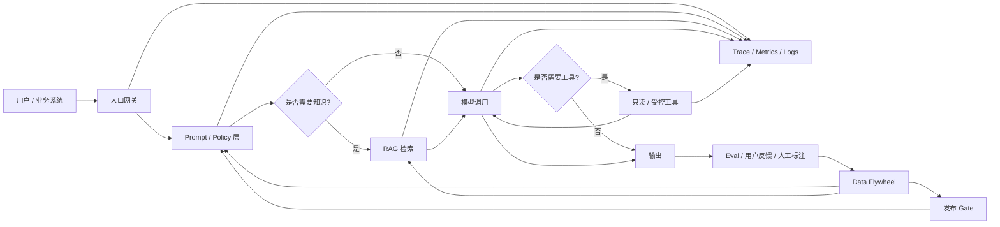
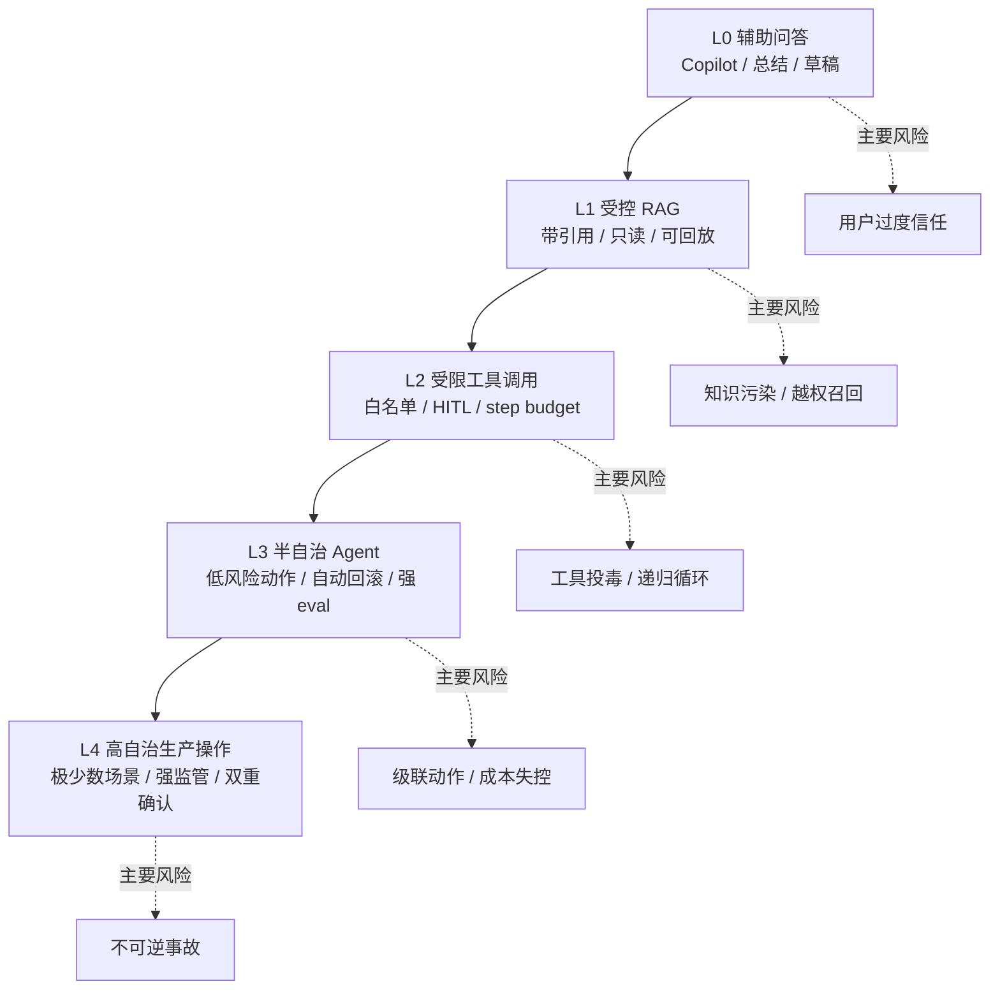

# 深入 11 · AI SRE 现实图谱

> [← 返回目录](../README.md)

> [!NOTE]
> 前面的章节讲了很多机制：推理 SLO、Agent 自治、Eval、Prompt Caching、数值级调试。
>
> 本章换一个角度：**从真实团队和真实生产环境出发**，看 AI SRE 到底在做什么、不做什么、最容易在哪些地方翻车。

---

## 0. 为什么需要一张现实图谱

很多团队第一次做 AI 系统时，会把问题想成"接一个模型 API"。这在 demo 阶段没错，但到了生产环境，真正难的部分会迅速变成：

- 业务输入质量参差，用户不会按你的 prompt 期望来组织语言
- 上游模型会升级、降级、限流、改策略
- RAG 召回会把旧知识、错知识、越权知识一起带进上下文
- Agent 调工具后，错误会从"一句话答错"变成"做错一串动作"
- 质量下降不一定伴随 5xx、p99 或 CPU 指标异常
- 组织内没人明确负责 eval、trace、prompt 版本、人工标注和 rollback

所以 AI SRE 不是"给 LLM 服务加监控"这么窄。更准确地说，它是在**不确定模型、真实业务、生产约束、组织责任**之间建立一套可运行的控制系统。

这一章的目的不是引入新概念，而是把整本书的概念压成一张生产现实地图。

---

## 1. 真实 AI 系统通常长成什么样

生产里的 AI 系统很少只有一个模型调用。更常见的是一个**复合 AI 系统**：模型、检索、工具、规则、缓存、人工流程、评估流水线、灰度系统缠在一起。

这张图里有几个现实判断：

- **模型只是中间节点**，不是系统本身。真正的可靠性来自模型周围的约束层、观测层和发布层。
- **RAG 不是知识库外挂**。它是权限、时效性、召回质量和引用可信度的共同入口。
- **工具调用不是能力增强这么简单**。它把模型错误从"文本风险"升级为"动作风险"。
- **Eval 不是离线考试**。它必须和 trace、发布、回滚、人工标注形成闭环。
- **Prompt 是代码**。它需要版本、评审、回放、灰度和回滚。

> [!IMPORTANT]
> 只要系统包含 RAG 或 tool use，就不要再把它当"模型接入项目"管理。它已经是一个有状态、有权限、有发布风险的生产系统。

---

## 2. AI SRE 的真实职责边界

AI SRE 不需要变成算法研究员，也不应该把 ML 团队的工作全部接过来。更现实的边界是：**SRE 拥有生产控制面，ML / 应用团队拥有能力面，双方共同拥有质量闭环**。

| 领域 | SRE 主责 | ML / 应用主责 | 共同责任 |
|---|---|---|---|
| 模型选择 | 约束延迟、成本、可用性、切换方案 | 能力评估、任务适配 | 灰度标准 |
| Prompt / Agent 设计 | 发布流程、权限边界、回滚 | 任务分解、prompt 迭代 | 版本化与回放 |
| RAG | 权限、索引更新、过期策略 | chunk / embedding / rerank 设计 | 召回 eval |
| 推理服务 | SLO、容量、限流、降级 | 模型参数、服务框架 | 性能压测 |
| Eval | Pipeline 可靠性、报警、数据流 | Rubric、gold set、judge 校准 | 质量 SLO |
| 事故处理 | IC、止血、回滚、复盘 | 根因分析、样本修复 | 模式库沉淀 |

一句话版本：

> **ML 团队让系统变聪明，SRE 让系统变可控。**

两者缺一不可。只聪明不可控，会变成高风险 demo；只可控不聪明，会变成昂贵规则引擎。

---

## 3. 现实中的四个成熟度阶段

不是所有团队都应该一上来做全自动 Agent。更合理的路线是分阶段上台阶，每一级都要有退出机制。

### L0 · 辅助问答

适合：客服草稿、事故复盘初稿、代码解释、日志摘要。

必备控制：

- 明确"仅辅助，不决策"
- 输出必须由人审阅
- 不接生产工具
- 不让模型直接看到不必要的敏感数据

### L1 · 受控 RAG

适合：内部知识库问答、runbook 检索、历史事故查询。

必备控制：

- 引用必须可追溯
- 文档权限进入检索层，而不是只靠 UI 层
- 过期文档有淘汰策略
- 对"找不到"的能力做 eval，不鼓励模型硬答

### L2 · 受限工具调用

适合：读日志、查指标、查部署记录、创建草稿工单。

必备控制：

- 工具默认只读
- 写操作必须 human-in-the-loop
- 单请求 step / 时间 / 成本硬上限
- tool response 标注为 data，不允许当 instruction 执行

### L3 · 半自治 Agent

适合：低风险、可回滚、步骤清晰的内部操作。

必备控制：

- 每类任务有 step budget
- 每个动作有审计日志
- 自动 rollback 可用
- 失败样本进入 eval / red-team 数据集

### L4 · 高自治生产操作

适合：极少数低 blast radius、强可验证、强可回滚的场景。

必备控制：

- 双重确认或双系统交叉验证
- 错误预算和权限预算绑定
- 事前 tabletop exercise
- 出现异常立即降级到 L2 / L1

> [!CAUTION]
> 如果团队连 L1 的引用正确率和越权召回都还没测清，不要跳到 L3。自治级别不是愿景口号，是控制能力的函数。

---

## 4. 最常见的现实落地路线

从真实项目看，合理路线通常不是"先造平台"，而是从一个高价值、低动作风险的场景切入。

### 推荐起点：SRE 事故助手

这也是本书贯穿项目选择这个题目的原因。它具备几个好处：

- 输入天然是 SRE 熟悉的：告警、日志、指标、runbook、postmortem
- 早期可以只读，blast radius 低
- 质量可以用引用、排查步骤完整性、误导率来评估
- 数据闭环清楚：每次事故和复盘都能反哺知识库和 eval
- 后续可以逐步接入工具，而不必一步到位自动修复

### 不推荐起点：自动修生产

这类项目听起来最酷，但通常最不适合做第一步。原因很简单：

- 权限大
- 错误不可逆
- 事故压力下人更容易过度信任自动化
- eval 很难覆盖真实长尾
- 一旦做错，会让组织对 AI 自动化产生长期免疫反应

更稳的路径是：

每升一级，都要求上一阶段的 trace、eval、权限和回滚已经稳定，而不是靠"模型更强了"跳过控制层。

---

## 5. 现实指标：不要只盯模型分数

AI 系统的指标分四层。只盯模型 benchmark，或者只盯 HTTP 200，都会误判。

### L1 · 基础服务指标

- availability / error rate
- TTFT / token throughput / p99
- queue depth / rate limit / timeout
- cache hit rate / cache creation tokens

这层回答：**系统有没有活着，用户有没有等太久，成本有没有爆。**

### L2 · 任务质量指标

- JSON / schema 通过率
- 引用存在率
- 引用支持率
- tool call 参数合法率
- 拒答正确率
- 按任务类型分桶的 judge score

这层回答：**系统有没有把这类任务做对。**

### L3 · 用户与业务指标

- 用户二次追问率
- 人工编辑距离
- thumbs-up / thumbs-down
- 工单一次解决率
- 事故定位耗时
- on-call 接受建议的比例

这层回答：**系统有没有真正帮到人。**

### L4 · 控制系统指标

- eval pipeline 延迟
- judge-human 对齐度
- gold set 新鲜度
- prompt / model 回滚耗时
- 自动化动作中 human override 比例
- 红队用例通过率

这层回答：**团队有没有能力发现、控制和修正系统。**

> [!WARNING]
> 很多 AI 系统不是死在 L1，而是死在 L2-L4：服务全绿，但引用错、工具错、用户不信、回滚慢。

---

## 6. 五个真实感很强的反直觉

### 反直觉 1 · 模型越强，越需要控制层

弱模型做不了复杂动作，反而风险有限。强模型能规划、能调用工具、能说服人，风险面更大。

因此控制层不是"等模型不够强时才需要"，而是模型越强越要前置。

### 反直觉 2 · Eval 不是为了证明模型好

生产 eval 的核心作用不是给模型打排行榜，而是支持三个决策：

- 能不能上线
- 上线后有没有坏
- 坏了能不能定位到哪类任务

如果 eval 不能支持发布和回滚，它更像研究报告，不像生产系统。

### 反直觉 3 · 人工审核不是银弹

HITL 只在三种条件下有效：

- 人知道自己在审核什么
- UI 把风险点清楚展示出来
- 审核者有足够时间和激励认真看

否则它会变成"点击确认"仪式，把责任从系统转移给人，但没有真正降低风险。

### 反直觉 4 · RAG 的难点常常不是 embedding

真实 RAG 项目的难点更多在：

- 文档权限
- 文档过期
- 同义术语
- 旧 runbook 与新架构冲突
- 引用是否真的支持回答
- 召回失败时模型是否敢说不知道

Embedding 只是入口，不是答案。

### 反直觉 5 · 最贵的不是 token，而是错误信任

Token 成本会体现在账单上，错误信任会体现在事故里。一个系统如果让 on-call 在错误方向排查 30 分钟，损失远大于一次模型调用费用。

---

## 7. 现实评审清单

拿到任何 AI 生产系统设计，先问下面 15 个问题。

### 系统边界

- 这个系统当前处在 L0-L4 哪一级？
- 它能做哪些动作，不能做哪些动作？
- 最大 blast radius 是什么？
- 降级到不用 AI 时，业务还能不能走？

### 数据与知识

- 输入里有哪些敏感数据？
- RAG 是否做了权限过滤？
- 文档过期怎么处理？
- 召回失败时，系统会承认不知道吗？

### 质量与观测

- 每类任务的 L1 assertion 是什么？
- L2 judge 有没有和人工校准？
- 线上 trace 能不能直接变成 eval 样本？
- 质量下降时，哪个指标先报警？

### 发布与事故

- Prompt / model / embedding / reranker 是否版本绑定？
- 发布前能否回放最近真实流量？
- 回滚需要几分钟？
- 有没有 AI 事故 pattern 对照表？

### 组织责任

- 谁拥有 prompt 版本？
- 谁拥有 gold set？
- 谁拥有 eval pipeline uptime？
- 谁在事故中有权暂停自动化？

如果这些问题答不上来，系统还可以继续试点，但不应该宣称"生产已就绪"。

---

## 8. 和本书其他章节的关系

这章是现实地图，不替代细节章节：

- 要设计指标：读 [第 5 章](../知识/05-AI推理服务的可靠性工程.md) 和 [Unit 3](../练习/Unit3-推理SLO与静默降级/总览.md)
- 要控制 Agent：读 [第 6 章](../知识/06-AI自治与上下文架构约束.md) 和 [深入 07](07-Agent-Prompt-Injection红队实战.md)
- 要做质量闭环：读 [第 7 章](../知识/07-质量可观测性与DataFlywheel.md) 和 [深入 06](06-Eval-Pipeline设计.md)
- 要练综合能力：做 [贯穿项目 · SRE 事故助手](../练习/贯穿项目-SRE事故助手.md)
- 要做架构评审：用 [Capstone](../练习/Capstone-AI生产架构评审包.md) 和 [附录 E](../附录/E-模板库.md)

---

## 参考来源

本章观点主要来自以下一手材料和生产经验抽象：

- BAIR · The Shift from Models to Compound AI Systems
- Anthropic · A postmortem of three recent issues
- Anthropic · An update on recent Claude Code quality reports
- OWASP · Top 10 for LLM Applications 2025
- NIST · AI 600-1: Artificial Intelligence Risk Management Framework: Generative Artificial Intelligence Profile
- Google SRE Book · SLO、Postmortem、Cascading Failures 相关章节

🔄 复习：[核心概念卡](../复习/核心概念卡.md) · [Active Recall 题库](../复习/Active-Recall题库.md)

---

[← 深入 10 · AI 系统事故模式库](10-AI系统事故模式库.md)  ·  [📖 总目录](../README.md)
