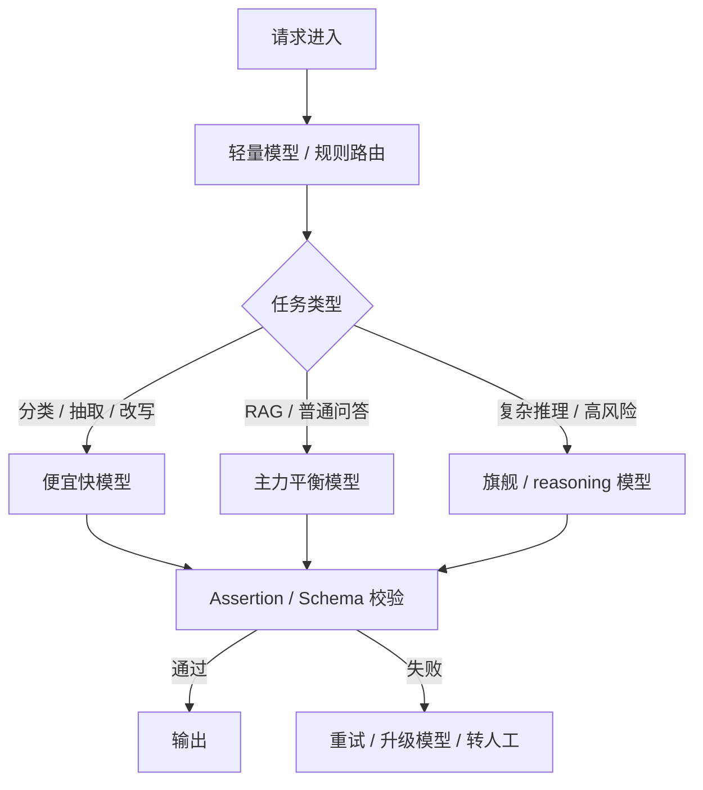
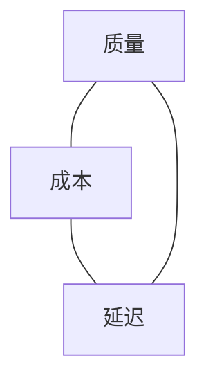
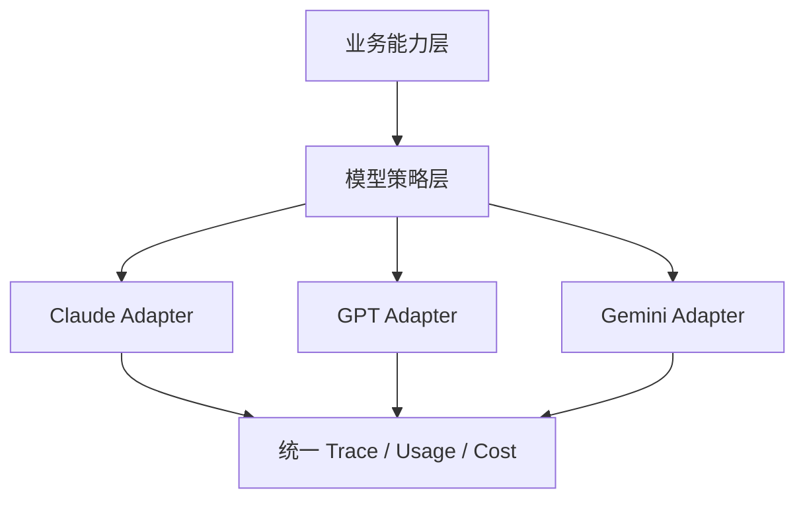

# 深入 12 · Claude / GPT / Gemini 三大模型系列使用指南

> [← 返回目录](../README.md)

> [!WARNING]
> 本章包含**模型系列、能力口径、API 形态、厂商命名习惯**等快变信息。内容快照日期为 **2026-05-24**；实际生产选型前，请以 Anthropic / OpenAI / Google 官方文档和你自己的 eval 为准。
>
> 本章不追榜单，不给"谁最强"这种过期很快的结论。它只讲三件更耐用的东西：**怎么理解三大系列、怎么选、怎么用不容易踩坑**。

---

## 0. 先建立一个不追星的模型观

Claude、GPT、Gemini 都不是"一个模型"，而是**一组按能力、速度、成本、上下文、多模态和推理深度分层的模型系列**。

你要记住的不是某个具体型号，而是这张心智地图：

| 系列 | 常见分层语言 | 典型强项 | 常见使用姿势 |
|---|---|---|---|
| Claude | Opus / Sonnet / Haiku | 长文理解、代码代理、写作质量、谨慎推理 | 用 Sonnet 做主力，Opus 做难题，Haiku 做高频便宜任务 |
| GPT | flagship / mini / nano / reasoning / codex | 通用能力、工具生态、结构化输出、Agent 与产品 API | 用旗舰做复杂任务，用 mini/nano 做路由和批处理，用 reasoning effort 控成本 |
| Gemini | 3.1 Pro Preview / 3.5 Flash（稳定）/ 3.1 Flash-Lite / Live / Embedding | 长上下文、多模态、Google 生态、低延迟 Flash | 用 3.1 Pro Preview 吃长上下文和复杂多模态，用 3.5 Flash 做高性价比线上链路 |

> [!IMPORTANT]
> 选模型时不要先问"哪个模型最好"。先问：**任务是否需要推理、是否需要长上下文、是否需要多模态、是否能接受延迟、单次错误代价多大、月度成本上限是多少**。

---

## 1. 三个系列的常识性介绍

### Claude 系列：Opus / Sonnet / Haiku

Claude 的命名基本可以这样理解：

- **Opus**：最强、最贵、最适合高难推理 / 复杂代码 / 架构分析。
- **Sonnet**：主力平衡档，通常是生产和日常工程任务的默认首选。
- **Haiku**：轻量快速档，适合分类、抽取、批处理、低延迟链路。

Claude 的工程气质是：**长上下文读写、代码代理、自然语言质量、谨慎的安全边界**。如果你的任务像"让一个高水平工程师读一堆材料后写方案"，Claude 往往很顺手。

使用上，Claude 有几个特别值得内化的习惯：

- 用清晰的段落、XML 风格标签、明确的输入区块隔离上下文。
- 对长任务给出角色、目标、约束、停止条件和验收标准。
- 对 Agent / tool use 强制 step budget、权限白名单和确认边界。
- 对复杂推理任务考虑 extended thinking，但要单独预算延迟和 token。
- 对固定长上下文使用 prompt caching，尤其是系统提示、工具说明、长规范文档。

### GPT 系列：旗舰 / 轻量 / 推理 / Codex

GPT 系列的核心不是某一个模型名，而是 OpenAI 平台围绕模型提供的一整套产品化能力：Responses API、tools、structured outputs、reasoning effort、vision/audio、embedding、evals、agent 开发栈。

可以把 GPT 系列粗分为：

- **旗舰通用模型**：复杂推理、代码、写作、跨模态任务的主力。
- **mini / nano 等轻量模型**：便宜、快，适合路由、分类、抽取、批量处理。
- **reasoning 模型 / reasoning effort**：需要"多想一会"的数学、规划、复杂代码、故障分析。
- **Codex / coding 优化模型**：面向软件工程任务，适合代码库理解、修改、测试与代理式开发。

GPT 的工程气质是：**API 产品能力完整、结构化输出成熟、工具生态强、适合做平台层集成**。如果你要做一个可规模化的 AI 能力平台，GPT 系列通常是必须评估的一条主线。

使用上，GPT 有几个关键习惯：

- 新项目优先从 Responses API 的统一形态开始，而不是为每个能力拼不同接口。
- 结构化输出优先用 schema / structured outputs，不靠 prompt "请输出 JSON"。
- 用 reasoning effort 控制"想多久"，而不是所有请求都上最高推理档。
- 用轻量模型做 router / classifier / validator，旗舰模型只接真正难的请求。
- Tool calling 的宿主代码必须负责权限、幂等、回滚和审计。

### Gemini 系列：Pro / Flash / Flash-Lite / Live

> [!WARNING]
> **2026-03-09 起 Gemini 3 Pro Preview 已关停**，生产环境必须迁移到 **Gemini 3.1 Pro Preview**。本节模型名按官方 2026-05-19 状态写。

Gemini 当前的分层（2026-05 快照）：

- **Gemini 3.1 Pro Preview**：复杂推理、长上下文、多模态理解的主力档；目前是预览态，Anthropic Opus 4.7 之外的另一旗舰候选。
- **Gemini 3.5 Flash（稳定）**：当前的稳定生产首选；智能体与编码任务上"以远低于大模型的成本提供 Frontier 级表现"是 Google 的口径，OpenRouter 用量验证它确实是高频生产档。
- **Gemini 3 Flash（预览）**：上一代 Flash，仍在 OpenRouter Top 10 用量榜上，但新项目应优先用 3.5 Flash。
- **Gemini 3.1 Flash-Lite**：成本/吞吐档，超高频字段抽取、分类、routing 类任务。
- **Gemini 3.1 Flash Live / TTS**：语音、视频、实时双向交互。
- **Gemini Deep Research / Antigravity Agent / Computer Use Preview**：Google 体系下的"托管式 Agent"分支，对应 Anthropic 的 computer use、OpenAI 的 Codex。

Gemini 的工程气质是：**长上下文、多模态、Google 生态整合、Flash 档高性价比**。如果任务里有大量 PDF、视频、图片、表格、长文档，或者你已经在 Google Cloud / Vertex AI 体系里，Gemini 是必须评估的主线。

使用上，Gemini 有几个关键习惯：

- 长上下文不是"把所有东西塞进去"的理由；仍然要做 chunk、引用、分桶和回放验证。
- 多模态输入要明确指定任务：看图抽字段、视频摘要、表格核对、还是跨文档问答。
- Thinking / thinking budget 要按任务开启，别让所有请求默认深思。
- Flash 档适合线上大流量，但关键任务仍要用业务 eval 验证。
- 在 Google Cloud 生产环境里，要同时评估 AI Studio 快速开发和 Vertex AI 企业部署路径。

---

## 2. SRE 视角的三系列选型矩阵

下面不是绝对结论，是**默认起点**。每个系统上线前仍然要用你的真实样本 eval。

| 场景 | Claude 默认起点 | GPT 默认起点 | Gemini 默认起点 | SRE 判断 |
|---|---|---|---|---|
| 代码库重构 / Agent 编码 | Sonnet / Opus | GPT flagship / Codex | 3.1 Pro Preview / 3.5 Flash | 先测 repo 理解、测试修复率、工具误用率 |
| 事故分析 / 根因推理 | Opus / Sonnet + thinking | reasoning effort 高档 | 3.1 Pro Preview + thinking | 看是否能引用证据，不看文风 |
| 工单分类 / 字段抽取 | Haiku | mini / nano | 3.1 Flash-Lite / 3.5 Flash | 成本、延迟、schema 通过率优先 |
| 长文档 RAG | Sonnet | flagship / mini 组合 | 3.1 Pro Preview / 3.5 Flash | 长上下文必须测"引用支持率" |
| 多模态文档 / 图片 / 视频 | Sonnet / Opus vision | GPT multimodal | 3.1 Pro Preview / 3.5 Flash | Gemini 常是强候选，但仍按任务 eval |
| 平台 API 集成 | Sonnet + Messages API | Responses API | Gemini API / Vertex AI | 看团队既有云、审计、网络和合规约束 |
| 高风险自动化 | Opus/Sonnet 只做建议 | reasoning + strict tools | 3.1 Pro Preview + tool boundary | 模型不是关键，权限边界才是关键 |

> [!TIP]
> 真正成熟的团队通常不是"选一家"，而是做**模型路由**：简单任务走便宜快模型，复杂任务走旗舰 / reasoning，故障时能切到另一家。

---

## 3. 一个可复用的模型路由策略

生产里最实用的不是"全站一个模型"，而是三层路由：



### 路由规则示例

- **默认**：Sonnet / GPT mini+flagship / Gemini Flash 这类平衡档。
- **升级**：满足任一条件就升级到强模型：
  - 用户请求包含多步规划、架构决策、复杂代码修改
  - 上下文超过某个阈值
  - 轻量模型的 confidence / validator 失败
  - 涉及高价值客户或高风险业务
- **降级**：满足任一条件就降到便宜模型或规则：
  - 固定 schema 抽取
  - 简单分类
  - 模板化摘要
  - 重复批处理
- **转人工**：
  - 高 blast radius
  - 不可回滚动作
  - 安全 / 合规 / 人事 / 金融结论
  - 三次模型尝试仍不一致

### 路由的 SLO

模型路由本身也要有 SLO：

| 指标 | 为什么重要 |
|---|---|
| 路由准确率 | 错把难题分给便宜模型，会制造静默质量下降 |
| 升级率 | 过高说明便宜模型没省钱，过低说明风险被压住没暴露 |
| 单请求成本 p95 | 防止复杂请求拖垮预算 |
| validator 失败率 | 判断模型输出是否可用 |
| fallback 触发率 | 衡量模型 / 供应商稳定性 |

---

## 4. 三家的提示词与上下文习惯

### Claude：把上下文分区写清楚

Claude 对清晰结构很友好。推荐习惯：

```markdown
<role>
你是生产环境 SRE，目标是给出可执行、可回滚的排查建议。
</role>

<context>
这里放日志、指标、runbook 摘要。
</context>

<constraints>
- 不得建议删除数据
- 每个结论必须引用日志行号或 runbook 段落
- 不确定时写"无法判断"，不要猜
</constraints>

<output_format>
输出 JSON，字段为 summary、evidence、next_steps、risks。
</output_format>
```

Claude 常见坑：

- 给了长上下文但没说哪些是指令、哪些是资料，容易让工具返回或文档内容污染任务。
- 让 Agent 长时间自由探索但没有 step budget。
- 用 Opus 处理所有请求，质量好但成本很快失控。

### GPT：把结构化输出交给 API 约束

GPT 系列适合把"必须机器可读"的要求下沉到 schema：

```json
{
  "type": "object",
  "properties": {
    "incident_type": {"type": "string"},
    "severity": {"type": "string", "enum": ["sev1", "sev2", "sev3"]},
    "evidence": {
      "type": "array",
      "items": {"type": "string"}
    }
  },
  "required": ["incident_type", "severity", "evidence"]
}
```

GPT 常见坑：

- 明明可以用 structured outputs，却还在 prompt 里写"请输出合法 JSON"。
- 所有请求都开高 reasoning effort，导致延迟和成本不可控。
- Tool call 执行层没有幂等、权限和审计，误把模型输出当可信动作。

### Gemini：不要把长上下文当免设计

Gemini 的长上下文和多模态能力很强，但使用上仍要保持工程纪律：

- 长文档先分区：政策、日志、runbook、历史事故、用户问题分别标注。
- 要求引用：回答中的关键判断必须指向文档位置、页码、时间戳或片段 ID。
- 长视频 / 多 PDF 场景先抽取结构化中间结果，再做推理。
- 用 Flash 做线上流量前，必须按任务分桶测引用支持率和拒答正确率。

Gemini 常见坑：

- 把 1M context 当数据库用，导致成本、TTFT、定位难度一起上升。
- 多模态输入没有明确任务，模型输出变成漂亮摘要而不是可执行结果。
- AI Studio demo 跑通后，忘了评估 Vertex AI 的网络、IAM、审计和数据驻留要求。

---

## 5. 成本、延迟和质量的三角

三大系列都逃不开这张三角：



常见误区：

- **只追质量**：所有请求都上旗舰 / thinking，最后账单和延迟爆炸。
- **只追成本**：轻量模型做复杂任务，质量下降但 dashboard 全绿。
- **只追延迟**：禁用 reasoning / rerank / verifier，用户得到很快的错答案。

SRE 要做的是把三角拆成可执行策略：

| 策略 | 解决什么 |
|---|---|
| 任务路由 | 简单任务不浪费旗舰模型 |
| Prompt caching | 固定长上下文降成本 |
| Batch / async | 批处理场景降吞吐成本 |
| Assertion / verifier | 不让低质量输出进入业务 |
| Human-in-the-loop | 高风险动作不自动化 |
| 多供应商 fallback | 厂商限流 / 降级 / 区域故障时可切换 |

---

## 6. 生产接入前的 20 条样本 eval

模型评估不需要一开始就做很大。先做一个**20 条真实样本**的小 eval，足以筛掉大部分错觉。

> **和 [深入 06 · Eval Pipeline 设计](06-Eval-Pipeline设计.md) 的关系**：深入 06 讲的是**怎么搭一条持续运行的 eval 管线**（数据流、回放、回归检测、指标），是给已经选定主模型之后的"质量地基"。本节讲的是**选型阶段的 20 条样本筛子**——一次性、轻量、用于跨厂商横向对比。两者不是替代关系：选型用本节方法选出候选 → 用深入 06 的 pipeline 把它持续盯住。换句话说，**本节是入口测试，深入 06 是生产监控**。

### 样本怎么选

| 类型 | 数量 | 说明 |
|---|---|---|
| 正常高频 | 6 | 最常见请求，衡量基本价值 |
| 长尾困难 | 6 | 罕见、复杂、多约束 |
| 安全边界 | 4 | prompt injection、越权、敏感数据 |
| 格式 / 工具 | 2 | schema、tool call、引用 |
| 反例 | 2 | 应该拒答或转人工 |

### 每条样本记录什么

- 输入
- 期望输出要点
- 模型输出
- 是否引用正确
- 是否格式正确
- 是否越权
- 人工评分
- 延迟
- token / 成本
- 是否触发 fallback

### 三家对比时不要只看平均分

要按任务分桶看：

- Claude 是否在长文和复杂代码上明显更稳？
- GPT 是否在结构化输出和工具集成上更省工程成本？
- Gemini 是否在长上下文 / 多模态 / 成本上有优势？
- 哪一家失败时更危险？
- 哪一家输出更容易被 validator 截住？

> [!IMPORTANT]
> 生产选型最怕"demo 选型"：拿 3 条漂亮样例试一下，就决定主模型。至少 20 条真实样本，是 SRE 选型的底线。

---

## 7. 多供应商接入的最低抽象

不要把三家的 API 差异过早抹平成一个"万能 LLM 接口"。那会丢掉 structured outputs、reasoning、tool use、thinking budget、cache control 这些关键能力。

更合理的抽象是分两层：



### 统一什么

- trace_id
- request_id
- task_type
- input / output token
- latency
- cost estimate
- model family / model name / version
- tool calls
- schema validation result
- eval score

### 不强行统一什么

- thinking / reasoning 参数
- cache control 细节
- tool schema 的厂商差异
- 多模态输入格式
- streaming 事件细节

> [!TIP]
> 适配层的目标不是让三家"看起来一样"，而是让业务层能做路由、观测、fallback 和回放。

---

## 8. 常见坑清单

### 坑 1 · 用模型名当架构

"我们用 Claude / GPT / Gemini"不是架构。架构至少要说明：

- 哪类请求走哪个模型
- 为什么
- 失败时怎么切
- 成本上限是多少
- 质量怎么测

### 坑 2 · 把轻量模型用在高风险结论

轻量模型适合高频低风险任务，不适合：

- 根因结论
- 生产变更建议
- 合规判断
- 金融 / 人事 / 医疗结论

### 坑 3 · 只看平均质量

平均分会掩盖长尾。SRE 更关心：

- p95 / p99 失败样本
- 最危险失败
- 某个任务分桶是否明显差
- 是否会自信地错

### 坑 4 · 忽视供应商级故障

三家都会出现：

- 限流
- 区域性故障
- 静默模型升级
- 输出风格变化
- 安全策略变化
- 价格 / 配额变化

所以生产系统要有 fallback、pin version、canary eval 和回放对比。

### 坑 5 · 把长上下文当 RAG 替代品

长上下文可以减少工程复杂度，但不能替代：

- 权限过滤
- 文档新鲜度
- 引用校验
- 召回评估
- 成本控制

---

## 9. 一句话选型建议

如果你只能记住一页：

| 你要做什么 | 起手式 |
|---|---|
| 日常工程助手 / 代码 Agent | Claude Sonnet 或 GPT coding 模型起步，关键任务加强模型复核 |
| 平台级 AI 能力 | GPT / Claude / Gemini 都评估，重点看 API 能力、审计、fallback、成本 |
| 长文档 / 多模态分析 | Gemini 3.1 Pro Preview / 3.5 Flash 和 Claude Sonnet 都测，不要跳过引用 eval |
| 高频分类 / 抽取 | 三家轻量档都测，谁便宜稳定用谁 |
| 复杂事故推理 | 旗舰 / reasoning / thinking 档，强制证据引用和人工确认 |
| 自动化生产操作 | 先别问模型，先问权限、回滚、blast radius |

---

## 10. 和本书其他章节的关系

- 要看动态榜单和价格：读 [深入 03 · 模型与工具场景化最佳实践](03-模型与工具场景化最佳实践.md)
- 要做 Agent 权限设计：读 [第 6 章](../知识/06-AI自治与上下文架构约束.md)
- 要做 prompt caching：读 [深入 02](02-Prompt-Caching原理.md)
- 要做 eval：读 [深入 06](06-Eval-Pipeline设计.md)
- 要做生产评审：用 [附录 E · 模板 9](../附录/E-模板库.md)
- 要找官方课程：看 [附录 D](../附录/D-厂商官方学习资源.md)

---

## 参考来源

本章只用三类来源校准：厂商官方文档、厂商官方 cookbook / academy、生产系统工程经验。

- Anthropic / Claude Docs · Models、Prompt engineering、Extended thinking、Tool use、Prompt caching
- OpenAI Platform Docs · Models、Responses API、Function calling、Structured outputs、Reasoning、Prompt caching
- Google Gemini API Docs · Models、Text generation、Long context、Thinking、Function calling、Live API

---

[← 深入 11 · AI SRE 现实图谱](11-AI-SRE现实图谱.md)  ·  [📖 总目录](../README.md)
