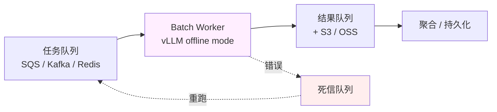

# 深入 13 · 离线 / 批量推理的 SRE 实践

> [← 返回目录](../README.md)  ·  对应知识章节：[第 5 章 · AI 推理服务的可靠性工程](../知识/05-AI推理服务的可靠性工程.md)  ·  相关：[深入 01 · TTFT 与吞吐](01-首包延迟与吞吐的影响因素.md)、[深入 05 · 容量规划](05-LLM推理服务的容量规划.md)

---

## 0. 为什么单独讲离线推理

本书前 12 篇深入专题默认讨论的都是**在线推理**（serving，单请求延迟敏感）。但生产里**很大一部分 LLM 工作量**实际是离线的：

| 场景 | 典型规模 | 关注点 |
|---|---|---|
| 日志摘要 / 异常归类 | 每日 10M-100M 条 | 吞吐 + 单条成本 |
| 文档全量打 embedding | 一次性千万级 + 增量 | 吞吐 + 中断恢复 |
| 合成训练数据 / data labeling | 一次性千万到亿级 | 吞吐 + 质量抽检 |
| Agent / RAG 系统的全量 re-index | 模型升级后必须做 | 一次性长任务、可重跑 |
| 报告生成 / 周报 / 月度分析 | 每周 / 月数千到数万次 | 准时完成 + 失败可恢复 |
| Eval 集回归 | 每次模型升级跑数千-数万样本 | 吞吐 + 可复现 |

这些场景的工程权衡和在线推理**反着来**：吞吐 ≫ 延迟、可以重跑、可以容忍长尾、可以用 spot 实例、可以用 batch API 拿半价。

> [!IMPORTANT]
> 把在线推理的 SLO / 容量模型套到离线场景，是**烧钱最快**的方式之一。一个组织里"在线推理 vs 离线推理"的成本结构通常 3:7 甚至 1:9（离线占大头），但 SRE 关注度通常 9:1（在线占大头）。**这本身就是组织级风险**。

---

## 1. 在线 vs 离线：八个维度的对照

| 维度 | 在线推理（serving） | 离线 / 批量推理（batch） |
|---|---|---|
| **关键指标** | TTFT p99 / tokens/s | 总吞吐 / 单条成本 / 完成时间 |
| **失败处理** | 立刻报错给用户 | 标记失败、批次结束统一重跑 |
| **延迟容忍** | 秒级 | 分钟-小时级，常常隔夜跑 |
| **请求形态** | 随机到达，QPS 波动 | 已知总量，可调度 |
| **资源选择** | on-demand GPU + 自动扩缩容 | **Spot / preemptible + batch API** |
| **价格档** | 标准 API 价 | Anthropic / OpenAI Batch API 通常 **5 折** |
| **prefix caching** | 命中率取决于自然重复 | **可以主动设计**前缀复用顺序 |
| **质量监控** | 实时 SLO + canary eval | 批次完成后抽样 + 全量统计 |

记住这张表，能避免 80% 的"用错了 API / 用错了硬件 / 用错了 SLO 体系"。

---

## 2. 离线推理的工程模式

离线推理的形态比在线丰富得多。SRE 至少要能识别这 4 种：

### 2.1 模式 A · 厂商 Batch API（最省心、最便宜）

Anthropic / OpenAI / Google 都提供 batch endpoint：

| 厂商 | 接口 | 折扣 | 完成时间 SLA |
|---|---|---|---|
| Anthropic Message Batches | `/v1/messages/batches` | **50%** | < 24h（多数 < 1h）|
| OpenAI Batch API | `/v1/batches` | **50%** | < 24h |
| Google Vertex AI Batch | `BatchPredictionJob` | ~50% | < 24h |
| DeepSeek 折扣时段 | 16:30-00:30 UTC | **75%** | 实时但限流 |

> 价格 / 时段为 2026-05 快照，使用前查官方。

**SRE 工作**：
- 选用 Batch API 而不是循环调标准 endpoint —— **直接省一半钱**
- 监控 batch job 状态（pending / in_progress / completed / failed）
- 把"24h SLA"作为业务依赖告警的输入
- 失败 batch 要有重提交流程（**不能手工**，必须自动）

> [!TIP]
> **常见错误**：把"50% 折扣"理解为"少花一半钱就行"，结果用标准 endpoint 跑 100 万次循环调用。Batch API 同样的 1M 请求**只要一次 HTTP 调用**——网络、限流、错误处理都简化了一个数量级。

### 2.2 模式 B · 自建 vLLM / SGLang offline batch

适合：

- 用开源模型（成本只算硬件，不算 API）
- 数据合规要求不出公司
- 量大到 Batch API 也贵（>1B token/月）

**典型架构**：



**关键工程点**：
- **vLLM `LLM.generate()` 而不是 OpenAI-compatible server**：跳过 HTTP 层，直接喂 list of prompts，吞吐高 2-3×
- **Continuous batching 自带**：vLLM/SGLang 离线模式默认开启
- **GPU 利用率拉到 80%+**（在线服务通常只能到 30-50%）
- **没有 TTFT 约束 = 可以塞超大 batch**（受 KV cache 上限限制）

### 2.3 模式 C · Spot / preemptible 实例

离线推理"可重跑"的特性让 spot 实例变成首选：

| 云 | spot 节省 | 中断频率 |
|---|---|---|
| AWS Spot H100 | 50-70% | 数小时-数天 |
| GCP Preemptible H100 | ~60% | 最长 24h 强制回收 |
| Lambda / RunPod | 30-50% | 较稳定 |

**SRE 必做**：
- **Checkpoint 机制**：每处理 N 条 / M 分钟把进度写到对象存储
- **幂等性**：同一条输入即使重跑结果也要一致（temperature=0 / seed 固定 / 或落盘后跳过）
- **优雅 shutdown**：收到中断信号（AWS 2 分钟通知 / GCP 30 秒）→ 把当前 batch 落盘 → 退出
- **不要把 spot 用在"准时性 SLO"严格的任务上**

### 2.4 模式 D · 混合（Pipeline 编排）

实际生产里离线推理通常是 pipeline 一环：

```
Airflow / Dagster DAG:
  ingest → preprocess → LLM batch → postprocess → load
                          ↓
                  本章重点
```

**SRE 工作**：
- 把 LLM 步骤封装成可重跑的 task（输入 / 输出都落盘）
- 在 DAG 里设置合理的 retry / timeout（LLM 调用比传统 task 慢一个量级）
- 监控**整条 DAG 的端到端时长**，不止 LLM 步骤本身
- 把 LLM token 量 / 成本作为 DAG 的指标暴露出来

---

## 3. 容量规划：和在线推理的本质区别

[深入 05](05-LLM推理服务的容量规划.md) 讲的容量规划公式（三角约束 / prefill / decode）**仍然适用**，但**最优解完全不同**：

### 3.1 在线推理的最优解

- 实例数 = max(prefill 容量, decode 容量) + 30% 冗余
- KV cache 留 50% safety margin（应对突发并发）
- GPU 利用率 30-50%（保延迟）

### 3.2 离线推理的最优解

- **实例数 = 完成时间 / token 量 / 单实例吞吐**——倒过来算
- **KV cache 利用率拉到 95%+**（没有突发，只有已知队列）
- **GPU 利用率拉到 80-95%**（不保延迟，只保吞吐）
- **batch size 拉到能塞的最大**（在线服务不能超 32-64，离线可以 512+）

### 3.3 Worked Example：1 亿条日志摘要

**需求**：
- 1 亿条原始日志，每条 ~500 token
- 输出摘要 ~50 token
- **截止时间**：24h 内完成
- 模型：Claude Haiku 4.5（成本敏感选最便宜的）

**方案 A 估算**（Batch API）：
- 总 input：100M × 500 = 50B token
- 总 output：100M × 50 = 5B token
- Haiku 4.5 标准价：$1 / $5 per MTok → 总成本 = 50k + 25k = **$75k**
- Batch API（50% off）：**$37.5k**
- 完成时间：Batch 队列通常 <1h，远在 24h 内 ✓
- **SRE 工作量**：写一个脚本提交 batch + 监控状态 + 失败重提交 ≈ 2 天工作量

**方案 B 估算**（自建 vLLM + spot H100）：
- 选 Qwen3-7B（开源 + 中文好 + 摘要任务足够）
- 单 H100 跑 Qwen3-7B offline batch：~3000 tokens/s 聚合输出 + 类似输入吞吐
- 1 亿条 × 550 token = 55B token 总流量
- 单卡：55B / 3000 = 18.3M 秒 = **212 卡天**
- 24h 完成需要 **~9 张 H100** 全程不停
- AWS spot H100 ~$2/h（on-demand 一半价）→ 9 × 24 × 2 = **$432**
- **SRE 工作量**：搭 vLLM + 队列 + checkpoint + spot 中断处理 ≈ 1 周

**决策**：

| 方案 | 成本 | SRE 投入 | 一次性 vs 长期 |
|---|---|---|---|
| Batch API | $37.5k | 2 天 | 适合一次性或低频 |
| 自建 vLLM + spot | $432 + 1 周搭建 | 摊薄到月度后极低 | 长期 / 高频时碾压 |

**临界点**：如果这种规模的 batch **每月跑 ≥1 次**，自建经济性立刻碾压 API。Batch API 适合**一次性 / 试水**。

> 这一计算逻辑和 [深入 05 SRE 助手 worked example](05-LLM推理服务的容量规划.md#7-worked-examplesre-事故助手的完整容量规划) 完全相反——那里 100 用户的在线场景结论是"用托管"，这里 1 亿次的离线场景结论是"自建"。**规模和形态决定 buy vs build，不要套结论**。

---

## 4. Prefix Caching 在离线场景的"主动设计"

在线推理里 prefix caching 命中率取决于**自然**的请求重复（同一 system prompt / RAG 同一文档检索到多次）。

离线场景里你掌握**全部输入**——可以**主动设计排序**最大化命中：

### 4.1 排序原则

- 按 **prefix 长度**排序：先跑共享前缀长的，让 cache 自然累积
- 按 **任务类型**分桶：同类任务（同 system prompt）一批跑完再切下一类
- 按 **文档 ID**分组：同一文档的所有衍生任务连着跑

### 4.2 一个反例

```
错误顺序（每 3 条切一次类型）：
  [logA, embed, summary, logB, embed, summary, ...]
  → cache 命中率 ~10%

正确顺序（按类型分桶）：
  [logA, logB, logC, ...] [embed1, embed2, ...] [summary1, summary2, ...]
  → cache 命中率 ~85%
```

### 4.3 实际收益

按 [深入 02](02-Prompt-Caching原理.md) 的定价模型，cache hit 部分按 ~10% 等效成本算。把命中率从 10% 提到 85% **直接省 70% 输入成本**——在 1 亿条规模下就是 $25k+ 的差距。

> **在离线场景里"懒得排序"等于直接烧钱**。这一项 SRE 不做没人做。

---

## 5. 质量监控：批次级 vs 实时

在线场景的质量监控是**实时**的（L1 assertion 每请求跑 / L2 judge 抽样跑 / Canary eval 定时跑）。

离线场景的质量监控是**批次级**的，并且应该**两遍**跑：

### 5.1 提交前 Smoke

提交 batch 之前，**先用 100 条样本跑标准 endpoint**：
- 验证 prompt 模板没问题
- 验证 output schema 合规
- 看 cost 估算是否符合预期

> 这一步省钱比省时间重要——错的 prompt 在 batch 里跑 1 亿次的代价是 $30k+。

### 5.2 完成后 Sample-eval

Batch 完成后，**对结果抽 1-5% 跑完整 eval**：
- L1 assertion 通过率：低于 99% 报警
- L2 judge 抽样打分：和上一批的分数比较
- 按时间 / 按 batch ID 看分布：找 batch 内的"塌陷段"

### 5.3 失败样本归档而不是抛弃

Batch API 通常返回 `failed_count > 0` 时，**SRE 的本能反应是重跑**——错了。应该：

1. **持久化**所有失败样本（不只是计数）
2. **分类**失败原因（content policy / token limit / API error / 输出格式错）
3. **针对性重跑**（content policy 必须先改 prompt；token limit 必须先截断；API error 才直接重跑）

```
失败样本归档 schema 建议：
{
  "batch_id": "batch_01H...",
  "input_index": 47832,
  "input_prompt": "...",
  "failure_type": "content_policy" | "token_limit" | "api_error" | "schema_invalid",
  "raw_error": "...",
  "retry_count": 0,
  "next_action": "needs_prompt_edit" | "retry_truncated" | "retry_as_is" | "dead_letter"
}
```

---

## 6. 离线推理的 SLO（和在线完全不同）

### 6.1 三个核心 SLI

| SLI | 含义 | 目标参考 |
|---|---|---|
| **Batch completion time** | 提交到完成的总时长 | < 业务截止时间 × 70% |
| **Per-record cost** | 每条记录的平均成本 | < 预算上限的 80%（留 buffer 给重跑）|
| **Quality drift across batches** | 同模板跨批次的质量分波动 | p95 漂移 < 5% |

### 6.2 三个常被忽略的 SLI

| SLI | 为什么重要 |
|---|---|
| **Failed record salvage rate** | 失败样本最终能救回多少？salvage rate 太低说明 prompt 设计有问题，不只是 retry |
| **Pipeline downstream wait** | 这个 batch 完了下游 task 等了多久才启动？反映调度问题 |
| **Schema validation rate** | 离线推理大量用于"结构化抽取"，schema 错了不报错但下游全废 |

---

## 7. 常见事故模式（离线版本的 [深入 10](10-AI系统事故模式库.md)）

### 7.1 Pattern · "凌晨 3 点 batch 没跑完"

**症状**：每日 batch 设定 24h 内完成，最近 7 天有 3 天超时。

**根因**（按概率排）：
1. 输入数据量周期性涨（周二 / 月初）→ **容量没跟着涨**
2. 模型供应商队列拥堵（Batch API 共享池）
3. 输出 token 数变长（模型升级后变啰嗦）
4. 下游 task 死锁

**预防**：
- 业务方周度报输入量预测
- 监控**最近 7 个 batch 的完成时间趋势**
- Batch API 用量大时切换到**多区域 / 多厂商分流**

### 7.2 Pattern · "spot 实例丢任务"

**症状**：自建 vLLM + spot，跑完发现少了 12% 输入对应的输出。

**根因**：
- 中断信号没处理 → 进程被 kill 前已 prefill 但未写盘
- Checkpoint 间隔太长（5 分钟）→ 一次中断丢 5 分钟工作

**预防**：
- 每条记录处理完**立刻**追加写入对象存储（而不是 batch 缓冲）
- 中断信号处理器写出当前 batch 进度
- 任务开始前**先扫一遍已完成清单**，跳过已处理的输入（幂等）

### 7.3 Pattern · "Prompt 改了，旧 cache 全废"

**症状**：本周和上周相同 batch 任务，本周成本翻倍。

**根因**：上游有人改了 system prompt 一个字符 → prefix 完全不同 → cache 命中率从 85% 跌到 0%。

**预防**：
- Prompt 模板**版本化 + git tag**
- Cache hit rate 突降 20% 必须报警
- 灰度 batch（5% → 100%）而不是直接全量

### 7.4 Pattern · "结构化输出 schema 漂移"

**症状**：Batch 跑完 99% success rate，但下游 ETL 失败 30%。

**根因**：模型版本升级（"latest" 漂了），输出 JSON 字段名从 `severity` 变成了 `level`。下游硬编码字段名 → 解析失败。

**预防**：
- **Pin 模型版本**（永远不用 `latest`、`stable`、`-2025-12` 这种半 alias）
- 提交前 smoke 必跑 schema 校验
- 下游 ETL **用 JSON schema 校验**而不是字段名硬编码

---

## 8. 离线推理的成本拆解和优化

按"省钱潜力大小"排序的 6 个杠杆：

| 杠杆 | 收益 | SRE 工作量 |
|---|---|---|
| 用 Batch API 而不是循环调 | -50% | 极低 |
| 主动设计 prefix 排序 | -50-70% 输入成本 | 低（一次性排序逻辑）|
| Spot / preemptible 实例（自建路线）| -50-70% 硬件成本 | 中（要 checkpoint + 中断处理）|
| 选小模型 + 提前过滤 | -80%+（如果适用）| 中（要做模型选型 eval）|
| 减少不必要的输出长度（max_tokens / 严格 schema）| -10-30% 输出成本 | 低 |
| 多厂商 batch 比价（同模型档位） | -10-30% | 低（一次性比价）|

> **80/20 法则**：前两条做了 80% 的收益就到手了。**Batch API + Prefix 排序**应该是离线推理的默认起点。

---

## 9. 一份可复用的离线推理 SLO + Runbook 骨架

```markdown
## 离线推理服务 SLO · <pipeline 名>

### Service definition
- 输入：<上游表 / 队列>
- 输出：<下游表 / 索引>
- 业务承诺：每日 N 万条，<HH:MM> 前完成

### SLI / SLO
| SLI | 测量点 | 目标 | 报警 |
|---|---|---|---|
| Daily completion rate | 当日成功条数 / 输入条数 | > 99.5% | < 99% page |
| Daily completion time | DAG 启动到 LLM 步骤完成 | < 4h | > 6h page |
| Per-record cost | 月累计 / 月处理量 | < $X | 周累计超 $X × 1.3 page |
| Schema validation rate | 通过下游 schema 校验比例 | > 99.9% | < 99.5% page |
| Cache hit rate | LLM 调用的 cache hit | > 60% | < 40% 调查 |

### 关键 dashboard
- Batch job 状态（pending/processing/completed/failed）
- 每日处理量 + 完成时间趋势（7 日 / 30 日）
- 失败样本按 failure_type 分布
- Token 消耗 / 成本趋势

### Runbook · 常见故障
1. Batch 超时 → 检查输入量、API 队列、模型选择
2. Schema 失败率高 → 暂停下游，回滚 prompt
3. 成本异常 → 检查 cache hit rate + 模型版本
4. Spot 中断丢任务 → 确认 checkpoint 间隔 + 幂等扫描
```

---

## 10. 给 SRE 的一句话总结

> [!IMPORTANT]
> **在线推理是组织的"心脏"——所有人盯着；离线推理是组织的"消化系统"——只有出事时才有人想起**。
>
> 这本书前 12 篇深入专题都是心脏，本章是消化系统。
>
> 对一个组织的实际 LLM 成本影响：**消化系统 ≥ 心脏**。SRE 不主动管，就没人管。

---

## 11. 参考资料

- Anthropic Message Batches API — https://docs.claude.com/en/docs/build-with-claude/batch-processing
- OpenAI Batch API Guide — https://platform.openai.com/docs/guides/batch
- Google Vertex AI · BatchPredictionJob — https://cloud.google.com/vertex-ai/generative-ai/docs/multimodal/batch-prediction-gemini
- vLLM Offline Inference Mode — https://docs.vllm.ai/en/latest/getting_started/quickstart.html#offline-batched-inference
- AWS Spot Best Practices — https://docs.aws.amazon.com/AWSEC2/latest/UserGuide/spot-best-practices.html

🔄 复习：[核心概念卡](../复习/核心概念卡.md) · [Active Recall 题库](../复习/Active-Recall题库.md)

---

← [深入 12 · Claude / GPT / Gemini 三大模型系列使用指南](12-Claude-GPT-Gemini三大模型系列使用指南.md)  ·  [📖 目录](../README.md)  ·  [深入 14 · 微调作为运维对象 →](14-微调作为运维对象.md)
