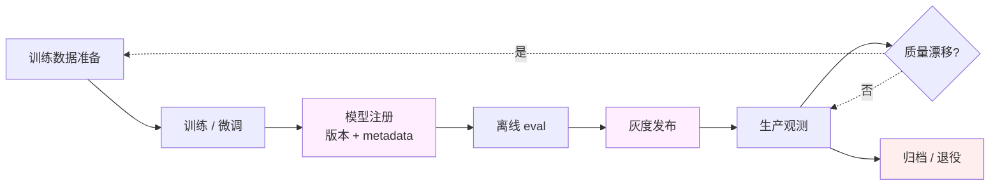
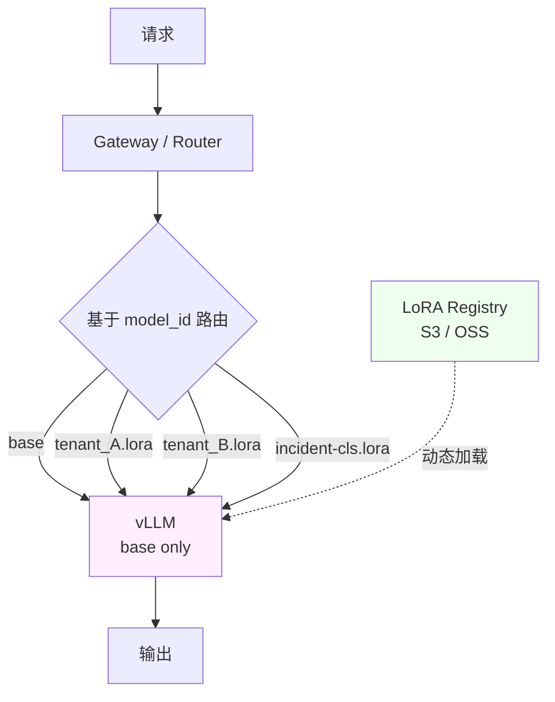

# 深入 14 · 微调作为运维对象

> [← 返回目录](../README.md)  ·  对应知识章节：[第 5 章 · AI 推理服务的可靠性工程](../知识/05-AI推理服务的可靠性工程.md)  ·  前置：[共同语言 01 · 训练生命周期](../共同语言/01-训练生命周期与Recipe.md)、[共同语言 04 · Alignment 的词汇](../共同语言/04-Alignment的词汇.md)

---

## 0. 这一章是给谁写的

[共同语言 01](../共同语言/01-训练生命周期与Recipe.md) 把 SFT / RLHF 当作"训练流程一部分"——讨论的是**模型厂商**怎么训他们的旗舰模型。

但实际生产里，**应用方公司自己做微调**是另一个独立战场：

- 拿开源的 base / instruction-tuned 模型 → 喂入自己的领域数据 → 做 LoRA 微调 → 部署
- 拿厂商模型 + 厂商微调 API（Anthropic / OpenAI 都有）→ 上传数据 → 拿到自己的模型 ID
- 拿基础模型 → 全参微调 → 自己跑推理

这三条路在 **SRE 视角下**有完全不同的运维负担——但本书前 13 篇深入专题都默认"模型是别人给的、你只负责推理"，对这一块涉及严重不足。本章补这个缺口。

> [!IMPORTANT]
> **微调不是"训练的简化版"，是一个独立的运维对象**。它有自己的版本、自己的回归、自己的成本、自己的事故模式。

---

## 1. 应用方微调的三种形态

按 SRE 负担从轻到重排：

### 1.1 形态 A · 厂商托管微调（最轻）

- Anthropic / OpenAI / Vertex AI 提供 fine-tuning API
- 你只上传训练数据 + 选 base model → 拿到一个自己的 model ID
- 训练全程在厂商那里，你看不到 loss curve 也不需要看
- 推理时把 model ID 换掉即可

**SRE 工作**：
- 数据上传管线（脱敏 / 验证）
- 模型 ID 版本管理
- 推理时的灰度 / 回滚
- 成本监控（厂商微调通常**贵**，但运维省）

**不需要**：GPU 集群、训练监控、checkpoint 管理

### 1.2 形态 B · LoRA / QLoRA（中等）

- 自己用 unsloth / axolotl / Hugging Face PEFT 跑
- 只训练几百 MB 的 adapter，不改 base model 参数
- 单卡 H100 / A100 / 甚至 4090 就能跑（QLoRA 4090 跑 13B 都行）
- 多个 LoRA 可以在**同一个 base model 上动态加载**（vLLM / TGI 支持）

**SRE 工作**：
- 训练任务编排（用 Kubernetes Job / Airflow）
- LoRA 文件（adapter weights）的版本化 + 存储
- 推理服务的**多 LoRA 路由**
- 回滚机制（adapter 加载 / 卸载）

**关键优势**：
- **一个 base 模型 + N 个 LoRA = N 个"专门模型"**，显存只占 1 个 base 的钱
- LoRA 文件几十 MB 到几 GB，**网络传输和存储几乎不是问题**
- 回滚 = 卸载 adapter，秒级

### 1.3 形态 C · 全参微调（最重）

- 改 base model 全部参数
- 需要数十张 H100 + 分布式训练栈（FSDP / DeepSpeed / Megatron）
- 单次训练成本 $10k-$1M+
- 每个版本是一个完整的模型（数十到数百 GB）

**SRE 工作**：
- 完整训练基础设施（见 [共同语言 05](../共同语言/05-分布式训练基础设施.md)）
- Checkpoint 存储和复制（TB 级）
- 训练过程监控（loss spike / divergence / OOM）
- 模型版本管理 + 部署链路

**何时值得做全参微调**：
- 任务和 base model 偏差太大，LoRA 救不了
- 公司有专门的 ML infra 团队 + 长期模型路线
- 否则**LoRA / QLoRA 应该是默认起点**

---

## 2. SRE 的"微调对象生命周期"

不管哪种形态，从 SRE 视角看，一个"微调模型"的生命周期是：



每个环节 SRE 都有具体职责——下面逐节展开。

---

## 3. 训练数据：SRE 的隐形战场

**最常被低估**的环节。微调失败 80% 是数据问题，不是算法问题。

### 3.1 数据 pipeline 的 SRE 关注点

| 关注点 | 为什么重要 |
|---|---|
| **PII 脱敏** | 训练数据进了模型权重，**永远拿不出来**。脱敏出错 = 永久泄露 |
| **去重** | 同一条数据出现 N 次会让模型记住而不是学习（见 [深入 02](02-Prompt-Caching原理.md) + [代码 06 MinHash 去重](../代码/06-dedup-minhash.py)）|
| **版本化** | 数据集要打 hash + 版本号，否则"我们上次训那个版本"找不回来 |
| **Eval set 隔离** | 训练集和 eval set 严格隔离，污染就是 contamination |
| **Schema 验证** | 训练样本格式错 = 模型行为不可预测 |
| **来源审计** | 哪些数据来自哪些人 / 哪些工单 / 哪些 source？合规要求 |

### 3.2 数据版本化的最小落地

```
data/
├── runbooks-v1.2.0/        # 数据集本身
│   ├── train.jsonl
│   ├── eval.jsonl
│   └── manifest.yaml       # sha256 + 来源 + 处理流程 + 创建日期
├── runbooks-v1.3.0/
└── ...
```

**manifest.yaml 应包含**：

```yaml
dataset_id: runbooks-v1.3.0
parent: runbooks-v1.2.0
created: 2026-05-24
source: 
  - internal-runbook-repo@a3f2c1
  - postmortem-database@2026-05-01
processing:
  - dedupe: minhash-0.85
  - pii_scrub: presidio-v2.1
  - schema_check: passed
splits:
  train: { count: 12483, sha256: ... }
  eval: { count: 1000, sha256: ... }
notes: "vs v1.2.0: 加入 Q2 新事故 1247 条；去掉网络相关样本 312 条（迁移到 networking-v1.0.0）"
```

> 这是 ML 团队不会主动做，但**事故复盘时第一个被问到的内容**。

---

## 4. 训练任务作为编排对象

### 4.1 不要手工跑训练

**反模式**：ML 工程师在自己的 workstation 上执行 `python train.py` 跑微调。

**问题**：
- 没有审计 trail
- 数据版本 / 代码版本 / 超参 / GPU 配置全靠 ML 工程师记
- 中断没人知道
- 复现一次训练 = 找出当时那台机器 + 那个 conda 环境

### 4.2 微调任务的正确形态

```yaml
# 一个 fine-tuning job 应该长这样
apiVersion: batch/v1
kind: Job
metadata:
  name: ft-runbook-classifier-v1.3.0
  labels:
    base_model: qwen3-7b-instruct
    dataset: runbooks-v1.3.0
    recipe: lora-r16-a32
    owner: ml-team
spec:
  template:
    spec:
      containers:
      - name: trainer
        image: my-registry/axolotl:v0.4.1
        command: ["accelerate", "launch", "train.py"]
        env:
          - name: DATASET_SHA256
            value: "abc123..."
          - name: BASE_MODEL_SHA256
            value: "def456..."
          - name: WANDB_RUN_NAME
            value: "ft-runbook-classifier-v1.3.0"
        resources:
          limits:
            nvidia.com/gpu: 4
```

**SRE 工作**：
- 这种 Job 是标准 k8s 对象，可以用 SRE 的现成工具监控（Prometheus / Grafana）
- 训练失败的告警走标准链路
- 训练完成 → 自动触发 eval → 自动注册到 Model Registry

### 4.3 训练监控的核心指标

| 指标 | 阈值参考 | 报警条件 |
|---|---|---|
| GPU utilization | > 85% | 持续 < 60% 调查 |
| Loss curve | 下降 | 上升 / 突变 = 立即停 |
| Gradient norm | 稳定 | 突变 10× 立即停 |
| Validation loss | 训练后期开始降 / 持平 | 上升 = 过拟合，停 |
| ETA | 监控 | 偏离预估 50% 调查 |

> 这些是 ML 团队"应该看"的指标。SRE 的工作是**让这些指标进监控系统**，而不是让 ML 工程师盯 wandb 网页。

---

## 5. LoRA 推理服务：N 个适配器同时上

这是 LoRA 路线的杀手锏，也是 SRE 工作量最大的环节。

### 5.1 多 LoRA 部署架构



vLLM / TGI 都原生支持**同一个 base model 上动态加载多个 LoRA**：

- 内存里加载一份 base（70B = 140GB）
- 每个 LoRA 几十 MB 到几 GB，**几乎不增显存**
- 请求时根据 `model="my-tenant-A"` 选择应用哪个 LoRA

### 5.2 SRE 关心的事

| 关注点 | 做法 |
|---|---|
| LoRA 版本管理 | 跟 base model 一样进 Model Registry（见 [深入 15](15-模型注册表与上线流程.md)） |
| 加载延迟 | 每个 LoRA 首次加载 1-5s，热缓存后 <100ms。冷启动场景预热 |
| 多租户隔离 | 通过 model_id 路由 + 鉴权，防止 tenant A 的请求误用 tenant B 的 LoRA |
| LoRA quality SLO | 每个 LoRA **独立**有质量 SLO，base 升级时全部 LoRA 重测 |
| LoRA "失活" | 长期没用的 LoRA 从内存卸载，节省显存（vLLM 默认有 LRU）|

### 5.3 一个真实陷阱：Base model 升级 = 所有 LoRA 失效

- LoRA 是基于 base model 的某一版训练的
- Base 升级（哪怕只是 patch）权重微调，LoRA 加载后可能**行为漂移甚至崩坏**
- **没有跨版本兼容保证**

**SRE 必做**：
- Base model 升级前，**所有挂在它上面的 LoRA 必须重测**
- LoRA 的 metadata 记录 base 版本，base 不匹配时**拒绝加载**而不是默默运行
- 灰度升级 base 时，先在 shadow 流量上验证 LoRA 行为

---

## 6. 微调专属的事故模式

补充 [深入 10](10-AI系统事故模式库.md) 没覆盖的微调专属 pattern：

### 6.1 Pattern · Catastrophic Forgetting（灾难性遗忘——模型学会新技能后忘掉了旧技能）

- **症状**：微调后**新任务好了，老任务全废**
- **根因**：训练数据全是新领域，原 instruction-following 能力被覆盖
- **预防**：训练集里**混 5-20% 通用数据**（开源的 instruction 数据集采样）
- **检测**：eval set 必须包含**通用任务**作为 regression baseline

### 6.2 Pattern · Memorization Leak

- **症状**：模型输出训练集里的**逐字逐句**内容（包括敏感 PII）
- **根因**：数据去重不足 / 训练 epoch 太多 / LoRA rank 太高
- **预防**：训练前去重；training set 上跑 prefix-suffix completion 测试
- **检测**：eval 里加一组"训练数据片段补全"测试，看模型多大程度记住

### 6.3 Pattern · Data Pipeline Drift

- **症状**：模型 v1 v2 v3 跑下来，每版都好像比上一版好一点，但**线上反馈越来越差**
- **根因**：训练集和真实流量分布**逐渐漂移**——你训的不是用户实际问的
- **预防**：定期从生产 trace 重新采样训练集，不要永远基于初版数据集迭代
- **检测**：训练集的分布统计 vs 生产 trace 分布对比，KL divergence 趋势监控

### 6.4 Pattern · LoRA Stack 冲突

- **症状**：多 LoRA 服务里，加载 LoRA_A + LoRA_B 后两者都行为异常
- **根因**：两个 LoRA 都在同一层的相同 module 上调整权重，叠加产生冲突
- **预防**：一次请求只用一个 LoRA（不要试图 stack）
- **检测**：服务层硬约束 max LoRA per request = 1

### 6.5 Pattern · Hyperparameter Cargo-Culting

- **症状**：从 paper 抄的 lr / batch / epochs 在自己数据上跑出来一直不好
- **根因**：超参高度依赖数据规模和分布
- **预防**：每个新数据集做**3-5 个超参 ablation**再决定，不要照抄

---

## 7. 微调成本经济学（SRE 拍板用）

### 7.1 三种形态的成本量级

| 形态 | 一次训练成本 | 推理成本（vs base API）| 总持有成本 |
|---|---|---|---|
| 厂商托管微调 | $100-$10k | 通常 2-4× | 中（运维省，调用贵）|
| 自建 LoRA / QLoRA | $10-$1000 | 0（用自己 base 推理）| **低** |
| 自建全参微调 | $10k-$1M | 0 | 高（要养训练栈）|

### 7.2 什么时候微调划得来

**值得**：
- 高频固定任务（每月 ≥10M 调用）
- 任务和通用模型差异显著（行业术语 / 内部格式 / 中文垂直领域）
- 有持续的标注数据流（运营 / 客服反馈）

**不值得**：
- 任务用 prompt + few-shot 就够（**先试这条**）
- 数据 < 1000 条（先标更多）
- 任务边界模糊 / 多意图（先用通用模型路由）
- "为了简历有微调经验"（reward hacking，见 [深入 09](09-何时不该用AI.md)）

> 详细的"该不该微调"决策框架见 [贯穿项目 · 可选支线](../练习/贯穿项目-SRE事故助手.md#可选支线--日志分类小模型--lora-微调)。

---

## 8. 微调服务的 SLO

```markdown
## 微调服务 SLO · <模型名>

### Service definition
- Base model: <name + sha256>
- Adapter: LoRA r=<N>, target_modules=<...>
- Training data: <dataset_id>
- Owner: <ML team> + <SRE>

### Quality SLI
| SLI | 测量点 | 目标 |
|---|---|---|
| Task accuracy | 每周 gold-set N 条 | > X% |
| Regression on general tasks | 每周通用 eval set | < 上一版 -2% |
| Memorization rate | 训练样本逐字回填率 | < 0.1% |

### Operational SLI
| SLI | 测量点 | 目标 |
|---|---|---|
| LoRA load p95 | adapter 加载耗时 | < 500ms |
| Training pipeline uptime | 一周内能否提交 | > 99% |
| Model registry consistency | adapter 文件存在性 + sha256 | 100% |

### Error budget policy
- 质量塌陷 > 5% → 立即 rollback 上一版 LoRA
- 训练 pipeline 挂 > 24h → 暂停所有新模型上线
```

---

## 9. 微调和"不该微调"的边界

回到[深入 09](09-何时不该用AI.md) 的精神——"该不该用 AI"对架构师最重要。微调版本是：

| 场景 | 建议 |
|---|---|
| Prompt + few-shot 能做到 80% 准确率 | **不要微调**。先把 prompt 工程做到位 |
| 用 RAG 能解决的"模型不知道私有数据" | **不要微调**。RAG 永远比微调便宜可控 |
| 任务用 GPT-4 / Claude Opus 已经够好但贵 | **可以微调**小模型替代，前提是任务窄 |
| 通用对话 / 复杂推理 | **千万别微调**。会损失通用能力 |
| 客服 / 内部知识库问答 | **先试 RAG**，不够再微调 |

---

## 10. 给 SRE 的一句话总结

> [!IMPORTANT]
> 微调是个"运维对象"，不是 ML 团队的实验玩具。
>
> 数据、训练任务、adapter 文件、LoRA registry、推理路由、回归测试——**每一环都是 SRE 工作**。
>
> 应用方做微调的失败 80% 是**运维失败**而不是算法失败：数据没版本化、训练没编排、adapter 没回归、base 升级没重测。
>
> 想做好微调，先把这一章的 8 节当 checklist 过一遍。

---

## 11. 参考资料

- Hugging Face PEFT 文档 — https://huggingface.co/docs/peft
- axolotl（流行的微调框架）— https://github.com/axolotl-ai-cloud/axolotl
- unsloth（QLoRA 加速）— https://github.com/unslothai/unsloth
- Anthropic Fine-tuning Docs — https://docs.claude.com/en/docs/build-with-claude/fine-tuning
- OpenAI Fine-tuning Guide — https://platform.openai.com/docs/guides/fine-tuning
- vLLM Multi-LoRA Serving — https://docs.vllm.ai/en/latest/models/lora.html

🔄 复习：[核心概念卡](../复习/核心概念卡.md) · [Active Recall 题库](../复习/Active-Recall题库.md)

---

← [深入 13 · 离线 / 批量推理](13-离线批量推理.md)  ·  [📖 目录](../README.md)  ·  [深入 15 · Model Registry 与上线流程 →](15-模型注册表与上线流程.md)
