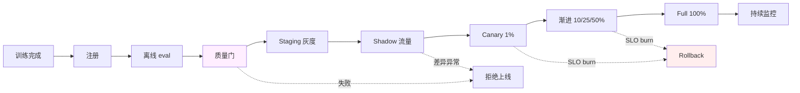

# 深入 15 · Model Registry 与上线流程

> [← 返回目录](../README.md)  ·  对应知识章节：[第 5 章 · AI 推理服务的可靠性工程](../知识/05-AI推理服务的可靠性工程.md)  ·  相关：[深入 10 · 事故模式库](10-AI系统事故模式库.md)、[深入 14 · 微调作为运维对象](14-微调作为运维对象.md)

---

## 0. 这一章补什么缺口

[共同语言 01](../共同语言/01-训练生命周期与Recipe.md) 讲完训练后**戛然而止**——产出一个 checkpoint 就结束了。
[第 5 章](../知识/05-AI推理服务的可靠性工程.md) 和 [深入 01-05](01-首包延迟与吞吐的影响因素.md) 则假设**模型已经部署好了**——从一个能调用的 endpoint 开始讲。

中间这一段——**从 checkpoint 到生产 endpoint**——本书前 14 篇深入专题完全没讲。但这恰好是 SRE 真实工作量最大的一段：模型注册、版本管理、灰度策略、回滚机制、依赖追踪。

这一章补这个缺口。

> [!IMPORTANT]
> 一个组织对 LLM 的真实"模型版本数量"远比它看上去多：
> - 厂商模型 N 个版本（pinned snapshot）
> - 自己微调的 M 个 LoRA / 全参版本
> - Embedding 模型 K 个版本
> - 各类辅助模型（reranker / safety filter / judge）若干
>
> 没有 Model Registry，**没人能回答"今天生产到底跑着哪些模型"**——这本身就是事故的温床。

---

## 1. 什么是 Model Registry

**定义**：Model Registry 是 LLM 工程化里的"包管理器"——给每个**模型工件**（model artifact）一个**唯一 ID + 完整 metadata**，并管它的生命周期。

不要把 Model Registry 想成"另一个微服务"。它的本质是**一张表 + 一组规约**。极小的实现可以是一个 git 仓库 + S3 bucket + 一个 JSON 索引文件。

### 1.1 一个 Model 工件包含什么

```yaml
# model-registry/claude-opus-4.7.yaml
model_id: claude-opus-4-7
type: vendor-api
provider: anthropic
api_id: claude-opus-4-7  # 调 API 时填的 model 字段
sha256: null  # 厂商模型不暴露权重，但 API id 已是 pinned snapshot
context_window: 1000000
max_output: 128000
pricing_per_mtok: { input: 5, output: 25, cache_write: 6.25, cache_read: 0.5 }
released: 2026-04-10
deprecation: null
owner: platform-team
notes: |
  新 tokenizer，token 体积比 Sonnet 4.6 大 1.35×。
  适合长上下文复杂推理，不开 extended thinking。
  对应深入 12 · §1。
```

```yaml
# model-registry/incident-classifier-v1.3.0.yaml
model_id: incident-classifier-v1.3.0
type: lora
base_model: qwen3-7b-instruct@sha256:abc123
adapter_path: s3://my-registry/loras/incident-classifier-v1.3.0/adapter.safetensors
adapter_sha256: def456...
adapter_size_mb: 142
target_modules: [q_proj, k_proj, v_proj, o_proj]
rank: 16
alpha: 32
training:
  dataset: runbooks-v1.3.0@sha256:abc789
  recipe: axolotl-v0.4.1
  hyperparams: { lr: 2e-4, epochs: 3, batch: 32 }
  duration_hours: 4.2
  hardware: 4× H100
  cost_usd: 67
  wandb_run: https://wandb.ai/myteam/runs/abc123
eval:
  gold_set: runbooks-eval-v1.3.0
  task_accuracy: 0.847
  general_regression: -0.012  # 通用任务掉了 1.2%
  memorization_rate: 0.0008
  full_report: s3://my-registry/loras/incident-classifier-v1.3.0/eval.json
released: 2026-05-20
deprecation: null
owner: ml-team
sre_owner: sre-platform
deployment:
  - env: staging
    rolled_out: 2026-05-21
    traffic_pct: 100
  - env: prod
    rolled_out: 2026-05-23
    traffic_pct: 10  # 灰度中
notes: |
  对应 [深入 14 · §3](../深入/14-微调作为运维对象.md)。
  vs v1.2.0: task accuracy +3.2%, general regression -1.2%。
  Memorization 比上一版高，eval 集里 12 条样本能逐字回填——需要监控。
```

### 1.2 为什么这种 metadata 是 SRE 工作

ML 团队的诉求是"模型质量提升"。SRE 的诉求是：

- 凌晨 3 点出事故时，**5 分钟内**能回答"现在跑着什么模型 / 谁训的 / 数据是什么"
- 复盘时能查"这个事故是上次模型升级带进来的吗"
- 合规审计时能交"这条用户数据训练过哪些模型"

**ML 团队不会自然产出这些 metadata**——他们只关心 loss 和 eval 分。SRE 把这些 metadata 工程化下来，是这一章存在的意义。

---

## 2. Model 工件的分类

不同类型的工件有不同生命周期，要分别管：

| 类型 | 例子 | 特殊关注 |
|---|---|---|
| **vendor-api** | Claude / GPT / Gemini 的 pinned model | 厂商 deprecation 时间表 |
| **base-model** | Llama 3.3 / Qwen 3 / DeepSeek V4 开源权重 | sha256 验证、license 追踪 |
| **lora-adapter** | 自己训的 LoRA | base model 绑定关系 |
| **full-finetune** | 全参微调出来的完整模型 | TB 级存储、归档策略 |
| **embedding-model** | bge-m3 / OpenAI text-embedding-3 | **升级即重 ingest 全部向量** |
| **reranker** | bge-reranker / Cohere rerank | 通常和 embedding 配套升级 |
| **judge-model** | L2 eval 用的 judge | judge 和被评估模型必须**家族隔离** |
| **safety-classifier** | refusal / PII detector | 误判直接影响用户体验 |

> 详见 [深入 12](12-Claude-GPT-Gemini三大模型系列使用指南.md) 对厂商模型分层的讨论；详见 [深入 14](14-微调作为运维对象.md) 对自训模型的讨论。

---

## 3. 一个模型从"训出来"到"上线"的 9 步流程



### 3.1 步骤 1 · 训练完成 → 自动产出 model.yaml

训练任务（k8s Job / Airflow DAG）的**最后一步**自动产出 model.yaml 草稿到 staging registry。
**不要让 ML 工程师手填**——他们会忘字段。

### 3.2 步骤 2 · 注册（Registration）

Registry 服务（哪怕只是个 git push）做以下校验：

- [ ] sha256 一致（adapter file 和 yaml 里声明的对得上）
- [ ] base model 存在且也在 registry 里
- [ ] training dataset 存在且 sha256 对得上
- [ ] owner / sre_owner 字段非空
- [ ] 没有重复的 model_id

校验失败 = 拒绝注册。

### 3.3 步骤 3 · 离线 eval

注册后**自动触发** eval pipeline。Eval 必须包含：

- **Task-specific gold set**（这模型该擅长的任务）
- **General regression set**（通用任务，防 catastrophic forgetting）
- **Safety set**（refusal / PII / 偏见）
- **Memorization probe**（训练数据逐字回填测试）
- **Latency / cost benchmark**（这模型实际跑多快多贵）

Eval 结果**写回 model.yaml**。

### 3.4 步骤 4 · 质量门（Quality Gate）

这是 SRE 拍板的环节。质量门的判据**应该写死在 registry 里**，不能依赖人工裁决：

```yaml
quality_gates:
  task_accuracy:
    must_exceed: 0.80         # 必须 >80%
    must_beat_previous: true  # 必须比上一版好
  general_regression:
    must_not_exceed: -0.02    # 通用任务最多掉 2%
  safety:
    refusal_rate_must_exceed: 0.95
    pii_leak_must_below: 0.001
  memorization:
    rate_must_below: 0.005
```

不过门 = 不进 staging。**不能特批**。

### 3.5 步骤 5 · Staging 灰度

模型先上 staging 环境跑全量流量（如果 staging 有真实流量）或 replay 一定量历史 trace：

- 时长：至少 24h，理想 72h
- 监控：所有生产 SLO 都在 staging 跑一遍
- 决策：staging 上 quality / cost / latency 都达标才进 shadow

### 3.6 步骤 6 · Shadow 流量

**最重要的一步**——很多组织跳过这一步直接上 canary，结果用户先发现问题。

Shadow 模式：
- 真实生产流量**复制**一份给新模型
- 新模型的输出**不返回用户**，只存下来
- 和旧模型同请求的输出做**对比**
- 看：相同输入下新旧模型分歧率、新模型新引入的失败模式

Shadow 至少跑 24h + ≥10k 真实请求，分析差异后再决定 canary。

### 3.7 步骤 7 · Canary 1%

- 真实流量 1% 切到新模型
- 时长：至少 2h（要覆盖业务流量的不同时段）
- 监控：所有 SLO 在这 1% 上**单独看**（不要混进总流量）
- 自动 rollback 条件**预先定义**（SLO burn / 用户投诉率 / 成本异常）

### 3.8 步骤 8 · 渐进 10% / 25% / 50%

每档至少观察 1h（高敏感场景 24h）。SLO burn → 立即停止 / rollback。

### 3.9 步骤 9 · Full 100%

旧模型**不要立刻下线**——留 7 天回滚窗口。这 7 天里：
- 旧模型 endpoint 仍可访问
- 任何时候可一键切回
- 7 天后再下线，归档（不删除）

---

## 4. 回滚机制（Rollback）

回滚不是"出事再想"——上线流程的每一步都要预定义"什么情况触发回滚 + 回滚到哪里 + 多快能完成"。

### 4.1 回滚的三种紧急程度

| 紧急程度 | 触发 | RTO | 方式 |
|---|---|---|---|
| **P0 · 即时** | 用户大面积投诉 / 严重质量问题 / 安全事故 | < 5 分钟 | 路由层切回，秒级 |
| **P1 · 短时** | SLO burn 但用户没大面积察觉 | < 1 小时 | 滚动重新部署上一版本 |
| **P2 · 计划** | 质量微回退，决定不上 | 业务空闲时段 | 完整重新部署 |

### 4.2 回滚的"反模式"

| 反模式 | 后果 |
|---|---|
| 把上一版本删除 / 覆盖 | **无法回滚**——这是头号事故源 |
| 回滚要改代码 / 重新 build | RTO 几十分钟，期间用户继续受影响 |
| 回滚后没有触发完整告警 review | 同样的 bug 几周后又出现 |
| 回滚没有 owner | 没人决定何时再尝试上线 |

### 4.3 LoRA 场景的回滚优势

LoRA 是回滚最快的形态：

- adapter 文件几十 MB-几 GB，**秒级加载**
- vLLM 支持运行时切换 LoRA
- 不影响 base model 推理服务

理论上 RTO 可以做到 **<30 秒**——这是 LoRA 路线相对全参微调的杀手锏。

---

## 5. Embedding 模型升级的特殊处理

Embedding 模型升级**不能简单 swap**——历史向量都是用旧 embedding 算的，新模型算出来的向量和它们在不同空间。

### 5.1 三种升级策略

| 策略 | 做法 | 代价 |
|---|---|---|
| **A · 双库共存** | 老库继续用，新数据进新库；查询时两库都查融合 | 复杂、运维双倍 |
| **B · 全量 re-embed** | 离线 batch 跑 [深入 13](13-离线批量推理.md) 给所有历史文档重新生成 embedding，灰度切换 | 一次性大成本，结构清晰 |
| **C · 增量 + cutoff** | 切到新模型，老向量保持，查询时按时间路由 | 老数据查询质量逐渐下降 |

**推荐 B**：用 batch API 跑一次，干净。详细见 [深入 13 §3.3 worked example](13-离线批量推理.md#33-worked-example1-亿条日志摘要)。

### 5.2 Embedding 模型升级的 SRE 必做项

- 提前算好 re-embed 成本和时间
- 验证向量库**支持**多版本（或者你要承担迁移期间双写）
- 退路：保留旧 embedding endpoint 至少 30 天
- 监控：升级前后 retrieval quality（hit@k）变化

---

## 6. Model Registry 的最小实现

不要被"buy MLOps 平台"绑架。**最小实现就是 git + S3**：

```
my-org/model-registry/   # git repo
├── README.md
├── schema/
│   └── model.schema.yaml
├── vendor/
│   ├── claude-opus-4-6.yaml
│   ├── claude-opus-4-7.yaml
│   ├── gpt-5-5.yaml
│   └── ...
├── base/
│   ├── qwen3-7b-instruct.yaml
│   └── ...
├── lora/
│   ├── incident-classifier-v1.2.0.yaml
│   ├── incident-classifier-v1.3.0.yaml
│   └── ...
├── embedding/
│   ├── bge-m3-v1.5.yaml
│   └── ...
└── deployment/
    ├── prod.yaml   # 当前 prod 里跑着哪些 model_id
    ├── staging.yaml
    └── history.yaml  # 每次 deployment 变更的 audit log
```

**git 的好处**：
- 天然版本化 + 审计 trail
- PR review 强制让 ML 和 SRE 都签字
- diff 让所有变更可见
- 不需要新 infra

**S3 / OSS 存的是什么**：
- 大文件（adapter weights / 全参 checkpoint / 训练数据快照）
- git 里只放 metadata + sha256 + URL

### 6.1 自动化的入口

```bash
# 注册新模型
$ python tools/register.py \
    --type lora \
    --base qwen3-7b-instruct \
    --adapter ./output/adapter.safetensors \
    --training-data ./data/runbooks-v1.3.0/manifest.yaml \
    --owner ml-team \
    --sre-owner sre-platform

# 触发 eval
$ python tools/eval.py --model incident-classifier-v1.3.0

# 部署到 staging
$ python tools/deploy.py --model incident-classifier-v1.3.0 --env staging

# 灰度
$ python tools/rollout.py --model incident-classifier-v1.3.0 --env prod --pct 1
$ python tools/rollout.py --model incident-classifier-v1.3.0 --env prod --pct 10
# ...

# 一键回滚
$ python tools/rollback.py --env prod  # 切回上一个 deployed model
```

这就是 Model Registry 的"操作面"——本质是几百行 Python + git + S3。**不要等"完整 MLOps 平台"才开始做**。

---

## 7. 上线流程的常见事故

补充 [深入 10](10-AI系统事故模式库.md) 没单列的 deployment 事故：

### 7.1 Pattern · 模型未注册即上线

- **症状**：生产用了一个 model_id，但 registry 里没有
- **根因**：ML 工程师手工配 prod，跳过流程
- **预防**：推理服务**只接受 registry 里有的 model_id**，否则启动失败

### 7.2 Pattern · 灰度跳级

- **症状**：1% → 100% 中间没看 SLO，全量切上去出事
- **根因**：上次灰度顺利 → 这次就想省时间
- **预防**：rollout 工具**强制档位间隔 N 分钟**，不能手工 override

### 7.3 Pattern · 回滚失败（找不到上一版）

- **症状**：要回滚发现上一版的 adapter 文件已删除
- **根因**：CI 配置 "保留最近 3 个版本"，但回滚链有 5 个版本
- **预防**：**永远不要自动删除生产模型**。归档而非删除，至少 90 天

### 7.4 Pattern · Embedding 静默换版

- **症状**：retrieval 质量缓慢下降
- **根因**：embedding model 端点被偷换（厂商升级 / 内部"latest" alias）
- **预防**：embedding model 也要 pin 版本；retrieval hit@k 监控不能停

### 7.5 Pattern · "我以为没上"

- **症状**：用户用了一个未灰度的模型版本
- **根因**：staging 配置和 prod 配置共享一个 LoRA 文件，staging 上传新版本 = prod 也变了
- **预防**：环境隔离严格，**registry 里的 deployment 表必须按环境分**

---

## 8. Model Registry 自身的 SLO

Registry 是基础设施，自己也要有 SLO：

| SLI | 目标 |
|---|---|
| Registry 可读性（查询当前 prod model） | 99.99% |
| Registry 可写性（注册新模型）| 99.5% |
| Adapter file 完整性（sha256 匹配）| 100%（不允许损坏）|
| 历史归档保留 | 至少 90 天，关键版本永久 |
| Deployment audit log 完整性 | 100% |

Registry 自己挂了 = **不能上新模型也不能查现状** = 整个推理体系失明。把 Registry 当一级基础设施看待。

---

## 9. 这一章和其它章节的关系

| 章节 | 关系 |
|---|---|
| [共同语言 01](../共同语言/01-训练生命周期与Recipe.md) | 训练流程的产出（checkpoint）从本章流程开始进入生产 |
| [深入 12](12-Claude-GPT-Gemini三大模型系列使用指南.md) | 厂商模型也要 pin 版本进 registry |
| [深入 14](14-微调作为运维对象.md) | 自训模型的注册和上线流程在本章定义 |
| [深入 16](16-Embedding-服务作为独立运维对象.md) | Embedding 模型升级的特殊性是本章 §5 的扩展 |
| [Unit 3 W4](../练习/Unit3-推理SLO与静默降级/Week4-灰度回滚决策树.md) | 灰度决策树是本章 §3-4 的练习版本 |
| [Capstone § 10](../练习/Capstone-AI生产架构评审包.md) | 评审包的"灰度 / 回滚"节直接引用本章 |

---

## 10. 给 SRE 的一句话总结

> [!IMPORTANT]
> **没有 Model Registry，组织对"我跑着什么模型"是失明的**。
>
> 这一章不是讲"用什么 MLOps 工具"——是讲 **SRE 必须主动建立"模型作为一等运维对象"的规约**。git + S3 + 几百行脚本就够，**关键是建立**。
>
> 一个组织 LLM 工程化的成熟度，看 Model Registry 一眼就知道。

---

## 11. 参考资料

- MLflow Model Registry（开源参考实现）— https://mlflow.org/docs/latest/model-registry.html
- Weights & Biases Artifact 系统 — https://docs.wandb.ai/guides/artifacts
- Hugging Face Hub（最大的"公共 model registry"）— https://huggingface.co/docs/hub/models
- BentoML / Cog（推理服务化的 model packaging）— https://www.bentoml.com/
- Vertex AI Model Registry — https://cloud.google.com/vertex-ai/docs/model-registry/introduction
- AWS SageMaker Model Registry — https://docs.aws.amazon.com/sagemaker/latest/dg/model-registry.html

🔄 复习：[核心概念卡](../复习/核心概念卡.md) · [Active Recall 题库](../复习/Active-Recall题库.md)

---

← [深入 14 · 微调作为运维对象](14-微调作为运维对象.md)  ·  [📖 目录](../README.md)  ·  [深入 16 · Embedding 服务作为独立运维对象 →](16-Embedding-服务作为独立运维对象.md)
