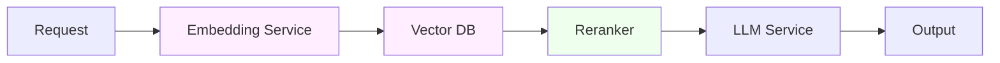

# 深入 16 · Embedding 服务作为独立运维对象

> [← 返回目录](../README.md)  ·  对应知识章节：[第 7 章 · 质量可观测性 ＋ Data Flywheel](../知识/07-质量可观测性与DataFlywheel.md)  ·  相关：[深入 06 · Eval Pipeline](06-Eval-Pipeline设计.md)、[深入 15 · Model Registry](15-模型注册表与上线流程.md)

---

## 0. 为什么 Embedding 值得单独一章

RAG 系统在 SRE 视角下不是"一个东西"，是**三个独立服务**的组合：



本书前 15 篇深入专题里：

- **LLM 推理服务** —— 第 5 章 + 深入 01/02/03/04/05 全方位覆盖
- **Reranker** —— 在 [深入 10 Pattern 10](10-AI系统事故模式库.md#pattern-10--rag-retrieval-noise-saturation-rag-检索噪声饱和) 简短提到
- **Embedding 服务 + Vector DB** —— 散落在 Unit 0 W2、深入 06，**没专章**

但实际工程里 **embedding 服务的 SRE 工作量和 LLM 推理几乎相当**——而且失败模式完全不同。这一章补这个缺口。

> [!IMPORTANT]
> 一个 RAG 系统失败的根因里，**embedding / vector 层占 60%+**，prompt / LLM 层只占 30-40%。但读者注意力分布通常反过来。这本身就是工程认知偏差。

---

## 1. Embedding 服务的本质和 LLM 推理的差异

| 维度 | LLM Inference | Embedding |
|---|---|---|
| **核心操作** | 自回归生成（一个 token 一个 token）| 一次 forward pass 出向量 |
| **延迟主导阶段** | Decode（带宽）| **Prefill only**（算力）|
| **单请求耗时** | 数百 ms 到几秒（取决于输出长度）| 通常 < 100ms（短文本）|
| **吞吐瓶颈** | HBM 带宽 | GPU FLOPs |
| **典型 batch size** | 16-64 | 256-1024（短文本可塞更多）|
| **模型规模** | 7B-700B | 通常 100M-7B |
| **量化敏感性** | 中等（int8 通常 OK）| **极敏感**（int8 量化常显著降低 retrieval 质量）|
| **升级影响** | 文本生成行为可能漂 | **全部历史向量作废** |

这些差异决定了 embedding 服务的 SRE 工作和 LLM 服务**不是同一个 playbook**。

---

## 2. Embedding 服务的形态选择

### 2.1 形态 A · 厂商 API（OpenAI / Voyage / Cohere）

| 厂商 | 模型 | 维度 | 价格 (per MTok) | 备注 |
|---|---|---|---|---|
| OpenAI text-embedding-3-small | small | 1536 | $0.02 | 通用首选 |
| OpenAI text-embedding-3-large | large | 3072 | $0.13 | 质量更高 |
| Voyage voyage-3 | - | 1024 | $0.06 | 强 retrieval 专项 |
| Cohere embed-v3 | English | 1024 | $0.10 | 强 multilingual |

> 价格 / 模型为 2026-05 快照。

**何时选**：流量 < 100M doc/月、不在意延迟、不能自建 GPU。

### 2.2 形态 B · 自建开源（bge / nomic / e5 / jina）

| 模型 | 维度 | 大小 | 强项 |
|---|---|---|---|
| BAAI/bge-m3 | 1024 | 568M | **多语言 + 中文，目前最强开源**|
| BAAI/bge-large-en-v1.5 | 1024 | 335M | 英文 |
| nomic-embed-text-v1.5 | 768 | 137M | 长文本（8k）|
| intfloat/e5-mistral-7b-instruct | 4096 | 7B | LLM-based，最强但贵 |
| jina-embeddings-v3 | 1024 | 570M | multilingual + 长文档 |

**部署技术栈**：
- **Text Embeddings Inference (TEI)** by Hugging Face —— 类似 vLLM 但专为 embedding
- **vLLM** 也开始支持 embedding model
- **FastEmbed** —— ONNX runtime，CPU 友好

**何时选**：流量大、数据合规、需要中文 / 垂直领域专项。

### 2.3 形态 C · 自训 / 微调 embedding

- 对垂直领域（医疗 / 法律 / 内部知识）做 contrastive fine-tune
- 通常基于 bge / e5 做 LoRA-style 微调
- 见 [深入 14](14-微调作为运维对象.md)

**何时选**：领域和通用模型差距大 + 有足够标注数据（triplet 数据集）。**多数公司不需要**。

---

## 3. Embedding 服务的 SLO

完全不同于 LLM SLO 的指标集：

### 3.1 性能 SLI

| SLI | 目标 | 报警 |
|---|---|---|
| **Embedding latency p99** | < 100ms（短文本）/ < 500ms（长文本）| > 2× 目标 |
| **Throughput** | 取决于规模 | > 80% 容量持续 1h |
| **Error rate** | < 0.1% | > 0.5% |
| **GPU utilization** | 60-80% | < 30% 或 > 90% 都调查 |

### 3.2 质量 SLI（关键且独特）

LLM 服务的质量看 assertion / judge。Embedding 服务的质量看 **retrieval 质量**——必须有这套指标：

| SLI | 测量方法 | 目标 |
|---|---|---|
| **Hit@k** | gold set 的 top-k 包含正确答案的比例 | > 90%（k=10）|
| **MRR** (Mean Reciprocal Rank) | 1/正确答案排名的平均 | > 0.7 |
| **NDCG@k** | 排序加权的命中率（排在前面的正确结果比排在后面的得分更高） | > 0.8 |
| **Embedding drift** | 同一 batch 文档在不同时间的 embedding 距离 | < 阈值（应该 0，除非模型变了）|
| **Cold corpus retrieval** | 新加入的文档能否被检索到 | > 95% |

### 3.3 一致性 SLI（极重要，常被忽略）

| SLI | 含义 |
|---|---|
| **Embedding determinism** | 同样输入两次得到的 embedding 是否完全相同？（应该）|
| **Cross-region consistency** | 同一模型不同区域服务 embedding 是否一致？|
| **Version consistency** | Registry 里 pin 的模型版本和实际服务用的是同一个吗？|

不一致 = 同一段文本的查询向量和入库向量不在同一空间 → 查不到。这是 RAG 系统**最隐蔽**的 bug。

---

## 4. Vector DB 作为 SRE 工程对象

Embedding 算出来的向量存在 vector DB 里。Vector DB 本身是另一个 SRE 关注点：

### 4.1 主流 Vector DB 形态

| 形态 | 例子 | 优势 | 劣势 |
|---|---|---|---|
| **嵌入式** | SQLite + sqlite-vec, FAISS | 简单、单机、零运维 | 单点、规模有限 |
| **服务化开源** | Qdrant, Weaviate, Milvus, Chroma | 可扩展、有 API | 要运维 |
| **关系库扩展** | pgvector, MySQL-vector | 复用现有 DB | 性能比专用差 |
| **托管** | Pinecone, Vertex AI Vector Search, Azure AI Search | 全托管 | 贵、锁定 |

### 4.2 容量规划

向量库容量算法：

```
存储 = 向量数 × (维度 × 4 bytes + metadata 大小)
索引内存 = HNSW 索引大小 ≈ 向量数 × 维度 × 8 bytes（含 graph 链接）
```

> HNSW（Hierarchical Navigable Small World）是向量库最常见的索引结构——把向量组织成多层图加速相似搜索，代价是额外占用内存（约原始向量的 2×）。

**Worked example**：1 亿条文档 × 1024 维 float32：
- 原始向量：100M × 4096 byte = **400 GB**
- HNSW 索引（在内存）：~800 GB
- 单机 RAM 不够 → **必须分片或量化**

**两种解决方案**：
- **量化向量**（int8 / 二值化）：精度损失换 4-32× 内存节省
- **分片**：多机分区 + 路由

### 4.3 Vector DB SLO

| SLI | 目标 |
|---|---|
| Query latency p99 | < 50ms（top-k=10）|
| Index rebuild time | < 1h（满库重建）|
| Write throughput | 取决于规模 |
| Recall@10 vs ground truth | > 95% |
| Index freshness | 新写入到可查询的延迟 |

---

## 5. Embedding 升级的"系统级事故"

这是本章**最重要的一节**——embedding 升级的成本和风险，**远高于**LLM 升级。

### 5.1 为什么严重

LLM 升级：换 endpoint，旧的请求记录仍然能解读。**无状态切换**。

Embedding 升级：
- 老向量是旧模型算的
- 查询用新模型算的
- 两者**在不同向量空间**——余弦距离没意义
- 结果：retrieval 突然全无关

**这是不可逆的工程操作**（除非保留旧 embedding endpoint 让历史查询用）。

### 5.2 升级前必须回答的 7 个问题

1. **存量有多少向量？** （决定 re-embed 成本）
2. **每天有多少新文档进来？** （决定迁移时长）
3. **能容忍多久的"双库共存"？** （决定迁移策略）
4. **维度变了吗？** （维度变 = 完全推倒重建索引）
5. **新模型的 retrieval quality 真的更好吗？** （gold-set eval 验证）
6. **能保留旧 embedding endpoint 多久作为退路？**
7. **触发 re-embed 后，下游应用要不要也调整？** （阈值 / 排序逻辑可能要改）

### 5.3 三种迁移策略对比

| 策略 | 描述 | 成本 | 复杂度 | 适用 |
|---|---|---|---|---|
| **A · 全量 re-embed + 灰度** | 用 [深入 13](13-离线批量推理.md) batch 模式把所有文档重新 embedding，新库就绪后灰度查询切过去 | 一次性大成本 | 中 | **首选**——清晰、可回滚 |
| **B · 双库共存 + 查询融合** | 老库继续接老向量，新库接新向量，查询时合并 | 长期运维双倍成本 | 高 | 必须保留老向量的合规场景 |
| **C · 增量切换 + cutoff** | 切点之后用新模型，老向量留库；查询时按时间路由 | 低，但 quality 长期受损 | 低 | 不推荐，技术债 |

### 5.4 全量 re-embed 的 Worked Example

**场景**：1 亿条文档从 OpenAI text-embedding-3-small 切到 bge-m3

- 总文档：100M
- 平均长度：500 token
- 总 token：50B

**用厂商 API**：
- text-embedding-3-small $0.02 / MTok → **$1000**
- 通过 [深入 13 Batch API](13-离线批量推理.md) 折半 → **$500**

**自建 bge-m3**：
- 单 H100 跑 bge-m3：~50k token/s
- 50B / 50k = 1M 秒 = **278 卡时**
- spot H100 $2/h → **$556**

成本接近，但**自建后续推理成本是 0**（原 API 每次查询都要付钱）。

**SRE 工作**：
- 设计 batch pipeline（输入文档 stream，输出向量到新库）
- Checkpoint 机制（处理到第 N 条，中断后继续）
- 进度监控（"已 re-embed 47.2%"）
- **不要全停服**——双写一段时间，等新库就绪后切查询

---

## 6. RAG 系统的端到端可观测性

把 embedding + vector + reranker + LLM 看成一个系统，trace 必须串起来：

```
trace_id: ...
spans:
  - name: query_embedding
    model: bge-m3@sha256:abc
    latency_ms: 12
    input_tokens: 47
  - name: vector_search
    db: qdrant-prod
    top_k: 50
    latency_ms: 8
    recall_score: 0.92
  - name: rerank
    model: bge-reranker-v2-m3@sha256:def
    input_count: 50
    output_count: 10
    latency_ms: 35
  - name: llm_generate
    model: claude-sonnet-4-6
    input_tokens: 6234
    output_tokens: 487
    latency_ms: 1840
```

**SRE 的可观测性 checklist**：
- [ ] 每个 span 都有 model_id + sha256
- [ ] 每个 span 都有自己的延迟 SLI
- [ ] 端到端延迟 = sum(spans) + overhead
- [ ] 错误归因：哪一 span 失败了？降级了？
- [ ] 模型升级时，能按 span 看历史趋势

---

## 7. Embedding 专属的事故模式

补充 [深入 10](10-AI系统事故模式库.md) 没覆盖的 embedding 专属 pattern：

### 7.1 Pattern · Embedding Version Mismatch

- **症状**：retrieval 突然全 miss
- **根因**：查询端的 embedding 模型和入库端的不一样（一个升级了，另一个忘了）
- **检测**：embedding model 版本作为 SLI 强一致性检查
- **预防**：embedding model 不能用 latest alias，必须 pin sha256

### 7.2 Pattern · Tokenization Mismatch

- **症状**：同一文档分两次 embed 结果不同
- **根因**：tokenizer 版本变了（罕见但发生过）或 normalization 配置不同
- **预防**：embedding model 和 tokenizer 一起 pin

### 7.3 Pattern · Vector DB Index Corruption

- **症状**：某些查询结果错乱（应该返回 A 返回 B）
- **根因**：索引重建中断 + 不一致状态 / 磁盘 bit flip
- **检测**：定期跑 gold set，hit@k 突降
- **恢复**：从备份恢复 / 全量重建

### 7.4 Pattern · Cold Document Black Hole

- **症状**：新加入的文档查不到
- **根因**：embedding 服务挂了但写入流水线还在 / 写入了但索引没刷新
- **检测**："新写入到可查询"延迟 SLI 必须监控
- **预防**：写入流程加端到端校验（写完立刻查一次）

### 7.5 Pattern · Query Distribution Shift

- **症状**：retrieval quality 整体下降但 embedding model 没变
- **根因**：用户查询分布变了，向量库里的文档已经不够代表性
- **检测**：定期对比"查询的 embedding 分布"vs"文档 embedding 分布"
- **应对**：扩充文档库 / 重新选 chunk 策略

---

## 8. 给 SRE 的 Embedding 服务 SLO 模板

```markdown
## Embedding 服务 SLO · <service 名>

### Service definition
- Embedding model: <name>@<sha256>
- Tokenizer: <name>@<version>
- Vector DB: <type, version>
- Owner: <ML / SRE>

### Performance SLI
| SLI | 目标 | 报警 |
|---|---|---|
| Embedding latency p99 | < 100ms | > 200ms |
| Vector search p99 | < 50ms | > 100ms |
| End-to-end retrieval p99 | < 200ms | > 500ms |
| Throughput | > N docs/s | < 60% N |

### Quality SLI
| SLI | 目标 | 报警 |
|---|---|---|
| Hit@10 on gold set | > 90% | < 85% |
| MRR on gold set | > 0.7 | < 0.65 |
| Embedding drift | 0 | 任何非零 |
| Cold document retrievability | > 95% | < 90% |

### Consistency SLI
| SLI | 目标 |
|---|---|
| Cross-region embedding consistency | 100% |
| Query/ingest model version match | 100% |
| Index integrity (random sample re-check) | > 99.99% |

### Capacity SLI
| SLI | 目标 |
|---|---|
| Index size vs RAM | < 80% |
| Daily new vectors growth | < 预算 |
| Re-embed budget for upgrade | 预算 + 时间 |
```

---

## 9. Embedding / Vector / RAG 的 30 分钟评审 checklist

在 [附录 E 模板 9](../附录/E-模板库.md) 通用 AI 评审基础上，**RAG 系统额外**要问：

- [ ] Embedding model 版本 pin 了吗？sha256 是？
- [ ] Vector DB 有备份策略吗？RTO/RPO？
- [ ] 查询和入库用的是同一个 embedding 模型？怎么强制？
- [ ] Hit@k 监控在哪个 dashboard？多久更新？
- [ ] Embedding 模型升级流程文档化了吗？最近一次升级是什么时候？
- [ ] 多语言 / 长文档的特殊情况测过吗？
- [ ] Cold start：新加入的文档多久能被查到？
- [ ] Rerank 在哪一步插入？模型是什么？
- [ ] Reranker 失败时的降级策略？
- [ ] 端到端 trace 串起来了吗？

---

## 10. 给 SRE 的一句话总结

> [!IMPORTANT]
> **RAG 系统不是"一个东西"**。Embedding 服务、Vector DB、Reranker、LLM 是**四个独立运维对象**，每个都有自己的 SLO / 容量 / 升级流程 / 事故模式。
>
> 把 RAG 当成一个整体来盯，等于没盯。
>
> 这一章是 [深入 06 Eval Pipeline](06-Eval-Pipeline设计.md) 的 RAG 视角补充——eval 是出口，但出口前的三个独立服务每一个都要被 SRE 严肃运维。

---

## 11. 参考资料

- BGE 模型系列 — https://huggingface.co/BAAI
- Text Embeddings Inference (TEI) — https://github.com/huggingface/text-embeddings-inference
- Qdrant 官方文档 — https://qdrant.tech/documentation/
- Pinecone Benchmark / 容量规划 — https://www.pinecone.io/learn/
- MTEB Benchmark（embedding 模型评测）— https://huggingface.co/spaces/mteb/leaderboard
- ann-benchmarks（vector DB 性能基准）— https://ann-benchmarks.com/

🔄 复习：[核心概念卡](../复习/核心概念卡.md) · [Active Recall 题库](../复习/Active-Recall题库.md)

---

← [深入 15 · Model Registry 与上线流程](15-模型注册表与上线流程.md)  ·  [📖 目录](../README.md)
