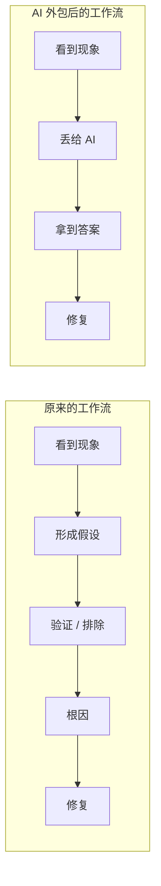

# 第 1 章 · AI 时代工程师的真实处境

> 所属：第一部分 · 理念  ·  [← 返回目录](../README.md)

大模型让很多工作从"需要你思考"变成"需要你确认"。这看似是效率提升，实则是一种**认知外包**——你把判断、推理和耐心逐步交给模型，自己只保留"看起来对"或"再试一次"的点击权。

这本书关心的不是 AI 本身，而是**工程师在这场外包里剩下什么**。

## 为什么要专门讨论认知外包

认知外包不是第一次发生：计算器接管了算术，IDE 接管了记忆 API，搜索引擎接管了背诵事实。它们没有削弱工程师，因为被外包出去的都是**外围记忆**。这一次不同——被外包出去的，是工程师的**核心能力**。

具体地说，**三种能力正在被悄悄转移到模型那里，而一旦转移就很难收回**：

- **推理链条**：你从现象推导根因的能力越来越弱。凌晨三点接到告警——CPU 打满。以前你会看 top、定位进程、上 strace、发现 fd 泄漏、追到代码。现在你把告警贴给 AI，它回一句"重启服务"，你照做了，好了。下次同样的 fd 泄漏你还是不会查——因为中间那条"假设 → 验证 → 排除"的链条被 AI 的一行回答折叠掉了；而折叠掉的那几步，恰好是推理能力生长的地方。
- **第一性判断**：你不再判断"这个方案好不好"，只判断"AI 给的能不能跑"。AI 建议你用 Redis 做分布式锁，你试了能跑就上了——但没想过这个场景其实用数据库行锁就够，多引入一个 Redis 反而多了一个故障点。好坏的评估标准从"是否符合系统的本质约束"退化为"有没有跑通"——后者只要跑得起来就行，不需要你理解系统为什么能跑。
- **慢思考耐受力**：你习惯了 30 秒得到答案，失去了坐两小时啃一个问题的耐心。以前你能花一下午读完一篇 Borg 论文，把调度模型在脑子里跑通；现在读到第三页就想"让 AI 总结一下吧"。你不再有"我今天就是要把这件事想明白"的坚持，因为总有一个更快的出口。

这三种能力是**工程判断力的底层**。磨损后，表面上你还能工作、效率甚至更高，但在以下三种场景会暴露：

1. **AI 给错了但看起来对** —— AI 建议你把超时从 5s 改成 30s 来"修复"偶发 504。看起来合理，实际上掩盖了下游数据库连接池耗尽的真正问题。两周后连接池彻底打满，全站挂。你失去了识别"治标不治本"的本能。
2. **问题无法被 AI 解** —— 新上线的内部 RPC 框架出了诡异的连接泄漏，没有 Stack Overflow 帖子、没有训练数据覆盖。AI 只会给你通用建议"检查连接池配置"。你失去了独立攻坚的肌肉——那种"我就不信搞不定"的韧劲。
3. **需要你承担后果** —— 事故发生时，AI 不会被 paged，你会。凌晨两点 P0 告警响了，你要在 5 分钟内决定是回滚还是扩容——这时候再补判断力已经来不及。

下面这张图把"工作流折叠"这件事画出来：

右边那条路每次走都省时间。问题是：**左边那条路才是能力生长的路径**。你每次选右边，都是在短期效率和长期能力之间做一次隐性的权衡——而你很可能意识不到自己做了权衡。

## 这本书不讨论什么

为了避免读错预期，几个明确的边界：

- **不是反 AI 的**。AI 确实在加速很多事，能用就用。这本书要解决的是**怎么用而不让自己废掉**，不是"用还是不用"。
- **不是 prompt 技巧手册**。能力差异很少来自 prompt 写得漂不漂亮，更多来自你判断 AI 何时可靠、看到错时能指出错在哪。
- **不是通用认知科学综述**。它只关心 SRE / 架构师这一类工程师，在日常使用 AI 的路径里如何不丢掉判断力。
- **不能替代练习**。读完这本书不会让你自动变成 AI-native SRE。真正的变化来自书的 Track B 部分——反复做"不用 AI 的"动作（预测、复盘、合成），把肌肉重新长回来。

## 为什么这个问题现在才被正视

AI 辅助工具不是第一次出现。代码补全、静态分析、运行时诊断早就在工程师身边，它们都没有引起这类讨论，是因为**它们的粒度小**——你看得到每一步，判断权始终在你手里。

大模型改变了粒度：

- **补全一行** → 你仍然在逐行审视，判断粒度 = 1 行
- **写一段方案** → 你开始"整段签字"，判断粒度 = 10-30 行
- **Agent 自己跑命令、改文件、报告结果** → 判断粒度 = 1 个任务

当一个决策的粒度超过你能一眼扫完的边界，你就只能用"看起来对/不对"来评估——而这正是判断力退化的开始。"用 AI 会让我变笨吗"这个问题之所以在近两年才被严肃提出，不是因为人变脆弱了，而是因为**工具正在越过那个关键粒度的临界线**。

## 接下来

- **下一章**：[第 2 章 · SRE 架构师的角色迁移](02-SRE架构师的角色迁移.md) —— 认清外包风险之后，SRE 架构师这个角色本身要怎么变
- **关联练习**：[Unit 0 · AI 大模型上手](../练习/Unit0-AI大模型上手/总览.md) —— 重建 AI 工作流的最朴素起点
- **深入专题**：[深入 09 · 何时不该用 AI](../深入/09-何时不该用AI.md) —— 具体场景判断

🔄 复习：[核心概念卡](../复习/核心概念卡.md) · [Active Recall 题库](../复习/Active-Recall题库.md)

---

下一章 → [第 2 章 · SRE 架构师的角色迁移](02-SRE架构师的角色迁移.md)
