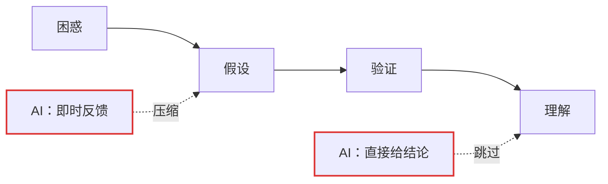

# 第 3 章 · 学习能力才是新的护城河

> 所属：第一部分 · 理念  ·  [← 返回目录](../README.md)

在一个知识半衰期按月计算的领域里，"学过什么"的价值在快速折旧。你 2024 年花两周搞懂的 vLLM 调度策略，2025 年底已经被 V1 引擎完全重写。真正值钱的是**学习速度**——能在一周内把一个陌生领域的边界、失败模式、判断标准搭出来。

这本书把"学习能力"当作和"SRE 架构能力"同等重要的第二条主线（Track B），原因正是：前一条线的知识会过期，而后一条线决定了你能不能跟上——它是你追上技术更新速度的**元能力**。

## 学习能力是什么

这里不用宽泛的"学习能力"，而是一个更窄的定义：

> **主动构建心智模型（mental model）的能力，以及承受"从困惑到理解"之间那段黑暗期的耐力。**

这个定义有两个关键词：

- **主动构建心智模型**：不是读完能复述，而是能在脑子里搭出一个模型——这个模型在遇到新现象时会自己推出预测，在预测错了时能自己修正。举个例子：你读完 Raft 论文后，有人问"如果 leader 和一个 follower 同时网络分区了会怎样"，你不需要翻论文，脑子里的模型会自动推演出答案。只有把输入的信息编织成模型，学习才真正发生；否则只是把内容换了个地方存着——从论文搬到笔记里，和从论文搬到 AI 的回答里，本质没区别。
- **忍受黑暗期的耐力**：从"第一次听说这个概念"到"能讲清楚它怎么运作"之间，中间那段时间叫做困惑期——你觉得自己什么都没懂，每个术语都模糊，看三遍还是一头雾水。就像你第一次读 Paxos 论文时的感觉。耐心待在这段黑暗里是学习的关键动作，绝大多数人放弃在这里——然后去问 AI "用大白话解释一下 Paxos"，拿到一个自以为懂了的幻觉。

## 为什么 AI 正在削弱这个能力

AI 不是单方向地削弱学习能力。它从两头挤压：

- **前端（输入端）**：AI 直接把结论递给你。你跳过了"困惑 → 假设 → 验证"这条建模通路，拿到了答案却没长出模型。就像你问 AI "Kubernetes HPA 的 stabilizationWindowSeconds 是干嘛的"，它给你一段完美解释，你点头说"哦懂了"——但下次遇到 HPA 抖动时你还是想不到这个参数，因为你从没在困惑中自己把它和"防止频繁缩容"这个需求连起来过。读过但没学会，和看完电影但讲不出剧情是一回事。
- **后端（耐力端）**：AI 把困惑期从数小时压缩到数秒。几次之后，你逐渐无法忍受任何一段没有即时反馈的思考——读一篇论文超过 10 分钟没看懂就想"算了让 AI 总结"。哪怕那段思考本来应该花你 20 分钟去想清楚，而那 20 分钟正是心智模型生长的窗口。

两头一挤，学习动作就被抽空。表面上你还在"学"，但缺了建模和耐力这两个核心动作，长出来的不是心智模型，而是一堆松散的术语和"AI 会告诉我"的条件反射。

## 这一章主张的不是什么

几个需要排除的误解：

- **不是反对用 AI 学习**。AI 是极好的学习加速器——前提是你用它时知道自己在做什么。"AI 告诉我答案"和"我用 AI 检查我的假设"是完全不同的两种使用方式。
- **不是要你装成没有 AI**。Track B 的练习里刻意要求"不用 AI 写产出"，不是出于道德洁癖，是因为**只有强制关掉工具才能让被萎缩的肌肉重新工作**；平时怎么用都行。
- **不是学习方法论综述**。番茄工作法（Pomodoro）、费曼学习法、SQ3R——这些方法本章都不讲。本章关心的只是 AI 时代特有的学习能力损耗与重建。

## Track B 具体在训练什么

Track B 的目标非常具体：**重建从困惑到理解的那条通路，并延长你能待在困惑里的时间**。配套的三个固定动作：

- **预测（每日 5 分钟）**：看监控或读材料前，先写下你对即将看到什么的预测。看完对比预测与真实，差距就是你 mental model 的漏洞。
- **复盘（周度）**：这一周自己独立想清楚了什么、哪些直接问了 AI、如果没有 AI 你会怎么做——把这些写下来，让差距显性化。
- **合成（Unit 结束时）**：把一个单元学到的东西整合成一份自己的架构文档、Runbook 或决策树，不借助 AI 完成第一版。合成就是强制建模的动作。

这三个动作看起来都很朴素。但它们的本质都是**强制你留在困惑里**——而留在困惑里，才是学习能力能长回来的唯一路径。

## 接下来

- **进入第二部分**：[第 4 章 · 系统架构 ＋ 复合 AI 可靠性数学](../知识/04-系统架构与复合AI可靠性数学.md) —— 从理念进入具体的六维能力画像
- **关联练习总览**：[练习第 10 章 · 三个核心训练动作](../练习/10-三个核心训练动作.md) —— Track B 三个动作的详细做法
- **关联附录**：[附录 A · 每月自检表](../附录/A-每月自检表.md) —— 衡量学习能力是否真的在恢复

🔄 复习：[核心概念卡](../复习/核心概念卡.md) · [Active Recall 题库](../复习/Active-Recall题库.md)

---

上一章 → [第 2 章 · SRE 架构师的角色迁移](02-SRE架构师的角色迁移.md)
下一部分 → [第二部分 · 知识（能力画像六维）](../知识/04-系统架构与复合AI可靠性数学.md)
