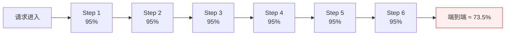
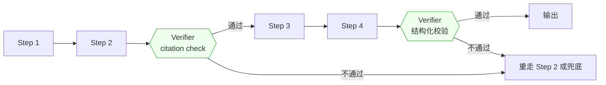

# 第 4 章 · 系统架构 ＋ 复合 AI 可靠性数学

> 所属：第二部分 · 知识  ·  [← 返回目录](../README.md)

经典架构设计——失败域、容量、多活、tradeoff 表达——在 AI 时代**没有过时**。但架构师要在这些能力之上，多掌握一件事：对复合 AI 系统算一笔**可靠性账**。这一章说的就是这笔账怎么算、为什么不算这笔账的系统上线就是赌博。

## 为什么需要复合 AI 可靠性数学

一个典型的 AI Agent 业务链路看起来像这样：**理解意图 → 检索上下文 → 调工具 A → 调工具 B → 生成回复 → 结构化输出校验**。6 步看起来不多——传统微服务调用链 6 跳也很常见。但每一步都不是确定性的——LLM 的单步正确率就算做到 95%（已经很高了），链路的端到端正确率是：

$$
P_\text{end-to-end} = 0.95^6 \approx 0.735
$$

也就是说，每 4 次交互中就有 1 次以上会在某一步出错。这个数字对 SRE 来说触目惊心——传统服务 73.5% 的成功率连 1 个 9 都不到。业务同学看到的"AI 好像老出问题"，背后的数学就是这条乘积曲线。

这个结果反直觉，但完全可推导。架构师如果不在设计阶段就把这条曲线画出来，业务团队会按**单步可靠性**的直觉去堆 step 数——结果就是上线即灾难。

推论也很直接：

> **每多一步，都要有明确的边际收益作交代——否则就是在烧端到端可靠性。**

## 架构师因此必须做的两件新工作

基于上面的乘积数学，架构师在 AI 系统设计里有两件传统架构设计不包括的新工作：

- **Step 预算**：一条业务链路**最多**容忍多少步？每多一步的**边际收益**是什么？超过预算的 step 必须裁剪或合并。这和你熟悉的 P99 latency budget、后端的 QPS budget 是同一类工程语言——只是约束的维度换成了"步数"。就像你不会让一个 API 调用链无限加 hop 一样，Agent 链路也不能无限加 step。
- **Verifier 插入点**：在哪里加**校验节点**（retrieval 核验、citation check、LLM-as-judge、结构化输出校验），能把累积误差在某一点截断、重置？打个比方：传统流水线里你会在关键节点加 health check，这里的 verifier 就是 AI 链路里的 health check——只不过它检查的不是"服务活着没"，而是"输出对不对"。Verifier 本身也有代价（延迟、成本、假阳性），所以它的位置和数量都要算。

Verifier 的工程价值在于：把原本乘积衰减的链路，切成几段"短乘积"相加；每段乘积长度控制住，端到端可靠性就能救回来。

## 这一章不讨论什么

几个需要提前界定的边界：

- **不是讲概率论基础**。上面的乘积公式是基础高中数学，这里只拿来用。读者需要的是"能在方案评审时把这张图画出来"，不是"能证明概率的独立性假设"。
- **不是替代单机可靠性工程**。单点 SLA、失败域、多活——这些仍然要做。复合可靠性**建立在**单步可靠性之上，不是替代它。
- **不是讲模型训练**。这里关心的是"模型已经给定，链路怎么设计"；模型本身怎么训出来超出架构师职责。

## 传统"单模型 SLO"为什么不够用

传统在线服务的可靠性计算是**串联式的**，每个微服务单独算 SLA、相乘得到整体——这套方法在 AI 系统里依然适用，但漏掉了两件事：

- **语义级错误不计入 SLA**。微服务返回 200 就算成功，但在 LLM 里 200 响应可能内容是错的。单看 HTTP 层的 SLA 永远看不到这类问题。
- **步数会被业务团队随意加**。微服务拓扑里加一个 call 是显性的；Agent 链路里加一个工具调用或中间 reasoning step，几行代码就行。**架构师不把 step 预算列出来，它就不存在**。

所以这一章要建立的不是一套替代品，而是一套**叠加层**：在传统 SLO 之上，加一层"链路级可靠性账"。

## 接下来

- **关联练习**：[Unit 4 · 复合 AI 可靠性数学](../练习/Unit4-复合AI可靠性数学/总览.md) —— 把 Step 预算与 Verifier 做成可评审的文档
- **下一章**：[第 5 章 · AI 推理服务的可靠性工程](05-AI推理服务的可靠性工程.md) —— 单步可靠性怎么做（链路可靠性的必要前提）
- **深入专题**：[深入 10 · AI 系统事故模式库](../深入/10-AI系统事故模式库.md) —— 真实发生的链路级事故

🔄 复习：[核心概念卡](../复习/核心概念卡.md) · [Active Recall 题库](../复习/Active-Recall题库.md)

---

上一部分 → [第 3 章 · 学习能力才是新的护城河](../理念/03-学习能力才是新的护城河.md)
下一章 → [第 5 章 · AI 推理服务的可靠性工程](05-AI推理服务的可靠性工程.md)
