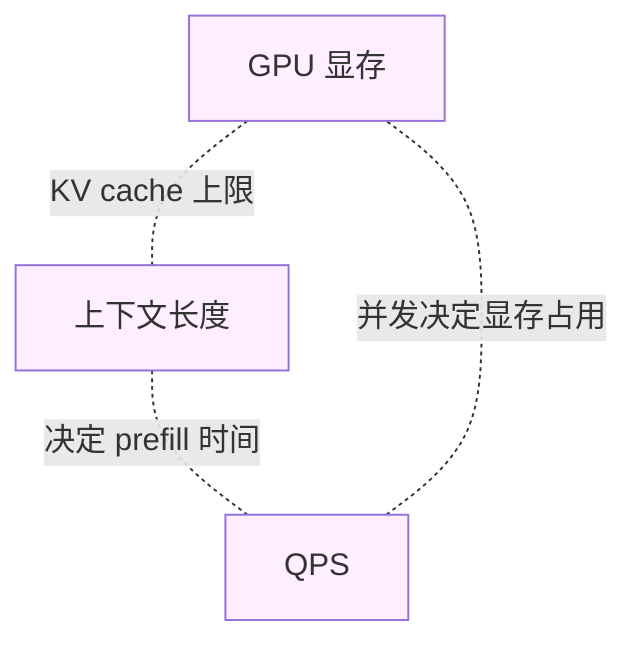

# 第 5 章 · AI 推理服务的可靠性工程

> 所属：第二部分 · 核心能力  ·  [← 返回目录](../README.md)

给 LLM 推理服务做 SLI / SLO，本质上和给任何在线服务做 SLI / SLO **一样**——只是**指标集变了**。就像从运维 MySQL 切到运维 Kafka 时你要换一套指标（从 QPS/慢查询 换成 consumer lag/partition skew），切到 LLM 推理也一样——指标集必须换，但方法论不变。这一章做的事就是把这套新指标集摆到桌面上：要测什么、怎么测、哪些指标你以为有效其实会骗你。

## 为什么推理服务的指标集必须换

传统在线服务的 SLI 大致是：可用性（HTTP 成功率）、延迟（p50/p99）、吞吐（QPS），加一点错误率。这套在 LLM 推理服务上**不够用**——不是错，是漏得厉害。

原因是 LLM 有几个传统服务没有的特性：

- **"成功"不等于"正确"**：HTTP 200 的响应，内容可能是错的、幻觉的、格式不对的。传统 SLI 根本看不见这件事。
- **延迟是分段的**：一次请求由 prefill 和 decode 两段组成，TTFT（首 token 延迟）和 token 吞吐是两个完全不同的现象；把它们混成一个 p99 latency 就丢信息。
- **容量是三维的**：请求数 × 上下文长度 × GPU 显存，三者互相约束；只盯 QPS 是从一个三维空间里只看一维。
- **故障会无声发生**：bf16/fp32 失配（bf16 = Brain Float 16，一种节省显存但精度比 fp32 低的浮点格式——两者混用且不审慎处理精度转换时，数学会悄悄出错）、kernel 非确定性、编译器改动，能让模型数学悄悄出错而指标全绿。传统 SLI 连它出错都不知道。

所以必须换。换的是指标集，不是方法论。

## 推理服务 SLI 的三类新指标

推理服务至少要覆盖以下三类：

- **延迟类**：
    - **TTFT (Time To First Token)**：用户按下回车到看到第一个 token 的时间——直接决定体感
    - **Token 吞吐**：生成阶段每秒多少 token——决定整段回答的快慢
    - **尾部延迟**：p95、p99、p999——长尾是分级事故信号
- **容量类**：
    - 并发请求数、上下文长度分布、GPU 显存占用率，三者必须**一起看**
    - 单看 QPS 在长 context 场景下会严重低估压力
- **质量类**：
    - 任务专属的 **assertion 通过率**（比如"结构化输出里该有 X 字段"）
    - **Judge 模型打分** 与人工打分的**对齐度跟踪**——判定 judge 自己还可不可信

关键是**三类齐备**。缺质量类，你看不到模型在退化；缺容量类，你会在长 context 场景被打穿；缺延迟类，你会对体感瞎。

## 容量规划必须画的那张三角图

传统容量规划看 QPS 就够了。LLM 推理服务的容量是一个三维约束系统：

- **GPU 显存 × 上下文长度**：KV cache 随 context 长度线性增长，显存决定你能塞多少并发请求
- **上下文长度 × QPS**：context 越长 prefill 越贵，QPS 上限随 context 长度衰减
- **QPS × GPU 显存**：并发数直接决定同时占用的 KV cache，吃回显存

**设计时这三者必须同时出现在一张图上**。只看其中一边做规划，上线就会在另一边被打穿——典型场景是"按短对话算的 QPS 容量，上了多轮 agent 就 OOM"。

## 静默降级：这维度里最容易被忽视的盲点

**静默降级**（silent regression）指的是：模型数学悄悄出错，但 dashboard 全绿——因为 LLM 有一定的自我纠错能力，会**掩盖**底层故障。这就像一个数据库的索引坏了但查询还能走全表扫描——功能没挂，但质量在偷偷掉。典型触发原因包括：

- **bf16/fp32 失配**：精度转换在某些 kernel 里处理不一致
- **编译器怪癖**：XLA / Inductor 改动了某条算子的实现，输出发生微小漂移
- **Kernel 级非确定性**：CUDA 算子在不同输入尺寸下走到不同 kernel，结果不严格一致

这些问题的共同特征是：可用性指标正常、延迟指标正常、请求数正常，**只有质量在偷偷掉**。而如果你没有按任务类型、按上下文长度、按语言分桶的质量指标，你连它出错都不知道。

这一节的真正主张也就很明确：

> **你的 eval 不会发现 production 已经烂了。**
> —— Anthropic 2026 年三起连续事故复盘后的共识。

所以在 AI 推理服务的 SLI 设计里，一个**持续运行的 canary eval**（金丝雀评估——定期用固定样本集探测模型输出质量，类似网络里的 canary 探针，一旦质量偏移立即报警）和 **按分桶追踪的质量指标**，比 p99 latency 还要优先。

## 一个组织边界提示：网关也是 AI SRE 的现场

很多组织把"AI 网关"划归"中间件团队"或"API 平台团队"，把"AI SRE"留给"算法/推理团队"。这种切分在 LLM 时代是错的——**用户感知的 SLO 在网关位定型**，所有"用户认为是模型问题"的事故事后查 80% 都是网关问题。如果你的组织里"网关"和"AI SRE"是两个团队、不开同一个例会、不看同一组指标，先承认你正在用一个反生产的模式做事，再决定怎么纠。

> 完整论证、判据和最小自检清单见 [深入 17 · LLM 网关的 SRE 视角](../深入/17-LLM网关的SRE视角.md)。

## 这一章不讨论什么

- **不是训练端的可靠性**。训练失败、loss 发散、checkpoint 管理这些是 MLOps 问题，不在本书范畴。
- **不是"万能指标"**。特别是**放弃"全局幻觉率"这种指标**——它不可操作，监控上去了也没法据此行动。换成**任务专属的 assertion battery**（一组针对特定任务类型的硬规则检查集合，类似单元测试的 test suite）：某类任务的结构化输出正确率、某类任务的引用是否真实存在、某类任务的拒答率，这种才可操作。
- **不是成本优化**。成本是相关话题但独立，本章只在容量规划里顺带提一句，不展开。

## 接下来

- **关联练习**：[Unit 3 · 推理 SLO 与静默降级](../练习/Unit3-推理SLO与静默降级/总览.md) —— 把上面三类 SLI 变成可落地的 dashboard 与 runbook
- **深入专题**：
    - [深入 01 · 首包延迟与吞吐的影响因素](../深入/01-首包延迟与吞吐的影响因素.md) —— prefill vs decode、显存带宽、batching、尾延迟的完整分解
    - [深入 02 · Prompt Caching 原理](../深入/02-Prompt-Caching原理.md) —— 缓存到底缓存了什么、如何命中、如何失效
    - [深入 05 · LLM 推理服务的容量规划](../深入/05-LLM推理服务的容量规划.md) —— 容量三角的量化推导
    - [深入 17 · LLM 网关的 SRE 视角](../深入/17-LLM网关的SRE视角.md) —— 多上游聚合场景下的可靠性设计
- **下一章**：[第 6 章 · AI 自治与上下文架构约束](06-AI自治与上下文架构约束.md)

🔄 复习：[核心概念卡](../复习/核心概念卡.md) · [Active Recall 题库](../复习/Active-Recall题库.md)

---

上一章 → [第 4 章 · 系统架构与复合 AI 可靠性数学](04-系统架构与复合AI可靠性数学.md)
下一章 → [第 6 章 · AI 自治与上下文架构约束](06-AI自治与上下文架构约束.md)
