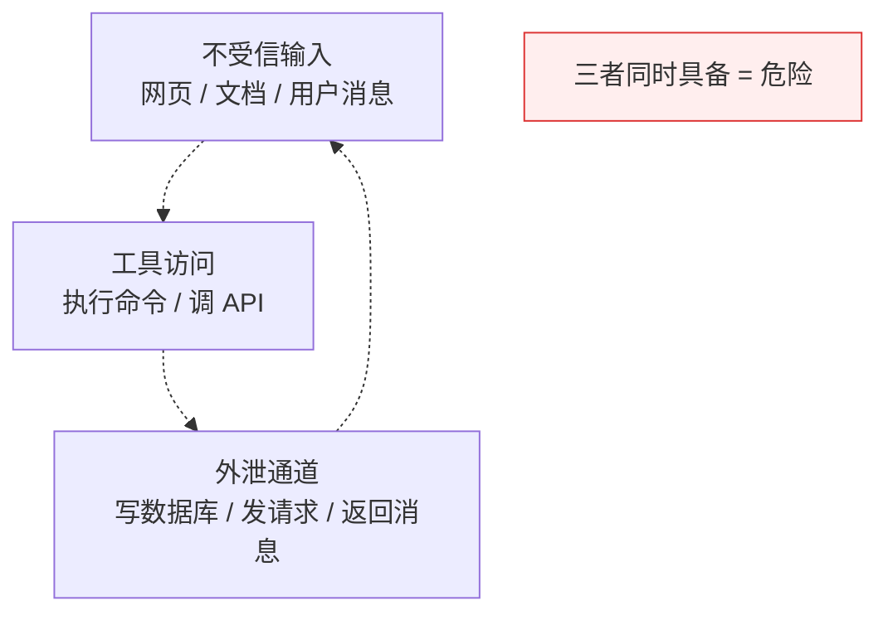

# 第 6 章 · AI 自治 ＋ 上下文的架构性约束

> 所属：第二部分 · 知识  ·  [← 返回目录](../README.md)

当 AI 获得工具调用权限并进入生产环境，"安全"不再是一个**防御编码问题**，而是一个**架构拓扑问题**。这句话是本章的核心主张：安全不能靠应用层的 if/else 和 prompt 规则来守护，必须靠基础设施的拓扑结构来兜底。就像你不会靠应用代码里的 `if (user.isAdmin)` 来保护生产数据库——你会用网络隔离、VPC、安全组把它物理上隔开。AI 安全是同样的逻辑。

同时被经常忽略的是第二件事：**上下文 window 是一种有限资源**，它和 CPU、内存一样需要被工程地规划。把它想象成一块固定大小的白板——Agent 在上面写写画画，写满了就看不到早期的内容了。不做管理的 Agent 系统，会在特定场景下出现难以复现的怪异失败。

## 为什么"安全"变成了拓扑问题

在非 AI 系统里，"恶意输入"这件事由防御编码处理：参数校验、SQL 注入防护、XSS 过滤。这些技术假设的是**代码是确定性的**——给定输入能推出能走到哪里。

LLM 推翻了这个假设。它是**非确定性解释器**：一个看起来无害的文档里藏一句话，可能让 Agent 在下一步调一个它不该调的工具。你没办法通过读代码知道"它会不会走到这里"，因为它是由自然语言驱动的——就像你没法通过审计 bash 的源码来预测用户会输入什么命令。

**结论**：安全不能再靠代码层的检查，必须靠代码**无法被绕过的**物理边界——基础设施拓扑。你不信任 Agent 的"自律"，就像你不信任用户的"善意"一样。这就是这一章的出发点。

## 致命三角（Lethal Trifecta）

Simon Willison 提出的核心威胁模型，是理解 AI Agent 安全的锚点：

> **不受信输入 ＋ 工具访问 ＋ 外泄通道，三者不可共存。**

只要这三条腿同时存在，Agent 就可被 prompt injection 利用来完成完整攻击链：读到恶意输入 → 被诱导调用工具 → 把敏感数据送出去。攻击者不需要绕过任何 SQL 防护或 CSRF token，只要能把一句话塞进模型能读到的任何地方。

**架构师的任务**：在基础设施层**砍掉其中一条腿**。通常砍"外泄通道"最方便：

- **沙箱执行**：容器隔离、无默认 egress，命令执行环境出不去网
- **出站白名单**：允许的 host 手动列一遍，其它全 deny
- **Capability-scoped 凭证**：给 Agent 的凭证要满足三件事——非生产凭证、支出上限、权限最小化
- **禁止 Agent 修改自己的配置**：防止 Agent 在某一步把自己的权限边界抬高

> [!IMPORTANT]
> **"外泄通道"被低估的两类形态**——它们在 CLI demo 里都不存在，但产品演化到 web / 通知 / 协作场景立刻接上：
>
> - **Markdown image / link 自动渲染**：模型在回答里嵌入 ``，前端只要渲染 markdown，浏览器就**自动发请求**外带数据。这是过去两年 Notion / Slack / 各种 AI 助手出现过的真实漏洞。**缓解**：渲染层禁止 image / iframe src 指向白名单外的 host；或在 markdown 解析时把外链改成需手动点击。
> - **人作为 egress hop**：操作者把 Agent 输出粘贴到工单 / chat / 邮件——Agent 没"发出去"，但敏感数据通过人转出了组织边界。**缓解**：输出层做 PII / secret 扫描；高敏感场景给输出加水印 / 不可复制；流程上培训操作者"AI 回答不能直接转发"。
>
> 这两类形态在 CLI 阶段看不到，等产品演化到 web 前端 / 通知 / 工单集成时**架构上必须先设计好渲染层和操作者协议**——事后改难度极高。

重点在"**物理切断**"。只要这条外泄通道是 Agent 代码本身无法绕过的（不是 if/else 里的判断，而是容器进程根本连不上外网），prompt injection 再聪明也没用。

## 上下文工程：被忽视的可靠性面

Context window 不是一个"越大越好"的东西。它是**有限资源**，与 CPU / 内存同级，需要被工程地分配。忽视这一点的 Agent 系统，会在特定场景下出现难以复现的怪异失败。

设计长链 Agent 时必须考虑的四件事：

- **Compaction 策略（何时压缩历史）**：长对话里早期的细节什么时候可以被压成摘要？压错了会丢关键决策（比如"用户说过不要动 prod 数据库"这条被压没了），不压会撑爆 context。这是策略问题，不能等撑爆了再处理——就像你不会等磁盘 100% 才想 cleanup 策略。
- **子 Agent 隔离**：不同子任务的 context 是否会交叉污染？一个子 Agent 被诱导后产生的污染数据，不能漂到主 Agent 的上下文里。这和微服务的故障隔离是同一个思想——blast radius 要可控。
- **外部记忆（NOTES.md 模式）**：状态应该落盘而非挂在对话里。让 Agent 把中间结论写到外部文件，后续步骤 re-read；这样 context 永远是"当前任务的最小工作集"。类比：你不会把所有 runbook 都打开放桌面上，你只打开当前事故需要的那份。
- **注意力预算**：Context 越长，末端指令的**服从度越低**（Lost in the Middle 现象，详见[科学 02](../科学/02-Lost-in-the-Middle.md)）。重要的指令别放在 10K token 之后的位置——这不是经验法则，是可测量的衰减曲线。就像你写了一封 5000 字的邮件，收件人大概率只认真看开头和结尾。

**上下文管理质量**直接决定 Agent 系统的可靠性。它和"推理可靠性"是两套并行的可靠性面，都归架构师管。

## 这一章不讨论什么

- **不能靠 LLM 分类器守边界**。很多团队会加一个"输入安全分类器"作为第一层防御。**这不够**——分类器本身也是 LLM，会被更聪明的 prompt injection 绕过。它可以作为纵深防御的一层，但不能作为**唯一**边界。边界必须在基础设施里强制。
- **"长上下文 = 更强大"是错觉**。Context 长到一定程度后能力**反降**。Claude / GPT 这些模型声称的"百万 token 上下文"在实际任务里很少能发挥那么长——Lost in the Middle、末端服从度、注意力稀释这些机制都会让有效 context 远短于名义上限。
- **不是 prompt injection 的完整红队手册**。本章只提到架构级防御。具体的红队攻击手法见深入 07。

## 接下来

- **关联练习**：[Unit 1 · Agent 自治与致命三角](../练习/Unit1-Agent自治与致命三角/总览.md) —— 把自治边界做成一张可落地的分级表
- **深入专题**：
    - [深入 07 · Agent Prompt Injection 红队实战](../深入/07-Agent-Prompt-Injection红队实战.md) —— 具体攻击手法与缓解
    - [深入 08 · 大模型的"记忆"是怎么回事](../深入/08-大模型的记忆是怎么回事.md) —— 外部记忆设计的前置知识
    - [科学 02 · Lost in the Middle](../科学/02-Lost-in-the-Middle.md) —— 注意力衰减的可测量机制
- **下一章**：[第 7 章 · 质量可观测性 ＋ Data Flywheel](07-质量可观测性与DataFlywheel.md)

🔄 复习：[核心概念卡](../复习/核心概念卡.md) · [Active Recall 题库](../复习/Active-Recall题库.md)

---

上一章 → [第 5 章 · AI 推理服务的可靠性工程](05-AI推理服务的可靠性工程.md)
下一章 → [第 7 章 · 质量可观测性 ＋ Data Flywheel](07-质量可观测性与DataFlywheel.md)
