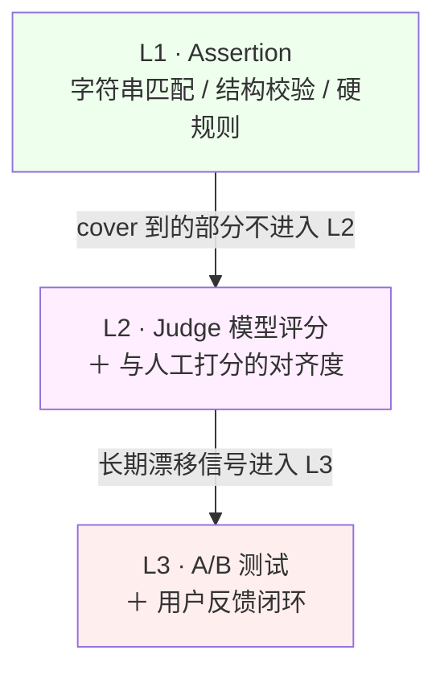
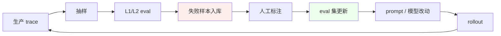

# 第 7 章 · 质量可观测性 ＋ Data Flywheel

> 所属：第二部分 · 知识  ·  [← 返回目录](../README.md)

传统 observability 的三大支柱是 **metrics / logs / traces**。AI 时代多一个**质量（quality）**，而且它不是第四根独立的柱子，而是**和前三根融合**成一个系统。

打个比方：传统监控像体检——血压、心率、体温都正常就算健康。但 LLM 系统可以"体检全绿但已经在胡说八道"——HTTP 200、延迟正常、错误率为零，但回答的内容全是幻觉。质量这根柱子就是为了抓住这类"指标正常但产品已烂"的情况。

本章的核心洞察——也是 Hamel Husain、Anthropic 事故复盘等一系列实践里逐渐收敛出的共识：

> **Traces 就是 eval 数据集，Evals 就是生产监控。**

这不是比喻，是架构事实。设计观测系统时若把 eval pipeline 和 trace pipeline 做成**两套**，会重复投入、数据断裂，长期维护不住。

## 为什么质量必须成为第四根支柱

传统三支柱回答的问题：

- **Metrics**：系统在宏观上健康吗？（可用性、延迟、错误率）
- **Logs**：具体发生了什么？（事件流、堆栈）
- **Traces**：一次请求穿了哪些组件？（调用链、瓶颈定位）

LLM 把一件事塞进了这个体系，但三支柱都不能回答它：**模型输出到底对不对？**

- Metrics 看不到内容——HTTP 200 的响应可能内容全错
- Logs 记下了输出，但无法自动判断"这输出合不合理"
- Traces 能告诉你调用了谁，但不告诉你答案是否幻觉

**质量**这根柱子单独竖起来，就是为了回答这个问题。

## 三层 eval 体系

质量不是一个单一指标，是**分层的**——层越高成本越大、但信号越可操作。

- **Level 1 · Assertion**：字符串匹配、结构校验、硬规则。"输出里必须有 X 字段"、"JSON 必须能 parse"、"citation 指向的 URL 必须存在"。便宜、快、可全量跑；覆盖不到语义层面的问题。
- **Level 2 · Judge 模型评分**：用一个 judge LLM 打分，配一个**与人工打分的对齐度跟踪**（判定 judge 自己可信吗）。注意这两件事必须一起做——光有 judge 分数、不持续校准 judge 本身，等于用一个说谎的尺子量身高。
- **Level 3 · A/B 测试**：长期反馈闭环。L1/L2 看不到的"用户满意度漂移"、"长期任务完成率变化"，只有 A/B 加行为指标能捕捉。

层次的工程意义：**L1 能 cover 的不要给 L2，L2 能 cover 的不要给 L3**——成本和延迟差一个数量级。

## Evals 本身也需要 SLO

这是 Anthropic 三连事故复盘后被广泛接受的观念：

> **你的 eval 会骗你。**

Eval pipeline 不是"跑一下就完事"的一次性工具，它是**持续运行的生产监控**。所以它本身需要有 SLO：

- **覆盖率**：多少比例的生产流量被 sample 到了 eval？
- **延迟**：eval 结果多久能回到 dashboard？（慢到分钟级就失去了告警价值）
- **Judge κ**：judge 模型与人工标注的一致性系数（Cohen's κ，一种修正了偶然一致的统计量——κ=1 表示完全一致，κ=0 表示和随机猜一样，≥0.6 算"适度一致"），周度跟踪
- **Pipeline uptime**：eval 管线自己挂了多久？eval 挂 = 质量盲眼
- **失败率**：eval 作业本身有多少比例因为各种原因失败

Eval 挂了 = 质量盲眼。所以必须给 eval 本身定 SLO + error budget policy。这也是为什么不能把 eval 推给"测试团队"——它是**生产观测基础设施**，归 SRE 管才合逻辑。

## Data Flywheel：核心反馈链路

Data Flywheel（数据飞轮）是一种自我强化的循环机制：生产数据喂给评估 → 评估发现问题 → 问题驱动改进 → 改进后的系统产生更好的数据 → 循环加速。名字来自 Jim Collins 的"飞轮效应"——每推一圈都让下一圈更轻松。

SRE 架构师需要拥有并运营的这条链路：

每一圈里都有四个必须明确的东西：

- **Owner**：谁负责这一步？（不可以模糊成"团队")
- **频率**：多久跑一次？（日度 / 周度 / 触发式）
- **触发条件**：什么时候启动？（新样本 >N 条？新模型上线？）
- **失败处理**：这一步挂了怎么办？（降级？人工介入？）

**这是 AI 时代的"可靠性基础设施"，不应被推给 MLOps 团队**。原因很朴素：出了问题被 paged 的是 SRE，兜底的是 SRE，所以设计权应当在 SRE 手里。推给别人等于把自己的兜底责任交出去。

> **关于飞轮的"启动器"**：上图里 `生产 trace → 抽样 → eval → 失败入库 → 人工标注` 是理想形态。绝大多数团队在跑通这条完整链路前，需要一个**廉价起点**——网关计费日志加几列就够。具体见 [深入 17 · §6 · Data Flywheel 在网关位的廉价起点](../深入/17-LLM网关的SRE视角.md#6-data-flywheel-在网关位的廉价起点)。

## 这一章不讨论什么

- **不是讲 OTel / Langfuse / LangSmith 选型**。具体工具选型见深入 06。本章关心的是**方法论层**：为什么要四支柱、三层 eval、Flywheel 怎么走——这些想清楚了，工具是次要的。
- **不是 ML 研究级 eval**。基准测试、leaderboard、学术 metric 不在本章范畴。本章只关心"线上系统每天都在产生数据，怎么把它变成持续改进"。
- **不是人工标注流程管理**。标注员怎么招、怎么培训、标注工具怎么选——这是运营问题，架构师只需要知道"哪一步需要人、人工带宽是瓶颈"，具体执行不在职责。

## 接下来

- **关联练习**：[Unit 2 · Trace-Eval 统一可观测性](../练习/Unit2-TraceEval统一可观测性/总览.md) —— 产出一份完整的 Data Flywheel 设计文档
- **深入专题**：
    - [深入 06 · Eval Pipeline 设计](../深入/06-Eval-Pipeline设计.md) —— 工具选型与 OTel 集成
    - [深入 10 · AI 系统事故模式库](../深入/10-AI系统事故模式库.md) —— Silent Quality Regression 等真实模式
    - [深入 17 · LLM 网关的 SRE 视角](../深入/17-LLM网关的SRE视角.md) —— 多上游聚合场景的飞轮起点
- **下一章**：[第 8 章 · 组织与判断力](08-组织与判断力.md)

🔄 复习：[核心概念卡](../复习/核心概念卡.md) · [Active Recall 题库](../复习/Active-Recall题库.md)

---

上一章 → [第 6 章 · AI 自治 ＋ 上下文的架构性约束](06-AI自治与上下文架构约束.md)
下一章 → [第 8 章 · 组织与判断力](08-组织与判断力.md)
