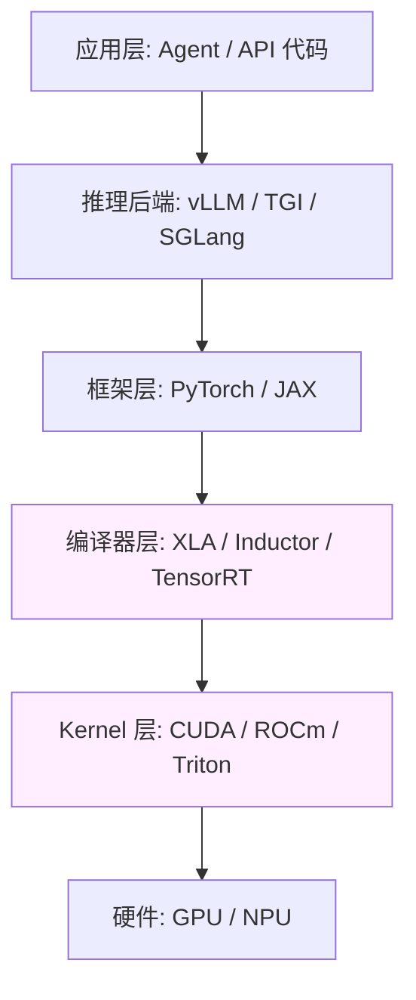

# 第 9 章 · 工程底座（含数值/编译器级调试）

> 所属：第二部分 · 知识  ·  [← 返回目录](../README.md)

AI 越强，底座越重要——因为遇到 AI 自己也解不出的问题时，能往下挖的是你。

这句话是这一章的核心主张。上面几章讲的都是"AI 时代新增的技能"，这一章讲的是**旧的能力为什么不能丢，以及在 AI 时代它还需要往哪里延伸**。

## 为什么底座反而升值

一个反直觉的观察：AI 能解决的问题越多，**剩下那些 AI 解不了的问题**就越值钱。

原因有三个：

- **AI 的能力边界决定了故障会沉积在底座**：训练数据里常见的问题 AI 会处理；那些训练数据没覆盖的、罕见的、数值层的问题，AI 无能为力。这些问题不会消失，它们会堆积在底座等你来挖。
- **底座问题对 AI 投毒**：如果底层 kernel 有 bug、数值有漂移、网络在丢包，所有上面跑的 AI 系统都会间歇性失常。而 AI 排查自己的症状时会把你带到错误方向——因为它根据症状推理，症状指向的是应用层。
- **会做底座的人在变少**：新一代工程师直接从"AI 辅助开发"起步，掌握汇编、CUDA、XLA IR、TCP 细节的人数量上在减少。稀缺性本身就是护城河。

## 经典部分：不会过期的底座

这块是传统 SRE 架构师的看家技能，**一个不能少**：

- **分布式系统**：一致性、共识、排队论、CAP——这些是讨论任何生产系统的公共语言，包括 AI 系统。你跟推理后端团队讨论 batching 策略时用的就是这套词。
- **性能工程**：pprof、flame graph、性能建模。Agent 链路里一旦出现性能问题，定位仍然要走这条路径——AI 自己不会帮你读火焰图。
- **Linux / 网络 / 存储深度排障**：GPU 服务器在 Linux 上、推理走 TCP、KV cache 落在显存和磁盘之间。任何一处底层问题都会传导到上层。

这些能力在 AI 时代**没变**——变的只是它们现在**更需要被保持住**，因为没有 AI 辅助你依然要能走到根因。

## AI 时代新增：数值级 + 编译器级调试

这是真正"新"的底座能力。AI 推理栈打开看是这样的：

传统 SRE 熟悉 App / Srv / FW 三层。AI 时代要把能力往下延伸到 Comp / Kern 层。先认识这两层里的名字：

- **编译器层**：负责把 PyTorch / JAX 写的高层算子"编译"成 GPU 能高效执行的低层指令
    - **XLA**（Accelerated Linear Algebra）：Google 开发的 ML 编译器，JAX 和 TensorFlow 的默认后端
    - **Inductor**：PyTorch 2.x 自带的编译器后端（`torch.compile` 背后的引擎）
    - **TensorRT**：NVIDIA 的推理优化编译器，做算子融合和精度转换，只支持 NVIDIA GPU
- **Kernel 层**：直接在 GPU 硬件上执行的最底层代码
    - **CUDA**：NVIDIA GPU 的编程接口和运行时，几乎所有 AI 推理都跑在它上面
    - **ROCm**：AMD GPU 的对应物，功能类似 CUDA 但生态较小
    - **Triton**：OpenAI 开源的 GPU kernel 编写语言，比原生 CUDA 更易写，FlashAttention 等高性能算子用它实现

具体包括：

- **数值级调试**：
    - **bf16 vs fp32 的精度差异**：同样的数学在不同精度下结果有差异，差异如何累积、何时爆发
    - **Kernel launch 的非确定性**：不同 batch size、不同 seq length 走到不同 kernel，结果不严格一致
    - **CUDA 确定性模式**：什么时候能开、开了代价多大
- **编译器级调试**：
    - **XLA / Inductor IR 读取**：编译后的算子图和你写的 PyTorch 不是一一对应，要能读懂生成物
    - **推理后端编译图排查**：vLLM / TGI / SGLang 各自的编译路径不同，上线前后质量变化多半出在这里

这块 ROI 短期看不高——大部分时候用不上。但**在其他人都不会的时候**，它就是你的护城河：

> 一个能把 bf16/fp32 漂移定位到某条 kernel 的 SRE，在出事的那 1 天，价值等于团队里其他所有人总和。

Anthropic 2026 三连事故的根因有两次落在这一层。这不是少数派报告。

## 这一章不讨论什么

- **不是让你都变成 kernel 工程师**。目标是**到得了**这一层，不是**常驻**这一层。平时不用、遇到需要时能下得去，就够了。
- **不是替代推理后端团队**。如果你所在的公司有专门的 Infra/ML 系统团队，他们会在这块深耕。架构师需要的是**能听懂他们在说什么、在评审时能判断他们方案的 tradeoff**——不是自己去写 kernel。
- **不是讲模型训练底座**。训练栈的底座（分布式训练、checkpointing、数据管线）是另一套系统，不在本书范畴。本书只管推理服务的底座。

## 接下来

- **关联练习**：[Unit 5 · 数值与编译器级调试](../练习/Unit5-数值与编译器级调试/总览.md) —— 做一份数值级故障排查 Runbook
- **深入专题**：
    - [深入 10 · AI 系统事故模式库](../深入/10-AI系统事故模式库.md) —— Pattern 1（Silent Quality Regression）、Pattern 12 等数值层事故
    - [科学 03 · Quantization 为什么有时坏](../科学/03-Quantization为什么有时坏.md) —— 数值层 bug 的机制根源
- **进入第三部分**：[练习第 10 章 · 三个核心训练动作](../练习/10-三个核心训练动作.md) —— 把前 9 章的知识变成可操作的训练

---

上一章 → [第 8 章 · 组织与判断力](08-组织与判断力.md)
下一部分 → [第三部分 · 练习](../练习/10-三个核心训练动作.md)
