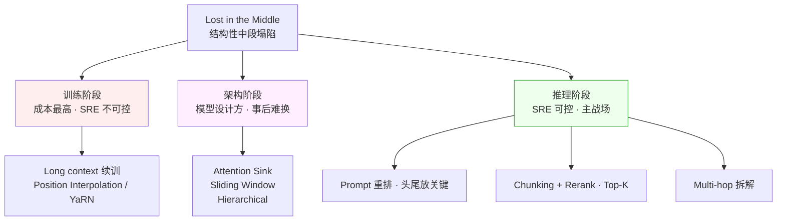

# 科学 02 · "Lost in the Middle" 为什么会发生

> [← 返回目录](../README.md)  ·  前置：[科学 01 · Attention 与 Transformer 的 SRE 视角](01-Attention与Transformer的SRE视角.md)  ·  相关：[深入 03 · 最佳实践](../深入/03-模型与工具场景化最佳实践.md)

> [!NOTE]
> **核心问题**：为什么长 context 里"中间的信息"最容易被模型忽略？这不是 bug，是**结构性的**。懂了机制，你就知道怎么在工程上对抗它。

---

## 0. 现象：RULER 曲线长什么样

Liu et al. 2023 的论文《Lost in the Middle》给了 LLM 社区第一个震撼结果：

- 在长文档里埋一条关键信息
- 问模型关于这条信息的问题
- **关键信息在开头或结尾时**，准确率 80%+
- **关键信息在中间时**，准确率跌到 50% 甚至 20%

后续 RULER 基准（NVIDIA 2024）系统性地评测了各家模型：

| 模型 | 宣称 context | 实际有效 | 曲线形态 |
|---|---|---|---|
| Gemini 1.5 Pro | 1M | >128K | 缓降 |
| GPT-4 (1106) | 128K | ~64K | U 型（首尾好，中间差）|
| Llama 3.1 70B | 128K | ~64K | U 型 |
| Claude 3 Opus | 200K | ~60K | U 型（最明显）|

**"有效 context" ≠ "宣称 context"**。几乎所有模型都在中间塌陷。

---

## 1. 为什么会这样：四个互相叠加的原因

### 1.1 训练分布的"首尾偏好"

绝大部分训练样本的**关键信息都不在正中间**。

- 新闻稿：重要事实在标题和首段
- 代码：函数签名和 return 在头尾
- 对话：问题在开头，答案在末尾
- 小说：开场交代 + 结局揭示

**后果**：模型学到"重要信息倾向于出现在头尾"。中间的信息**没训练足够次数**让它学会重视。

### 1.2 位置编码的几何偏差

Transformer 不能天然理解位置顺序——需要"位置编码"告诉它 token 的相对位置。

主流方案：

**RoPE（Rotary Position Embedding）** — 当前最流行
- 通过旋转向量表示位置
- 长距离位置的向量距离变大 → attention 分数衰减
- **副作用**：超过训练时见过的最长距离，外推能力崩溃

**ALiBi（Attention with Linear Biases）**
- 给 attention 分数加一个线性衰减项
- 越远的位置分数越低
- **副作用**：天生的"偏向近处"

**结果**：**中间远离当前位置的 token**被几何上打了折扣。

### 1.3 Softmax 的"稀释效应"

回忆 [科学 01](01-Attention与Transformer的SRE视角.md) 的公式：

```
attention = softmax(Q·K^T) · V
```

Softmax 把 N 个 score 归一成概率分布。**N 越大，分母越大**。

- Context 1k：每个位置平均 attention = 1/1000
- Context 128k：每个位置平均 attention = 1/128000
- Context 1M：**每个位置平均 attention ≈ 1/1000000**

如果某个"中间位置"本来就没 attention sink 或训练偏好的加持，它被分到的注意力**数学上接近零**。

> [!WARNING]
> 这不是工程 bug。这是 softmax 的**固有数学性质**。无法通过"改进工程"消除，只能用架构变种（sparse、sliding、hierarchical）绕开。

### 1.4 Attention Sink 现象

实测发现：无论什么内容，**前几个 token（甚至是无意义的 BOS token）**在深层 attention 里总能拿到异常高的注意力。

原因（猜测）：softmax 必须总和为 1，模型需要一个"出口"把多余的 attention 倾倒出去——前几个 token 成了默认"垃圾桶"。

**后果**：
- **开头**因为 attention sink 有额外权重
- **末尾**因为 recency bias 有额外权重
- **中间**两面不靠，受影响最大

这是"Lost in the Middle" 现象的直接成因。

---

## 2. 工业界的应对方案

针对这个结构性问题，工业界在三个阶段各有方案——只有推理阶段是 SRE 可控的主战场：



### 2.1 训练阶段

**Long Context 训练**
- Llama 3.1 从 128k 继续训练到 128k 数据上
- 训练样本刻意在中间放关键信息
- **但成本高、数据难收**

**Position Interpolation + YaRN**
- 微调让 RoPE 外推到更长
- Anthropic、Qwen 都用类似技术
- **副作用**：推理时要保持和训练一致

### 2.2 架构阶段

**Attention Sink（StreamingLLM）**
- 显式保留前 4 个 token 永不驱逐
- 对长 streaming 场景有效
- 但不解决"中间被忽略"

**Sliding Window**
- 每个位置只看最近 W 个
- 中间的"窗口范围外"彻底丢
- Mistral 用这方案

**Hierarchical / Summary Layers**
- 先压缩中间内容再 attention
- 新研究方向，尚未主流

### 2.3 推理阶段（SRE 能控制的）

- **Prompt 重排**：把关键信息放头尾
- **Chunking + Rerank**：先检索 → rerank → 只喂 Top-K 最相关
- **Multi-hop**：拆成多个小 context 分别处理再汇总
- **Confirmation**：让模型明确引用位置，没引用就重问

---

## 3. SRE 角度的工程含义

### 3.1 "长 context 替代 RAG" 的迷思

2024 年 Gemini 1.5 Pro 发布后，有种声音："1M context 让 RAG 过时了。"

**这是错的**。

- 长 context 质量**在中间塌陷**
- 长 context 成本**线性增长**（每次请求 prefill 巨贵）
- 长 context **延迟高**（prefill 数秒级）
- RAG 的 chunking + rerank 本质上是**把"该模型 attention 的注意力"前置到搜索引擎**

**正确立场**：长 context 是工具箱里的一把工具，不是替代 RAG 的银弹。

### 3.2 Prompt 架构的经验规则

基于机制，设计 prompt 的规则：

```
[最前] System prompt                 ← attention sink + 重要指令
[前段] 工具定义 / CLAUDE.md           ← attention 强
[中段] 检索出的文档片段（可能被稀释） ← rerank 后只放 Top-K
[末段] 历史对话
[最末] 当前用户请求 ★                ← recency bias 加持
```

> [!TIP]
> **把"最想让模型记住的指令"复述两次**——一次放系统提示开头，一次放用户消息末尾。利用头尾双重 attention 加持。

### 3.3 RAG 里 Rerank 的地位

给工程上的直观解释：
- 你从 100 条片段里选 20 条喂进 context → "中间塌陷"风险极大
- **Rerank 之后只放 Top-5** → 每条都在"头/尾"，attention 充足

**结论**：**Rerank 不是"优化项"，是 long context 局限的必要补救**。

### 3.4 多跳推理的代价

长 context 里做多跳推理（要跨越多个段落合成答案）比单跳差很多。
- 单跳（只查一个事实）：长 context 准确率 ~80%
- 多跳（4 个事实跨 128k）：准确率跌到 ~30%

**SRE 工程做法**：
- 把多跳拆成多个单跳
- 每步用独立 API call
- 中间结果可审计

---

## 4. 观测与监控

### 4.1 "有效 context 曲线"

对你的实际 workload，建一个监控曲线：

```
质量 ↑
   │ ●●●●●●●
   │        ●●●●
   │             ●●●
   │                ●●●●●●●
   └─────────────────────────→ context 长度
    0k  10k  50k  100k  500k
```

找到你场景下的**"曲线开始下降的拐点"**——超过这点就该换方案（RAG / 多跳 / 拆分）。

### 4.2 Needle Test 不够

**单针 needle test（"第 X 行是什么"）**容易通过——任何头尾位置都能答对。

**实测要用**：
- Multi-needle test（多个事实要同时找到）
- Reasoning test（找到事实 + 推理）
- Distractor test（有相似但错误的信息干扰）

### 4.3 生产中的异常信号

- 用户问"这份文档里 X 是什么？"，模型引用了错的段落 → 中间位置被忽略
- 用户抱怨"你前面才说过的你忘了" → 历史对话中段被稀释
- 长链 Agent 的决策引用了旧信息 → 注意力没到该到的地方

---

## 5. SRE 实操清单

- [ ] 不要信厂商的"宣称 context"数字。用 RULER 或你自己的 multi-needle 测
- [ ] Prompt 架构遵循"首尾放关键内容"规则
- [ ] RAG 系统**必须有 rerank 阶段**，不只是 embedding 相似度
- [ ] 复杂任务拆成多跳小 context，不是堆到一个大 context
- [ ] 关键指令头尾各说一遍
- [ ] 建立"context 长度 → 准确率"曲线，找到你的"拐点"
- [ ] 监控：当生产 context 长度超过拐点的比例增加时告警

---

## 6. 常见误区

- ❌ **"1M context 可以装下全部业务数据直接问"** — 中间会塌陷
- ❌ **"Rerank 可以省"** — 不，尤其是长 context 场景更需要
- ❌ **"Needle test 通过就等于真实场景能用"** — 多针 / 多跳才是真考验
- ❌ **"关键信息放中间没关系，反正模型应该都能看到"** — 数学上就不应该都看到
- ❌ **"长 context 模型一定优于短 context"** — 对短任务反而可能更差（训练分布偏移）

---

## 7. 给 SRE 的一句话总结

> [!IMPORTANT]
> **"Lost in the Middle" 是 attention + softmax + 位置编码 + 训练分布四重叠加的结构性结果**——不是可以通过"调 prompt"消除的 bug。
>
> 工程应对只有一条路：**让重要信息进入 attention 的"特权区域"**（头、尾、rerank 后的 Top-K）。
>
> 这就是为什么 RAG + Rerank + Prompt 架构才是长 context 时代的正确姿势，而不是"全扔进去让模型自己处理"。

---

## 8. 参考资料

- Liu et al · 《Lost in the Middle: How Language Models Use Long Contexts》(2023) — https://arxiv.org/abs/2307.03172
- NVIDIA · 《RULER: What's the Real Context Size of Your Long-Context Language Models?》— https://github.com/NVIDIA/RULER
- Xiao et al · 《Efficient Streaming LLMs with Attention Sinks》— https://arxiv.org/abs/2309.17453
- Peng et al · 《YaRN: Efficient Context Window Extension》— https://arxiv.org/abs/2309.00071
- Press et al · 《Train Short, Test Long (ALiBi)》— https://arxiv.org/abs/2108.12409
- Anthropic · Context Engineering 博客（对应 "attention budget" 概念）

🔄 复习：[核心概念卡](../复习/核心概念卡.md) · [Active Recall 题库](../复习/Active-Recall题库.md)

---

← [科学 01 · Attention 与 Transformer 的 SRE 视角](01-Attention与Transformer的SRE视角.md)  ·  [📖 目录](../README.md)  ·  [科学 03 · Quantization 为什么有时坏 →](03-Quantization为什么有时坏.md)
