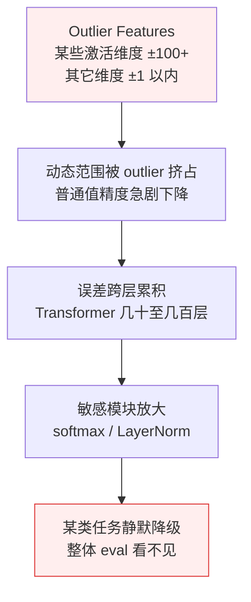

# 科学 03 · Quantization 为什么有时坏

> [← 返回目录](../README.md)  ·  前置：[科学 01 · Attention](01-Attention与Transformer的SRE视角.md)  ·  相关：[第 5 章 · AI 推理服务的可靠性工程](../知识/05-AI推理服务的可靠性工程.md)  ·  [Unit 5 · 数值与编译器级调试](../练习/Unit5-数值与编译器级调试/总览.md)

> [!NOTE]
> **核心问题**：为什么同一个模型 int4 量化后"大多数 prompt 工作正常，但偶尔某类 prompt 错得离谱"？这是 SRE 必须能判断的**静默降级**典型场景。

---

## 0. 现象：量化的"薛定谔"

一个真实的 SRE 工位故事：

- 团队把 Llama 3 70B bf16（需要 2 张 H100）量化成 int4（单张 H100 能跑）
- 整体 eval 测试：平均分下降 2%（"可接受"）
- 线上灰度 10% 流量：一周没问题，切全量
- **第 10 天**：客户大量投诉"回答突然变糟糕"
- 排查：某类特定任务（涉及精细数字比较）错误率 30%，其他任务完全正常

**这不是 bug，是 quantization 的固有特性**。理解原理才能设计 eval、选择方法与识别失败模式。

---

## 1. Quantization 基础

### 1.1 精度格式对照

| 格式 | 字节 | 动态范围 | 典型用途 |
|---|---|---|---|
| **fp32** | 4 | 巨大 | 训练 |
| **fp16** | 2 | 中 | 老 GPU 推理（数值不稳）|
| **bf16** | 2 | 大（同 fp32）| **当代主流推理** |
| **fp8 (E4M3/E5M2)** | 1 | 小 | 新硬件（H100+）原生 |
| **int8** | 1 | 离散 256 级 | 权重量化主流 |
| **int4** | 0.5 | 离散 16 级 | 激进量化 |
| **int2 / 1.58-bit** | 0.25 / 0.2 | 极少 | 实验 |

### 1.2 什么东西可以量化

**权重量化（Weight-only Quantization）**
- 把模型权重从 bf16 压到 int8 / int4
- 推理时先反量化回 bf16 再计算
- **好处**：显存省，带宽读取快
- **几乎所有生产部署都用**

**激活量化（Activation Quantization）**
- 把中间激活值也量化
- **好处**：算力也省
- **难度**：激活值动态范围大，更难量化

**KV cache 量化**
- 把 KV cache 存成 int8 / fp8
- **好处**：长 context 省显存
- **难度**：精度损失累积到 attention 分布

### 1.3 量化的两种阵营

**PTQ（Post-Training Quantization）**
- 训练完再量化
- 无需重训
- **典型方法**：GPTQ、AWQ、SmoothQuant

**QAT（Quantization-Aware Training）**
- 训练时就按量化约束来
- 质量好但贵
- **典型方法**：LLM-QAT、QLoRA 的 fine-tune 阶段

---

## 2. 为什么能量化（为什么大部分情况工作）

### 2.1 权重分布高度偏态

LLM 权重绝大多数集中在 0 附近：

```
频次 ↑
    │         ████
    │        ██████
    │       ████████
    │      ██████████
    │  ▂▁█████████████▁▂
    └────────────────────→ 权重值
    -1    0    1
```

大部分值可以用少数几个离散级别精确表示。

### 2.2 LLM 对精度容错

模型每层都有微小噪声容忍度。单个权重从 `0.374289` 变成 `0.375`（最近的 int8 级别）→ 很少改变整体输出。

### 2.3 计算是"低秩"的

Attention 的 K^T·Q 通常是低秩矩阵，量化误差在低秩空间里更可恢复。

---

## 3. 为什么有时坏（核心！）

**一句话**：量化失败不是"整体变差"，而是**少数几个关键维度被 outlier 挤占了精度 → 误差在几十层里来回放大 → 最终在某些特定任务上暴雷**。平均分看不出来，因为大多数 prompt 不触发这些 outlier 维度。

量化"有时坏"不是单一机制，是一条因果链——从微观的 outlier 走到宏观的某类任务静默降级。下面用一个比喻建立直觉，再逐个环节拆解。

**一个比喻：用 16 个刻度量身高**

> 你要用一个只有 16 个刻度的尺子去量全班同学的身高。大部分同学在 150-180cm 之间——每个刻度精确到 2cm，够用了。但班上有一个同学身高 250cm——为了让尺子能量到他，你不得不把刻度间距放大到 16cm。结果全班每个人的身高都变成了"约 160cm→160"、"约 172cm→176"、"约 168cm→160"——**多数人的精度被一个极端值毁了**。
>
> 这就是量化里 outlier feature 的直觉。模型几千个维度中，某几个维度值在 ±150，其余全在 ±1 以内。为了让那几个 ±150 能表示，整个量化的刻度被"撑大"了，±1 以内的值全部挤到几个粗糙的刻度——精度几乎为零。Adam 拿到的身高误差是 8-16cm，但只有遇到"需要精确身高判断"的任务（比如衣服尺码推荐）才会出错——测平均身高看不出来。Taylor 的身高本来就是 170cm，分到 160-176 档看起来"还行"——但实际上丢了 10cm 的精度，只是暂时没触发。

下面逐环节拆解。



下面逐环节拆解。

### 3.1 Outlier Features（离群特征）

**这是量化失败的头号元凶**。

Dettmers 2022 的论文《LLM.int8()》发现：**LLM 的某些激活维度会出现 100+ 的极端值**，而 99% 的维度在 1 以内。

```
激活值分布：
维度 0-2047: 值 ±1 以内
维度 2048:   值 ±150  ← outlier!
维度 2049-4095: 值 ±1 以内
```

**为什么这是问题**：
- int8 只有 256 级，动态范围从 -128 到 127
- 如果要覆盖 `±150` 的 outlier，每个级别就表示 ~1.2
- 那些 ±1 以内的值全被压到几个级别 → **精度几乎没了**

**机制**：
- Outlier 不均匀分布；某些维度几乎总是大
- 这些维度和**关键语义**相关（识别特定词、语法结构）
- 这些维度精度掉 → 模型对特定输入失灵

### 3.2 误差的跨层累积

Transformer 有几十到几百层。每层量化误差单独看可能只 0.1%，但：
- 误差有时相关（不是独立）
- 某些路径放大误差（Layer Norm 后会放大）
- **累积后可能在"极端输入"上爆发**

### 3.3 对精度敏感的特殊模块

**Attention 的 softmax**
- 见[科学 01](01-Attention与Transformer的SRE视角.md#7)
- softmax 里的 `e^x` 对输入精度敏感
- 量化后的 `QK^T` 如果误差分布存在偏差，softmax 会失真

**Layer Normalization**
- 计算均值和方差
- 量化后方差估计可能偏
- 累积整个 layer 的输出都偏

**Embedding 层**
- Embedding 向量精度低 → token 语义丢失
- 某些工具 "只量化中间层，embedding 保持 bf16"

### 3.4 动态范围的"平均覆盖 vs 尖峰"

PTQ 算法要选 `scale factor`（每个离散级别代表多大的值）。

- **Per-tensor（全局）**：一个 scale 覆盖整个张量 → outlier 毁掉普通值
- **Per-channel（按输出通道）**：每列独立 scale → 更好但没完全解决 outlier
- **Per-group（分组）**：每 32 个值一个 scale → GPTQ / AWQ 用这招，是当前主流

---

## 4. 现代量化方法（为什么越来越好）

**一句话记住四种方法**：GPTQ 用梯度信息保护重要权重；AWQ 看激活值大小决定保护谁；SmoothQuant 把 outlier 从激活移到权重；FP8 靠硬件原生浮点格式从根本上躲开 int 的离散问题。

### 4.1 GPTQ（2022）

核心思想：用 **Hessian 信息**决定哪些权重重要，重要的优先保护精度。

- 逐层量化
- 用校准数据集算梯度二阶信息（Hessian）
- 高敏感度的权重先量化，剩下的"补偿"它带来的误差

**结果**：int4 比朴素 RTN（Round-to-Nearest）好 5-10%。

### 4.2 AWQ（Activation-aware Weight Quantization, 2023）

核心思想：**激活值大的维度对应的权重更重要**。保护这些。

- 校准集上观察每个维度的激活幅度
- 对"激活大"的维度保留更多精度
- 实际只移动一小部分权重就大大改善

**结果**：int4 质量接近 bf16，广泛采用。

### 4.3 SmoothQuant（2023）

核心思想：**把 outlier 的"难"从激活转移到权重**。

- 激活 outlier → 除以 scale
- 对应权重 × scale 抵消
- 激活值变平滑，权重能承受
- **权重 + 激活 都能量化到 int8**

### 4.4 FP8 / FP4（硬件原生，2024+）

H100 / H200 / B200 硬件直接支持 fp8 计算：
- fp8 保留浮点特性（指数范围）
- 比 int8 对 outlier 鲁棒
- **训练和推理都能用**

### 4.5 QLoRA（量化 + LoRA fine-tune）

用 4-bit NF4 格式压基模型，外挂 LoRA adapter 做 fine-tune。
- 消费级 GPU 能 fine-tune 65B 模型
- 质量几乎不受量化影响（因为 fine-tune 补回来了）

---

## 5. SRE 的角度：量化的"静默降级"是什么样

### 5.1 症状谱

| 症状 | 可能原因 |
|---|---|
| 整体 eval 降 1-2% | 正常量化代价 |
| 整体 eval 降 5%+ | 方法选择不当（outlier 没处理） |
| **多数正常，某类任务崩** | **Outlier feature 在这类任务触发** |
| 长 context 劣化比短 context 严重 | KV cache 量化问题 |
| 中文劣化比英文严重 | 语言特定 outlier（embedding 精度） |
| 数字 / 结构化输出错误率高 | 精细数值决策对量化敏感 |
| 量化后偶尔输出乱码 | 数值溢出（softmax 崩） |

### 5.2 验证清单

量化后上线前必跑：

- [ ] **整体 eval 集**：通常会降 1-3%，超过 5% 要换方法
- [ ] **分类任务 eval**：按任务类型分开看，找出"掉得最多的那一类"
- [ ] **长 context eval**：单独做，因为 KV cache 量化影响
- [ ] **结构化输出 eval**：JSON / 代码 / 数字，**对量化特别敏感**
- [ ] **多语言 eval**：如果你做多语言
- [ ] **红队 eval**：拿**已知疑难** prompt 测

### 5.3 线上监控（发现"静默降级"）

- **按任务类型分开的质量指标**（不要只看整体）
- **输出长度分布**：量化后某些 prompt 输出异常截断
- **Hallucination rate 按任务类分**：数字类任务 / 事实类任务 / 推理类任务
- **用户反馈按任务类分**：投诉集中在哪类
- **重试率**：某类请求被重试率突然涨

---

## 6. 决策矩阵：什么场景用什么量化

| 场景 | 推荐 | 原因 |
|---|---|---|
| 显存紧，质量敏感 | **AWQ int4 + Per-group** | 当前 PTQ 最佳质量 |
| 追求极致吞吐 | **FP8（H100 及以上）** | 硬件原生，质量损失最小 |
| 消费级 GPU 本地跑 | **GGUF Q4_K_M / Q5_K_M** | llama.cpp 成熟生态 |
| 需要 fine-tune | **QLoRA** | 量化 + LoRA 黄金组合 |
| Edge device | **int8 或更低** | 看硬件支持 |
| KV cache 紧 | **FP8 KV cache** | 现代推理引擎原生 |
| **关键任务（医疗/金融）** | **bf16 不量化** | 精度风险不值得 |

---

## 7. 常见误区

- ❌ **"量化是免费的加速"** — 永远有代价，只是多数时候小
- ❌ **"整体 eval 通过就能上"** — 要按任务类型分开看
- ❌ **"int4 比 int8 差一点点"** — 实际 int4 对 outlier 敏感度高很多
- ❌ **"量化后该重新 fine-tune"** — 除非你知道怎么做 QLoRA，否则 PTQ 足够
- ❌ **"每层都量化"** — Embedding / 某些 Layer Norm 保留 bf16 更稳
- ❌ **"所有模型量化都差不多"** — 同参数量不同结构差很大
- ❌ **"量化后延迟必然降低"** — 反量化开销可能抵消（尤其是小 batch）

---

## 8. SRE 实操清单

- [ ] 量化方法选 AWQ 或 GPTQ，**不用 RTN**
- [ ] 量化前后对**每个任务类别**单独 eval
- [ ] 量化后做**长 context 专项 eval**
- [ ] KV cache 量化要单独验证（对长对话影响大）
- [ ] 关键任务**不要量化**，即使显存紧
- [ ] 线上监控按任务类型分桶的质量指标
- [ ] 量化版本**单独打 tag**，方便回滚
- [ ] 文档里记录"量化方法 + 校准数据集 + eval 结果"

---

## 9. 给 SRE 的一句话总结

> [!IMPORTANT]
> Quantization 能工作是因为**权重偏态 + 低秩 + 容错**；失败是因为 **outlier features + 误差累积 + 敏感模块**。
>
> 平均 eval 过不代表**每类任务**都过——真实生产的"静默降级"多半藏在**某一类 prompt 的尾部**。
>
> **分类 eval + 在线分桶监控**是 SRE 对抗量化静默降级的唯一有效武器。

---

## 10. 参考资料

- Dettmers et al · 《LLM.int8(): 8-bit Matrix Multiplication for Transformers》(2022) — https://arxiv.org/abs/2208.07339
- Frantar et al · 《GPTQ: Accurate Post-Training Quantization》(2022) — https://arxiv.org/abs/2210.17323
- Lin et al · 《AWQ: Activation-aware Weight Quantization》(2023) — https://arxiv.org/abs/2306.00978
- Xiao et al · 《SmoothQuant》(2022) — https://arxiv.org/abs/2211.10438
- Dettmers et al · 《QLoRA: Efficient Finetuning of Quantized LLMs》(2023) — https://arxiv.org/abs/2305.14314
- NVIDIA · FP8 formats for deep learning 白皮书 — https://arxiv.org/abs/2209.05433
- llama.cpp · GGUF quantization formats — https://github.com/ggml-org/llama.cpp/blob/master/docs/build.md
- Anthropic · Postmortem of three recent issues（数值级事故典型案例）

🔄 复习：[核心概念卡](../复习/核心概念卡.md) · [Active Recall 题库](../复习/Active-Recall题库.md)

---

← [科学 02 · "Lost in the Middle" 为什么会发生](02-Lost-in-the-Middle.md)  ·  [📖 目录](../README.md)  ·  [科学 04 · Tokenization 的坑 →](04-Tokenization的坑.md)
