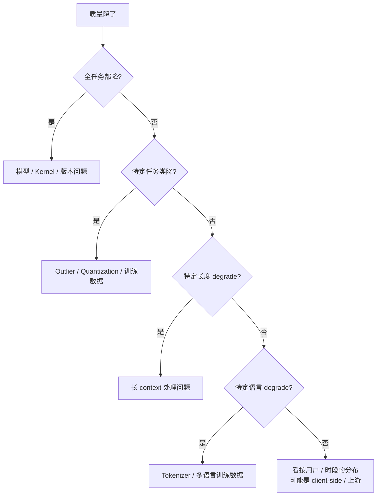

# Unit 3 · Week 3 · 静默降级检测

> [← Unit 3 总览](总览.md)  ·  [← 返回目录](../../README.md)

## 本周目标

设计一套能**捕捉静默降级**的检测方案——Anthropic 2026 事故的核心教训。

## 任务清单

### 阅读 · B3 · 45 分钟（无 AI）

**主读**：Anthropic · 《A postmortem of three recent issues》**第三次精读**
  - 这次**只关注"他们怎么发现的"**
  - 哪些指标提前报了？哪些报了但没人注意？哪些根本没监控？

**辅读**：[科学 03 · Quantization 为什么有时坏](../../科学/03-Quantization为什么有时坏.md)
  - 静默降级的典型症状库

**重点**：
- 为什么传统 5xx / latency 监控**看不出来**质量下降
- 哪些 ML 特有信号是 SRE 应该放在 dashboard 上的

### 产出 · B2 · 60-90 分钟

#### Section 1 · 静默降级症状谱（来自 [科学 03](../../科学/03-Quantization为什么有时坏.md) + 事故库）

填这张表：

| 症状 | 可能根因 | 可监控信号 |
|---|---|---|
| 整体 eval 降 1-2% | 正常量化代价 | 按任务类型分桶 eval |
| 整体 eval 降 5%+ | 方法选错 | 同上 |
| **多数正常，某类崩** | **Outlier 在该类触发** | **按任务类型分桶 p99 质量分** |
| 长 context 专门劣化 | KV cache 量化 | 按 context 长度分桶 |
| 中文劣化比英文严重 | 语言特定 outlier | 按语言分桶 |
| 数字 / 结构化错误率高 | 对量化敏感的路径 | structured output validation rate |
| 偶发乱码 | 数值溢出 | entropy 异常检测 |

#### Section 2 · 监控指标设计

除了 Unit 3 W1 的 SLI，**静默降级专项**至少要加：

1. **按任务类型分桶的 L1 assertion 通过率**（而非全局）
2. **按任务类型分桶的 L2 Judge 分数**
3. **输出长度分布**（按任务分桶，突变 > 20% 告警）
4. **Hallucination rate 按任务分桶**（结构化任务 vs 开放任务）
5. **重试率**（某类请求被重试率突然涨）
6. **Structured output validation rate**

**关键**：**每个都按任务类型或输入维度分桶**——不分桶看不出。

#### Section 3 · 检测机制

**主动探测**：
- **Canary eval**：每 10-30 分钟跑 20 条固定样本
- 预设阈值告警
- 对比历史 baseline

**被动观测**：
- 用户 thumbs-down 率
- 编辑距离（用户改了多少）
- 后续提问率（回答不好就追问）

**对照组**：
- Shadow 流量到老模型（如果改模型）
- 持续 A/B

#### Section 3B · 网关位的影子探针（多上游场景必做）

如果你的系统**不直接运营推理服务**，而是把多家上游聚合在网关后面（参见 [深入 17 · LLM 网关的 SRE 视角](../../深入/17-LLM网关的SRE视角.md)），那么 Section 3 的"主动探测"还要再加一层——**网关位独有的横向探针**。

**为什么单服务的 canary 不够**：

- 上游侧的退化**不一定通过错误码暴露**——返回 200 + 一个糟糕回答，是常态
- 同一个模型 ID 在不同上游通道（直连 vs Bedrock vs Azure）行为可能漂移，且漂移**互相独立**
- 你看的是聚合指标，单通道悄悄变差会被其他通道稀释掉

**网关位探针的最小设计**：

| 维度 | 单服务 canary | 网关位探针 |
|---|---|---|
| 投放对象 | 一个模型实例 | **每个 (model × channel)** |
| 投放频率 | 10-30 分钟一次 | 高 SLO 通道 5-10 分钟，低 SLO 通道 30 分钟 |
| 判定方式 | 业务 metric | 黑盒规则（长度、格式、关键短语、语种）+ 抽样 LLM-as-judge |
| 报警条件 | 单点降级 | **跨通道分叉**——同 prompt 在 A 通道通过、B 通道失败 |
| 维度切片 | 模型 × 时段 | 模型 × 通道 × 时段，三维度都要建索引 |

**填表练习**：选一个你（未来）会接入的多上游模型（比如 `claude-3-5-sonnet`，同时挂 Anthropic 直连和 AWS Bedrock），填出：

1. 5 条金标准 prompt（覆盖：JSON 格式输出、长输出、中文输入、工具调用、长 context 检索）
2. 每条 prompt 的判定规则（不依赖上游错误码）
3. 跨通道分叉的报警阈值（建议从 P95 开始）
4. 探针自身的预算（按月 token 数估算）

**红队挑战**：

> "我把某个通道的模型悄悄换成上一代版本。按我的探针设计，它能瞒过多久？"

如果是"几天"——只有单服务 canary 不够。如果是"一两轮探针"——可以用。

#### Section 4 · 故障定位树

当某个信号异常时，走这棵树：

#### Section 5 · Error Budget 与处理

- 静默降级超过 X% = error budget 扣 Y%
- 什么阈值触发 rollback？
- Rollback 到哪个版本？

### AI 挑错 + 红队

**挑错**：
> "我的检测方案里哪些盲点？有没有 Anthropic 事故里的症状我还没覆盖到？"

**红队**（关键）：
> "假装你部署了一个静默变烂的新版本。按我的检测方案，它能瞒过多久？"

如果答案是"几周"——你的检测不够。如果是"几小时"——可以用。

### 预测 · B1 · 每日 5 分钟

本周每次看监控，猜：
- "今天有没有静默降级？哪些维度最值得查？"
- "如果有，我现在的指标能不能看出来？"

## 周末自检

- [ ] 症状谱表填完，**至少覆盖 6 种**
- [ ] 每个症状有**对应的可监控信号**
- [ ] 故障定位树有明确分支和下一步
- [ ] 红队问题能答出"几小时内能发现"，不是"几周"

**未达标的表现**：
- 全局 eval 分数是唯一质量信号（无分桶）
- 没有 canary eval
- Rollback 阈值拍脑袋（没依据）

## 学习科学标注

- **Bloom 层级**：**综合（Create）+ 评估（Evaluate）**
- **关联章节**：[科学 03](../../科学/03-Quantization为什么有时坏.md)、[深入 10 · Pattern 1](../../深入/10-AI系统事故模式库.md)、[深入 17 · LLM 网关的 SRE 视角](../../深入/17-LLM网关的SRE视角.md)

---

下一步 → [Unit 3 · Week 4 · 灰度 / 回滚 / 影子流量决策树](Week4-灰度回滚决策树.md)

上一步 → [Unit 3 · Week 2](Week2-容量规划.md)
